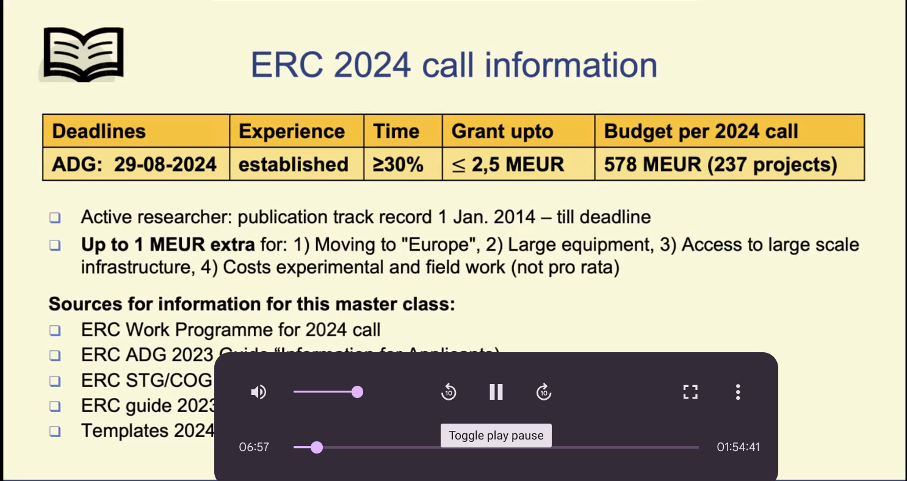
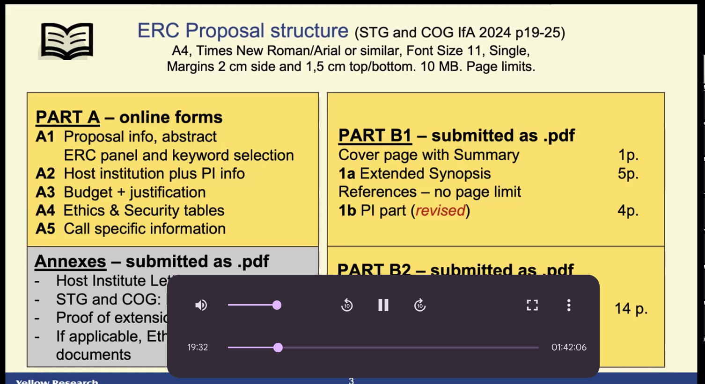

<!--
theme: gaia
class: gaia lead
headingDivider: 1
paginate: true
header: OXFORD 2024
footer: 
backgroundImage: linear-gradient(-20deg, rgba(0, 0, 0, 0.6), transparent)
_paginate: false
_header: ''
_footer: ''

style: |
  @keyframes marp-outgoing-transition-vertical-scroll {
    from { transform: translateY(0%); }
    to { transform: translateY(-100%); }
  }
  @keyframes marp-incoming-transition-vertical-scroll {
    from { transform: translateY(100%); }
    to { transform: translateY(0%); }
  }

  @keyframes marp-outgoing-transition-vflip {
    0% { animation-timing-function: ease-in; }
    50% {
      transform: perspective(100vw) translateZ(-100vw) rotateX(-90deg);
      opacity: 0.5;
      animation-timing-function: step-end;
    }
    100% { opacity: 0; }
  }
  @keyframes marp-incoming-transition-vflip {
    0% {
      animation-timing-function: step-start;
      opacity: 0;
    }
    50% {
      transform: perspective(100vw) translateZ(-100vw) rotateX(90deg);
      opacity: 0.5;
      animation-timing-function: ease-out;
    }
  }

  header, footer { text-align: center; color: currentcolor; }
  section.small-code pre { font-size: 68%; }

-->

#

[Yellow Research](https://yellowresearch.nl)

**ERC Grant Writing Workshop**

[Fostering science]()

[Giant research](https://www.youtube.com/watch?v=3JZ_D3ELwOQ)

# capture

# capture

# ERC

- 237 projects
- project or programme
- UK back in ERC

# ERC Advanced

* active researchers
* still active in research field
* last 10 years researchers (10 year window)
* momentum ?

# Online forms

- budget justification Horizon Europe

# Appendices

- host letter
- ethics
- extensions 10 year window (only for mother)
	* serious illness

# Part B

### Part B2: technical

- state of art + objectives 
- methodology

### Part B1:  Strategic

- extended synopsis
- PI track record

# Organisation

- chair meeting
- lead panel member
- bar scientific excellence

* A/B/C what does it mean?
* A invitation step 2 or not
* B looks promising but 2026

# Evaluation

- innovative and ground breaking
- methodology
- expected outcomes
- potential contribution to science
- research team

- feasibility

# who is your audience

# Goals of the ERC

- empower researcher
- advancing research
- pioneering research emerging fields

## Ground breaking

- address important challenges
- ambitious novel concepts and approaches

# eligibility criteria

* ambition risk/reward
* ground breaking
* feasibility

# Mitigating risk

- feasibility
- back up plans

# Gantt chart

