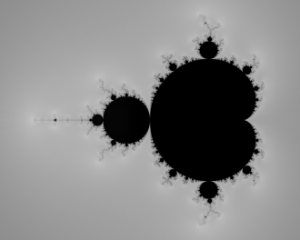

# Hello hello

### Click to continue

#

## La vie en rose

# Une femme

300$F = m\alpha$

!

# L'autre

500$E = mc^2$

!

# et....

!

# mortel

400$a = \cos(t),\, b = \sin(t)$

!

# worse

500$a^2 + b^2 = 1$

!

# The end?

ou presque...

!

# Epilogue

350$z \mapsto z^2 + c$

!

#

- Julia
- Fatou
!

# Stabilité et chaos

400

!
