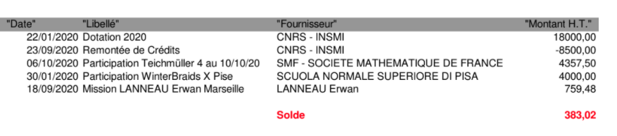

# Rapport d'activité 2020

## GDR-CNRS2105 Tresses et topologie de basse dimension

## Contexte 

L'activité principale du GdR est la promotion et le financement des conférences organisées pare les membres. Le
fonctionnement du GdR a été  fortement perturbé par les circonstances
sanitaires exceptionnelles. Au mois de janvier on avait prévu de participer au financement de septs conférences mais finalement le bilan est assez maigre :

- une s'est déroulée dans les conditions normales
- une deuxième en distanciel avec les exposés en vidéo
- une troisième a eu lieu en presentiel mais  les organisateurs
ont dû faire face à des problèmes non négligeables. 

La liste   gdrtresses@listes.math.cnrs.fr s'est avérée
très utile pour diffuser les informations concernant 
l'evolution de rapidement

### Séminaires virtuels

La liste de diffusion a également servi à faire la publicité pour divers
séminaires virtuels :

- Le séminaire virtuel francophone Groupes et Géométrie
- Le séminaire de topologie LAGA/IMJ-PRG
- Geometry and Topology Online (Université de Warwick, UK)

### Liste de conférences prévues

- WinterBraids X, Pise
- Journées Franco Japonais, Grenoble
- Artin Groups, CAT(0) Geometry and Related Topics, CIRM
- Conférence internationale à la mémoire de Patrick Dehornoy, Caen
- Teichmüller Theory: Classical, Higher, Super and Quantum, CIRM
- Complex Hyperbolic Geometry and Related Topics, CIRM
- Journées ARA, l'ENSL

    
### Credits remontés à l'INSMI

Suite à la demande de P. Auscher on a rendu 8500 euros
à l'INSMI le 23/9.

## Production scientifique 

Les actes de WinterBraids sont publiés http://www.cedram.org/spip.php?article228&lang=en

## Bilan financière

Le solde au 1/11 est de 383 euros - vu les contraintes sur les déplacements et
les réunions....

## Perspectifs pour 2021

Étant donné l'évolution de la pandémie l'activité du GdR risque d'etre
fortement perturbée en 2021. La prochaine edition de Winterbraids est prévue
pour la rentrée 2021 à Dijon mais les conferences avec une participation internationale
auront lieu très probablement en distanciel.

