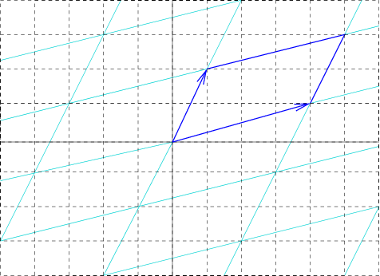
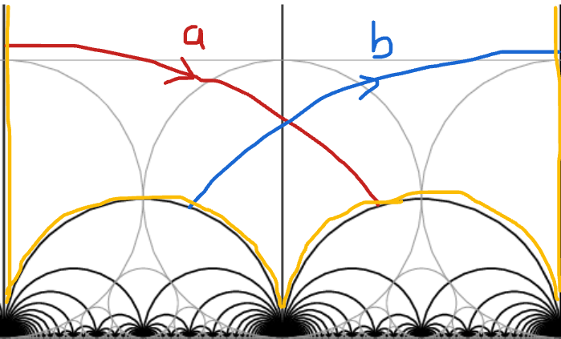
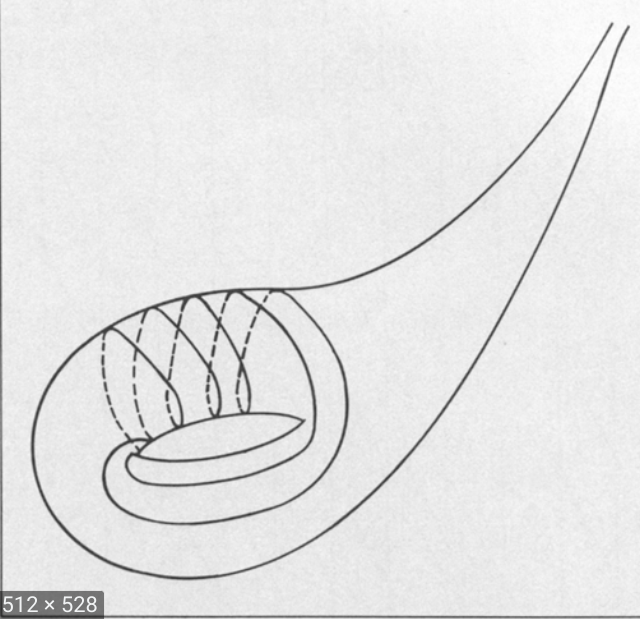

# Motivation

Lengths of closed simple curves

- Norm on the homology, McShane, Rivin
- [Mirzkhani](https://annals.math.princeton.edu/wp-content/uploads/annals-v168-n1-p03.pdf)
- [Erlandsson, Parlier, Souto](https://www.ems-ph.org/journals/of_article.php?jrn=jems&doi=953)

#
## Different cases

150$x^2 + y^2 + z^2 - x y z = 0.$

- positive characteristic Sarnak et al.
- over 100$\mathbb{R}$ Bill Goldman 
- over 100$\mathbb{C}$ ? 
- Bowditch
- Sakuma et al.
- SP Tan et al.

#
## Fibonacci growth

[Bowditch](http://homepages.warwick.ac.uk/~masgak/papers/bhb-markoff.pdf){target="_blank"}

#
## Fibonacci growth

- 200$a,b$ generate 200$\mathbb{Z}*\mathbb{Z}$
- coprime 200$(p,q) \mapsto w \in \langle a, b \rangle$
- 200$1/c (|p| + |q|) \leq \ell_w \leq  c(|p| + |q|)$

#
## Continuity of length

200$\rho, \gamma \mapsto \ell_\gamma(\rho)$
is a continuous map  
200$\mathcal{T}(\Sigma) \times \mathcal{ML} \rightarrow \mathbb{R}$

-[Generalisation Brock](http://citeseerx.ist.psu.edu/viewdoc/download;jsessionid=B57D2A49F7D875E1D8673D71711C7134?doi=10.1.1.493.2878&rep=rep1&type=pdf)
- Question how regular is it?

#
## Cohn and the character variety

H. Cohn, Approach to Markov’s Minimal Forms Through Modular Functions (1955)

- modular torus = quotient of upper half plane 150$\mathbb{H}$ by  150$\Gamma$ = commutator subgroup of 150$PSL(2,\mathbb{Z})$, acting by Mobius transformations
-  relates Markoff numbers to lengths of simple closed geodesics

#

## Back to the Torus

- 150$\mathbb{Z}^2$ acting on 150$\mathbb{R}^2$ by translation
- quotient space (orbit space) is a euclidean torus
- primitive elements 150$(p,q)\in \mathbb{Z}^2$ 
- 150$\rightarrow$ closed curve on torus = 150$(p,q)$ curve
- (usual) length 150$=\|(p,q)\| = \sqrt{p^2 + q^2}$

#

## Saul's Usual Torus

#

## Torus

- 200$\mathbb{Z}^2$ acts by translation in lots of different ways
- translation lengths of 200$(1,0),(0,1),(1,-1)$ determine (up to conjugation)
- the representation 200$\mathbb{Z}^2 \rightarrow \text{isom}(\mathbb{R}^2)$
- length of 200$(p,q)$ curve given by quadratic form 

#

representation 200$\mathbb{Z}^2 \rightarrow \text{isom}(\mathbb{R}^2)$

#

representation 200$\mathbb{Z}^2 \rightarrow \text{isom}(\mathbb{R}^2)$

#

- 3 side lengths determine a triangle
- need 3 numbers to build a euclidean torus
- what about the 3 Markoff numbers ?
- can build a hyperbolic punctured torus
- no simple formula for length of 200$(p,q)$ curve

#

- modular torus = quotient of upper half plane 200$\mathbb{H}$ by  200$\Gamma$ = commutator subgroup of 200$\text{PSL}(2, \mathbb{Z})$, acting by Mobius transformations
- hyperbolic torus = quotient of upper half plane 200$\mathbb{H}$
by  200$\Gamma = \rho(\mathbb{Z}*\mathbb{Z})$, 
- 200$\rho:\mathbb{Z}*\mathbb{Z}\rightarrow\text{PSL}(2, \mathbb{R})$ discrete
    faithful

#
## Analogue of Saul's figure

#
## Analogue of Saul's figure

# 

[Geometry of the Markoff
numbers](https://www.researchgate.net/publication/226685228_The_geometry_of_markoff_numbers){target="_blank"}

#

200$\rho:\mathbb{Z}*\mathbb{Z}\rightarrow\text{PSL}(2, \mathbb{R})$ 

- lifts to 
 200$\hat{\rho}:\mathbb{Z}*\mathbb{Z}\rightarrow\text{SL}(2, \mathbb{R})$ 
- character map 200$\chi : \rho \mapsto ( tr \hat{\rho}(a),  tr \hat{\rho}(b),  tr \hat{\rho}(ab) )$
- 200$a,b$ generators of the free group = fundamental group of the torus.

#
Traces behave "like squares of translation lengths"

- [parallogram
    law](https://en.wikipedia.org/wiki/Parallelogram_law){target="_blank}
- 200$b\in SL(2,\mathbb{C}),\,b^2 - (tr b)b + I_2 = 0$ 
- (Cayley-Hamilton) 200$\Rightarrow$
- 200$tr ab  + tr ab^{-1} = (tr a) (tr b)$

#

## Markoff cubic from the puncture 

Loop round the puncture 200$aba^{-1}b^{-1}$

- isn't trivial but it's special (parabolic)
- corresponding matrix something like 
- 200$\begin{pmatrix} \pm 1 & 6 \\ 0 & \pm 1 \end{pmatrix}$ 

#

## puncture condition 

200$tr \hat{\rho} (aba^{-1}b^{-1}) = -2$

- 200$(x,y,z) =  ( tr \hat{\rho}(a),  tr \hat{\rho}(b),  tr \hat{\rho}(ab) )$
- 200$x^2 + y^2 + z^2 - x y z = 2 + tr \hat{\rho} (aba^{-1}b^{-1})=0.$
- = Markoff cubic up to a change of variable

#
## "inverse" character map 

Section: character variety to representation variety

 200$\begin{pmatrix}  x & -1 \\ 1 & 0 \end{pmatrix}$ 
 200$\begin{pmatrix}  0 &  \eta \\ -\eta^{-1} & y \end{pmatrix}$ 

200$z = \text{trace of  product} = \eta + \eta^{-1}$

#

Cohn shows that 
the permutations and the Vieta flips
used to construct Markov's binary tree
are induced by automorphisms of the
fundamental group of the torus.

#### Exo

- Nielsen move 200$(a,b,ab) \mapsto (a, b^{-1}, ab^{-1})$
- 200$tr ab  + tr ab^{-1} = (tr a) (tr b)$
