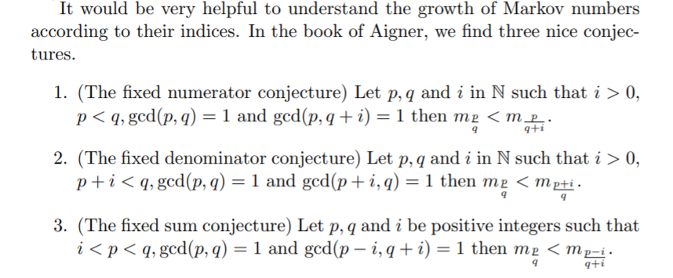
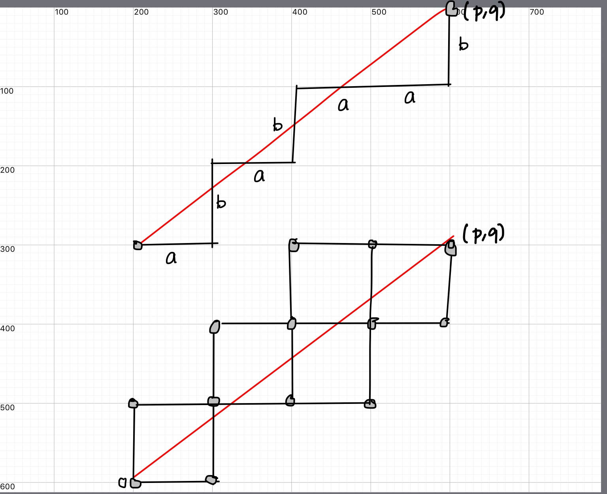
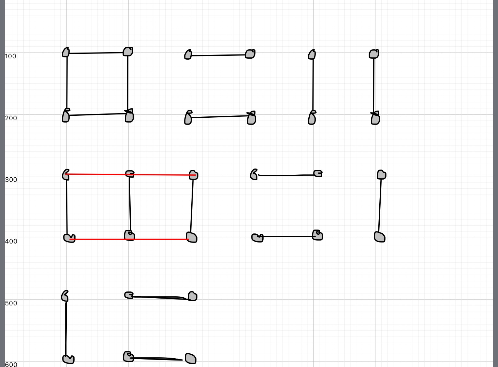
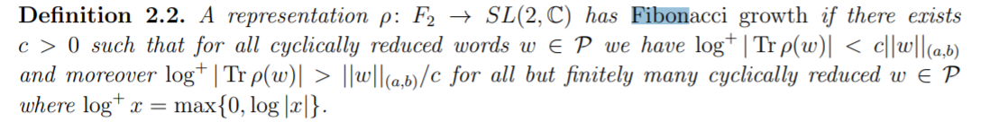

%Markoff numbers 
%greg mc
%June 2021

#
##University of Glasgow

June 7th 2021

- Undergrad 1983-87
- [Alex Miller](https://otago.academia.edu/AlexMiller)
- [(S)Tony Mulholland](https://research-information.bris.ac.uk/en/persons/anthony-mulholland)

#
### quote

- you realise that we are the only normal people here?
- What makes you think that we are normal?

# Contents

- Markoff numbers and Frobenius conjecture
- Aigners monotonicity conjectures
- Group actions and labelling numbers
- Visualizing Markoff numbers
- Norms, Growth, Convexity

#

- Author of [Proofs from THE BOOK](https://en.wikipedia.org/wiki/Proofs_from_THE_BOOK#:~:text=Proofs%20from%20THE%20BOOK%20is,proof%20of%20each%20mathematical%20theorem){target="_blank"}
- [Convexity and Aigner's Conjectures](https://arxiv.org/abs/2101.03316){target="_blank"}
- Can I prove these with one figure ?

#

Markov numbers are integers that appear in triples which are solutions of
a Diophantine equation the so-called Markov cubic

$x^2 + y^2 + z^2 - 3x y z = 0.$

$(1,1,1),(1,1,2),(1,2,5),(1,5,13)$

# 
## infinity of Markoff numbers

$\begin{pmatrix} 3 & -1 \\ 1 & 0 \end{pmatrix}$
is an automorph of $x^2 + y^2  - 3x y.$

so $( v_n,v_{n+1},1)$ is a solution to Markov cubic:

$\begin{pmatrix}v_{n+1} \\ v_n \end{pmatrix} = \begin{pmatrix} 3 & -1 \\ 1 & 0 \end{pmatrix}^n \begin{pmatrix}1 \\ 1 \end{pmatrix}$

#
### Odd index Fibonacci numbers are Markoff numbers

$1, 1, 2, 3, 5, 8, 13, 21, 34, 55, 89, 144, 233, 377, 610, 987, 1597, 2584, 4181, 6765, 10946, 17711, 28657, 46368, 75025, 121393, 196418, 317811, ...$

$(1,1,1),(1,1,2),(1,2,5),(1,5,13)$

#
### Frobenius uniqueness conjecture

The largest integer in a triple (x,y,z) 
determines the two other numbers.

#
### Partial results

m = Markoff number

- Jack Button for [m prime power](https://londmathsoc.onlinelibrary.wiley.com/doi/abs/10.1112/S0024610798006292){target="_blank"}
- Zhang [An elementary proof...](https://arxiv.org/abs/math/0606283){target="_blank}
- Baragar [m, 3m - 2, 3m + 2 prime](https://www.cambridge.org/core/services/aop-cambridge-core/content/view/88B0E426FFCBEA8B3A345C1074B8CC59/S0008439500018828a.pdf/on-the-unicity-conjecture-for-markoff-numbers.pdf){target="_blank}
- [ Bugeaud, Reutenauer, Siksek](https://core.ac.uk/download/pdf/82088222.pdf){target="_blank}
- [Multiplicities of simple closed geodesics](https://projecteuclid.org/journals/geometry-and-topology/volume-12/issue-4/Multiplicities-of-simple-closed-geodesics-and-hypersurfaces-in-Teichm%C3%BCller-space/10.2140/gt.2008.12.1883.full){target="_blank}
- Conclusion too hard!!!

#
### Aigner's monotonicity conjectures

- Markov’s theorem and 100 years of the uniqueness conjecture. A mathematical journey from irrational numbers to perfect matchings.  2013.  
- M. Rabideaua, R. Schiffler,
Continued fractions and orderings on the Markov numbers,
Advances in Mathematics Vol 370,  2020.
- C Lagisquet and E. Pelantová and S. Tavenas and L. Vuillon, On the Markov numbers: fixed numerator, denominator, and sum conjectures.

#

There is a natural map (we'll see why shortly)

$\mathbb{Q}\cup \infty \rightarrow$ Markoff numbers

$p/q \mapsto m_{p/q}= m_{p,q}$

# 
## A tale of three trees

Labeling Markoff numbers

- Markoff number = $m_{p/q}$
- Farey tree of coprime integers $p,q$
- Markoff tree of solutions to his cubic
- Bass-Serre of a free product ($PSL(2,\mathbb{Z})$)

# 
## Story of correspondences 

- $GL(2,\mathbb{Z})$ and its actions
- coprime integers $p,q$
- simple closed geodesics on a torus
- snake graphs
- "lengths"

# 
### Lines on grids

<iframe data-src="./snake2.html" > </iframe>

# 
### Lines on grids

<iframe data-src="./snake1.html" > </iframe>

# 
### Lines on grids

 coprime integers $p,q$ live in a grid with a line

#
## Matchings

#
## Favorite Groups

- $\mathbb{Z}$ fundamental group of circle
- $\mathbb{Z}^2$ fundamental group of torus

#
## Generators/primitives

- $\mathbb{Z}^2$ acting by translation on $\mathbb{R}^2$.
- infinitely many primitive elements 
- $(a,b)$ primitive iff $a,b \in \mathbb{Z}$ coprime

#
## Two choices (red/blue pill)

Next most interesting groups ?

- free product $\mathbb{Z}*\mathbb{Z}$
- automorphism group  $GL(2,\mathbb{Z})$
- both lead to hyperbolic geometry

#
## Actions

- $GL(2,\mathbb{Z})$ acting by "base change" on $\mathbb{Z}^2$
- Bezout's identity $\Rightarrow$ transitive on primitives
- Visualize  $GL(2,\mathbb{Z})$ action 

#

$\mathbb{Q}\cup \infty \subset$ circle/projective line

- $(a,b)\text{ primitive } \mapsto a/b \in \mathbb{Q}\cup \infty$
- $\begin{pmatrix} a & c \\ b & d \end{pmatrix} \mapsto$  arc joining $(a/b, c/d)$ 
- $(a/b, c/d)$ are Farey neighbors

#

[source](https://www.math.mcgill.ca/sdouba/seminar/sami)

#

[source](https://www3.nd.edu/~math/rtg/GTS/www3.nd.edu/_jquigle2/GSTS%20FA18/Week1P.pdf)

#
### natural map ?

$\mathbb{Q}\cup \infty \rightarrow$ Markoff numbers

$p/q \mapsto m_{p,q}$

- projective $GL(2, \mathbb{Z})$ action on $\mathbb{Q}\cup \infty$ 
- action on Markoff numbers ?
- [Vieta flipping](https://en.wikipedia.org/wiki/Vieta_jumping){target="_blank"}

#
### Vieta flips/involutions
$x^2 + y^2 + z^2 - 3x y z = 0.$

- quadratic in $x$,  two roots $x^\pm$
- $x^+ + x^- = 3yz$
- involution $(x,y,z) \mapsto (3yz -x, y,z)$

#

Peter Sarnak (Princeton and IAS)

Title: Strong approximation for Markoff surfaces

We discuss the transitivity properties of the group of morphisms generated by Vieta involutions on the solutions in congruences to the Markoff equation as well as to other Markoff type affine cubic surfaces. These are dictated in part by the finite orbits of these actions on the algebraic points

Joint work with J.Bourgain and A.Gamburd.

#
## Automorphisms 

- Vieta flips
- (cyclic) permutations of $x,y,z$
- get $\mathbb{Z}/2 * \mathbb{Z}/3$ action
- = [$PSL(2,\mathbb{Z})$ action](https://en.wikipedia.org/wiki/Modular_group){target="_blank}

#
Natural  = $PSL(2,\mathbb{Z})$-equivariant map

$\mathbb{Q}\cup \infty \rightarrow$ Markoff numbers $p/q \mapsto m_{p/q}$

- $(1:1) \mapsto  1/1 \mapsto 2$ 
- $(0:1) \mapsto  0/1 \mapsto 1$ 
- $(1:0) \mapsto  \infty \mapsto 1$ 
- actions = projective on left and by autos on right

# 
### Tree structure

comes from Bass-Serre tree of
 $PSL(2,\mathbb{Z})$ 

#
## Visualization

- so we have seen the structure of the Markoff numbers
- is there a better way?
- is there hidden information?

#
## Motivation

$x^2 + y^2 + z^2 - x y z = 0.$

- positive characteristic Sarnak et al.
- over $\mathbb{C}$ ? 
- Bowditch
- Sakuma et al.
- SP Tan et al.

#
## Fibonacci growth

[Bowditch](http://homepages.warwick.ac.uk/~masgak/papers/bhb-markoff.pdf){target="_blank"}

#
## Fibonacci growth

- $a,b$ generate $\mathbb{Z}*\mathbb{Z}$
- coprime $(p,q) \mapsto w \in \langle a, b \rangle$
- $1/c (|p| + |q|) \leq \ell_w \leq  c(|p| + |q|)$
- [Svarc-Milnor](https://en.wikipedia.org/wiki/%C5%A0varc%E2%80%93Milnor_lemma)

#
### Is there a norm hidden here?

