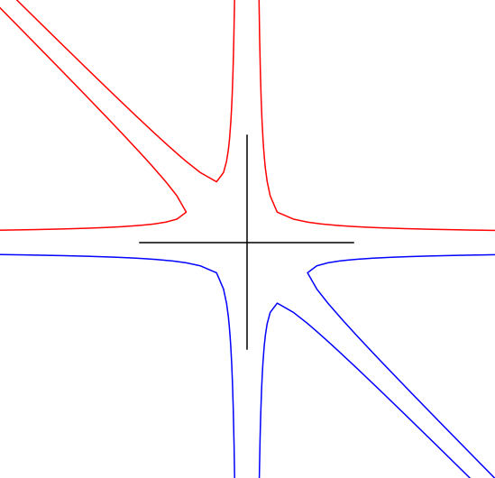

# Annex

- integer points 
-  non convexity

#
## Pair of pants

- coprime $(p,q) \mapsto w_{p,q} \in \langle a,b \rangle$
- extend length from $\mathbb{Z}^2$ to $\mathbb{R}^2$ 
- technically, can be done in general using immersed train tracks

#
## Goldman integer pts, orbifolds

$x^2 + y^2 + z^2 - x y z = 20.$

- different $GL(2,\mathbb{Z})$ orbts
- (2,2,-2) three punctured sphere
- (0,3,1) orbifold, disc with 2 cone points
- (0, 4,2) orbifold, punctured disc one cone point

#
## Three punctured sphere

#
## Pair of pants

$x^2 + y^2 + z^2 - x y z \geq  20.$

#
## (0,4,2) orbifold

#
## (0,3,1) orbifold

#
## 

