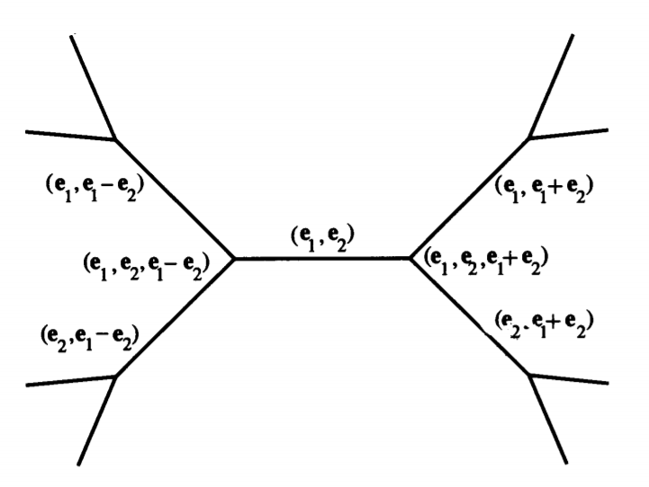

# Conway: Sensual quadratic forms

This page is a repo for exchanges 
in the gpe de lecture E. 

***IMPORTANT: this group 
will no longer meet physically 
because of confinement***

We are meeting on [Discord](https://discordapp.com/).

- [seance 25/3](Support_Grp_de_Lecture_1.pdf)
- [seance 1/4](Support_Grp_de_Lecture_2.pdf)
- [seance 8/4](Support_Grp_de_Lecture_3.pdf)
- this [test.tex](test.tex) is a TeX template for using figures. The output should look like [this](test.pdf).
- I also wrote a **buggy** [python script](wiki_math.py) for pulling math out of wikipedia pages to a LaTex file 

---

## Background

The [text](https://www.maths.ed.ac.uk/~v1ranick/papers/conwaysens.pdf) 
is english so it might be useful to read some background material in english
before the class.

There is a more recent
[text](https://pi.math.cornell.edu/~hatcher/TN/TNpage.html)
which has a lot of overlap with Conway's book
and we will be comparing the two versions when appropriate.

The theme of both books is the interplay between geometry 
and number theory.

We will spend 4 weeks on each of the first 3 chapters of Conway:

- Peut-on voir les valeurs d’une  formes quadratiques ?
- Peut-on entendre la forme d'un réseau?
- ... et pouvez-vous sentir sa forme?

## References for background reading

Follow the blue arrows
[->](https://en.wikipedia.org/wiki/Conway%27s_Game_of_Life)
for a reference.

**For  Wednesday 22/1 just read through 
[Hatcher's book](https://pi.math.cornell.edu/~hatcher/TN/TNpage.html)**

---

## Plan for the seminars

### Can you see the shape of a quadratic form

1. Generalities on quadratic forms (definite, indefinite, integer valued,
   Pythagorean triples, Diophantine equations etc.)
2. Farey diagram, SL(2,Z), Poincaré plane/disc (see Hatcher)
3. Topography I
4. Topography II
5. Generalizations: Markoff numbers, Appolonian packings etc.

### Can You Hear the Shape of a Lattice?

1. Generalities on lattices, theta functions
2. Milnor example, Kneser etc.
3. Codes etc.
4. Drums eigenfunction transplantation  Buser, Berrard, Tsunada etc.

### ... and Can You Feel Its Form?

1. Voronoi cells
2. Vonorms
3. Minkowski etc

---

# Exposes

date | nom | sujet
--- | --- | ---
5/2 | Victor | triplets
12/2| William | sl2 et ses actions
19/2 | Thomas | topographie
11/3    | Corentin | descente
25/3  | Vincent | Markoff numbers
1/4   |  Milan | formes modulaires et reseau
8/4 |Vincent et Victor | progressions arithmetiques

---
     
## Further reading

- [The Modular Tree Of Pythagoras](http://www.math.sjsu.edu/~alperin/pt.pdf)
- [Arbres, amalgames, SL2](http://www.numdam.org/issue/AST_1983__46__1_0.pdf)
- [Ping pong lemma](https://en.wikipedia.org/wiki/Ping-pong_lemma)
- [Tits alternative](https://en.wikipedia.org/wiki/Tits_alternative)
- [Markov numbers](https://en.wikipedia.org/wiki/Markov_number)

