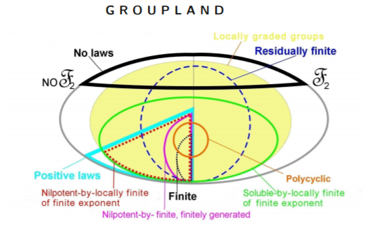
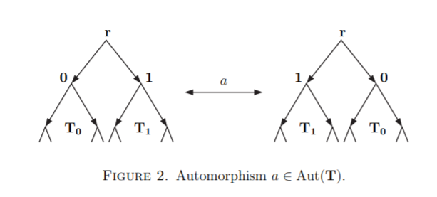

# P de la Harpe : Topics in Geometric Group Theory 

This page is a repo for exchanges 
in the gpe de lecture . 

[This is the text ](./book.djvu)

***IMPORTANT: this group 
will not meet physically 
because of confinement***

We are meeting on 
- [Discord](https://discordapp.com/).
- Zoom 
- BBB

we'll decide which is most convenient by email

---

# Presentation

Groups as abstract structures were recognized progressively during the 19th
century by mathematicians including Gauss (Disquisitiones avithmeticae in
1801), Cauchy, Galois, Cayley, Jordan, Sylow, Frobenius, Klein (Erlangen pro-
gram in 1872), Lie, Poincare ... 
Groups are of course sets given with appropriate "multiplications", and
they are often given together with actions on interesting geometric objects.
But the fact which we want to stress here is that groups are also interesting
geometric objects by themselves -- a point of view illustrated in the past by
Cayley and Dehn, and more recently by Gromov. More precisely, a finitely-generated group can be seen as a metric space (the distance between two points being defined "up to quasi-isometry"), and this gives rise to a very fruitful approach to group theory.

In 1968 it became apparent that all known classes of groups have either polynomial or
exponential growth, and John Milnor formally asked whether groups of intermediate
growth exist. The first such examples were introduced by 
Grigorchuk in the 80s
and since then there has been an explosion in the number of
works on the subject. 
This **groupe de lecture** is an attempt to present the material in an introductory manner, to
the reader familiar with only basic algebraic concepts
following de la  Harpe's book  and a paper that improves on chapter VIII

IV. Finitely-generated groups viewed as metric spaces
- IV.A. Word lengths and Cayley graphs
- IV.B. Quasi-isometries

VI. Growth of finitely-generated groups
- VI.A. Growth functions and growth series of groups
- VI.B. Generalities on growth types
- VI.C. Exponential growih rate and entropy

VII. Groups of exponential or polynomial growth
- VII.A. On groups of exponential growth
- VII.B. On uniformly exponential growth
- VII.C. On groups of polynomial growth
- VII.D. Complement on other kinds of growth

VIII The first Grigorchuk group

we will do this chapter from a paper
[Groups of Intermediate Growth: an Introduction for Beginners](https://arxiv.org/abs/math/0607384)

---

## Calendrier

Will appear here

---

## Background

Video of Grigorchuk (

<iframe width="560" height="315" src="https://www.youtube.com/embed/7AeD5FBOixo" frameborder="0" allow="accelerometer; autoplay; clipboard-write; encrypted-media; gyroscope; picture-in-picture" allowfullscreen></iframe>

## References for background reading

The Wikipedia page in english is very complete 
with history and references

1. [Wikipedia page](https://en.wikipedia.org/wiki/Grigorchuk_group)
1. [Some slides](https://mat.polsl.pl/groups/talks/Macedonska.pdf)

---

## Calendar for the exposes

date | nom | sujet
--- | --- | ---
??? | ??? | ???

---
     
## Further reading

Will be added here to complement the exposes

