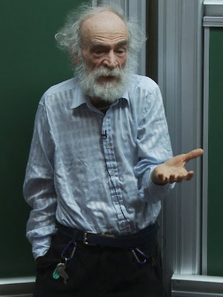
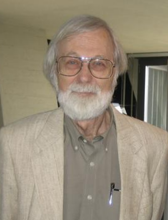

#  Topics in Geometric Group Theory 

This page is a repo for exchanges 
in the gpe de lecture . 

[This is the text ](./book.djvu) in djvu.

***IMPORTANT: this group 
will not meet physically 
because of confinement***

## Format

Each seance will consist of

- online video chat for 5-10 minutes
- presentation in audio for 50 minutes with support in *pdf*
- discussion  for 20-30 minutes either by text chat or video chat (depending on quality of connexion)
- You will work in teams of 2 (binomes) as preparing the support for the presentations takes a **lot** of time.
- The **pdf** should be submitted Wednesday 12h latest.

We will be meeting on 

- [Discord](https://discordapp.com/).
- Zoom 
- BBB

we'll decide which is most convenient by email.

[Here is what we did](https://macbuse.github.io/GPE_ENS/) last year during the confinement.

---

## Calendar for the exposes

We will decide this by email

date | nom | sujet
--- | --- | ---
20/1 | Greg Mc | Presentation
27/1 | ??? | ???

---

# Presentation of text

Groups as abstract structures were recognized progressively during the 19th
century by mathematicians including Gauss (Disquisitiones avithmeticae in
1801), Cauchy, Galois, Cayley, Jordan, Sylow, Frobenius, Klein (Erlangen pro-
gram in 1872), Lie, Poincare ... 
Groups are of course sets given with appropriate "multiplications", and
they are often given together with actions on interesting geometric objects.

But the fact which we want to stress here is that groups are also interesting
geometric objects by themselves -- a point of view illustrated in the past by
Cayley and Dehn, and more recently by Gromov. 
More precisely, a finitely-generated group can be seen as a metric space (the distance between two points being defined "up to quasi-isometry"), and this gives rise to a very fruitful approach to group theory.

In 1968 it became apparent that all known classes of groups have 
- either polynomial growth (Gromov [characterised these](#groups-of-polynomial-growth) )
- or exponential growth,

John Milnor formally asked whether groups of intermediate
growth exist. 

The first such examples were introduced by 
Grigorchuk in the 80s
and since then there has been an explosion in the number of
works on the subject. 
This **groupe de lecture** is an attempt to present the material in an introductory manner, 
- to the reader familiar with only basic algebraic concepts
- following de la  Harpe's book  
- and a paper by Grigorchuk and Pak that improves on chapter VIII

---

## Contents

Chapters I and III are not directly relevant.
This leaves chapters II and IV - VII.

II. Free products and free groups
- II.A. Free products of groups
- II/.B. The Table-Tennis Lemma (Klein's criterion) and examples
of free products

IV. Finitely-generated groups viewed as metric spaces
- IV.A. Word lengths and Cayley graphs
- IV.B. Quasi-isometries

VI. Growth of finitely-generated groups
- VI.A. Growth functions and growth series of groups
- VI.B. Generalities on growth types
- VI.C. Exponential growih rate and entropy

VII. Groups of exponential or polynomial growth
- VII.A. On groups of exponential growth
- VII.B. On uniformly exponential growth
- VII.C. On groups of polynomial growth
- VII.D. Complement on other kinds of growth

VIII The first Grigorchuk group

we will do this chapter from a paper which appeared later and simplifies things
[Groups of Intermediate Growth: an Introduction for Beginners](https://arxiv.org/abs/math/0607384)

---

## Background

The first three chapters of the book
are not directly relevant and we will skip
them in class but you should read them.
It is important to understand the  [https://en.wikipedia.org/wiki/Ping-pong_lemma].

Video of Grigorchuk (

<iframe width="560" height="315" src="https://www.youtube.com/embed/7AeD5FBOixo" frameborder="0" allow="accelerometer; autoplay; clipboard-write; encrypted-media; gyroscope; picture-in-picture" allowfullscreen></iframe>

## References for background reading

The Wikipedia page in english is very complete 
with history and references

1. [Wikipedia page](https://en.wikipedia.org/wiki/Grigorchuk_group)
1. [Some slides](https://mat.polsl.pl/groups/talks/Macedonska.pdf)
1. [Geometric group thy](https://bookstore.ams.org/coll-63/)

---
     
# Further reading

Will be added here to complement the exposes.

### Alternative de Tits

---

**Theorem** (Tits)

Let **G** be a finitely generated linear group over a field. Then two following possibilities occur: 
- **G** is virtually solvable (i.e. has a solvable subgroup of finite index)
- **G**  contains a nonabelian free group (i.e. it has a subgroup isomorphic to the free group on two generators).

---

- [wikipedia](https://en.wikipedia.org/wiki/Tits_alternative)
- [Tao's blog](https://terrytao.wordpress.com/tag/tits-alternative/)

### Groups of polynomial growth

---

**Theorem** (Gromov) Every finitely generated group of polynomial growth is virtually nilpotent.

---

- [Gromov's Theorem poly
    growth](https://en.wikipedia.org/wiki/Gromov%27s_theorem_on_groups_of_polynomial_growth)
- [paper](./gromov_ihes.djvu)
- [Tao's blog
    post](https://terrytao.wordpress.com/2010/02/18/a-proof-of-gromovs-theorem/)
- [another proof](https://arxiv.org/pdf/1510.04223.pdf) if you like functional
    analysis.

### Uniform exponential growth

- [Osin by Breuillard](https://arxiv.org/pdf/math/0602076.pdf)
- [Uniform Exponential Growth for Linear Groups](https://arxiv.org/pdf/math/0108157.pdf)
- [Connexion](https://www.imo.universite-paris-saclay.fr/~breuilla/BreuillardICMtalk.pdf)
with [Lehmer's conjecture](https://en.wikipedia.org/wiki/Lehmer%27s_conjecture)
