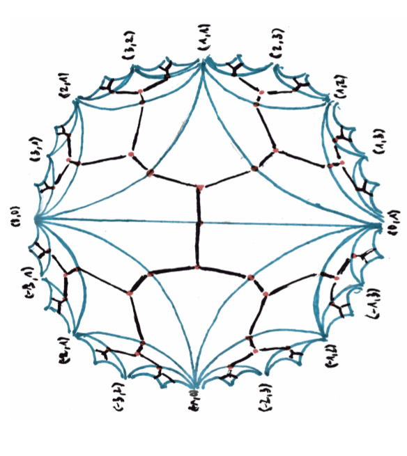

%Geometry of sums of squares
%greg mc
%October 2021

#

- [Proofs from THE BOOK](https://en.wikipedia.org/wiki/Proofs_from_THE_BOOK#:~:text=Proofs%20from%20THE%20BOOK%20is,proof%20of%20each%20mathematical%20theorem){target="_blank"}
- [Convexity and Aigner's Conjectures](https://arxiv.org/abs/2101.03316){target="_blank"}
- Can I prove these with one figure ?

#

Markov numbers are integers that appear in triples which are solutions of
a Diophantine equation the so-called Markov cubic

200$x^2 + y^2 + z^2 - 3x y z = 0.$

$(1,1,1),(1,1,2),(1,2,5),(1,5,13)$

# 
## Infinity of Markoff numbers

$\begin{pmatrix} 3 & -1 \\ 1 & 0 \end{pmatrix}$
is an automorph of 150$x^2 + y^2  - 3x y.$

 so 150$( v_n,v_{n+1},1)$ is a solution where

150$\begin{pmatrix}v_{n+1} \\ v_n \end{pmatrix} = \begin{pmatrix} 3 & -1 \\ 1 & 0 \end{pmatrix}^n \begin{pmatrix}1 \\ 1 \end{pmatrix}$

#
### Odd index Fibonacci numbers are Markoff numbers

$1, 1, 2, 3, 5, 8, 13, 21, 34, 55, 89, 144, 233, 377, 610, 987, 1597, 2584, 4181, 6765, 10946, 17711, 28657, 46368, 75025, 121393, 196418, 317811, ...$

200$(1,1,1),(1,1,2),(1,2,5),(1,5,13)$

#
### Frobenius uniqueness conjecture

The largest integer in a triple determines the two other numbers.

#
### Partial results

m = Markoff number

- Jack Button for [m prime](https://londmathsoc.onlinelibrary.wiley.com/doi/abs/10.1112/S0024610798006292){target="_blank"}
- Zhang [An elementary proof...](https://arxiv.org/abs/math/0606283){target="_blank}
- Baragar [m, 3m - 2, 3m + 2 prime](https://www.cambridge.org/core/services/aop-cambridge-core/content/view/88B0E426FFCBEA8B3A345C1074B8CC59/S0008439500018828a.pdf/on-the-unicity-conjecture-for-markoff-numbers.pdf){target="_blank}
- [ Bugeaud, Reutenauer, Siksek](https://core.ac.uk/download/pdf/82088222.pdf){target="_blank}
- Conclusion too hard!!!

#
### Aigner's monotonicity conjectures

- Markov’s theorem and 100 years of the uniqueness conjecture. A mathematical journey from irrational numbers to perfect matchings.  2013.  
- M. Rabideaua, R. Schiffler,
Continued fractions and orderings on the Markov numbers,
Advances in Mathematics Vol 370,  2020.
- C Lagisquet and E. Pelantová and S. Tavenas and L. Vuillon, On the Markov numbers: fixed numerator, denominator, and sum conjectures.

#

### Natural map ?

200$\mathbb{Q}\cup \infty \rightarrow$ Markoff numbers

200$p/q \mapsto m_{p,q}$

- projective 200$GL(2, \mathbb{Z})$ action on 200$\mathbb{Q}\cup \infty$ 
- action on Markoff numbers ?
- automorphisms of the Markoff cubic?

#
## Automorphisms

- (cyclic) permutations of 200$x,y,z$
- Vieta flips/involutions
- get 200$\mathbb{Z}/2 * \mathbb{Z}/3$ action
- = 200$PSL(2,\mathbb{Z})$ action

#
### Vieta flips/involutions
250$x^2 + y^2 + z^2 - 3x y z = 0.$

- quadratic in 200$x$,  two roots 200$x^\pm$
- 200$x^+ + x^- = 3yz$
- involution 200$(x,y,z) \mapsto (3yz -x, y,z)$

#
Natural  = 200$PSL(2,\mathbb{Z})$-equivariant map

200$\mathbb{Q}\cup \infty \rightarrow$ Markoff numbers 200$p/q \mapsto m_{p/q}$

- 200$(1:1) \mapsto  1/1 \mapsto 2$ 
- 200$(0:1) \mapsto  0/1 \mapsto 1$ 
- 200$(1:0) \mapsto  \infty \mapsto 1$ 
- actions = projective on left and by autos on right

## Topological representation

200$\mathbb{Q}\cup \infty \subset$ circle/projective line

- 200$(a,b)\text{ primitive } \mapsto a/b \in \mathbb{Q}\cup \infty$
- 200$\begin{pmatrix} a & c \\ b & d \end{pmatrix} \mapsto$  arc joining 200$(a/b, c/d)$ 
- 200$(a/b, c/d)$ are Farey neighbors

#

[source](https://www.math.mcgill.ca/sdouba/seminar/sami)

#

[source](https://www.mathi.uni-heidelberg.de/~pozzetti/trees/4.pdf)

#

[source](https://www3.nd.edu/~math/rtg/GTS/www3.nd.edu/_jquigle2/GSTS%20FA18/Week1P.pdf)

# 
### Markoff numbers

