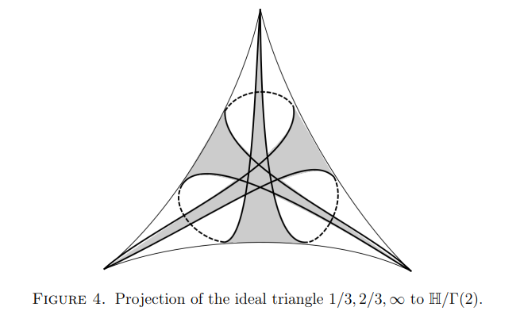

%Geometry of sums of squares
%JSTeichR 
%November 2022

#

-  [Geometry of Fermat’s sum of squares](./squares.pdf)
-  [Convexity and Aigner's Conjectures](https://arxiv.org/pdf/2101.03316.pdf)
-  [Eisenstein integers and equilateral ideal triangles](./eisenstein.pdf)

#

- [Proofs from THE BOOK](https://en.wikipedia.org/wiki/Proofs_from_THE_BOOK#:~:text=Proofs%20from%20THE%20BOOK%20is,proof%20of%20each%20mathematical%20theorem){target="_blank"}
- [Convexity and Aigner's Conjectures](https://arxiv.org/abs/2101.03316){target="_blank"}
- Can I prove these with one figure ?

#

-  [Geometry of Fermat’s sum of squares](./squares.pdf)

#

Markov numbers are integers that appear in triples which are solutions of
a Diophantine equation the so-called Markov cubic

$x^2 + y^2 + z^2 - 3x y z = 0.$

$(1,1,1),(1,1,2),(1,2,5),(1,5,13)$

#
### Odd index Fibonacci numbers are Markoff numbers

$1, 1, 2, 3, 5, 8, 13, 21, 34, 55, 89, 144, 233, 377, 610, 987, 1597, 2584, 4181, 6765, 10946, 17711, 28657, 46368, 75025, 121393, 196418, 317811, ...$

$(1,1,1),(1,1,2),(1,2,5),(1,5,13)$

# 
### Markoff numbers

#
### Frobenius uniqueness conjecture

- The largest integer in a triple determines the two other numbers.
- For every Markoff number $m$ there are exactly 3 simple closed geodesics of length  $2\cosh^{-1}(3m/2)$ on the modular torus $\mathbb{H}/\Gamma'$ 

#
### Partial results

m = Markoff number

- Jack Button for [m prime](https://londmathsoc.onlinelibrary.wiley.com/doi/abs/10.1112/S0024610798006292){target="_blank"}
- Zhang [An elementary proof...](https://arxiv.org/abs/math/0606283){target="_blank}
- Baragar [m, 3m - 2, 3m + 2 prime](https://www.cambridge.org/core/services/aop-cambridge-core/content/view/88B0E426FFCBEA8B3A345C1074B8CC59/S0008439500018828a.pdf/on-the-unicity-conjecture-for-markoff-numbers.pdf){target="_blank}
- [ Bugeaud, Reutenauer, Siksek](https://core.ac.uk/download/pdf/82088222.pdf){target="_blank}
- Conclusion too hard!!!

#
## Button's Theorem

If $z$ is a Markoff number which is prime 
then there is a unique triple $z > y > x$

- $x^2 + y^2 + z^2 - 3x y z = 0.$
- $\bar{x}^2 + \bar{y}^2 = 0.$ in $\mathbb{F}_z$
- $(\bar{x}/\bar{y})^2 = -1$ in $\mathbb{F}_z$
-  $\Rightarrow p = 2$ or $p − 1$ is a multiple of 4.

#

<!--  -->

### Theorem 1.2

Let $p$ be a prime then
$$x^2 + y^2= p$$
has a solution over $\mathbb{Z}$

- iff $p = 2$ or $p − 1$ is a multiple of 4.
- Button's theorem follows from unicity of $x,y$

#

### Theorem 1.3

Let $p$ be a prime then
$$x^2  + xy + y^2= p$$
has a solution over $\mathbb{Z}$ 

- iff $p = 3$ or $p − 1$ is a multiple of 6.

#

-  [Eisenstein integers and equilateral ideal triangles](./eisenstein.pdf)

#
## two groups of order 4

Acting on $\mathbb{F}_p^*$

$\begin{array}{lll}
x &\mapsto& -x \\
x &\mapsto& 1/x
\end{array}$

Acting on $\mathbb{H}$

$\begin{array}{lll}
z &\mapsto& -\bar{z} \\
z &\mapsto& 1/\bar{z}
\end{array}$

#
## Farey tessalation

#
## Ford circles

<!-- # -->
<!-- <iframe width="560" height="315" src="https://www.youtube.com/embed/0hlvhQZIOQw" title="YouTube video player" frameborder="0" allow="accelerometer; autoplay; clipboard-write; encrypted-media; gyroscope; picture-in-picture" allowfullscreen></iframe> -->

#
## References etc

- Heath-Brown, Fermat’s two squares theorem. Invariant (1984) 
- Zagier, A one-sentence proof that every prime p = 1 (mod 4) is a sum of two squares, 1990
- Elsholtz, Combinatorial Approach to Sums of Two Squares and Related Problems.  (2010) 
- Penner, The decorated Teichmueller space of punctured surfaces, Comm  Math Phys  (1987)
- [Zagier text](https://people.mpim-bonn.mpg.de/zagier/files/doi/10.2307/2323918/fulltext.pdf){target="_blank"}

#
## Zagier

#
## Let's begin then...

#
### Burnside Lemma 

- $G$ acting on $X$ then 

    $|G| |X/G| = \sum_{g} |X^g|$

- $X^g$ =  fixed points of the element $g$ 
- $X/G$  the orbit space.

#

### Theorem 1.1

Let $p$ be a prime then 

$x^2 = -1$

has a solution over $\mathbb{F}_p$

- iff $p = 2$ or $p − 1$ is a multiple of 4.

#
### Proof

Group acting on $X = \mathbb{F}_p^*$:

$\begin{array}{lll}
x &\mapsto& x \\
x &\mapsto& -x \\
x &\mapsto& 1/x \\
x &\mapsto& -1/x
\end{array}$

#

### Counting fixed points

- identity $|X^g| = p-1$ 
- $x \mapsto -x, |X^g| = 0$  
- $x \mapsto 1/x, |X^g| = 2$  
- $x \mapsto -1/x, |X^g| = \ldots$ ?  

#
### Apply Burnside

- $|G| |X/G| = \sum_{g} |X^g|$
- $4 |X/G| = (p-1) + 2 + |X^{(x\mapsto -1/x)}|$
- $\Rightarrow  |X^{(x\mapsto -1/x)}| = 2,\, \text{if }4 \not \mid (p+1)$
- $\Rightarrow  \exists x,\, x^2 = -1,\, \text{if }4 \not \mid (p+1)$

#
## QED

#
### Theorem 1.2: sum of 2 squares

Acting on $\mathbb{H}$

$\begin{array}{lll}
z &\mapsto& -\bar{z} \\
z &\mapsto& 1/\bar{z}
\end{array}$

#
## Primitives

- $\mathbb{Z}^2$ 
- infinitely many primitive elements 
- $(a,b)$ primitive iff $a,b \in \mathbb{Z}$ coprime
- $SL(2,\mathbb{Z})$ transitive on primitives

#
## Important

\begin{eqnarray*}
\{ \textit{primitives} \} &=& \mathbb{Q}\cup \infty\\
&\subset& \text{circle/projective line } \\
&=& \partial_\infty \mathbb{H}
\end{eqnarray*}

#

#
## Farey tessalation

$\mathbb{Q}\cup \infty \subset$ circle/projective line

- $(a,b)\text{ primitive } \mapsto a/b \in \mathbb{Q}\cup \infty$
- $\begin{pmatrix} a & c \\ b & d \end{pmatrix} \in \mathrm{SL}(2,\mathbb{Z})\mapsto$  arc joining $(a/b, c/d)$ 
- $(a/b, c/d)$ are Farey neighbors

#

[source](https://www.math.mcgill.ca/sdouba/seminar/sami)

#

[source](https://www3.nd.edu/~math/rtg/GTS/www3.nd.edu/_jquigle2/GSTS%20FA18/Week1P.pdf)

#
## Definitions
- **arc** = Poincaré geodesic joining $a/b, c/d \in \mathbb{Q}\cup \infty$
- **$\lambda$- length of  arc** $= |ad - bc|^2$ 

#
## Lemma

**$\log \lambda$-length** = length of the portion outside Ford circles tangent to the real line at its endpoints

#
## Ford circles

#

$\mathrm{SL}(2,\mathbb{Z})$ acts by Mobius transformations on $\mathbb{H}$

- $\begin{pmatrix} a & c \\ b & d \end{pmatrix}.z = \frac{az+b}{cz+d}$ 
- preserves the Poincaré (hyperbolic) metric
- the orbit of $F := \{ z, \mathrm{Im}\, z > 1\}$ are the Ford circles

#

- $p/q$ point of tangency with $\mathbb{R}$, diameter = $1/q^2$
- ie the diameter is the square of the inverse of the denominator of $p/q$

#
### Proof of lemma

- **arc** joining $a/b, c/d$ has **$\lambda$-length** $= |ad - bc|^2$ 
- **$\log \lambda$-length** = length of the portion outside Ford circles tangent to the real line at its endpoints

#
### Proof of lemma

- $\mathrm{SL}(2,\mathbb{Z})$  transitive, 
- can suppose $a/b = \infty$ and $c/d = k/(ad - bc)$
- Ford circles  $F$  tangent at $\infty$
- and another of diameter $1/(ad - bc)^2$
<!-- - the **midpoint** of this vertical arc is at height $1/|ad - bc|$ -->

#
#
### Groups and quotients

- $\Gamma = \mathrm{SL}(2,\mathbb{Z})$ has torsion so $\mathbb{H}/\Gamma$ orbifold
- $\Gamma(2) = \ker (\mathrm{SL}(2,\mathbb{Z})\rightarrow  \mathrm{SL}(2,\mathbb{F}_2))$
- $\Gamma' = [\Gamma,\Gamma]$
- $\mathbb{H}/\Gamma(2)$  three punctured sphere 
- $\mathbb{H}/\Gamma'$ once punctured torus 

#

- For Aigner's conjectures the geometry of the 
simple geodesics on
$\mathbb{H}/\Gamma'$ once punctured torus was important. 
- For Fermat's theorem it's the automorphisms of 
$\mathbb{H}/\Gamma(2)$ =  three punctured sphere 

#

A three punctured sphere  
can be cut up into 2 ideal triangles.

- Fundamental domain for $\Gamma(2)$

#

- $i, 1+i, \frac12 ( 1 + i)$ are midpoints

#
### reciprocals of sums of squares

- $i, 1+i, \frac12 ( 1 + i)$ are midpoints of arcs
- the lifts to $\mathbb{H}$ of the midpoints $=\Gamma.i$ 
- $\mathrm{Im} \frac{ai+b}{ci+d} = \frac{\mathrm{Im}\, i }{c^2 + d^2}$

#

What is the group of automorphisms?

#

What is the subgroup of automorphisms  
fixing the cusp labeled $\infty$?

#

- fixes the cusp and midpoint $\frac12(1+i)$ 
- dashed arca are invariant under the group 
- one arc has $\lambda$-length 1, the other 2.

#
### the set $X$

- arcs joining cusps $\infty, 1$ with $\lambda$-length $p^2$
- lift to vertical lines with endpoints $k/p$ with $k$ odd
- $|X| = p - 1$ as before

#
### Lemma
Let $n$ be a positive integer.
The number of  ways of writing $n$  as a  sum of squares
$n = c^2 + d^2$
with $c,d$ coprime integers is equal to the number of  integers 
$0 \leq k < n-1$ coprime to $n$
such that the line
$\{  k/n + i t,\, t>0  \}$
contains  a point in the $\Gamma$  orbit of $i$.

#
### Proof of lemma

#
## subgroup lifts to 

- $U': z \mapsto 2-\bar{z},\, V' : z \mapsto \bar{z}/(\bar{z} - 1)$
- composition is $U'\circ V' : z \mapsto z \mapsto (-z + 2) /( z + 1)$
- whose fixed point is $i+$.

#
## automorphisms 

<!-- - $U' : z \mapsto 2-\bar{z}$ induces an automorphism no fixed points in $X,\, p \geq 3$ -->
- $U' : z: z \mapsto 2-\bar{z}$ induces an automorphism no fixed points in $X,\, \text{if } p \geq 3$
- $V' : z \mapsto \bar{z}/(\bar{z} - 1)$ is an inversion in a circle center with endpoints -1 and 1
- projection to surface is simple arc of $\lambda$ length $=4$

#
## Lemma

The automorphism $V$ induced by $V'$  
fixes two and exactly two arcs in $X$.

- apply Burnside Lemma to prove Theorem 1.2
- $4 |X/G| = (p-1) + 2 + |X^{U\circ V}|$

#
## Proof

- If $\infty$ and $k/p$ are exchanged by an inversion swapping Ford circles
- Then the endpoints of the fixed circle are $(k-1)/p$ and $(k+1)/p$  
- if $1 < k < p-1$ the arc joining these points has $\lambda$-length = $4p^2 >4$ 

#
## Button's Theorem

If $z$ is a Markoff number which is prime 
then there is a unique triple $z > y > x$

- $x^2 + y^2 + z^2 - 3x y z = 0.$
- $\bar{x}^2 + \bar{y}^2 = 0$ in $\mathbb{F}_z$
- $(\bar{x}/\bar{y})^2 = -1$ in $\mathbb{F}_z$

#

- Button's theorem follows from unicity and
- For every Markoff number $m$ there are exactly 3 simple closed geodesics of length  $2\cosh^{-1}(3m/2)$ on the modular torus $\mathbb{H}/\Gamma'$ 
- exactly 3 simple arcs of $\lambda$ length $9m^2$ on $\mathbb{H}/\Gamma'$ 

# That's all folks!!!!!
