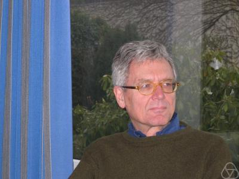

%Geometry of sums of squares
%greg mc
%October 2021

#

- [Proofs from THE BOOK](https://en.wikipedia.org/wiki/Proofs_from_THE_BOOK#:~:text=Proofs%20from%20THE%20BOOK%20is,proof%20of%20each%20mathematical%20theorem){target="_blank"}
- [Convexity and Aigner's Conjectures](https://arxiv.org/abs/2101.03316){target="_blank"}
- Can I prove these with one figure ?

#

#
## two groups of order 4

Acting on $\mathbb{F}_p^*$

$\begin{array}{lll}
x &\mapsto& -x \\
x &\mapsto& 1/x
\end{array}$

Acting on $\mathbb{H}$

$\begin{array}{lll}
z &\mapsto& -\bar{z} \\
z &\mapsto& 1/\bar{z}
\end{array}$

#
## Farey tessalation

#
## Ford circles

#
### Burnside Lemma says

- $G$ acting on $X$ then 

    $|G| |X/G| = \sum_{g} |X^g|$

- $X^g$ =  fixed points of the element $g$ 
- $X/G$  the orbit space.

#
## Theorem 1.1

Acting on $X = \mathbb{F}_p^*$

- identity $|X^g| = p-1$ 
- $x \mapsto -x, |X^g| = 0$  
- $x \mapsto 1/x, |X^g| = 2$  
- $x \mapsto -1/x, |X^g| = \ldots$  

#

- $|G| |X/G| = \sum_{g} |X^g|$
- $4 |X/G| = (p-1) + 2 + |X^{(x\mapsto -1/x)}|$
- $\Rightarrow  |X^{(x\mapsto -1/x)}|= 2$,, if $4 \not | (p+1)$
- $\Rightarrow  \exists x,\, x^2 = -1$, if $4 \not | (p+1)$

#
## Theorem 1.2: sum of 2 squares

Acting on $\mathbb{H}$

$\begin{array}{lll}
z &\mapsto& -\bar{z} \\
z &\mapsto& 1/\bar{z}
\end{array}$

#
## Primitives

- $\mathbb{Z}^2$ 
- infinitely many primitive elements 
- $(a,b)$ primitive iff $a,b \in \mathbb{Z}$ coprime
- $SL(2,\mathbb{Z})$ transitive on primitives

#
## Important

$\{ \textit{primitives} \} = \mathbb{Q}\cup \infty \subset$ circle/projective line $= \partial_\infty \mathbb{H}$

#

#
## Farey tessalation

$\mathbb{Q}\cup \infty \subset$ circle/projective line

- $(a,b)\text{ primitive } \mapsto a/b \in \mathbb{Q}\cup \infty$
- $\begin{pmatrix} a & c \\ b & d \end{pmatrix} \in \mathrm{SL}(2,\mathbb{Z})\mapsto$  arc joining $(a/b, c/d)$ 
- $(a/b, c/d)$ are Farey neighbors

#

[source](https://www.math.mcgill.ca/sdouba/seminar/sami)

#

[source](https://www3.nd.edu/~math/rtg/GTS/www3.nd.edu/_jquigle2/GSTS%20FA18/Week1P.pdf)

#
## Definitions
- **arc** = Poincaré geodesic joining $a/b, c/d \in \mathbb{Q}\cup \infty$
- **$\lambda$- length of  arc** $= |ad - bc|^2$ 

#
## Lemma

**$\log \lambda$- length ** = length of the portion outside Ford circles tangent to the real line at its endpoints

#
## Ford circles

#

$\mathrm{SL}(2,\mathbb{Z})$ acts by Mobius transformations on $\mathbb{H}$

- $\begin{pmatrix} a & c \\ b & d \end{pmatrix}.z = \frac{az+b}{cz+d}$ 
- preserves the Poincaré (hyerbolic) metric
- the orbit of $F := \{ z, \mathrm{Im}\, z > 1\}$ are the Ford circles

#

- point of tangency with $\mathbb{R} = p/q$, diameter = $1/q^2$

#
### Proof of lemma

- **arc** joining $a/b, c/d$ has **$\lambda$- length ** $= |ad - bc|^2$ 
- **$\log \lambda$- length ** = length of the portion outside Ford circles tangent to the real line at its endpoints

#
### Proof of lemma

- $\mathrm{SL}(2,\mathbb{Z})$  transitive, 
- can suppose $a/b = \infty$ and $c/d = k/(ad - bc)$
- Ford circles  $F$  tangent at $\infty$
- and another of diameter $(ad - bc)^2$

#
#
- $\Gamma = \mathrm{SL}(2,\mathbb{Z})$ has torsion so $\mathbb{H}/\Gamma$ orbifold
- $\Gamma(2) = \ker (\mathrm{SL}(2,\mathbb{Z})\rightarrow  \mathrm{SL}(2,\mathbb{F}_2))$
- $\Gamma' = [\Gamma,\Gamma]$
- $\mathbb{H}/\Gamma(2)$  three punctured sphere 
- $\mathbb{H}/\Gamma'$ once punctured torus 

#

In the solution of Aigner's conjectures the geometry of the 
simple geodesics on
$\mathbb{H}/\Gamma'$ once punctured torus was important. 

- For Fermat's theorem it's the automorphisms of 
$\mathbb{H}/\Gamma(2)$ =  three punctured sphere 

#

A three punctured sphere  
can be cut up into 2 ideal triangles.

- Fundamental domain for $\Gamma(2)$

#

- $i, 1+i, \frac12 ( 1 + i)$ are midpoints

#
## reciprocals of sums of squares

- $i, 1+i, \frac12 ( 1 + i)$ are midpoints of arcs
- the lifts to $\mathbb{H}$ of the midpoints $=\Gamma.i$ 
- $\mathrm{Im} \frac{ai+b}{ci+d} = \frac{\mathrm{Im} i }{c^2 + d^2}$

#

What is the group of automorphisms?

#

What is the subgroup of automorphisms  
fixing the cusp labeled $\infty$?

#

- fixes the cusp fixes and midpoint $\frac12(1+i)$ 
- dashed geodesics are invariant under the group 

#
### the set $X$

- arcs joining cusps $\infty, 1$ with $\lambda$-length $p$
- lift to vertical lines with endpoints $k/p$ with $k$ odd
- $|X| = p - 1$ as before

#
### Lemma
Let $n$ be a positive integer.
The number of  ways of writing $n$  as a  sum of squares
$n = c^2 + d^2$
with $c,d$ coprime integers
is equal to the number the  integers $0 \leq k < n-1$ coprime to $n$
such that the line
$\{  k/n + i t,\, t>0  \}$
contains  a point in the $\Gamma$  orbit of $i$.

#
## subgroup lifts to 

- $U': z \mapsto 2-\bar{z},\, V' : z \mapsto \bar{z}/(\bar{z} - 1)$
- composition is $U'\circ V' : z \mapsto z \mapsto (-z + 2) /( z + 1)$
- whose fixed point is $i+1$.
#

- $U': z \mapsto 2-\bar{z}$ induces an automorphism no fixed points in
    $X,\, p \geq 3$
- $V' : z \mapsto \bar{z}/(\bar{z} - 1)$ is an inversion in a circle center $1$
