%Identities Harvard 
%greg mc
%Dec 2020

#

<span style="font-size: 300%">$\sum\frac{1}{1 + e^{\ell_\gamma}}=\frac{1}{2}$</span>

Is a formula but it is describing a geometric **truth**


#

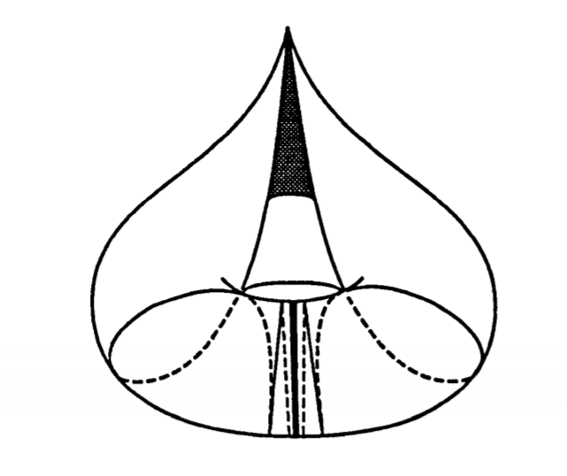

Illustrator 88 circa 1990

# Apologies

This was hacked together 

- in ```nvim```
- using Markdown
- and
[revealjs](https://github.com/jgm/pandoc/wiki/Using-pandoc-to-produce-reveal.js-slides)

and my first time on Zoom :(

# 
## Undergrad Surfaces 

2 dimensional space (manifold)

- disc (is a subset of)
- plane (is the image under the stereographic projection of)
- sphere
- torus (which is a branched cover of the sphere)

Study them by embedding <br> them in <span style="font-size: 200%">$\mathbb{R}^3$</span>.

#

## Coordinates

- disc (polar)
- plane (cartesian or polar)
- sphere (spherical polar <span style="font-size: 100%">$0 \leq \theta \leq \pi, 0\leq \phi\leq 2\pi$</span>)
- torus (spherical polar <span style="font-size: 100%">$0 \leq \theta \leq 2\pi, 0\leq \phi\leq 2\pi$</span>)

#
## Grew out of this..

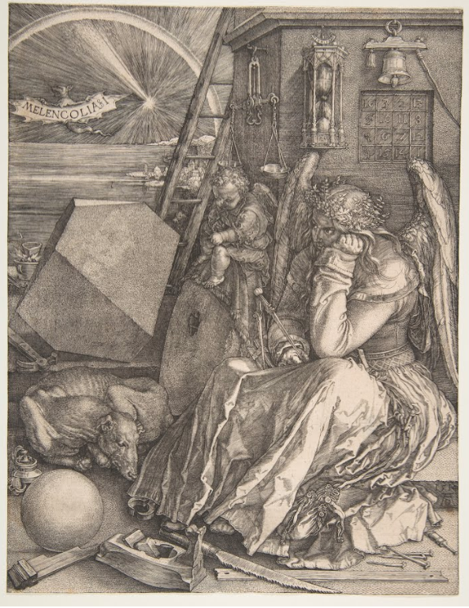


# Geometry

## Three questions

- what are the isometries?
- what are the geodesics?
- what are the optimal maps to other spaces?

# Torus

The disc, plane and sphere are simply connected.   
 Torus is not simply connected. 

- Fundamental group is isomorphic to <span style="font-size: 200%">$\mathbb{Z}^2$</span>
- Is a quotient of the plane by a group of translations <span style="font-size: 200%">$\Gamma$</span> generated by...
- <span style="font-size: 200%">$z \mapsto z + 1$</span> and <span style="font-size: 200%">$z \mapsto z + \tau$</span> where <span style="font-size: 200%">$\tau \in \mathbb{H} \subset \mathbb{C}$</span>

#
### making a torus 

from a parallelogram with corners <span style="font-size: 200%">$0, 1, 1 + \tau, \tau$</span> <br> by glueing opposite edges



#
## Tilings/tessalations

[source](https://angyansheng.github.io/blog/my-final-year-project-i)

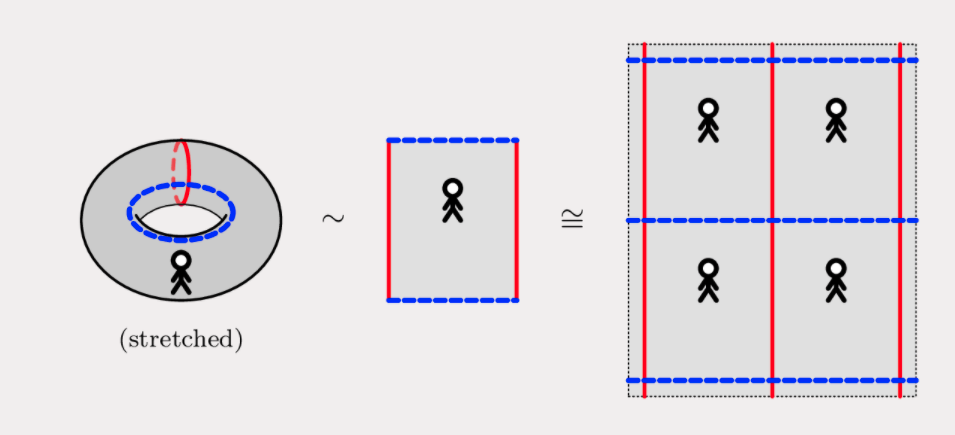

#
## Tilings/tessalations

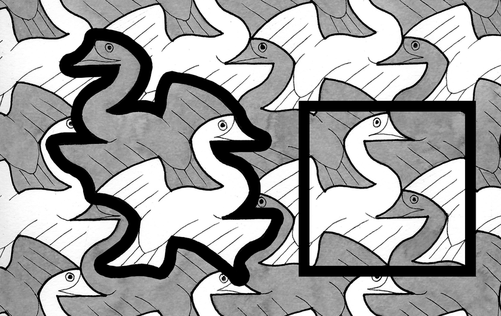

# Geodesics

Geodesic = length minimising curve

- straight line in the (euclidean) plane
- great circle on the sphere

Geodesic foliation: <span style="font-size: 200%">$\mathbb{R}^2$</span> is partitioned by parallel families of geodesics.

#

## Geodesics on the flat torus

Being geodesic is a local property so under the projection map
straight lines map to geodesics <br>
<span style="font-size: 200%">$(\theta, \phi) \mapsto (e^{i\theta},e^{i\phi})$</span>, 
<span style="font-size: 200%">$\mathbb{R}^2 \rightarrow  \mathbb{R}^2 / \Gamma$</span> = torus

### Long term behavior

- rational slope => closed 
- irrational slope => dense

#
## Geodesics on the flat torus


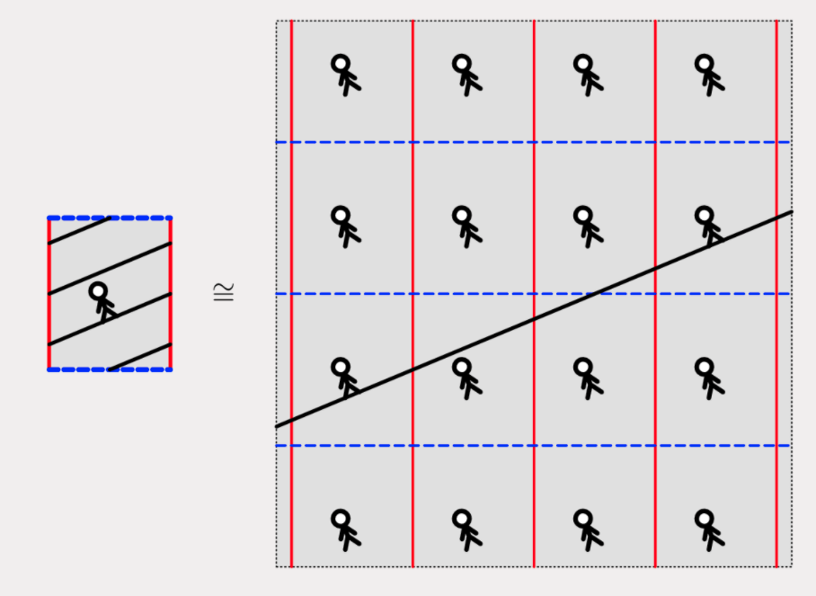

#
## Geodesics on the flat torus

- closed geodesic <span style="font-size: 200%">$\gamma$</span>,  rational slope = p/q, 
- where <span style="font-size: 200%">$p,q$</span> are  coprime integers 
- length of the geodesic is <span style="font-size: 200%">$\ell_\gamma = | p \tau + q |$</span>
- this is a closed formula for the length of a closed geodesic

#

## Let's draw some
to see how they fill outspace

#
## Farey enumeration

Recursive enumeration coprime  pairs <span style="font-size: 200%">$p,q$</span>

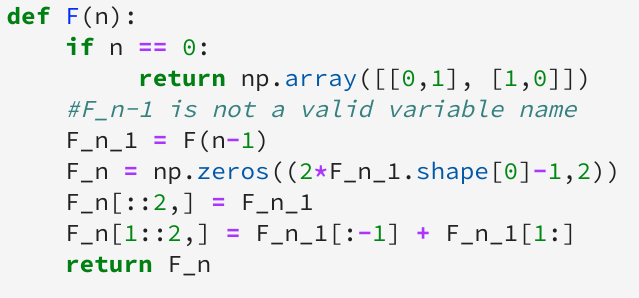

#

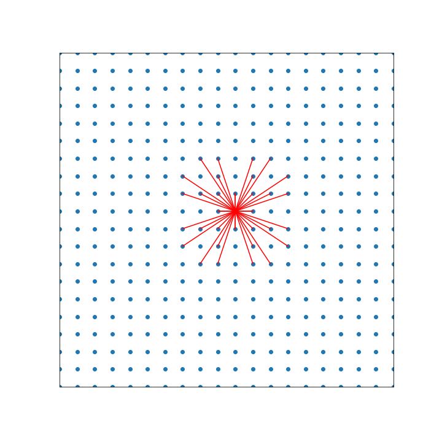

#

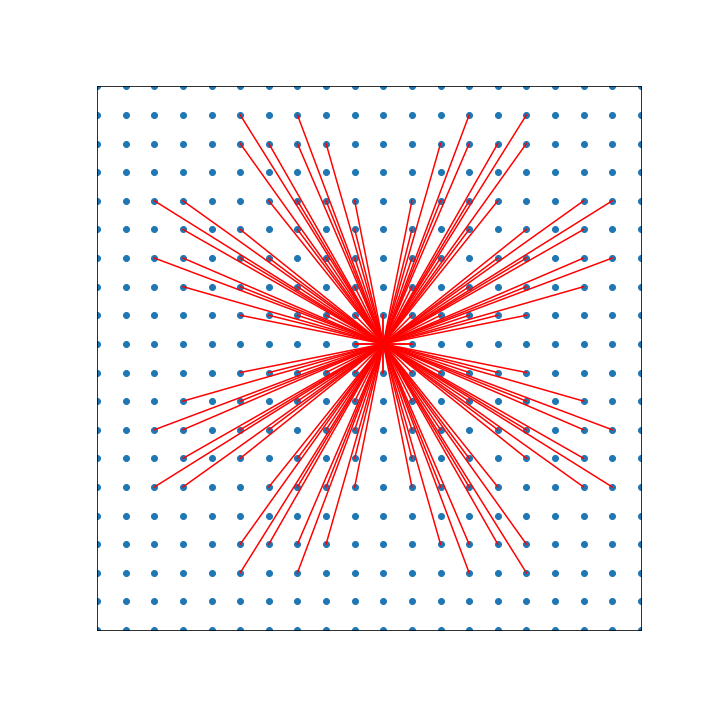

#

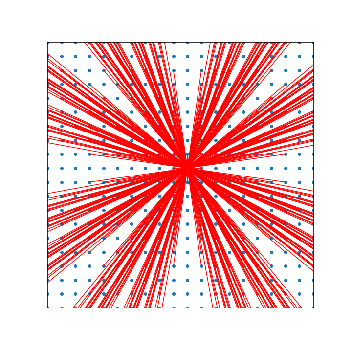

#

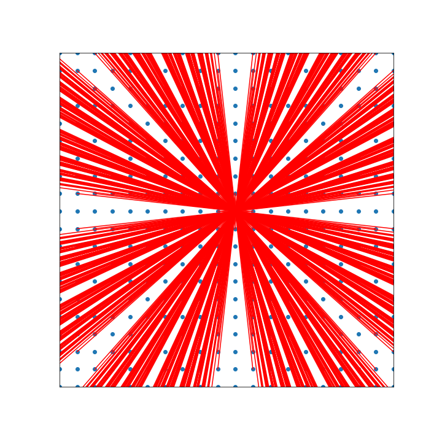

#

There are holes but they will get filled in

#

### Poincare disc/upper half plane

metric for which the orientation preserving isometries are Moebius transformations :
<span style="font-size: 200%">$z \mapsto \frac{a z + b }{cz + d}$</span>

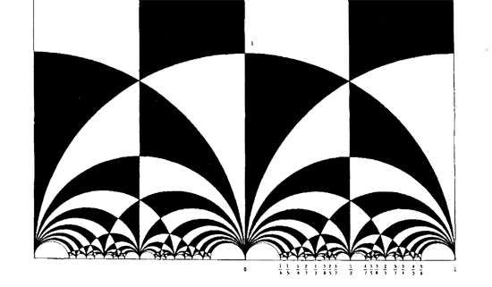

#

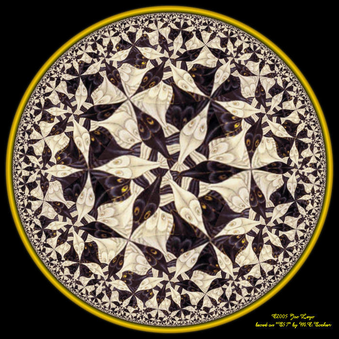

#
### [Call of Cthulhu](https://www.jstor.org/stable/25678597)
the geometry of the dream-place he saw was
abnormal, non-Euclidean, and loathsomely redolent of spheres and dimensions apart from ours.

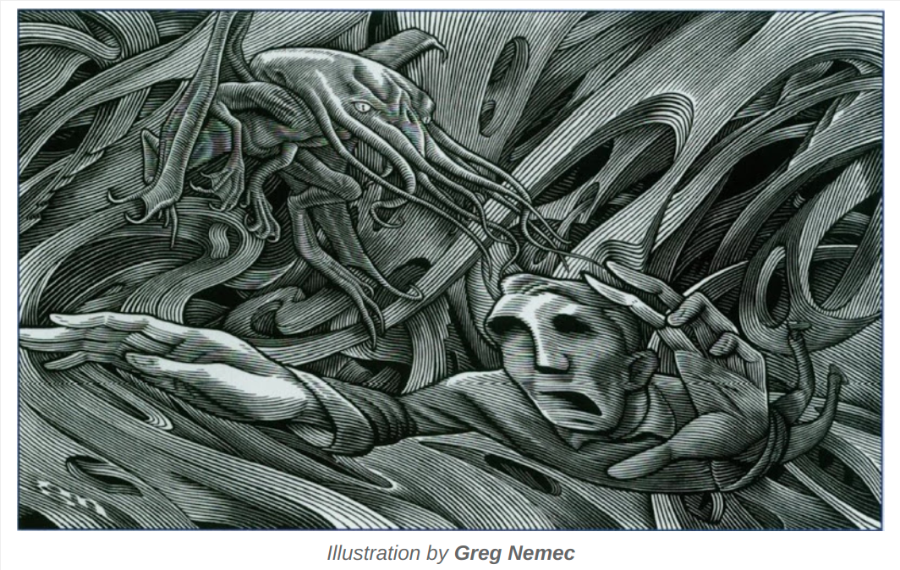

#
## Ideal triangles

area = <span style="font-size: 200%">$\pi$</span>, all angles = 0

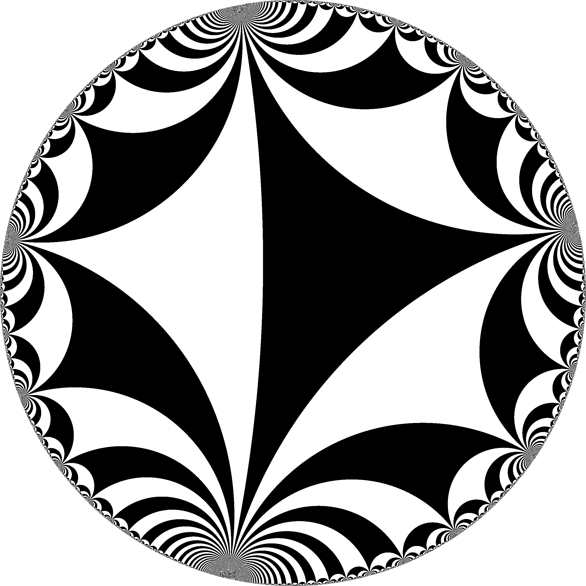


#
## Types of isometry

<span style="font-size: 300%">$z \mapsto \frac{a z + b }{cz + d}$</span>

- rotations : single fixed point in <span style="font-size: 200%">$\mathbb{H}$</span>
- parabolic : single fixed point on
    <span style="font-size: 200%">$\mathbb{R}$</span>
- loxodromic : pair of fixed points on <span style="font-size: 200%">$\mathbb{R}$</span>

#

## Punctured torus

Glue opposite sides ideal quadrilateral.


#

## Punctured torus

- closed geodesics
- dense geodesics
- all sorts of other geodesics

#

on the left simple, on the right non simple

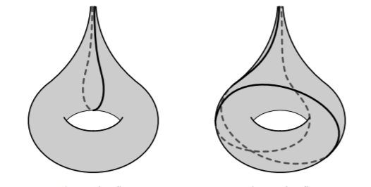

most geodesics aren't simple they have self intersections.

#

81 shortest geodesics on torus

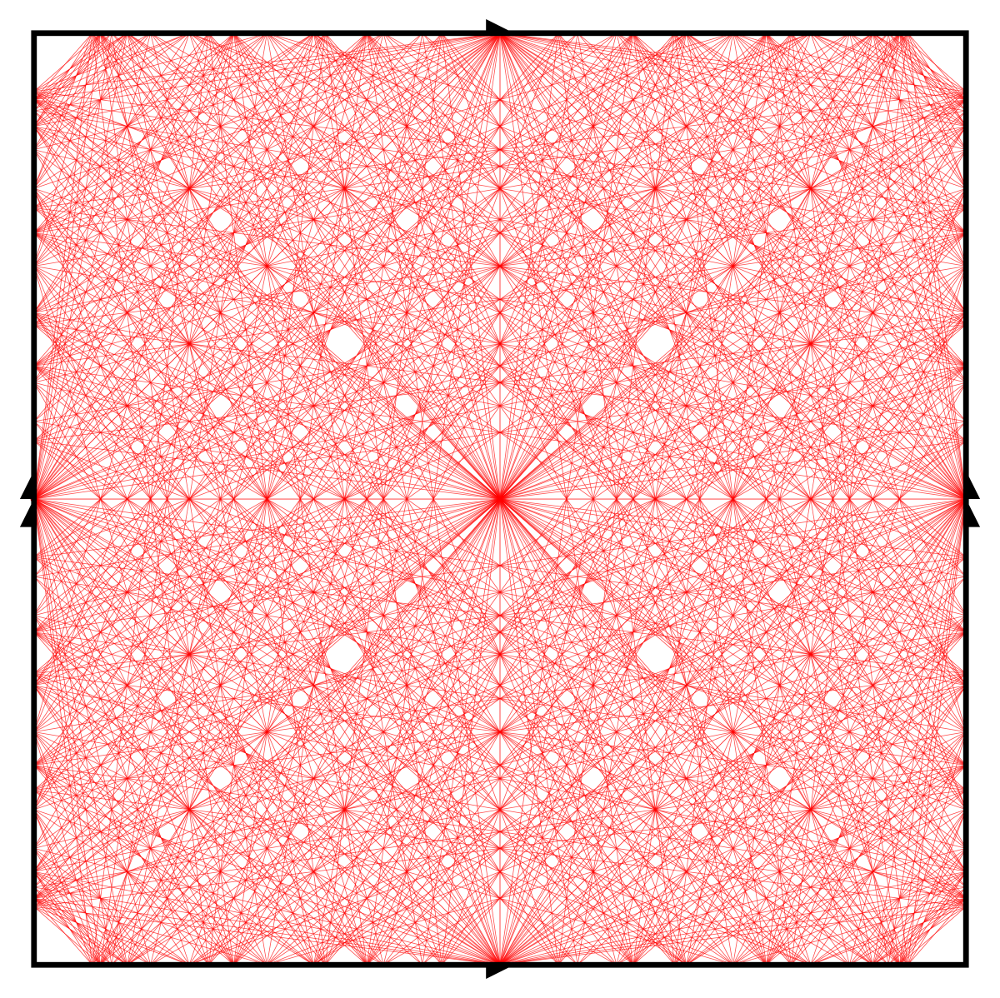


#

on punctured torus

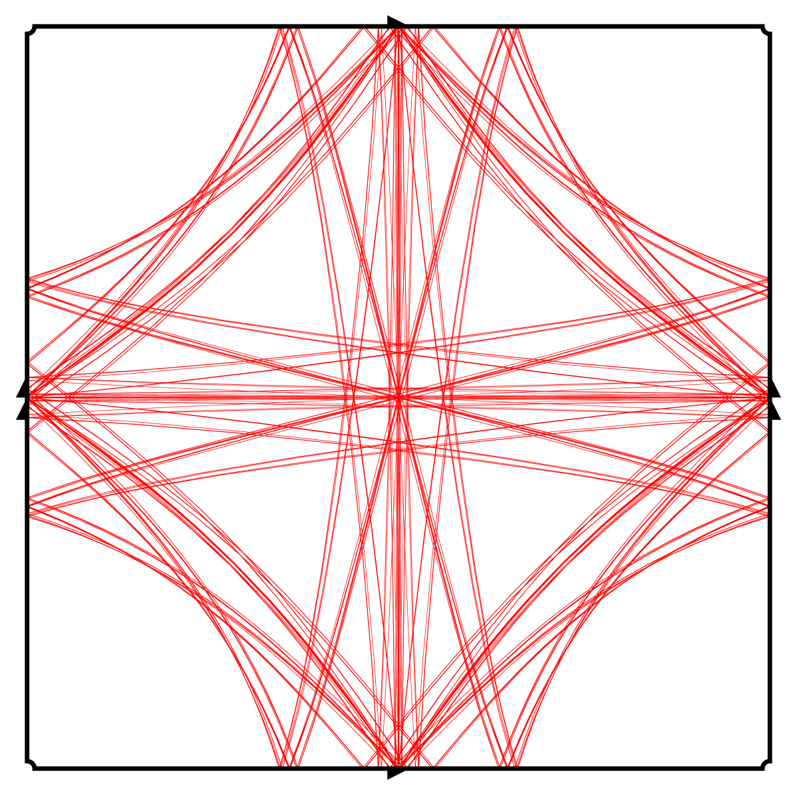

# 

## Birman-Series Theorem

The union of all complete **simple** geodesics is 

- closed
- nowhere dense i.e. there are holes
- Hausdorff dimension 1,  so measure zero

#

## Big question: where are the holes?

#
Pseudo sphere embedded in <span style="font-size: 200%">$\mathbb{R}^3$</span>.
<span style="font-size: 200%">$(\mathrm{sech}(u)\cos(v),\mathrm{sech}(u)\sin(v),u-\tanh(u) )$</span><br>
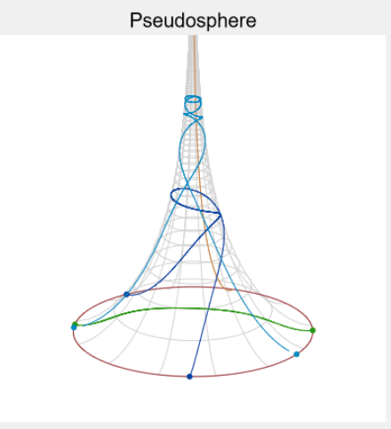

#
Pseudo sphere as a quotient<br>
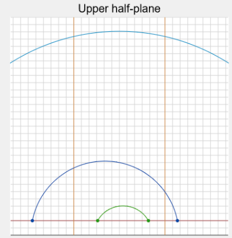


#
## Observation
The pseudo sphere is foliated by *vertical geodesics*

#
## Fundamental lemma

- every punctured torus contains a pseudo sphere of area 1
- no simple closed geodesic enters this pseudo sphere
- any simple geodesic that enters the pseudo sphere is vertical

#
The pseudo sphere is a bit like a black hole
once past it's horizon there is no escape for the geodesic.

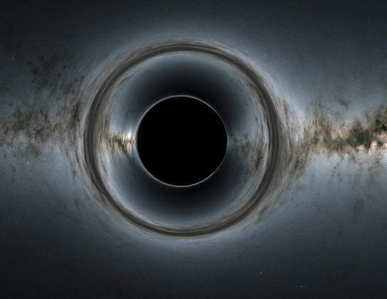

#
## Historical background

- Approach to Markoff's Minimal Forms Through Modular Functions Harvey Cohn
    [dowload](https://www.jstor.org/stable/1969618?seq=1)
- Geometry of the Markoff numbers
    [dowload](https://perso.univ-rennes1.fr/serge.cantat/Documents/series-geometry-markoff.pdf)
- Markov numbers [wiki](https://en.wikipedia.org/wiki/Markov_number)

#

Intersection of Birman Series set with pseudo sphere.

<span style="font-size: 200%">$K \times \mathbb{R}^+ = K_{ess} \sqcup K_{iso}$</span>

- <span style="font-size: 200%">$K$</span> = closed nowhere dense subset of circle  
- <span style="font-size: 200%">$K_{iso}$</span> = isolated points 
- "shallow" points in  closure of interval <span style="font-size: 200%">$\subset K_{ess}^c$</span> 
- also "deep" points in <span style="font-size: 200%">$K_{ess}$</span>

#


<span style="font-size: 400%">$\frac{2}{1 + e^{\ell_\gamma}}$</span>

is the length of an interval in <span style="font-size: 200%">$K_{ess}$</span>

#

## geometrically 

what are the geodesics like that come from

- isolated points
- "shallow" points?
- "deep" points?

[My thesis](http://wrap.warwick.ac.uk/4008/)

#

<span style="font-size: 200%">$x \in K \rightarrow  \gamma_x$</span> the geodesic "accumulates" somewhere.

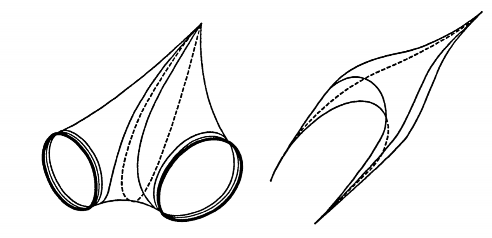

Surface cut along accumulation set

# Classification Theorem

- <span style="font-size: 200%">$\gamma_x$</span> returns to pseudo sphere <=> x isolated 
- <span style="font-size: 200%">$\gamma_x$</span> spirals to a closed geodesic <=> x "shallow" 
- otherwise x "deep" 

# Corollary

The gaps in <span style="font-size: 200%">$K_{ess}$</span> are 1-1 with closed geodesics


#
## Short story

- Look what I proved I think you're going to like it.
- Either false or Bob Penner has done it already


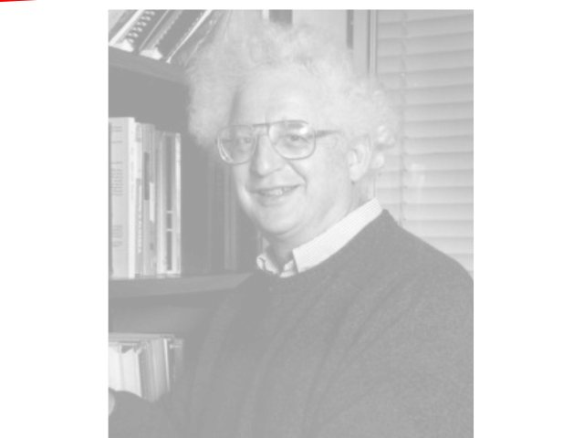

#
## Short story


#
## Markoff numbers

 (Cohn) the Markoff numbers are <span style="font-size: 200%">$2/3 \cosh(\ell_\gamma/2)$</span>
for <span style="font-size: 200%">$\gamma$</span> a closed simple geodesic on the punctured torus.

- recursive enumeration, no closed formula

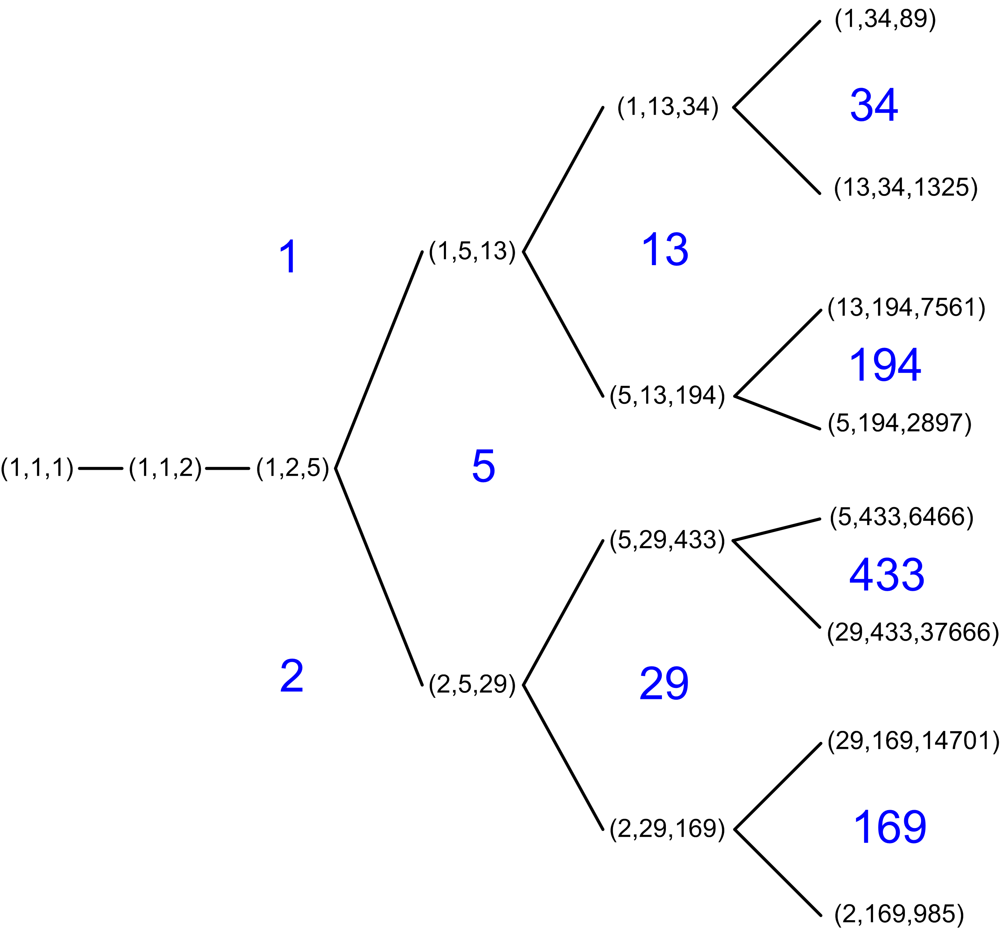

#
## I wrote a program


#
## Diophantine approximation

-  x "deep" point not isolated or shallow
- Even-numbered convergents are smaller than the original number,
- while odd-numbered ones are larger.


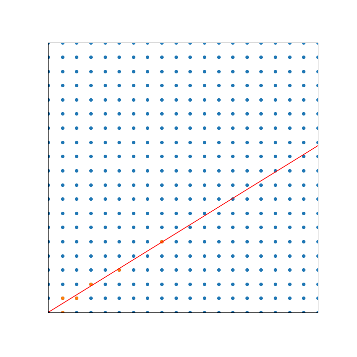
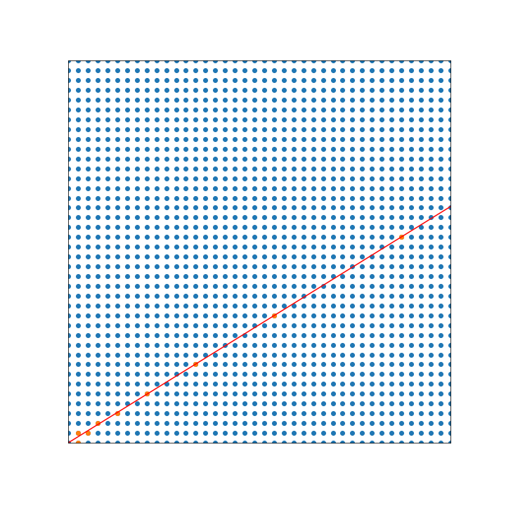

#
## Applications : 
partition of unity for integration 


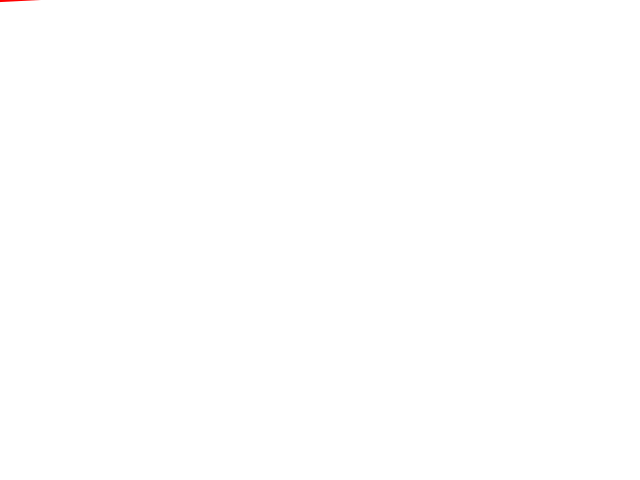

#
# Teichmueller space

3 glueing parameters + 1 relation

[Shear
coords](https://en.wikipedia.org/wiki/Teichm%C3%BCller_space#Shear_coordinates) 

#
# Teichmueller space

2 parameters - length and twist


[Fenchel Nielsen
coords](https://en.wikipedia.org/wiki/Fenchel%E2%80%93Nielsen_coordinates)

#
# References

[Mirzakhani](https://arxiv.org/pdf/1509.06880)<br>
[Wright](https://arxiv.org/pdf/1905.01753)
