<!--
theme: gaia
class: gaia lead
headingDivider: 1
paginate: true
header: 
footer: 
backgroundImage: linear-gradient(-20deg, rgba(0, 0, 0, 0.6), transparent)
_paginate: false
_header: ''
_footer: ''

style: |
  @keyframes marp-outgoing-transition-vertical-scroll {
    from { transform: translateY(0%); }
    to { transform: translateY(-100%); }
  }
  @keyframes marp-incoming-transition-vertical-scroll {
    from { transform: translateY(100%); }
    to { transform: translateY(0%); }
  }

  @keyframes marp-outgoing-transition-vflip {
    0% { animation-timing-function: ease-in; }
    50% {
      transform: perspective(100vw) translateZ(-100vw) rotateX(-90deg);
      opacity: 0.5;
      animation-timing-function: step-end;
    }
    100% { opacity: 0; }
  }
  @keyframes marp-incoming-transition-vflip {
    0% {
      animation-timing-function: step-start;
      opacity: 0;
    }
    50% {
      transform: perspective(100vw) translateZ(-100vw) rotateX(90deg);
      opacity: 0.5;
      animation-timing-function: ease-out;
    }
  }

  header, footer { text-align: center; color: currentcolor; }
  section.small-code pre { font-size: 68%; }

-->

# Hyperbolic geometry and Diophantine approximation
<!-- _transition: glow -->
greg mc shane

<!-- # -->
<!-- <!-1- _transition: cube -1-> -->
<!-- - slides : google **greg mcshane github** -->
<!-- - click on **serfest** -->
<!-- - if there is a bug in my slides blame [this guy](https://github.com/yhatt) -->

# Contents

- prelude
- numbers: integers, rationals, quadratic irrationals
- geodesics on the modular torus and identity
- Dehn twists and Markoff numbers

* $\Gamma = \mathrm{PSL}(2,\mathbb{Z})$ two index 6 subgroups
* $\Gamma(2) = \ker (\Gamma →\mathrm{PSL}(2,\mathbb{Z}/2\mathbb{Z})) \simeq \mathbb{Z}*\mathbb{Z}$
* $\Gamma' = [\Gamma,\Gamma] = \ker (\Gamma →\mathbb{Z}/6\mathbb{Z})\simeq \mathbb{Z}*\mathbb{Z}$ 
* $\mathbb{H}/\Gamma(2) =$ three punctured sphere, automorphisms $\simeq \mathfrak{S}_3$
* $\mathbb{H}/\Gamma' =$ modular torus, automorphisms $\simeq \mathbb{Z}/6\mathbb{Z}$ 

#

## Simple geodesics

- A curve $\gamma\subset\mathbb{H}$ covers a simple curve in $\mathbb{H}/\Gamma'$ 
if and only $\forall g\in \Gamma',\,g\gamma \cap \gamma = \begin{cases} \emptyset  \\ \gamma  \end{cases}$
$z\mapsto z + 6$ is a (primitive) parabolic element of $\Gamma'$ fixing $\infty$
- **Definition** 
The **cusp region** (of area $6/r$) is the quotient of 
the horoball $\{ z, \mathrm{Im}\, z > r > 1\}\subset \mathbb{H}$ 
by the subgroup  $\langle z\mapsto z + 6 \rangle< \Gamma'$

- **Lemma A** 
If $\gamma \subset \mathbb{H}$ projects to a simple closed curve in $\mathbb{H}/\Gamma'$ then it is either a vertical line or disjoint from the horoball with $r = 3$.

#

<!-- transition: cube -->

- **Lemma A** If $\gamma \subset \mathbb{H}$ projects to a simple closed geodesic in $\mathbb{H}/\Gamma'$ then it is either:
    - a vertical line or 
    - disjoint from the horoball with $r = 3$ (in grey).

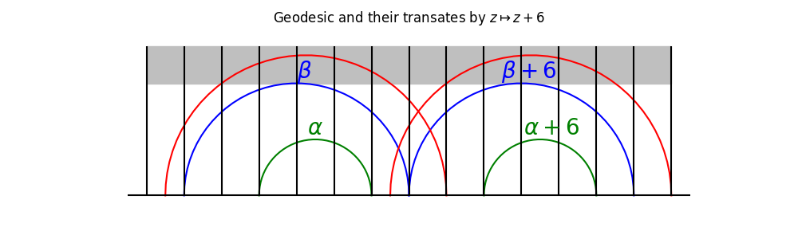

# Part 1
<!-- transition: fade -->

# Numbers

- Boris Springborn, The hyperbolic geometry of Markov's theorem on Diophantine approximation and quadratic forms. Enseign. Math., 

---

- rationals $p/q \in \mathbb{Q}\cup \infty$ 
    - $\leftrightarrow$ simple closed curves on the torus
- irrationals
    - quadratic irrationals eg golden ratio $\phi =
    \frac{1+\sqrt{5}}{2}$ 
    - other irrationals $\sqrt{2} + \sqrt{5}$

# Continued fraction of $x\in \mathbb{R}_+$

$$x = a_0 + \frac{1}{a_1 + \frac{1}{a_2 + \frac{1}{a_3 + \dots}}}$$
where $a_0 \in \mathbb{N}$ and $a_n \in \mathbb{N}^*$ for $n\ge 1$.
- we write $x = [a_0; a_1, a_2, a_3, \dots]$
    - golden ratio $\phi = [1; 1, 1, 1, \dots]$ 
    - $\sqrt{2} = [1; 2, 2, 2, \dots]$

# Best approximation of $x$ by rationals

 Truncating the continued fraction of $x$ at the $n$-th step gives a rational approximation $p_n/q_n:=$ **the n-th convergent of $x$.**

- This is the best approximation of $x$ by rationals with
denominator at most $q_n$. 
- For example, the best approximations of $\phi$ are
$$\frac{1}{1}, \frac{2}{1}, \frac{3}{2}, \frac{5}{3}, \frac{8}{5},
\frac{13}{8}, \ldots \frac{F_{n+1}}{F_n} \ldots$$
- where $F_n$ is the $n$-th Fibonacci number. 

#

## Visualization

- Farey diagram: 
    - vertices = rationals, edges = Farey neighbors
    - $a/c, b/d$ are Farey neighbors iff $|ad - bc| = 1$
- $PSL(2,\mathbb{Z})$ invariant translation of $\mathbb{H}$ 

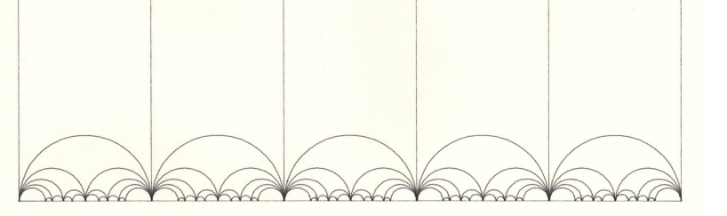

#

## Visualization $\phi=$ golden ratio = 1.6180339...

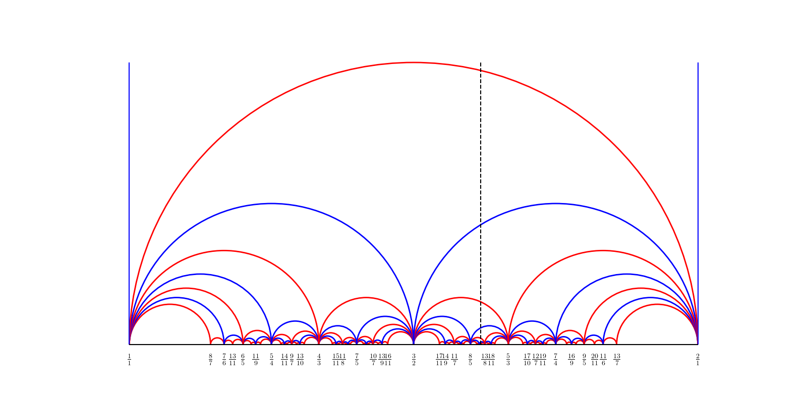

#

## Visualization $\phi=$ golden ratio = 1.6180339...

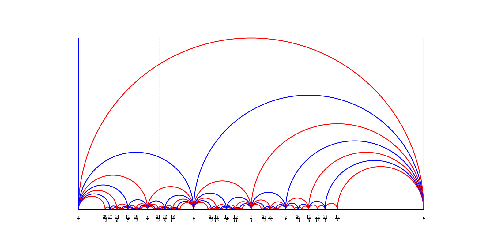

# $\sqrt{2}$ 

$$1, \frac{3}{2}, \frac{7}{5}, \frac{17}{12}, \frac{41}{29}, \frac{99}{70}, \frac{239}{169}, \frac{577}{408}, \dots$$

#

### $\sqrt{2}\rightarrow 1, \frac{3}{2}, \frac{7}{5}, \frac{17}{12}$

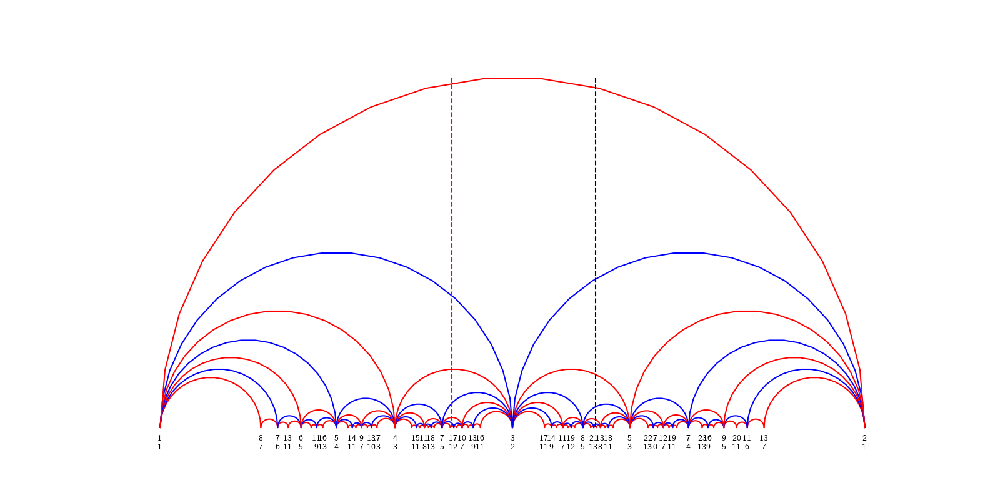

#

| Constant | Continued Fraction Notation | First 5 Convergents (Fractions) |
| :--- | :--- | :--- |
| **Golden Ratio** ($\phi$) | $[1; 1, 1, 1, 1, \dots]$ | $1, \frac{2}{1}, \frac{3}{2}, \frac{5}{3}, \frac{8}{5}$ |
| **Square Root of 2** ($\sqrt{2}$) | $[1; 2, 2, 2, 2, \dots]$ | $1, \frac{3}{2}, \frac{7}{5}, \frac{17}{12}, \frac{41}{29}$ |
| **Euler's Number** ($e$) | $[2; 1, 2, 1, 1, 4, 1, 1, 6, \dots]$ | $2, \frac{3}{1}, \frac{8}{3}, \frac{11}{4}, \frac{19}{7}$ |
| **Pi** ($\pi$) | $[3; 7, 15, 1, 292, 1, \dots]$ | $3, \frac{22}{7}, \frac{333}{106}, \frac{355}{113}, \frac{103993}{33102}$ |
| **$\sqrt{2} + \frac{\sqrt{5}}{2}$** | $[2; 1, 1, 10, 1, 1, 1, \dots]$ | $2, \frac{3}{1}, \frac{4}{1}, \frac{43}{11}, \frac{47}{12}$ |
| **Cube Root of 3** ($\sqrt[3]{3}$) | $[1; 2, 3, 1, 4, 2, 3, \dots]$ | $1, \frac{3}{2}, \frac{10}{7}, \frac{13}{9}, \frac{62}{43}$ |

#

## Can  "read" the $a_i$ from the picture:

- the number of corners of the "zig-zag" **alternately on the left and the right** of the vertical line ending at $x$
- The modular surface and continued fractions, Caroline Series

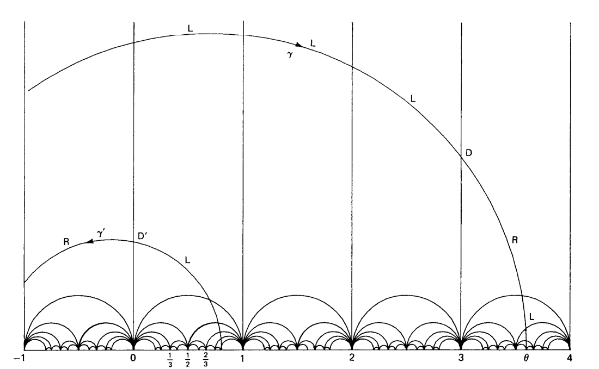
#

## Visualization $\phi=$ golden ratio = 1.6180339...

# zig-zag

 **Best approximations alternate on the left and the right**  

#

- rational numbers are poorly approximated by rationals
$$ \left| x - \frac{p}{q} \right| > \frac{C_x}{q}$$
continued fraction is finite
- quadratic irrationals are also poorly approximated by rationals
$$ \left| x - \frac{p}{q} \right| > \frac{C_x}{q^2}$$
continued fraction is (pre)periodic, eg $\sqrt{2} = [1; 2, 2, 2,
\dots]$

#

<!-- transition: cube -->

| Irrational Number (x) | Constant Cx | Numerical Value |
| :--- | :--- | :--- |
| **Golden Ratio (φ)** | 1/$\sqrt(5)$ | 0.4472 |
| **$\sqrt(5)$** | 1/$\sqrt(5)$ | 0.4472 |
| **$\sqrt(2)$** | 1/(2$\sqrt(2))$ | 0.3535 |
| **$\sqrt(3)$** | 1/(2$\sqrt(3)$ | 0.2886 |

- **Note:** This is related to how deep a (closed) geodesic can go into the cusp of the modular surface.

# Part 2
<!-- transition: fade -->

# email

- My name is **Jia Longsong**, and I am a Ph.D. student at **Peking University**. Recently, I have been studying your remarkable identity in detail. In your Acknowledgements, you mentioned that the motivation for the work lies in two series of seminars held at the University of Warwick. The first series concerned Thurston's unpublished work on **minimal stretch maps** between surfaces and the second Maskit's embedding of the Teichmuller space of the punctured torus. I am truly fascinated by the profound ideas behind your work.

# Minimal stretch maps

https://arxiv.org/abs/math/9801039

- This paper develops a theory of Lipschitz comparisons of hyperbolic surfaces analogous to the theory of quasi-conformal comparisons. Extremal Lipschitz maps (minimal stretch maps) and geodesics for the `Lipschitz metric' are constructed. The extremal Lipschitz constant equals the maximum ratio of lengths of measured laminations, which is attained with probability one on a simple closed curve. 

- **Geodesic laminations** = limits of simple closed curves

#

- **Definition** The Birman-Series set  (**BS**) is the union of the pointset of all compact measured laminations on a hyperbolic surface.
In fact this is just the closure of the set of the union of all 
simple closed geodesics.

- **Theorem 10.2** (Stretch maps)
For any hyperbolic surface of finite area, 
the Hausdorff dimension of **BS** is 0. 
In particular it is:
    - nowhere dense 
    - has measure zero.

# Questions

- nowhere dense, so where are the holes?
- has measure zero, can we exploit this?

- **Answer for a punctured torus:**
$$\sum_{\gamma } \frac{1}{e^{\ell_\gamma} + 1} =
\frac12$$

#
<!-- _transition: cube -->
## Punctured torus 
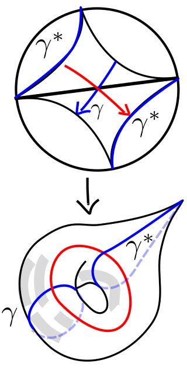

- modular torus obtained from a pair of ideal triangles by identification
* blue arc $\gamma^*$  is the unique arc  disjoint from blue curve $\gamma$  

#

- **Definition** 
The **(Haas)cusp region** $C$ is the quotient of the 
horoball $\{ z,
\mathrm{Im}\, z > r=3/2\}\subset \mathbb{H}$ by $\langle z\mapsto z + 6 \rangle< \Gamma'$
- **Lemma A+** 
If $\alpha\subset \mathbb{H}/\Gamma'$ is a simple closed geodesic 
then it is disjoint from the Haas cusp region.
- **Lemma A** 
If $\gamma \subset \mathbb{H}$ projects to a simple curve in $\mathbb{H}/\Gamma'$ then it is either 
    - a vertical line (lift of arc $\gamma^*$)
    - or disjoint from the horoball with $r = 3$ (lift of $\gamma$)

- **Corollary**
The cusp region is a hole in the Birman-Series set.

#

- The extended Birman-Series set  (**EBS**) is the union of the pointset of all measured laminations on a hyperbolic surface.
In fact this is just the closure of the set 
of the union of all simple closed geodesics **and** arcs.

- **Theorem 10.2** (essential stretch maps)
For any hyperbolic surface of finite area, 
the Hausdorff dimension of **EBS** is 0. 
In particular it is 
    - nowhere dense 
    - and has measure zero.

#
<!-- transition: cube -->
## nowhere dense, so where are the holes in the cusp region?

# Geodesics in homology classes

<!-- transition: slide -->

- **Definition:** Let $c$ be an essential closed curve 
on the punctured torus $\mathbb{H}/\Gamma'$ and $\ell_c$ denote its length.

- **Natural map:** $(p/q)\in\mathbb{Q}\cup\infty \leftrightarrow q\alpha + p \beta \in H_1(\mathbb{H}/\Gamma')$

- **Theorem** 
The shortest representative for a non trivial homology class is always a multiple of a closed simple geodesic.
If $p,q$ are coprime then it is a single geodesic $\gamma_{p/q}$.

<!-- $\alpha \in H^1(T,\mathbb{Z}), \, \| \alpha \| := \inf_{ c \in \gamma} \ell_c/2$ -->

#
<!-- transition: slide -->
## Dehn twist round $\alpha$ acting on arcs

- 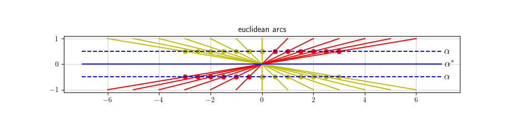
- 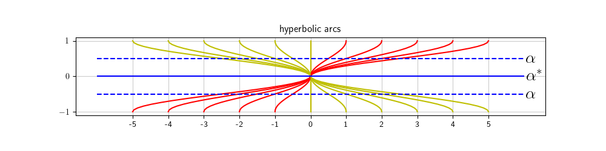

#

<!-- transition: slide -->
## limit geodesic on pants

Previous slide is the infinite cyclic cover of a pair of pants
obtained by cutting the torus along the geodesic $\alpha$.

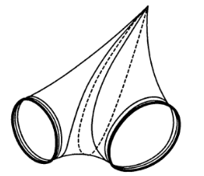
#

<!-- transition: cube -->
## limit geodesic on torus

- Pants glued up to a torus
- Shaded region is a pair of gaps in **EBS**

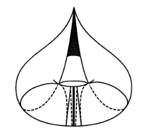

#

<!-- transition: cube -->
## torus cut open along lamination

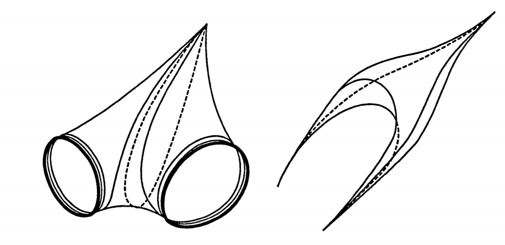

#
<!-- transition: slide -->
- **Theorem A**
If $\gamma^*$ is an arc then it is isolated in the $\text{EBS} \cap C$
It sits in the center of a pair of gaps of area
$$\frac{1}{e^{\ell_{\gamma}} + 1} \times \text{area of }C$$
- **Corollary**

$$\sum_{\gamma} \frac{2}{e^{\ell_{\gamma}} + 1} \leq 1$$

#

<!-- transition: slide -->
## Dehn twist round $\alpha$ acting on arcs

 

The sequence of arcs converges to a geodesic that is 
- disjoint from the lifts of the arc $\alpha^*$
- asymptotic to a pair of lifts of the closed geodesic $\alpha$.
#
<!-- transition: slide -->

## Dehn twist acting on arcs

- grey region is gap in **EBS** $\setminus \alpha^*$
- dotted red lines are lifts of arcs 

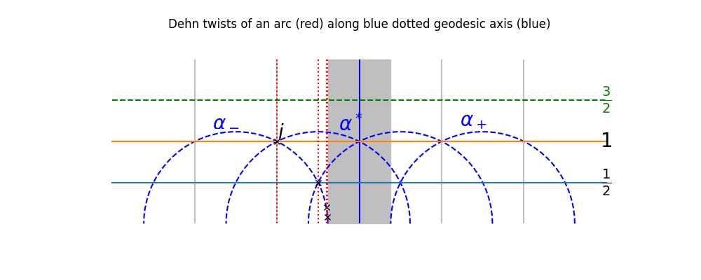

#

$$\sum_{\gamma} \frac{1}{e^{\ell_{\gamma}} + 1} \leq \frac12$$

- To promote this to an equality we need to show :
    1. show every gap is "adjacent" to an arc 
    1. then apply Theorem 10.2 to show that the union of the gaps has
full measure in the cusp region.

#

<!-- transition: cube -->

Show every gap is "adjacent" to an arc:
- extend the segment bounding a gap to a complete geodesic
- look at it in the homology cover, it's essentially a line of slope $m$.
- if $m$ is irrational use the continued fraction expansion of $m$ to find an infinite  sequence of arcs converging to this line **alternately** from left and right. **contradiction**
- so $m$ is rational and the geodesic is asymptotic to the lift of a
  simple closed geodesic.

# Part 3
<!-- transition: fade -->

# Another problem 
<!-- transition: slide -->
**Markoff numbers** are integers that appear a **Markoff triple** 
$$(1,1,1),(1,2,1),(2,5,1),(5,13,1)$$
- which are solutions of a Diophantine equation the so-called **Markoff cubic**

 $$x^2 + y^2 + z^2 - 3x y z = 0.$$

<!-- # --> 
<!-- _transition: wipe -->
<!-- ## infinity of Markoff triples: $z=1$ -->

<!-- $\begin{pmatrix} 3 & -1 \\ 1 & 0 \end{pmatrix}$ -->
<!-- is an automorph of --> 
<!-- $$x^2 + y^2  - 3x y.$$ -->

<!-- So $( v_n,v_{n+1},1)$ is a Markoff triple where -->

<!-- $\begin{pmatrix} x \\ y \end{pmatrix}=  \begin{pmatrix}v_{n+1} \\ v_n \end{pmatrix} = \begin{pmatrix} 3 & -1 \\ 1 & 0 \end{pmatrix}^n \begin{pmatrix}1 \\ 1 \end{pmatrix}$ -->

#
### Odd index Fibonacci numbers are Markoff numbers
<!-- _transition: slide -->
$1, 1, 2, 3, 5, 8, 13, 21, 34, 55, 89, 144, 233, 377, 610, 987, 1597, 2584, 4181 \ldots$

$(1,1,1),(1,2,1),(2,5,1),(5,13,1),(13,34,1),(34,89,1)$

#
### Odd index Pell numbers are Markoff numbers
<!-- _transition: slide -->
$0, 1, 2, 5, 12, 29, 70, 169, 408, 985, 2378, 5741, 13860,\ldots$

$(1,5,2), (5,29,2),(29,169,2)\ldots$

#

<!-- _transition: cube -->
### Frobenius uniqueness conjecture

The largest integer in a Markoff triple
determines the two other numbers.

#
<!-- _transition: cube -->
## Uniqueness conjecture: tree structure

- The largest integer in a triple determines the two other numbers.
* The multiplicity of any number in the complementary regions to the tree is at most **6**

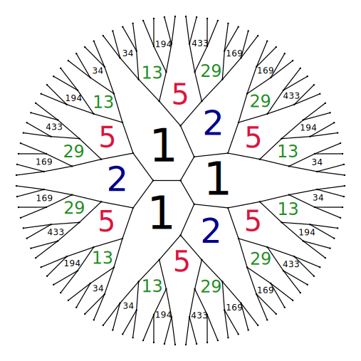

#
<!-- _transition: cube -->
### Partial results

m = Markoff number then there are at most 6 triples containing m.

-  Jack Button for [m prime](https://londmathsoc.onlinelibrary.wiley.com/doi/abs/10.1112/S0024610798006292)
    * Zhang [An elementary proof...](https://arxiv.org/abs/math/0606283)
    * Lang, Tan [A simple proof....](https://arxiv.org/abs/math/0508443)
    * Baragar [m, 3m - 2, 3m + 2 prime](https://www.cambridge.org/core/services/aop-cambridge-core/content/view/88B0E426FFCBEA8B3A345C1074B8CC59/S0008439500018828a.pdf/on-the-unicity-conjecture-for-markoff-numbers.pdf)
    * [ Bugeaud, Reutenauer,
    Siksek](https://www.sciencedirect.com/science/article/pii/S0304397509000930)

* Odd index Fibonacci numbers $\bigcap$  odd index Pell numbers = $\{1, 5\}$
<!-- * Conclusion too hard!!! -->

#
<!-- _transition: fade -->
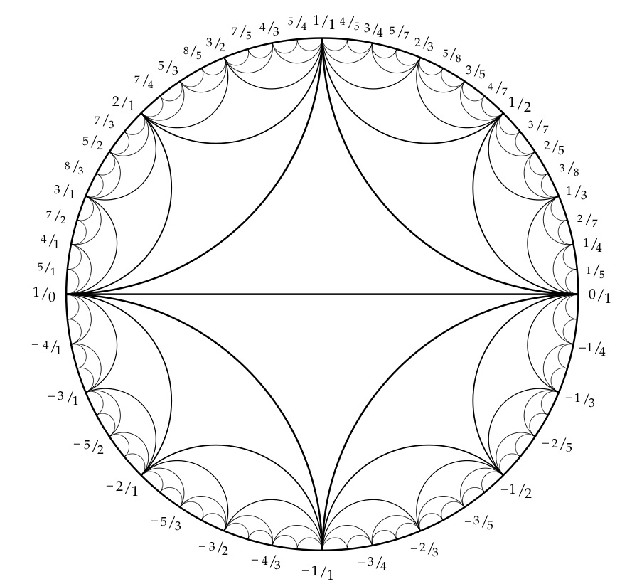
[source](https://www.math.mcgill.ca/sdouba/seminar/sami)

#

## Visualizing using natural map

<!-- _transition: slide -->
$\mathbb{Q}\cup \infty \rightarrow$ Markoff numbers

$p/q \mapsto m_{p/q} = \frac23 \cosh\left(\frac12\ell_{\gamma_{p/q}} \right)= \frac23 \cosh(\| (q,p) \|_s)$

* $PSL(2, \mathbb{Z})$ action on $\mathbb{Q}\cup \infty$ 
* transitive mapping class group action on essential simple curves on $\mathbb{H}/\Gamma'$

# 
### Tree structure

comes from Bass-Serre tree of
 $PSL(2,\mathbb{Z})$ 

<!--  -->

#
<!-- _transition: slide -->
## Role of the character variety 

H. Cohn Approach to Markoff’s Minimal Forms Through Modular Functions (1955)

* modular torus = quotient of upper half plane $\mathbb{H}$ by  commutator subgroup of $\Gamma'< \text{PSL}(2, \mathbb{Z})$, acting by Mobius transformations
*  relates Markoff numbers to lengths of simple closed geodesics

#
<!-- _transition: cube -->

- modular torus = quotient of upper half plane $\mathbb{H}$ by  commutator subgroup of $\Gamma'< \text{PSL}(2, \mathbb{Z})$
- obtained from a pair of ideal triangles by identification
- elliptic involution swaps triangles fixes midpoint of diagonal

#
<!-- _transition: fade -->
## Character variety

 modular torus = $\mathbb{H}/\Gamma'$ 

- $\Gamma'\simeq \mathbb{Z}*\mathbb{Z} \simeq$ fundamental group of the torus.
- any hyperbolic torus = $\mathbb{H}/ \rho(\mathbb{Z}*\mathbb{Z})$, 
- $\rho:\mathbb{Z}*\mathbb{Z}\rightarrow\text{PSL}(2, \mathbb{R})$ discrete faithful representation
- lifts to $\hat{\rho}:\mathbb{Z}*\mathbb{Z}\rightarrow\text{SL}(2, \mathbb{R})$ 
- $a,b$ generators of $\mathbb{Z}*\mathbb{Z}$
* **Definition** *character map* $\chi : \rho \mapsto ( tr \hat{\rho}(a),  tr \hat{\rho}(b),  tr \hat{\rho}(ab) )$

#

<!-- {: style="text-align: left"} -->
<!-- _transition: fade -->

- **Definition** *character map* $\chi : \rho \mapsto ( tr \hat{\rho}(a),  tr \hat{\rho}(b),  tr \hat{\rho}(ab) )$

- **Theorem:** (Fricke, Cohn and many others) the semi-algebraic set:

$(x,y,z) \in \mathbb{R}_+,\,x^2 + y^2 + z^2 - x y z = 0.$

* can be identified with the Teichmueller space 
of the punctured torus.
* there is a finite index subgroup of the automorphisms induced by the action of the mapping class group
    * the permutation $(x,y,z) \mapsto (y,z,x)$
    * the involution $(xy-z,z,y)$ (the flip)

#

## pairing arcs and curves

simple closed curve
$\leftrightarrow$ coprime integer $p,q$

* simple closed geodesic 
* hyperbolic length $\ell_\gamma$
* arc $\gamma^*$ disjoint from the closed geodesic
* $\lambda$-length of $\gamma^*$ 

# 
<!-- _transition: cube -->
## traces= $\lambda$ lengths

- **Lemma B** 
For an appropriate normalization:

$\lambda$-length of  $\gamma^* 
= 2 \cosh(\ell_\gamma/2)$

- appropriate normalization
= choice of cusp region

# 

## Proof (by recurrence):

- Let $\alpha,\beta$ be a pair of simple closed geodesics 
on the punctured torus that  intersect once.
- The corresponding traces $x,y$ together 
with some other z>0$ satisfythe Markoff equation:
$$z^2 - (xy)z + (x^2 + y^2) = 0$$
- Call the solutions $z_+,z_-$. These satisfy Vieta's relations:
    1. $z_+ + z_- = xy$ (Trace relation in $\text{SL}(2,\mathbb{R})$)
    1. $z_+ z_- = x^2 + y^2$ (Ptomley relation for $\lambda$-lengths)

#
<!-- _transition: slide -->
-  Bugeaud, Reutenauer, Siksek; A Sturmian sequence related to the uniqueness conjecture for Markoff numbers:
Odd index Fibonacci $\cap$ Odd index Pell = $\{1,5\}$

$F_{2n+1} = 3 F_{2n-1} - F_{2n-3}$
$P_{2n+1} = 6 P_{2n-1} - P_{2n-3}$

- Up to a multiplicative factor these are  sequence of 
traces of simple closed geodesics ($\lambda$ lengths of arcs) 
obtained by doing Dehn twists on the modular torus. 
$$A = \begin{bmatrix} 1 & 1 \\ 1 & 2 \end{bmatrix}, B = \begin{bmatrix} 1 & -1 \\ -1 & 2 \end{bmatrix},\, C_n:=A^nB$$

#

<!-- transition: cube -->
$$A^2B = \begin{pmatrix} -1 & 4 \\ -2 & 7 \end{pmatrix}, A^3B = \begin{pmatrix} -3 & 11 \\ -5 & 18 \end{pmatrix}, A^4B = \begin{pmatrix} -8 & 29 \\ -13 & 47 \end{pmatrix}, A^5B = \begin{pmatrix} -21 & 76 \\ -34 & 123 \end{pmatrix}$$

- Traces $6= 3\times 2,15=3\times 5,39=3\times 13,102= 3\times 34$

- **Theorem**
Let $\alpha$ be a simple closed geodesic on the punctured torus and $\alpha^*$ the unique arc disjoint from $\alpha$. and $\beta^*,\gamma^*$ a pair of arcs such that $\alpha^*,\beta^*,\gamma^*$ are the sides of an embedded ideal triangle. 
Then 
    1.the  (normalised) $\lambda$-lengths of $\alpha^*,\beta^*,\gamma^*$ is a Markoff triple.
    1. any power of Dehn twist along $\alpha$ gives a new Markoff
    triple containing the $\lambda$-length of $\alpha^*=$ trace of $\alpha$.

# Unicity conjecture

<!-- transition: slide -->
- Then 
    1.the  (normalised) $\lambda$-lengths of $\alpha^*,\beta^*,\gamma^*$ is a Markoff triple.
    1. any power of Dehn twist along $\alpha$ gives a new Markoff
    triple containing the $\lambda$-length of $\alpha^*=$ trace of $\alpha$.

- Unicity conjecture is equivalent to the statement that 
no **fractional Fenchel-Nielsen twist** along $\alpha$ 
gives integer $\lambda$-lengths to the images of $\beta^*,\gamma^*$.

# Bugeaud, Reutenauer, Siksek

<!-- transition: slide -->
- This is equivalent to a statement like:

- no "fractional" twist along one of the $A^nB,\,n\geq 2$
takes the arc of $\lambda$ length $1$ that meets $\alpha$
to an arc of $\lambda$-length $2$.

# Bugeaud, Reutenauer, Siksek

<!-- transition: slide -->
## How was I going to prove it?

- $\frac12 + i\frac12$ is the intersection of 
the line $y=\frac12$ and the axis of $A=\begin{pmatrix} 1 & 1 \\ 1 & 2 \end{pmatrix}$
- use Dehn twists to construct a sequence of points $\frac12 +
i x_n\rightarrow \frac12 + i\frac12$ "too quickly" for infinitely many $x_n$ to be rational.

#

<!-- transition: cube -->
## Dehn twist of the axes

- dotted red lines are lifts of arcs 
- $\alpha_-$ is the axis of $A$

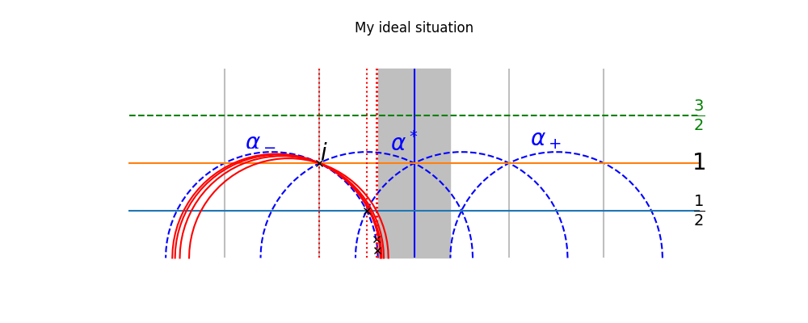

# 

## Where did I go wrong? Reciprocal geodesics
<!-- transition: slide -->
- $A = \begin{pmatrix} 1 & 1 \\ 1 & 2 \end{pmatrix}$ is conjugate to it's own inverse by $\begin{pmatrix} 0 & -1 \\ 1 & 0 \end{pmatrix}$

- the associated (simple) closed geodesic is invariant by the
**elliptic involution**
- any closed simple geodesic on the punctured torus is invariant
under the elliptic involution
- so I picked a  lifts of a sequence of simple closed geodesics
with traces $3F_{2n-1}$ that all went through the fixed point of $z \mapsto -1/z$ ie $i\in \mathbb{H}$. 

<!-- $$A^nBA^n = \begin{pmatrix} F_{2n-3}F_{2n-1} & F_{2n}^2 + F_{2n-2}F_{2n} \\ F_{2n}^2 - F_{2n-2}F_{2n} & F_{2n-1}F_{2n+1} + F_{2n}^2 \end{pmatrix}$$ -->

# 

<!-- transition: slide -->
## Where did I go wrong? Reciprocal geodesics

- any closed simple geodesic on the punctured torus is invariant
under the elliptic involution
- so I picked a  lifts of a sequence of simple closed geodesics
with traces $3F_{2n-1}$ that all went through the fixed point of $z \mapsto -1/z$. 

* These converge to the axis of $A$ and the intersection points give me the result
* **Unfortunately not**

#
## Dehn twist of the axes

- dotted red lines are lifts of arcs 
- $\alpha_-$ is the axis of $A$

#
<!-- transition: cube -->
- $\alpha_-$ is the axis of $A$
- limit of the $\frac12 + i x_n$ is intersection of  $y=\frac12$ with black semicircle
- black semicircle projects to a leaf of the lamination containing $\alpha$ 
= "limit" of the Dehn twists
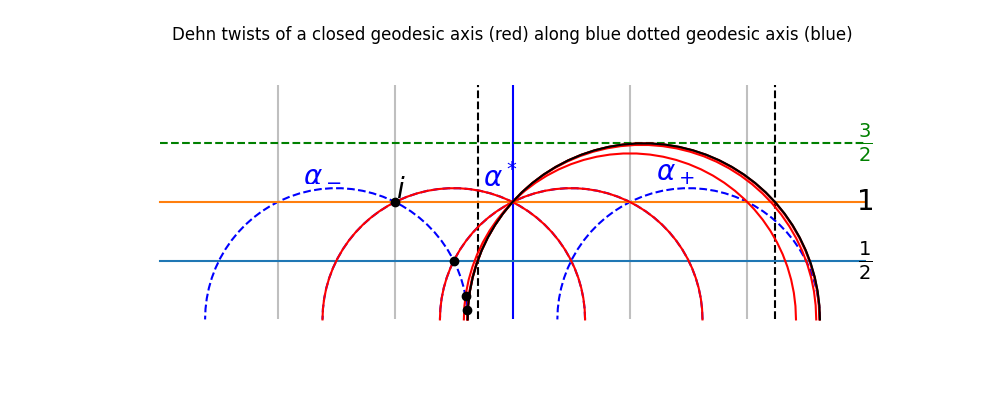

# THE END
