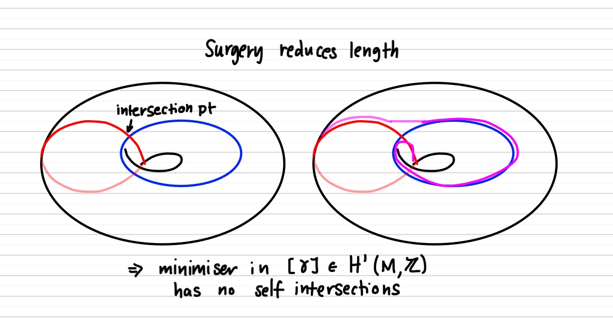
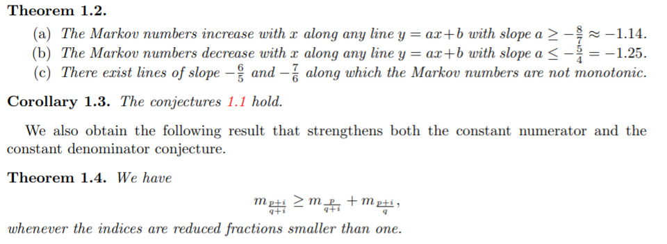
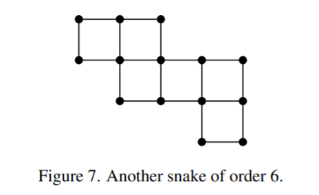

<!--
theme: gaia
class: gaia lead
headingDivider: 1
paginate: true
header: Serfest
footer: Kyoto 2023
backgroundImage: linear-gradient(-20deg, rgba(0, 0, 0, 0.6), transparent)
_paginate: false
_header: ''
_footer: ''

style: |
  @keyframes marp-outgoing-transition-vertical-scroll {
    from { transform: translateY(0%); }
    to { transform: translateY(-100%); }
  }
  @keyframes marp-incoming-transition-vertical-scroll {
    from { transform: translateY(100%); }
    to { transform: translateY(0%); }
  }

  @keyframes marp-outgoing-transition-vflip {
    0% { animation-timing-function: ease-in; }
    50% {
      transform: perspective(100vw) translateZ(-100vw) rotateX(-90deg);
      opacity: 0.5;
      animation-timing-function: step-end;
    }
    100% { opacity: 0; }
  }
  @keyframes marp-incoming-transition-vflip {
    0% {
      animation-timing-function: step-start;
      opacity: 0;
    }
    50% {
      transform: perspective(100vw) translateZ(-100vw) rotateX(90deg);
      opacity: 0.5;
      animation-timing-function: ease-out;
    }
  }

  header, footer { text-align: center; color: currentcolor; }
  section.small-code pre { font-size: 68%; }

-->

# Markoff numbers 
<!-- _transition: glow -->
greg mc shane

#

<!-- _transition: cube -->
- slides : google **greg mcshane github**
- click on **serfest**
- if there is a bug in my slides blame [this guy](https://github.com/yhatt)

#
<!-- _transition: slide -->
**Markoff numbers** are integers that appear a **Markoff triple** 
$$(1,1,1),(1,2,1),(2,5,1),(5,13,1)$$
which are solutions of a Diophantine equation 
the so-called **Markoff cubic**

* $$x^2 + y^2 + z^2 - 3x y z = 0.$$

<!-- # --> 
<!-- _transition: wipe -->
<!-- ## infinity of Markoff triples: $z=1$ -->

<!-- $\begin{pmatrix} 3 & -1 \\ 1 & 0 \end{pmatrix}$ -->
<!-- is an automorph of --> 
<!-- $$x^2 + y^2  - 3x y.$$ -->

<!-- So $( v_n,v_{n+1},1)$ is a Markoff triple where -->

<!-- $\begin{pmatrix} x \\ y \end{pmatrix}=  \begin{pmatrix}v_{n+1} \\ v_n \end{pmatrix} = \begin{pmatrix} 3 & -1 \\ 1 & 0 \end{pmatrix}^n \begin{pmatrix}1 \\ 1 \end{pmatrix}$ -->

#
### Odd index Fibonacci numbers are Markoff numbers
<!-- _transition: slide -->
$1, 1, 2, 3, 5, 8, 13, 21, 34, 55, 89, 144, 233, 377, 610, 987, 1597, 2584, 4181 \ldots$

$(1,1,1),(1,2,1),(2,5,1),(5,13,1),(13,34,1),(34,89,1)$

#
### Odd index Pell numbers are Markoff numbers
<!-- _transition: cube -->
$0, 1, 2, 5, 12, 29, 70, 169, 408, 985, 2378, 5741, 13860,\ldots$

$(1,5,2), (5,29,2),(29,169,2)\ldots$
#
<!-- _transition: slide -->
### Frobenius uniqueness conjecture

The largest integer in a triple determines the two other numbers.

#
<!-- _transition: cube -->
### Partial results

m = Markoff number

* Jack Button for [m prime](https://londmathsoc.onlinelibrary.wiley.com/doi/abs/10.1112/S0024610798006292)
* Baragar [m, 3m - 2, 3m + 2 prime](https://www.cambridge.org/core/services/aop-cambridge-core/content/view/88B0E426FFCBEA8B3A345C1074B8CC59/S0008439500018828a.pdf/on-the-unicity-conjecture-for-markoff-numbers.pdf)
* Zhang [An elementary proof...](https://arxiv.org/abs/math/0606283)
* Lang, Tan [A simple proof....](https://arxiv.org/abs/math/0508443)
* [ Bugeaud, Reutenauer, Siksek](https://core.ac.uk/download/pdf/82088222.pdf)
* Conclusion too hard!!!

# Martin Aigner
<!-- _transition: wipe -->

* [Proofs from THE BOOK](https://en.wikipedia.org/wiki/Proofs_from_THE_BOOK#:~:text=Proofs%20from%20THE%20BOOK%20is,proof%20of%20each%20mathematical%20theorem)
* [Convexity and Aigner's Conjectures](https://arxiv.org/abs/2101.03316)
* Prove his conjectures with one figure?

#
<!-- _transition: cube -->
### Aigner's monotonicity conjectures

* Markoff’s theorem and 100 years of the uniqueness conjecture. A mathematical journey from irrational numbers to perfect matchings.  2013.  
* M. Rabideau, R. Schiffler,
Continued fractions and orderings on the Markoff numbers,
Advances in Mathematics Vol 370,  2020. [published](https://www.sciencedirect.com/science/article/abs/pii/S0001870820302577)
* C Lagisquet and E. Pelantová and S. Tavenas and L. Vuillon, On the Markoff numbers: fixed numerator, denominator, and sum conjectures. [published](https://www.sciencedirect.com/science/article/abs/pii/S0196885821000658)

#
<!-- _transition: slide -->
There is a natural map (we'll see why shortly)

$\mathbb{Q}\cup \infty \rightarrow \text{Markoff numbers},\,\, p/q \mapsto m_{p,q}$

#
<!-- _transition: wipe -->
## Aigner's conjectures proof

# Labeling Markoff numbers
<!-- _transition: cube -->
## A tale of three trees

* Markoff number = $m_{p/q}$
* Farey "tree" of coprime integers $p,q$
* Markoff tree of solutions to the cubic
* Bass-Serre of a free product 

$PSL(2,\mathbb{Z}) \simeq \mathbb{Z}/2 * \mathbb{Z}/3$

# 
<!-- _transition: slide -->
## coprime integers $p,q$
* arc on a punctured torus
* closed geodesic (disjoint from the arc)
* snake graph and its perfect matchings
* "lengths" that verify a Ptolemy inequality

<!-- # --> 
<!-- ## Story of involutions -->

<!-- - Vieta jumping -->
<!-- - diagonal exchanges -->
<!-- - mutations -->

<!-- # -->
<!-- ## Group actions -->

<!-- * $\mathbb{Z}^2$ acting by translation on $\mathbb{R}^2$. -->
<!-- * infinitely many primitive elements --> 
<!-- * $(a,b)$ primitive iff $a,b \in \mathbb{Z}$ coprime -->

#
## Group actions

<!-- _transition: glow -->
$\mathbb{Q}\cup \infty \subset$ circle/projective line

* $(a,c)\text{ primitive } \mapsto a/c \in \mathbb{Q}\cup \infty$
* $\begin{pmatrix} a & d \\ c & d \end{pmatrix} \mapsto$  arc joining $(a/c, b/d)$ 
* $(a/b, c/d)$ are Farey neighbors iff $|ad - bc | =  1$
* obvious transitive $SL(2,\mathbb{Z})$  action on Farey neighbors

#
<!-- _transition: fade -->

[source](https://www.math.mcgill.ca/sdouba/seminar/sami)

<!-- # -->
<!--  -->
<!-- [source](https://www.mathi.uni-heidelberg.de/~pozzetti/trees/4.pdf) -->

#
<!-- _transition: cube -->

[source](https://www3.nd.edu/~math/rtg/GTS/www3.nd.edu/_jquigle2/GSTS%20FA18/Week1P.pdf)

#

### natural map ?
<!-- _transition: slide -->
$\mathbb{Q}\cup \infty \rightarrow$ Markoff numbers

$p/q \mapsto m_{p,q}$

* $SL(2, \mathbb{Z})$ action on $\mathbb{Q}\cup \infty$ 
* $SL(2, \mathbb{Z})$ action on Markoff numbers/triples ?
* [Vieta jumping](https://en.wikipedia.org/wiki/Vieta_jumping)

#
<!-- _transition: cube -->
### Vieta jumps/flips/involutions
$$x^2 + y^2 + z^2 - 3x y z = 0.$$
$$x^2 - (3yz)x  + (y^2 + z^2) = 0.$$

* quadratic in $x$,  two roots $x^\pm$
* Vieta formula $x^+ + x^- = 3yz$ 
* involution $(x^-,y,z) \mapsto (x^+, y,z) = (3yz - x^-, z,y)$

#

<!-- _transition: fade -->
Peter Sarnak (Princeton and IAS)

Title: Strong approximation for Markoff surfaces

We discuss the transitivity properties of the group of morphisms generated by Vieta involutions on the solutions in congruences to the Markoff equation as well as to other Markoff type affine cubic surfaces. These are dictated in part by the finite orbits of these actions on the algebraic points

Joint work with J.Bourgain and A.Gamburd.

#
<!-- _transition: fade -->
## Automorphisms
$$x^2 + y^2 + z^2 - 3x y z = 0.$$

- Vieta flips
- (cyclic) permutations of $x,y,z$
- action of $\mathbb{Z}/2 * \mathbb{Z}/3 \simeq PSL(2,\mathbb{Z})$ 

#
<!-- _transition: glow -->
Natural  = $PSL(2,\mathbb{Z})$-equivariant map

$\mathbb{Q}\cup \infty \rightarrow p/q \mapsto \text{Markoff
number}\,\,m_{p/q}$

- $(0:1) \mapsto  0/1 \mapsto  m_{0/1} = 1 = x$
- $(1:0) \mapsto  \infty \mapsto m_{1/0} = 1 = y$
- $(1:1) \mapsto  1/1 \mapsto m_{1/1} = 2 = z$ 
- actions = projective on left and by autos on right

# 
### Tree structure

comes from Bass-Serre tree of
 $PSL(2,\mathbb{Z})$ 

<!--  -->

#
<!-- _transition: cube -->
## Uniqueness conjecture

* The largest integer in a triple determines the two other numbers.
* The multiplicity of any number in the complementary regions to the tree is at most **6**

#
<!-- _transition: slide -->
## Modern theory: H. Cohn 

Approach to Markoff’s Minimal Forms Through Modular Functions (1955)

* modular torus = quotient of upper half plane $\mathbb{H}$ by  commutator subgroup of $\Gamma'< \text{PSL}(2, \mathbb{Z})$, acting by Mobius transformations
*  relates Markoff numbers to lengths of simple closed geodesics

#
<!-- _transition: cube -->

* modular torus = quotient of upper half plane $\mathbb{H}$ by  commutator subgroup of $\Gamma'< \text{PSL}(2, \mathbb{Z})$
* obtained from a pair of ideal triangles by identification
* elliptic involution swaps triangles fixes midpoint of diagonal

#
<!-- _transition: fade -->
## Character variety

 modular torus = $\mathbb{H}/\Gamma'$ 

* $\Gamma'\simeq \mathbb{Z}*\mathbb{Z} \simeq$ fundamental group of the torus.
* any hyperbolic torus = $\mathbb{H}/ \rho(\mathbb{Z}*\mathbb{Z})$, 
* $\rho:\mathbb{Z}*\mathbb{Z}\rightarrow\text{PSL}(2, \mathbb{R})$ discrete faithful representation
* lifts to $\hat{\rho}:\mathbb{Z}*\mathbb{Z}\rightarrow\text{SL}(2, \mathbb{R})$ 
* $a,b$ generators of $\mathbb{Z}*\mathbb{Z}$
* **Definition** *character map* $\chi : \rho \mapsto ( tr \hat{\rho}(a),  tr \hat{\rho}(b),  tr \hat{\rho}(ab) )$

#

<!-- _transition: cube -->
## Puncture condition 

$aba^{-1}b^{-1}$ is a loop round the puncture 
so its holonomy is parabolic and in fact:

$tr \hat{\rho} (aba^{-1}b^{-1}) = -2$

* $(x,y,z) =  ( tr \hat{\rho}(a),  tr \hat{\rho}(b),  tr \hat{\rho}(ab) )$
* $0 = 2+ tr \hat{\rho} (aba^{-1}b^{-1}) = x^2 + y^2 + z^2 - x y z .$
* ie Markoff cubic up to a change of variable

#

<!-- _transition: fade -->
 
 
Cohn (and others) shows that the 

- permutations 
- the Vieta flips 

 used to construct Markoff's binary tree are induced by
 automorphisms of the fundamental group of the torus.

#### Exo

- Nielsen move $\rightarrow$ Vieta flip
- $tr ab  + tr ab^{-1} = (tr a) (tr b)$

#

<!-- _transition: cube -->
### Theorem

The semi-algebraic set:

$(x,y,z) \in \mathbb{R}_+,\,x^2 + y^2 + z^2 - x y z = 0.$

can be identified with the Teichmueller space of the punctured torus.

#
<!-- _transition: fade -->
## Counting problem

$N(t) := \text{number of Markoff numbers} \leq t$

**Theorem** $N(t) = C (\log(3t))^2 + O(\log t)$

- Zagier (1982) [On the Number of Markoff Numbers Below a Given Bound.](https://www.ams.org/journals/mcom/1982-39-160/S0025-5718-1982-0669663-7/S0025-5718-1982-0669663-7.pdf) 
- Greg McShane, Igor Rivin (1995) [A norm on homology of surfaces and counting simple geodesics](https://arxiv.org/abs/math/0005222)

#
<!-- _transition: fade -->
### Counting closed simple geodesics

- character map $\chi : \rho \mapsto ( tr \hat{\rho}(a),  tr \hat{\rho}(b),  tr \hat{\rho}(ab) )$
* $a$ is generator iff $\exists$ essential simple  closed curve representing its conjugacy/free homotopy class

# 
<!-- _transition: cube -->
### Simple representatives

* blue curve is simple representative of its homotopy class
* not every homotopy class contains a simple curve 
* every (non trivial) homology class has a representative that is a (multiple) of a simple curve

<!-- # -->
<!-- ### Simple representatives in homology -->
<!-- $\phi :  \mathbb{Z}*\mathbb{Z} \rightarrow \mathbb{Z}^2 \simeq -->
<!-- H^1(T,\mathbb{Z})$. -->
<!-- abelianizing homomorphism. -->

<!-- - $\phi$ takes generators of  $\mathbb{Z}*\mathbb{Z}$ to generators of $\mathbb{Z}^2$. -->
<!-- - $(p,q) \in \mathbb{Z}^2$  generator $\Leftrightarrow p,q$ coprime. -->

#
<!-- _transition: fade -->
### Norms and minimizers

Let $c$ be an essential closed curve $\ell_c$ its length.

$\gamma \in H^1(T,\mathbb{Z}), \, \| \gamma \| := \inf_{ c \in \gamma} \ell_c/2$

* convexity/triangle inequality
* any pair of curves in linearly independent homology classes intersect
* a curve with self intersections is never a minimizer

#

<!-- _transition: fade -->

* Cluster algebra folks call this a **smoothing**

<!-- # -->

<!--  -->

#

<!-- _transition: cube -->
**Corollary:** Let T be a punctured torus  with a hyperbolic structure. 

- Then, the shortest multicurve representing a non-trivial homology class $h$ is a simple closed geodesic if $h$ is a primitive homology class, and a multiply covered geodesic otherwise. 
- In addition, the shortest multicurve representing $h$ is unique.

#

<!-- _transition: cube -->
## Unit ball

#
<!-- _transition: fade -->
### Unit ball and counting

 $\sharp \{ \gamma \in \mathbb{Z}^2,\, \| \gamma \| \leq t \} \sim \text{area unit ball}\times t^2$ 
* $\sharp \{ \gamma \text{ primitive},\, \| \gamma \| \leq t \} \sim \frac{6}{\pi^2}\text{area unit ball}\times t^2$ 
* the area of the unit ball depends on the hyperbolic structure
* with Rivin we studied it, but now it's called the Mirzakhani function :(

#
<!-- _transition: cube -->
## Why log ?
$N(t) = C (\log(3t)^2 + O(\log t)$

- $m_{p/q} = \frac13 tr \hat{\rho}( \gamma_{p/q})$
- $= \frac23 \cosh\left(\frac{\ell_{\gamma_p}}{2} \right)$
- $= \frac23 \cosh(\| (q,p) \|_s)$
- **important** $t ↦ \frac23 \cosh(t)$ monotone increasing on $[0,\infty[$

#
<!-- _transition: fade -->
## Aigner's conjectures 

#
<!-- _transition: fade -->
## Reformulate Aigner's conjectures 

 Markoff number $m_{p/q} = \frac23 \cosh(\| (q,p) \|_s)$
 $t ↦ \frac23 \cosh(t)$ monotone increasing on $[0,\infty[$

- Let $p, q$ be real non negative numbers and $i > 0$ then

- $\|(q,p) \|_s < \|(q + i,p) \|_s$
- $\|(q,p) \|_s < \|(q ,p +i ) \|_s$
- If in addition $p < q$ then
$\|(q ,p  ) \|_s < \|(q + i ,p -i ) \|_s$

#
<!-- _transition: fade -->
### Aigner's conjectures proof

#
<!-- _transition: cube -->
##

* [Gaster](https://arxiv.org/abs/2107.13499)

[source](https://arxiv.org/pdf/2010.13010.pdf)

#

<!-- _transition: fade -->
[On the ordering of the Markoff numbers](https://arxiv.org/abs/2010.13010)
Kyungyong Lee, Li Li, Michelle Rabideau, Ralf Schiffler

The proof uses a connection to cluster algebras. It was observed
in [P, BBH] that the Markoff numbers can be obtained from the cluster variables in the cluster
algebra of the once-punctured torus by specializing the initial cluster variables to 1. Moreover, the clusters in the cluster algebra then specialize to the Markoff triples. On the other hand, the cluster variables can be computed by a combinatorial formula given as a summation over the perfect matchings of a so-called snake graph.

#
<!-- _transition: fade -->
## Snake graph

#
<!-- _transition: cube -->
##

#
<!-- _transition: slide -->
## Button's Theorem

If $z$ is a Markoff number which is prime
then there is a unique triple $z > y > x$

$x^2 + y^2 + z^2 - 3x y z = 0.$

#
<!-- _transition: cube -->
### Theorem (Fermat)

Let $p$ be a prime then $p=c^2 + d^2$ has a solution over $\mathbb{Z}$

- iff $p = 2$ or $p − 1$ is a multiple of 4.

- Button's theorem follows from "unicity" of $c,d$
- unique factorisation $p = (ci+d)(-ci+d)\in \mathbb{Z}[i]$

#
<!-- _transition: cube -->
## Frobenius uniqueness conjecture

* The multiplicity of any number in the complementary regions to the tree is at most **6**

#

 $\Gamma = \mathrm{PSL}(2,\mathbb{Z})$
* $\Gamma' = [\Gamma,\Gamma]$ 
* $\mathbb{H}/\Gamma' =$ modular torus
* loop around the cusp $z \mapsto z + 6$
* automorphism group $\Gamma/\Gamma' \simeq \mathbb{Z}/6\mathbb{Z}$
* "generator" of the automorphism group is $z \mapsto z + 1$
* $z \mapsto -1/z$ normalises $\Gamma'$ so induces an involution of $\mathbb{H}/\Gamma'$
* the involution has 3 fixed points which lift to the $\Gamma$ orbit of i.

#
<!-- _transition: cube -->

* elliptic involution swaps triangles fixes midpoint of diagonal
* $z \mapsto -1/z$ normalises induces an involution of $\mathbb{H}/\Gamma'$
* the fixed points lift to the $\Gamma.\{i\}$

#

<!-- _transition: slide -->

#
<!-- _transition: cube -->
## Ford circles

# Definitions
<!-- _transition: slide -->
 **arc** = Poincaré geodesic joining $a/c, b/d \in \mathbb{Q}\cup \infty$
* **$\lambda$-length of  arc** $= |ad - bc|$ 
* $\lambda$-length of arc on $\mathbb{H}/\Gamma'$ is the length of a lift to $\mathbb{H}$

* $\mathrm{SL}(2,\mathbb{Z})$ acts by Mobius transformations on $\mathbb{H}$
* orbit of $F := \{ z, \mathrm{Im}\, z > 1\}$ are the Ford circles
<!-- - $\begin{pmatrix} a & b \\ c & d \end{pmatrix}.z = \frac{az+b}{cz+d}$ --> 

#
<!-- _transition: slide -->

* $p/q$ point of tangency with $\mathbb{R}$, diameter = $1/q^2$
*   hyperbolic midpoint of the arc joining $F$ to this Ford circle is at euclidean height $1/q$
<!-- - ie diameter is the square of the inverse of the denominator of $p/q$ -->

#

<!-- _transition: cube -->

- $p/q$ point of tangency with $\mathbb{R}$, diameter = $1/q^2$
-   hyperbolic midpoint of the arc joining $F$ to this Ford circle is at euclidean height $1/q$
<!-- - ie diameter is the square of the inverse of the denominator of $p/q$ -->

# Proposition
<!-- _transition: slide -->

- **arc** joining $a/c, b/d$ has **$\lambda$-length** $= |ad - bc|$ 
- **$2 \log \lambda$-length** = length of the portion outside Ford circles tangent to the real line at its endpoints

<!-- text_align: top -->
#
<!-- _transition: cube -->

 $\mathrm{SL}(2,\mathbb{Z})$  transitive on $\mathbb{P}(\mathbb{Q})$, 
* can suppose $a/c= \infty=1/0$ and $b/d = k/(ad - bc)$
* joins Ford circle  $F$  tangent at $\infty$ and another of diameter $1/(ad - bc)^2$
* hyperbolic length of portion outside these is $2\log(ad - bc)$
<!-- - the **midpoint** of this vertical arc is at height $1/|ad - bc|$ -->

#
## pairing arcs and curves
<!-- _transition: cube -->

* modular torus obtained from a pair of ideal triangles by identification
* blue arc $\gamma^*$  is the unique arc  disjoint from blue curve $\gamma^*$  

#

<!-- _transition: slide -->
### Lemma A

The $\lambda$-length of the unique arc $\gamma^*$  disjoint from the 
simple closed geodesic such that $m = \frac23 \cosh(\ell_\gamma/2)$ is $m$.

*Proof:* Easy calculation

### Corollary B
Every Markoff number $m$ is a sum of squares ie $m=c^2 + d^2$

#
<!-- _transition: slide -->
## Proof of corollary

* simple close geodesic $\gamma$ is invariant under the elliptic involution
* the unique arc $\gamma^*$ disjoint from $\gamma$ is invariant
* $⇒ \exists$  a fixed point of the elliptic involution on $\gamma^*$
* $⇒ \exists$ a lift of $\gamma^*$ which is a vertical line and which meets  $\Gamma.\{i\}$
* since $\lambda$-length of $\gamma^*$ = m this point is at euclidean height $1/m$

#
<!-- _transition: cube -->
## and  so we have the equation

$$\text{height } = \frac{1}{m} = \mathrm{Im} \frac{ai +b}{ci+d}  = \frac{1}{c^2 + d^2}$$

# by the same argument.... 
<!-- _transition: slide -->
## Lemma C

Let $m$ be a positive integer. 
The "number of  ways" of writing $m$  as a  sum of squares
$$m = c^2 + d^2$$
with $c,d>0$ coprime integers is equal to the number of arcs 
$\{  k/m + i t,\, t>0  \}$
$0 \leq k < m-1$ coprime to $m$ which meet $\Gamma.\{i\}$

# Counting solutions
<!-- _transition: slide -->
The "number of  ways" of writing $m$  as 
$$m = c^2 + d^2$$

* eight solutions
* four choices for the signs $\pm c, \pm d$ 
* swap $c$ and $d$
* only swapping $c,d$ "counts" 

# Example

<!-- _transition: cube -->

$5 = 2^2 + 1^2$

 $$\begin{pmatrix} 1& 0 \\ 2& 1 \end{pmatrix}.i
= \frac{i}{2i+1} = \frac25 + \frac{i}{5}$$

 $$\begin{pmatrix} 1& 1 \\ 1& 2 \end{pmatrix}.i
= \frac{i+1}{i+2} = \frac35 + \frac{i}{5}$$

<!-- text_align: top -->

#
<!-- _transition: slide -->
## Lemma C

The number of  ways of writing $m$  as a  sum of squares
$$m = c^2 + d^2$$
is equal to the number of arcs on the modular surface 
1. of $\lambda$-length $m$ 
1. which pass through the cone point of of order 2.

#
<!-- _transition: cube -->
<iframe src="./button.html" height="600" width="700"></iframe>

exactly 6 simple arcs of $\lambda$-length $m$ on $\mathbb{H}/\Gamma'$ 

# Proof of Button

<!-- _transition: slide -->
 every Markoff number $m$ is the sum of two squares
* if $m$ is prime then there are two ways of doing this
* there are $\leq 12$ oriented simple arcs of $\lambda$ length $m$ on $\mathbb{H}/\Gamma'$
* the multiplicity of $m$ in the Markoff tree is at most 6

# In fact....

<!-- _transition: glow -->

 
 
if $m$ is a Markoff number and 

- $m = p^k$
- or $m = 2p^k$

 
 
then $m$ satisfies the uniqueness conjecture

# 
<!-- _transition: cube -->

#
### Theorem (Fermat)

Let $p$ be a prime then $p=c^2 + d^2$ has a solution over $\mathbb{Z}$

- iff $p = 2$ or $p − 1$ is a multiple of 4.

