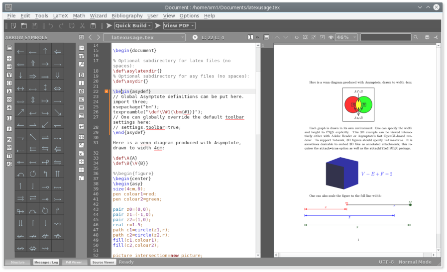

# UGA Introduction LaTeX  2020


Si vous avez le temps regardez la vidéo avant de lire le texte

<iframe width="560" height="315" src="https://www.youtube.com/embed/PRZ3cqjE1-4" frameborder="0" allow="accelerometer; autoplay; encrypted-media; gyroscope; picture-in-picture" allowfullscreen></iframe>

Merci à mon ancien collègue Arnaud Bodin.

- [slides en pdf](./bodin_slides.pdf)
- [slides en .tex](./bodin_slides.tex)

## Introduction

LaTeX est le format standard utilisé dans le monde de l’édition mathématique. Il existe des distributions libres de LaTeX pour toutes les plateformes (voir les références).

Un document au format LaTeX est un texte (au format ASCII) contenant des commandes de formatage. Ces commandes servent à structurer le texte (chapitres, sections, etc.) en laissant au compilateur le soin de rendre cette structure au mieux en fonction du format de sortie (texte imprimé, fichier PDF, sortie HTML pour mettre sur un site Web). Elles gèrent aussi l’affichage des symboles mathématiques, la numérotation des chapitres (chapter), sections, sous-sections (section, subsection), les réfèrences (on place un repère nom avec label puis on se réfère à nom avec ```ref``` ou ```pageref```)

``` {."verbatim"}
\label{toto} puis \ref{toto} ou \pageref{toto}
```

ou permettent de créer automatiquement la table des matières (\tableofcontents). Une fois saisi, le texte source LaTeX doit être compilé (parfois deux fois de suite pour mettre à jour les références et la table des matières). Le compilateur ne tient pas compte de la mise en page du texte source, le nombre d’espace entre deux mots est ignoré de même que le passage à la ligne. Seuls les sauts de lignes sont interprétés comme signalant un début de paragraphe.

La syntaxe d’une commande de formatage LaTeX est :

``` {."verbatim"}
\command[option]{argument}
```

Il existe dix caractères réservés qui ne sont donc pas imprimés tels quels :
$ & % # _ { } \

Pour les imprimer, il faut taper :

Un espace est crée avec \⊔.

``` {."verbatim"}
\$ \& \% \# \_ \{ \} \circonflexe \tild \symbol{92}
```

Le passage à la ligne (changement de paragraphe) se fait en insérant une ligne vide, la ligne suivante est alors indentée.


--------------------------------------------------------------------

###  Choix de l'éditeur, saisie d'un premier document.

Pour éditer votre texte en LaTeX, vous devez utiliser un éditeur comme pour taper le code source d’un programme. 
Vous pouvez utiliser n’importe quel éditeur si vous en connaissez déjà un, comme par exemple emacs (un éditeur de fichiers sources C/C++, Java, Python, LaTeX, ... très puissant mais qui nécessite un apprentissage...). 
Sinon, vous pouvez apprendre **TexMaker** (ou Overleaf) qui est un environnement facilitant beaucoup l’apprentissage de LaTeX avec des raccourcis clavier compatibles Windows et des assistants et barres d’icones pour saisir les symboles mathématiques,

#### Overleaf

[overleaf](https://www.overleaf.com/) est un éditeur LaTeX en ligne,
collaboratif en temps réel. Il est payant mais gratuit si l'on travaille seul (sans collaborateur).

L'interface est intuitive : on tape dans la fenêtre de gauche et la version
compilée s'affiche à droite :


Overleaf resemble beaucoup à....

#### TexMaker

Recherchez Texmaker sur un poste dans la salle Carism dans les programmes (menu Bureau, pour l’installer sur votre ordinateur, voir les liens en fin de document) ou ouvrez un terminal (menu Accessoires) et tapez la commande texmaker &
(Si vous avez oublié le &, tapez Ctrl-Z puis bg). Cliquez sur Nouveau puis sur Assistant dans la barre d’icones, sélectionnez utf8 au lieu de latin1 comme encodage. Ajouter ensuite la partie du texte ci-dessous entre
`\begin{document}` et `\end{document}`.



#### Editeur classique.

Téléchargez le [document](www-fourier.ujf-grenoble.fr/~parisse/info/essai.tex)
Ouvrez un terminal, puis éditez le document dans le terminal, par exemple avec Emacs  :
emacs essai.tex &
(Si vous avez oublié le &, tapez Ctrl-Z puis bg). Vous pouvez aussi créer un nouveau document à partir d’un fichier vide et taper les lignes suivantes (sans les commentaires qui commencent par %).


``` {."verbatim"}
\documentclass[a4paper,11pt]{article}  % 11 ou =
12pt, article ou report ou book=20
\usepackage[utf8]{inputenc}            % caract=C3=A8res accentu=C3=A9s en =
UTF8
\usepackage[T1]{fontenc}               % idem
\usepackage[francais]{babel}           % fran=C3=A7ais (chapter -> chapi=
tre...)
\usepackage{graphicx}                  % graphiques
\usepackage{amsmath,amsfonts,amssymb}  % symboles AMS
\newcommand{\N}{{\mathbb{N}}}          % d=C3=A9finit la commande \N
\title{Un essai\\Stage latex M1} % d=C3=A9finit le titre (ici sur 2 lignes)
\author{Mon Nom}                       % indiquez votre nom

\begin{document}                       % d=C3=A9but du document

\maketitle                             % =C3=A9crit le titre (cf. \title et=
 \author)

\section{Calcul de $ A^P \pmod{N}$}    % un paragraphe
Soit $A \in \N$ un entier, ...         % on utilise la commande \N

\subsection{Traduction Algorithmique}  % un sous paragraphe
\label{sec:tradu}                      % d=C3=A9finit un label
L'algorithme de la puissance rapide se compose de plusieurs parties
\begin{enumerate}
\item On commence par ...
\item Ensuite ...
\end{enumerate}

\subsection{Le programme en $C^{++}$}  % un autre sous paragraphe
On a vu (section \ref{sec:tradu}) ...  % une r=C3=A9f=C3=A9rence au label

\newpage                               % nouvelle page=20
\tableofcontents                       % table des mati=C3=A8res

\end{document}                         % fin du document=20
```


Pour traduire les différentes commandes de votre texte, il faut le compiler.

#### Overleaf

A priori il y a rien à faire 
mais pour le forcer cliquer sur le bouton marqué **recompile**.

#### Texmaker 

Vous devez d’abord sauver votre texte, à la souris, icone disquette ou menu Fichier -> Enregistrer ou au clavier Ctrl-S. Cliquez ensuite sur l’icone à gauche de Compilation rapide dans la barre d’icones (vous pouvez sélectionner un autre format de rendu: par exemple le format Latex et le rendu DVI, ce dernier se met à jour automatiquement). S’il y a des erreurs, elles apparaissent numérotées en-dessous, en cliquant sur le numéro, on positionne le curseur dans le texte source à l’endroit de l’erreur.


#### Éditeur classique.
Vous devez d’abord sauver votre texte, par exemple avec emacs à la souris, icone disquette ou menu Files -> Save current buffer ou au clavier en tapant (Ctrl-X Ctrl-S sous emacs). Puis compilez en tapant dans la fenêtre de commandes (Konsole ou xterm) :
latex essai
Dans emacs, vous pouvez aussi utiliser le menu Tex-> Tex file.

La compilation se fait avec traduction en un fichier essai.dvi ou, avec un arrêt à la première erreur rencontrée. Lorsque une erreur est détectée depuis emacs, un message apparait indiquant, la nature de l’erreur et la ligne où elle se situe.

Tapez sur la touche Entree pour continuer ou tapez x puis Entree pour interrompre la compilation. Corrigez votre erreur dans l’éditeur et recompilez. Si vous avez compilé avec le menu Tex->Tex file d’emacs, vous pouvez consulter le fichier essai.log pour déterminer les erreurs à corriger.

Pour visualiser votre texte avant l’impression, utilisez le menu Tex->Tex view dans emacs ou tapez dans la fenêtre de commandes :
xdvi essai &

Si la page de visualisation n’est pas mise à jour lorsque vous compilez à nouveau, vous devez quitter xdvi en tapant sur la touche q et le relancer comme ci-dessus.


### L’impression
Pour imprimer (attention ne le faites pas maintenant!), vous cliquerez dans TexMaker sur l’icone d’imprimante ou vous taperez dans le fenêtre de commandes :
dvips essai


### Créer des fichiers PDF et HTML à partir d’un source LaTeX
Si vous utilisez la commande pdflatex à la place de la commande latex, le compilateur génére un fichier .pdf au format PDF (que l’on peut lire avec Acrobrat Reader ou sous Unix avec gv ou evince). On peut aussi convertir un fichier DVI en fichier PDF par la commande dvipdf.

Pour obtenir une sortie HTML, utilisez latex2html (disponible sur certains systèmes seulement) ou pandoc.

```
pandoc fichier.tex -f latex -t html -o fichier.html
```


## Les environnements LaTeX
Dans TexMaker, les commandes correspondantes se trouvent dans le menu LaTeX.

C’est une partie du document délimitée par:
`\begin{type d'environnement}...\end{type d'environnement}`


-   `\begin{verbatim}` ... `\end{verbatim}` : pas d’interprétation des commandes, le texte est mis en style \texttt  (contrairement à {\tt...} qui met en style \texttt mais interpréte...)
-    `\begin{itemize}` ... `\end{i= temize}` ou=20 `\begin{enumerate}`
    ... `\end{enumerate}` :permet d’énumerer une liste ; chaque élement de la liste doit commencer par \item
La différence est que enumerate numérote les items
-   `\begin{center}` ... `\end{ce= nter}` permet de centrer un texte
-   `\begin{tabular}{|l|c|r|r|}` ... &lt;= code&gt;\\end{tabular} :crée un tableau. Le nombre d’arguments (ici 4) indique le nombre de colonnes. Ces arguments définissent l’alignement l (left),c (center), r (right). On tape les lignes du tableau en séparant les colonnes par &. Chaque ligne est terminée par la commande \\ . Si on écrit la commande \hline après une fin de ligne, cela affichera un trait de séparation horizontal, Pour les traits de séparation verticaux, utiliser | dans l’argument.
-  “Exception”: pour mettre une partie de texte en italique, on écrit `{\textit ... }`, en gras `{\bf ...}`.

### L’environnement mathématique
Dans TexMaker, les commandes correspondantes se trouvent dans le menu

### Le mode mathématique
Dans le corps d’un texte, les formules mathématiques sont délimitées par un dollar, alors que les formules devant apparaître sur une ligne séparée sont délimitées par deux dollars. 
Pour tester les expressions sans compiler, le site
[codecogs](https://www.codecogs.com/latex/eqneditor.php) est très utile.


On tape par exemple :

``` {."verbatim"}
$x^2+y^2=0  et  x+y=0$
```

on obtient :

<a href="https://www.codecogs.com/eqnedit.php?latex=x^2&plus;y^2=0&space;et&space;x&plus;y=0" target="_blank"></a>


Alors que si on tape :

``` {."verbatim"}
$x^2+y^2=0 \text{ et } x+y=0$
```

et on obtient :

<a href="https://www.codecogs.com/eqnedit.php?latex=x^2&plus;y^2=0&space;\text{&space;et}&space;x&plus;y=0" target="_blank"></a>

on obtient (la commande `\text` permet d’écrire du texte dans une formule) :


On peut aussi obtenir une équation numérotée avec l’environnement equation :


``` {."verbatim"}
\begin{equation} \label{eq:def_x}
x = \sqrt{y+z}
\end{equation}
```

ce qui donne :\


### Les fractions

Une fraction s’obtient avec la commande `\frac` (`\overline` surligne)


``` {."verbatim"}
\[\frac{x}{2y}= 0.4\overline{230769}\]
```

donne :

<a href="https://www.codecogs.com/eqnedit.php?latex=\frac{x}{2y}=&space;0.4\overline{230769}" target="_blank"></a>


### Les indices, les exposants et les flèches de vecteurs

Les indices s’obtiennent avec le caractère _ , les exposants avec le caractère et les flèches de vecteurs avec la commande `\overrightarrow`


Exemple :

``` {."verbatim"}
\[x_1={(a^2+b^2)}^\frac{ 1 }{2}\]
\[\overrightarrow{OA_{1,i}}=x^{2t}\cdot \overrightarrow{OB_i}\]
```

donne :

<a href="https://www.codecogs.com/eqnedit.php?latex=x_1={(a^2&plus;b^2)}^\frac{&space;1&space;}{2}" target="_blank"></a>

<a href="https://www.codecogs.com/eqnedit.php?latex=\overrightarrow{OA_{1,i}}=x^{2t}\cdot&space;\overrightarrow{OB_i}\" target="_blank"></a>

#### Le flêches

``` 
\Rightarrow, \Leftarrow, \Leftrightarrow
```

<a href="https://www.codecogs.com/eqnedit.php?latex=\Rightarrow,&space;\Leftarrow,&space;\Leftrightarrow" target="_blank"></a> 

####  Les racines
Une racine s’obtient avec la commande :


``` {."verbatim"}
\[\sqrt{x^2+1},\, \sqrt[3]{x^2+1}\]
```

donne :

<a href="https://www.codecogs.com/eqnedit.php?latex=\sqrt{x^2&plus;1},\,&space;\sqrt[3]{x^2&plus;1}" target="_blank"></a>


#### Les limites
Une limite s’obtient avec la commande : `\lim{ ...}`

Pour écrire les fonctions mathématiques 
on les fait précéder de \ . On tape :

``` {."verbatim"}
\[\lim_{x \rightarrow +\infty} \ln (x) = +\infty\]
```

pour obtenir :

<a href="https://www.codecogs.com/eqnedit.php?latex=\lim_{x&space;\rightarrow&space;&plus;\infty}&space;\ln&space;(x)&space;=&space;&plus;\infty\" target="_blank"></a>

### Les matrices

``` {."verbatim"}
\[\left(\begin{array}{ccc}
 2 & 3 & 4\\ x & x^2 & x^3\\ 5 & 6 & 7
\end{array}\right)\]
```

donne:

</a>

### Fonctions définies par morceaux

```
|x| = \left \{ \begin{array}{cc}
  -x & x < 0\\ 
x & x \geq 0\\
 \end{array}\right . 
 ```

 <a href="https://www.codecogs.com/eqnedit.php?latex=|x|&space;=&space;\left&space;\{&space;\begin{array}{cc}&space;-x&space;&&space;x&space;<&space;0\\&space;x&space;&&space;x&space;\geq&space;0\\&space;\end{array}\right&space;." target="_blank"></a>


### Les ensembles

#### Les nombres réels, entiers etc. :

```
\mathbb{R}^*, \mathbb{Z}, \mathbb{Q}, \mathbb{N}
```

<a href="https://www.codecogs.com/eqnedit.php?latex=\mathbb{R}^*,&space;\mathbb{Z},&space;\mathbb{Q},&space;\mathbb{N}" target="_blank"></a>
#### Définition d'une fonction

```
f : \mathbb{R} \rightarrow \mathbb{C},\, t \mapsto e^{it}
```

<a href="https://www.codecogs.com/eqnedit.php?latex=f&space;:&space;\mathbb{R}&space;\rightarrow&space;\mathbb{C},\,&space;t&space;\mapsto&space;e^{it}" target="_blank"></a>

#### Intersection, réunion : 

```
A \cap B,\,A \cup B,\, \bigcup_{i} A_i,\, \bigcap_{i} A_i
```

<a href="https://www.codecogs.com/eqnedit.php?latex=A&space;\cap&space;B,\,A&space;\cup&space;B,\,&space;\bigcup_{i}&space;A_i,\,&space;\bigcap_{i}&space;A_i" target="_blank"></a>

### Les intégrales et les séries


``` {."verbatim"}
\[\int_a^b f(t)\; dt\]
```

donne

<a href="https://www.codecogs.com/eqnedit.php?latex=\int_a^b&space;f(t)\;&space;dt\" target="_blank"></a>


``` {."verbatim"}
$\sum_{i=0}^{+\infty} \frac{1}{i^2}$ et \[\sum_{i=0}^{+\infty} \frac{1}{i^2}\]
```

donne : 

<a href="https://www.codecogs.com/eqnedit.php?latex=\sum_{i=0}^{&plus;\infty}&space;\frac{1}{i^2},\,\sum_{i=0}^{&plus;\infty}&space;\frac{1}{i^2}" target="_blank"></a> 

###  Les derivées
On utilise la commande `\prime` ou ’


``` {."verbatim"}
\[ f'(x)=(\exp(2x))^\prime=2\exp(2x)\]
```

donne

<a href="https://www.codecogs.com/eqnedit.php?latex=f'(x)=(\exp(2x))^\prime=2\exp(2x)" target="_blank"></a>

Pour la dérivée seconde, utiliser `f'{'}`. Pour les derivées partielles on utilise `\partial` :

``` {."verbatim"}
\[ \frac{\partial f(x,y)}{\partial x}=2\exp(2= x)\]
```

donne

<a href="https://www.codecogs.com/eqnedit.php?latex=\frac{\partial&space;f(x,y)}{\partial&space;x}=2\exp(2x)" target="_blank"></a>

## Énoncés
Pour mettre en valeur théorèmes, propositions, lemmes et autres corollaires, on crée des environnements avec la commande newtheorem. Ces environnements peuvent partager le même compteur ou avoir des compteurs séparés. On saisit au début du document :

``` {."verbatim"}
\newtheorem{thm}{Théorème}
\newtheorem{prop}[thm]{Proposition}
\newtheorem{defn}{D\'efinition}
```

Ici, `thm` et `prop` partagent 
le même compteur, mais pas defn.

Puis pour créer un énoncé, on tape

`\begin{thm}`\
`` \'Enonc\'e du th\'eor\`eme ``\
`\end{thm}`\
et on obtient


# Références et citations
On crée explicitement une référence avec la commande \label{} et un nom de label entre les accolades. La référence correspond au numéro de section, sauf si on se trouve dans une environnement d’équation numérotée. On y fait ensuite référence avec la commande \ref{} (et \pageref{} pour indiquer la page).

Certaines commandes, comme \tableofcontents utilisent des références crées implicitement (numéro de section).

Les citations d’oeuvre sont en général gérées par un programme externe, bibtex à partir d’un fichier de base de données bibliographiques. On utilise les commandes (menu LaTeX dans Texmaker)

- \cite{} pour citer une oeuvre, avec en paramètre la référence de l’oeuvr
- \bibliiography{} pour indiquer le nom de fichier de la base de données bibliographique,
- \bibliographystyle{abbrv} pour spécifier un style d’affichage des citations (ici abbrv pour abrégé),


Exemple, on crée un fichier mabiblio.bib contenant (dans Texmaker, utilisez le menu Bibliographie pour aider la saisie) :


``` {."verbatim"}
@ book {Leborgne,
  AUTHOR="D. Leborgne",
  TITLE="{Calcul diff\'erentiel et g\'eom\'etrie}",
  PUBLISHER="PUF",
  YEAR="1982" }
```

puis on ajoute dans le source latex une fois
`\bibliiography{mabiblio.bib}` et `\bibliographystyle{abbrv}`, et
`\cite{Leborgne}`  autant de fois que nécessaire. Sauvegarder le
fichier `mabiblio.bib`.

Depuis texmaker, revenir au fichier tex, puis avant-dernier menu de la barre d’outil, faire une compilation latex ou pdflatex, puis sélectionner bibtex comme compilateur, compiler, puis sélectionner à nouveau latex ou pdflatex et compiler 2 fois. En ligne de commande, taper
`latex essai`\
`bibtex essai`\
`latex essai`\
`latex essai`

Espaces, ponctuation, césure.
La philosophie de LaTeX est de laisser le compilateur gérer les espaces, cependant il peut se produire qu’il soit nécessaire d’en ajouter. Les commandes \, \ \quad \qquad permettent d’ajouter un espacement horizontal de taille de plus en plus grande. On peut aussi utiliser \hspace{0.3cm} où l’argument est une longueur (avec une unité) pour un espacement horizontal, \vspace{0.2cm} pour un espacement vertical.

L’espacement en début de paragraphe peut être omis par la commande \noindent.

La commande \\ force un saut de ligne, la commande \pagebreak force un saut de page.

Les règles de ponctuation en français imposent de mettre toujours un espace après le signe de ponctuation, et d’en mettre un avant si le signe de ponctuation possède deux composantes connexes. Dans ce cas on utilise un espace insécable ~ pour éviter que le signe de ponctuation se trouve tout seul sur une ligne.

En principe, LaTeX sait où couper dans un mot pour passer à la ligne, mais il peut être nécessaire de l’aider, en particulier si le mot contient des accents, on ajoute alors des \- pour séparer les syllabes du mot.


##  Insérer un graphique
On peut insérer une image au format EPS/png/jpg/pdf (encapsulated postscript) dans un source LaTeX de la manière suivante :


``` {."verbatim"}
\includegraphics[width=\textwidth]{image}
```

où image désigne le nom du fichier image.eps. On peut aussi indiquer une largeur en centimètres après width=. La commande Unix convert permet de convertir une image d’un autre format vers le format Encapsulated Postscript, par exemple

``` {."verbatim"}
convert image.png image.eps
```

Il faut avoir déclaré en tête 
(avant `\begin{document}`) du fichier source : 
``` {."verbatim"}
\usepackage{graphicx}
```
### Figures

Normalement les graphiques sont imbriquées dans 
l'environement `figure` : 
```
\begin{figure}[!t]
\centering
\includegraphics{Tux.png}
\caption{Tux, le pingouin}
\label{Tux}
\end{figure}
```
## Hyperref

Le package hyperref offre à LaTeX la possibilité de créer des hyperliens dans le document. Il fonctionne avec pdflatex et aussi avec le "latex" standard utilisé avec dvips et ghostscript ou dvipdfm pour construire un fichier PDF. Si vous le chargez, vous aurez la possibilité d'inclure des liens externes interactifs et toutes vos références internes seront transformées en hyperliens. Le compilateur pdflatex permet de créer des fichiers PDF directement à partir de la source LaTeX, et PDF prend en charge plus de fonctionnalités que DVI. En particulier, PDF prend en charge les hyperliens. De plus, le PDF peut contenir d'autres informations sur un document telles que le titre, l'auteur, etc., qui peuvent être éditées à l'aide de ce même package.


```
\url{https://en.wikibooks.org/wiki/LaTeX/Hyperlinks}
```

## Créer des transparents.
Pour créer des transparents, on utilise fréquemment la classe de document beamer. Cf. par exemple le tutoriel sur
[ce site.](http://www.tuteurs.ens.fr/logiciels/latex/beamer.html)

## Interaction avec des logiciels de calcul.
De nombreux logiciels de calcul scientifique permettent d’interagir avec LaTeX, on donne deux exemples dans cette section.

### WolframAlpha 

WolframAlpha est un outil de calcul en langage naturel développé par la société internationale Wolfram Research. Il s'agit d'un service internet qui répond directement à la saisie de questions factuelles en anglais par le calcul de la réponse à partir d'une base de données, au lieu de procurer une liste de documents ou de pages web pouvant contenir la réponse. 

En 2010 Wolfram a ajouté la possibilité de comprendre la notation TeX et de la convertir sous la forme Mathematica utilisée par le moteur Wolfram | Alpha.
Pour savoir plus lire
[l'article](https://blog.wolframalpha.com/2010/09/30/talk-to-wolframalpha-in-tex/)

### giac/xcas
Depuis Xcas, vous pouvez copier dans le presse-papier la traduction LaTeX d’une expression ou sous-expression en la sélectionnant et en utilisant le raccourci Ctrl-T. On peut aussi générer facilement un graphique insérable dans un fichier LaTeX(menu M à droite du graphique, puis Exporter).

Vous pouvez compiler avec hevea un fichier source LaTeX contenant des commandes de calcul en un document HTML5 interactif permettant au lecteur de modifier et/ou exécuter les commandes de calcul depuis le navigateur avec lequel il consulte le document, pour plus de détails, cf.

- [giac](http://www-fourier.ujf-grenoble.fr/~parisse/giac/test.tex)
- [giac castex](http://www-fourier.ujf-grenoble.fr/~parisse/giac/castex.html)

Sous linux, vous pouvez générer les deux formats de sortie PDF et HTML5 interactif en utilisant la commande icas ou giac au lieu de pdflatex. Il suffit de créer un document latex normal, y ajouter 
(juste après `\begin{document}`) `\begin{giacjsonline}` et (juste avant
`\end{document}) \end{giacjsonline}`, puis taper des commandes telles
que `\giacinputbigmath{factor(x^10-1)}` ou `\giacinput{plot(sin(x))}`.
La compilation s'effectue alors depuis un terminal en tapant la
commande\
`giac nomfichier`

Enfin pgiac est un programme qui permet de faire calculer automatiquement par Giac (le moteur de calcul formel de Xcas) certaines expressions d’un fichier source au format LaTeX. Voir le site de 
[J.Michel Sarlat](http://melusine.eu.org/syracuse/giac/)
pour des exemples

### texmacs

texmacs est un programme permettant de saisir des documents mathématiques avec une interface similaire à celle des logiciels de traitement de texte usuels tout en conservant une qualité typographique comparable à LaTeX. Il permet d’importer et d’exporter au format LaTeX. Il possède également une interface pour lancer certains logiciel de calcul (Menu Inserer, sous-menu session). Pour lancer texmacs sous Unix, tapez la commande :
'texmacs &'

##  Pour aller plus loin


### Forums, docs

- Les [forums](https://tex.stackexchange.com/)
- Le groupe [AmiTeX](http://fr.groups.yahoo.com/group/AmiTeX/)
- LaTex à [l'ENS](http://www.tuteurs.ens.fr/logiciels/latex/)
-   Wikibook [Programmation LaTeX](http://fr.wikibooks.org/wiki/Programmation_LaTeX)


### Distributions LaTeX pour  

- Windows: [miktex](http://miktex.org/)
- Mac: [mactex](http://www.tug.org/mactex/)
- Linux: rechercher latex sur votre gestionnaire de paquets et sélectionner par exemple [texlive](https://www.tug.org/texlive/).

### Environements

- [Le site de Overleaf](https://www.overleaf.com/learn/latex/Main_Page)
-   [Le site de Texmaker ](www.xm1math.net/texmaker/index_fr.html)
-   [Le site de texmacs](https://www.texmacs.org)
-   [pandoc](https://pandoc.org/demos.html) convertisseur TeX/html/md/pdf

---
---

## Mathjax

MathJax est une bibliothèque logicielle JavaScript cross-browser qui affiche les formules mathématiques dans des navigateurs web, en utilisant les balises de AsciiMath (en), LaTeX ou de MathML. 
Le projet MathJax a débuté en 2009 comme successeur de jsMath qui est une bibliothèque de formatage des mathématiques. 
Il est subventionné par l'American Mathematical Society, Design Science (en) et la Society for Industrial and Applied Mathematics ; le projet est soutenu par des « partenaires » : Stack Exchange Network et American Institute of Physics et des « soutiens », parmi lesquels la American Physical Society, Elsevier, IEEE, la London Mathematical Society, la Optical Society et le Projet Euclide.

MathJax est utilisé par des sites web MathSciNet, MathOverflow, les journaux du projet Euclide, Scholarpedia, et le portail mathématique russe Общероссийский математический портал5. En revanche, Wikipédia a abandonné son usage.

## Markdown

Markdown est un langage de balisage léger créé en 2004.
Son but est d'offrir une syntaxe facile à lire et à écrire. Un document balisé par Markdown peut être lu en l'état sans donner l’impression d'avoir été balisé ou formaté par des instructions particulières.

Un document balisé par Markdown peut être converti 
avec **pandoc** en HTML, 
`LaTex`, en PDF ou en d'autres formats. Bien que la syntaxe Markdown ait été influencée par plusieurs filtres de conversion de texte existants vers HTML — dont Setext3, atx4, Textile, reStructuredText, Grutatext5 et EtText6 —, la source d’inspiration principale est le format du courrier électronique en mode texte.

Ce document est écrit en **Markdown**.

## Pandoc

Pandoc est un logiciel libre de conversion de documents numériques en ligne de commande.
Il permet de convertir des documents en Markdown, reStructuredText, Textile, HTML, DocBook, LaTeX, syntaxe MediaWiki, syntaxe TWiki, OPML, Org-mode, Txt2tags, Microsoft Word docx, LibreOffice ODT, EPUB ou Haddock markup vers des formats HTML, Microsoft Word, PDF.

Pandoc est considéré comme le « couteau-suisse de l'édition » tant il permet de passer facilement d'un format à un autre3. Il est utilisé dans beaucoup d'applications, allant de Zettlr [archive] à Stylo [archive] en passant par des éditeurs de texte ou des chaînes de publication.

Il existe une version en ligne 
[essai](https://pandoc.org/try/?text=%23+hello+world%0A%0A%24x%5E2++%2B+y%5E2%24%0A%0A&from=markdown&to=latex&standalone=1)
