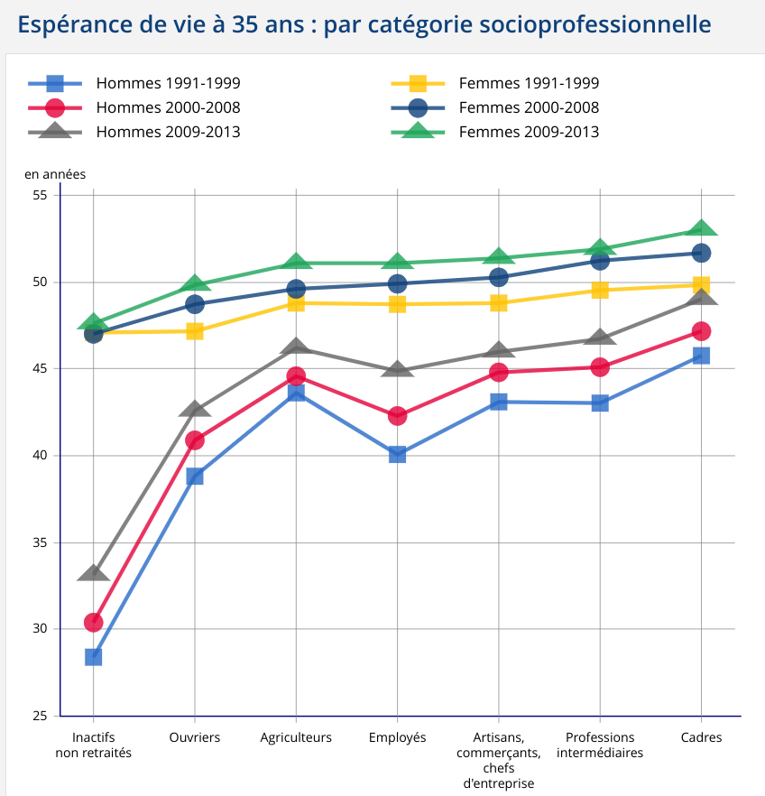
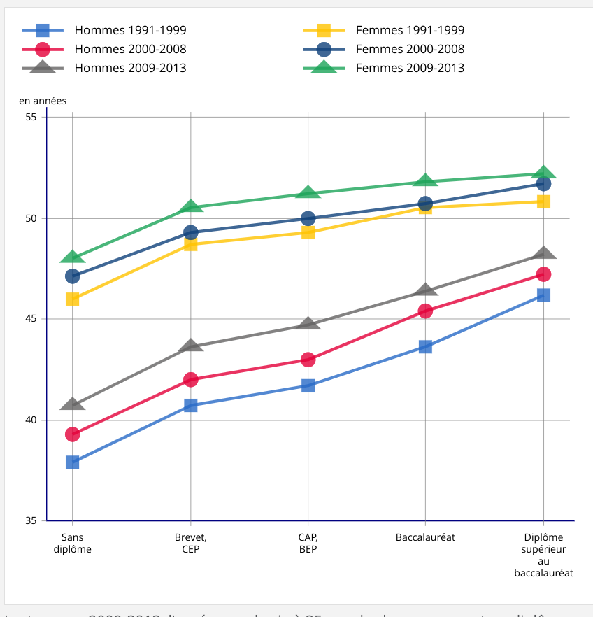
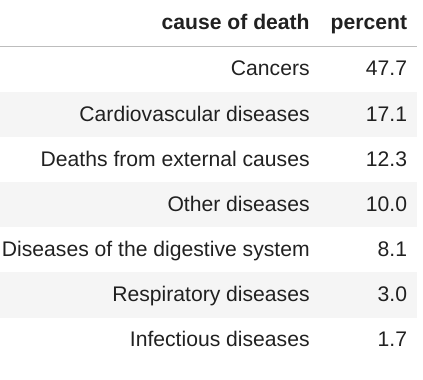

<!--
theme: gaia
class: gaia lead
headingDivider: 1
paginate: true
header: 
footer: 
backgroundImage: linear-gradient(-20deg, rgba(0, 0, 0, 0.3), transparent)
_paginate: false
_header: ''
_footer: ''

style: |
  @keyframes marp-outgoing-transition-vertical-scroll {
    from { transform: translateY(0%); }
    to { transform: translateY(-100%); }
  }
  @keyframes marp-incoming-transition-vertical-scroll {
    from { transform: translateY(100%); }
    to { transform: translateY(0%); }
  }

  @keyframes marp-outgoing-transition-vflip {
    0% { animation-timing-function: ease-in; }
    50% {
      transform: perspective(100vw) translateZ(-100vw) rotateX(-90deg);
      opacity: 0.5;
      animation-timing-function: step-end;
    }
    100% { opacity: 0; }
  }
  @keyframes marp-incoming-transition-vflip {
    0% {
      animation-timing-function: step-start;
      opacity: 0;
    }
    50% {
      transform: perspective(100vw) translateZ(-100vw) rotateX(90deg);
      opacity: 0.5;
      animation-timing-function: ease-out;
    }
  }

  header, footer { text-align: center; color: currentcolor; }
  section.small-code pre { font-size: 68%; }
-->
# Inequalities in mortality 
<!-- _transition: fade -->
## Social inequalities 

Improving educational attainment may make
it possible to reduce the accumulation of risk factors.

<!-- [source](https://www.hal.inserm.fr/file/index/docid/364818/filename/Edisc-art-sept08.doc) -->
[source:INSERM](https://www.hal.inserm.fr/inserm-00364818v1/file/Edisc-art-sept08.pdf)

# Social inequalities in mortality 
<!-- _transition: cube -->

**Policy implications**
The reduction of cardiovascular disease mortality in low educational
level groups should be treated as a major public health priority.
Effective policies are required to decrease cumulative exposure to
cardiovascular risk factors, such as 

* smoking, 
* being overweight,
* hypertension 
* diabetes. 

# Context in France since 2010
<!-- _transition: cube -->

#

<!-- _transition: fade -->
The problem of inequality in the face of death has become an important topic in French public discourse in recent times, in particular in autumn 2010 during debate about raising the minimum legal retirement age by two years, by gradually shifting it from age 60 to 62. The debate became focused around a politically divisive issue: should the retirement age remain unchanged for low-skilled workers on the grounds that they enter the labour market earlier and / or have more strenuous jobs and live shorter lives?

[source](https://www.ofce.sciences-po.fr/blog/social-inequality-in-the-face-of-death/)

#

<!-- _transition: fade -->

the most disadvantaged groups cumulate a number of **risky behaviours**, such as smoking, excessive alcohol consumption, poor diet and a sedentary lifestyle. In contrast, managers and the intermediate professions smoke and drink in moderation. ...., these differences in behaviour show up clearly in the mortality rates associated with certain diseases. The risk of death due to a tumour in the larynx, pharynx, lungs, oesophagus, liver is especially high among **manual workers**, and is at the heart of a significant portion of the observed differences in mortality. ...... the mortality rate associated with a tumour of the pharynx was **11 times higher** for skilled workers and labourers than for teachers and the intellectual professions (Desplanques, 1993).

# Biggest differences ...
<!-- _transition: glow -->
## are between the sexes 

#

<!-- _transition: fade -->
[source](https://www.insee.fr/fr/statistiques/2383438#graphique-figure1_radio1)

# Niveau d'étude

<!-- _transition: fade -->

[source](https://www.insee.fr/fr/statistiques/2383438#graphique-figure1_radio2)

#

<!-- _transition: fade -->
## All cause mortality males 45-65

# Cancer due to work exposure

<!-- _transition: cube -->
5.3% of total cancer due to occupational exposures 

- 8.2% men 
- 2.3%, women
- 41% construction industry. 
- Among women, 54% breast cancers attributable to shift work.

# Cancer due to work exposure

<!-- _transition: cube -->
|Britain 2004 ||
|---|---|
| lung cancer |40%  |
| non-melanoma skin cancer |21% |
| breast cancer |14% |
| mesothelioma |14% |
| bladder cancer |4%  |

[source](https://www.ncbi.nlm.nih.gov/pmc/articles/PMC4631263/#:~:text=Overall%2C%205.3%25%20of%20total%20cancer,%3B%202.3%25%2C%20women).

