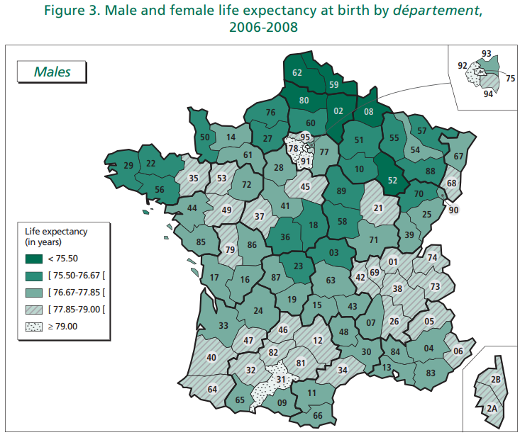

<!--
theme: gaia
class: gaia lead
headingDivider: 1
paginate: true
header: 
footer: 
backgroundImage: linear-gradient(-20deg, rgba(0, 0, 0, 0.3), transparent)
_paginate: false
_header: ''
_footer: ''

style: |
  @keyframes marp-outgoing-transition-vertical-scroll {
    from { transform: translateY(0%); }
    to { transform: translateY(-100%); }
  }
  @keyframes marp-incoming-transition-vertical-scroll {
    from { transform: translateY(100%); }
    to { transform: translateY(0%); }
  }

  @keyframes marp-outgoing-transition-vflip {
    0% { animation-timing-function: ease-in; }
    50% {
      transform: perspective(100vw) translateZ(-100vw) rotateX(-90deg);
      opacity: 0.5;
      animation-timing-function: step-end;
    }
    100% { opacity: 0; }
  }
  @keyframes marp-incoming-transition-vflip {
    0% {
      animation-timing-function: step-start;
      opacity: 0;
    }
    50% {
      transform: perspective(100vw) translateZ(-100vw) rotateX(90deg);
      opacity: 0.5;
      animation-timing-function: ease-out;
    }
  }

  header, footer { text-align: center; color: currentcolor; }
 # section.small-code pre { font-size: 68%; }
-->
# Inequalities in mortality 
 

<!-- _transition: fade -->
France is an extremely insular culture. While they like to think of themselves on the cutting edge of culture, intellectual ideas often die and arrive in France very late..... French intellectuals were still clinging to Stalinism and Maoism 20 years after the rest of the world had abandoned them.

**Noam Chomsky**

# Inequalities in mortality 
 
<!-- _transition: fade -->
## Social inequalities 

Improving educational attainment may make
it possible to reduce the accumulation of risk factors.

<!-- [source](https://www.hal.inserm.fr/file/index/docid/364818/filename/Edisc-art-sept08.doc) -->
[source:INSERM](https://www.hal.inserm.fr/inserm-00364818v1/file/Edisc-art-sept08.pdf)

# Social inequalities in mortality 
<!-- _transition: cube -->

**Policy implications**
The reduction of cardiovascular disease mortality in low educational
level groups should be treated as a major public health priority.
Effective policies are required to decrease cumulative exposure to
cardiovascular risk factors, such as 

* smoking, 
* being overweight,
* hypertension 
* diabetes. 

# Context in France since 2010
<!-- _transition: cube -->

#

<!-- _transition: fade -->
The problem of inequality in the face of death has become an important topic in French public discourse in recent times, in particular in autumn 2010 during debate about raising the minimum legal retirement age by two years, by gradually shifting it from age 60 to 62. The debate became focused around a politically divisive issue:

*should the retirement age remain unchanged for low-skilled workers
on the grounds that they enter the labour market earlier and / or
have more strenuous jobs and live shorter lives?*

[source](https://www.ofce.sciences-po.fr/blog/social-inequality-in-the-face-of-death/)

#

<!-- _transition: fade -->

the most disadvantaged groups cumulate a number of **risky behaviours**, such as smoking, excessive alcohol consumption, poor diet and a sedentary lifestyle. In contrast, managers and the intermediate professions smoke and drink in moderation. ...., these differences in behaviour show up clearly in the mortality rates associated with certain diseases. The risk of death due to a tumour in the larynx, pharynx, lungs, oesophagus, liver is especially high among **manual workers**, and is at the heart of a significant portion of the observed differences in mortality. ...... the mortality rate associated with a tumour of the pharynx was **11 times higher** for skilled workers and labourers than for teachers and the intellectual professions (Desplanques, 1993).

# Biggest differences ...
<!-- _transition: glow -->
## are between the sexes 

#

<!-- _transition: fade -->
[source](https://www.insee.fr/fr/statistiques/2383438#graphique-figure1_radio1)

# Niveau d'étude

<!-- _transition: fade -->

[source](https://www.insee.fr/fr/statistiques/2383438#graphique-figure1_radio2)

#

HEAD: CAUSE-SPECIFIC MORTALITY
A number of recent studies have found that educational differences in mortality vary across causes of death. For example, deaths that are more closely linked to social and behavioral risk factors (lung cancer, respiratory diseases, homicide, and accidents) are associated with wide educational differences in mortality rates, while there are narrower educational differences in mortality rates for causes less amenable to human control (such as cancers other than lung cancer)

[source](https://www.ncbi.nlm.nih.gov/pmc/articles/PMC4435622/)

#

#

[source](https://pubmed.ncbi.nlm.nih.gov/25093685/)

#

#

A debate within the mortality literature centers around the impact
of health behaviors on the prospects of disadvantaged groups.
.....Findings reveal that cigarette smoking is an important mediator
of the education-mortality gap for **all males and for younger
females**. In particular, education-mortality gaps for young men
narrow considerably when cigarette smoking is accounted for, 

[source](https://www.ncbi.nlm.nih.gov/pmc/articles/PMC2885918/)

#

<!-- _transition: fade -->
## All cause mortality males 45-65

# Cancer due to work exposure

<!-- _transition: cube -->
5.3% of total cancer due to occupational exposures 

- 8.2% men 
- 2.3%, women
- 41% construction industry. 
- Among women, 54% breast cancers attributable to shift work.

# Cancer due to work exposure

<!-- _transition: cube -->
|Britain 2004 ||
|---|---|
| lung cancer |40%  |
| non-melanoma skin cancer |21% |
| breast cancer |14% |
| mesothelioma |14% |
| bladder cancer |4%  |

[source](https://www.ncbi.nlm.nih.gov/pmc/articles/PMC4631263/#:~:text=Overall%2C%205.3%25%20of%20total%20cancer,%3B%202.3%25%2C%20women).

# Mortality by department

<!-- _transition: fade -->
[source](https://www.ined.fr/fichier/s_rubrique/22051/2013_3_france_mortality_by_departement.en.pdf)

#

<!-- _transition: fade -->

#

<!-- _transition: fade -->

#

<!-- _transition: cube -->

# Life expectancy in Scotland 

<!-- _transition: cube -->
is markedly lower compared to other European nations 
and the UK as a whole. 

What are the reasons for this higher mortality?

[source](https://www.sciencedirect.com/science/article/abs/pii/S0033350612001096?via%3Dihub)

#

<!-- _transition: cube -->

[source](https://www.scotpho.org.uk/population-dynamics/deaths/data/most-frequent-causes/)

# explanations 

1. artefactual:  a construct of the measurement process. 
1.  downstream:  occur at the micro level/individual and include one's genetics
1.  midstream:  material circumstances
1.  upstream: macro factors that comprise social-structural influences

#  artefactual explanations 

<!-- _transition: fade -->
 
- deprivation
- migration

# downstream explanations

<!-- _transition: fade -->
 
- genetics
-  health behaviours
-  individual values

# midstream explanations 

<!-- _transition: fade -->
- substance misuse
- culture of boundlessness and alienation
- family, gender relations and parenting differences
- lower social capital
- sectarianism
- culture of limited social mobility
- health service supply or demand
- deprivation concentration

# upstream explanations 

<!-- _transition: cube -->
 
- climate
-  inequalities
-  de-industrialization
-  political attack

#  Conclusions

* between 1950 and 1980 the reasons for higher mortality are unclear, but may be linked to particular industrial, employment, housing and cultural patterns. 

* from 1980 onwards, the higher mortality is most likely to be accounted for by a synthesis which begins from the changed political context of the 1980s, and the consequent hopelessness and community disruption experienced. 
