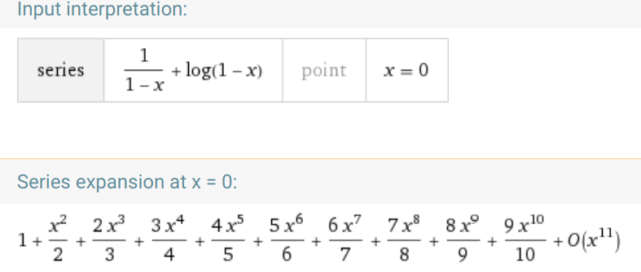

# M2R 2019

**IMPORTANT** : classes are suspended because of the pandemic.

I’ll finish the graduate course online using 
[Discord](https://discord.gg/gQjp36)

- This page is a repo for exchanges 
in the Masters 2019 - **Geometry of surfaces**
 The details of the final exam/evaluation 
will appear here in due course

[//]: # ()

---
## Notes from classes

These are my rough notes from the classes
and the texts we will read in the last part:

1. [week 1](cour1.pdf)
1. [week 2](cour2.pdf)
1. [week 3+4](cours3+4.pdf)
1. [week 5](shearsAgain.pdf)

---

## Recommended reading

- [Mostly surfaces](http://www.math.brown.edu/~res/MathNotes/surface.pdf)
- Louis Funar's notes.
- [James W. Anderson Hyperbolic
  Geometry](https://www.academia.edu/25421476/_James_W._Anderson_Hyperbolic_Geometry_Springer_BookFi.org_)
