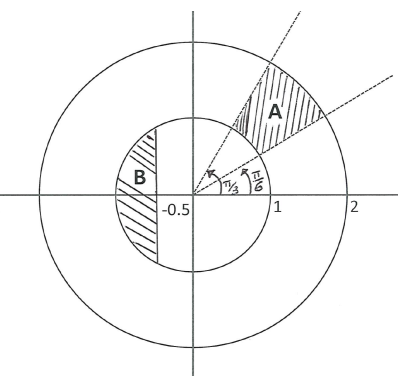
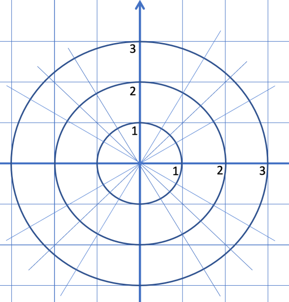
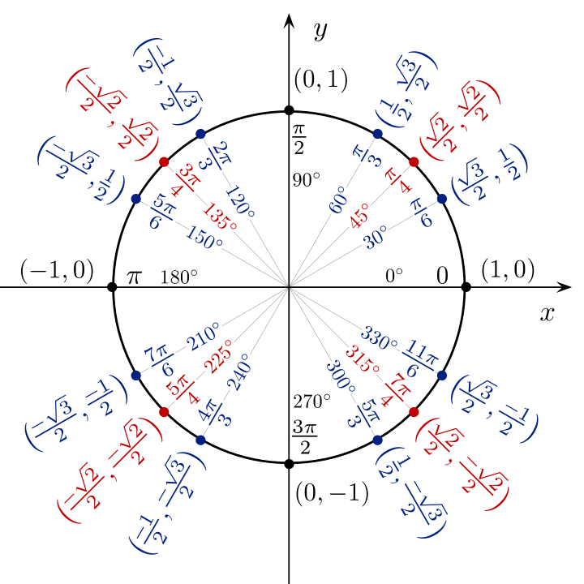
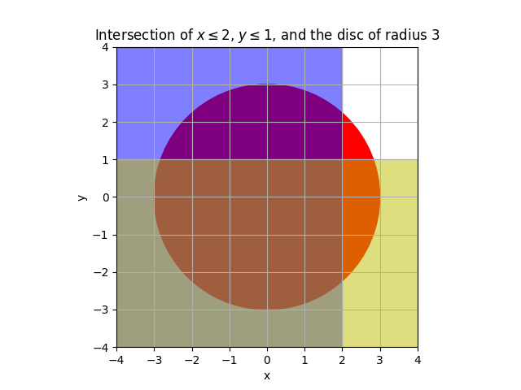

# MAT 102

### Les infos 
- changements de salle
- dates de CCs

    <!-- - **Vendredi 13/12/2024 D004.** -->
    <!--    -  18 octobre, DLST D102. -->

    <!-- - **IMPORTANT quick test 2 27/11/2024** -->

---


## Résources 

- [CHAMILO](https://chamilo.univ-grenoble-alpes.fr/courses/GBX1MT12/)
- [poly](./polyMAT102-main.pdf) 

## Planning

36 séances :

* 8-9 séances sur les chapitres 1 et 3
* 6-7 sur les autres.

1. Nombres complexes
1. Sommes et produits
1. Géométrie 
1. Fonctions 
1. Intégrales 


### Sujets d'examens et partiels

- Quick tests (en classe 30-40 minutes)
    - [quick test 1 2022](./quick_test.pdf)
    - [quick test 2](qt2.pdf)
    - [quick test 3](qt3.pdf)
    - [quick test 3 2024](./qt2_2024.pdf)


- Exams : annales complèt sur CHAMILO

    - [partiel  2023](./Annales/2023-octobre.pdf)
    - [partiel  2024](./Annales/2024-octobre-corr.pdf)

    - [examen 2023](./Annales/2023-final.pdf)
    - [examen 2024](./Annales/2024-final-corr.pdf)

<!--  -->
<!--  -->


---

## Discussion 

On a divers utils à notre disposition :

- WolframAlpha
- ChatGPT

<!-- ``` -->
<!-- Write a story about about Lynna --> 
<!-- who is late for  her math class --> 
<!-- but makes up to the teacher --> 
<!-- by buying a hot chocolate for him -->

<!-- ``` -->

<!-- And [here is the result](./story.md) -->
<!-- et en français [ici](./story_french.md). -->

<!-- ### Plus serieusement --> 

Obtenir une correction avec Chatgpt :

Feuille 1 : [complexes](./Fiche1-complexes.pdf)
Exo 33. 1

Résolution de l'équation $Z^2 = 1 + i$ via deux méthodes : forme algébrique et forme exponentielle.


- [Solution WolframAlpha](https://www.wolframalpha.com/input/?i=solve+z%5E2+%3D+1+%2B+i)
- [Solution ChatGPT html](./chatgpt.html)
    - [python script](./clean_gpt.md)
- [Solution ChatGPT pdf](./chatgpt.pdf)
- [ChatGPT corrigé par Copilot et Prof](./chatgpt_corrected.html)

---

### Feuilles de TD avec commentaires

1. Nombres complexes
1. Sommes et produits
1. Géométrie 
1. Fonctions 
1. Intégrales 


---

 <!-- 16-17 -->

<!-- 15.5 /16 -->


<!-- **nombres complexes** -->

<!-- - [lapin de Douady](https://youtu.be/JttLtB0Gkdk ) -->
<!-- <!-1- - [mandelbrottle](https://github.com/macbuse/Mandelbrottle/blob/master/mandelbrotlle_coke.ipynb) -1-> -->

<!-- --- -->


<!-- --- -->

<!-- [F5](./Fiche5-integrales.pdf) -->

<!-- - [exo 5](./Fiche5Ex5.pdf) -->
<!-- - [exo 6](./Fiche5Ex6.pdf) -->
<!-- - [exo 7](./Fiche5Ex7.pdf) -->

<!-- - [exo 8b](https://www.wolframalpha.com/input?i=primitive++sqrt%28t%5E2+-+4%29) -->
<!-- - [exo 8c](https://www.wolframalpha.com/input?i=primitive++sqrt%289+-+4t%5E2%29) -->
<!-- - [exo 11d](https://www.wolframalpha.com/input?i=primitive+1%2F%28x%5E2+-+3x+%2B+2%29) -->
<!-- - [exo 12e](https://www.wolframalpha.com/input?i=primitive++exp%28x%29+cos%28x%29) -->
<!-- - [exo 12h](https://www.wolframalpha.com/input?i=primitive++exp%28x%29+%28x%5E2+%2B+x+%2B+1%29) -->
<!-- - [exo 14](https://www.wolframalpha.com/input?i=primitive+sin%5E3%28x%29) -->

<!-- --- -->

---


<!-- [F4](./Fiche4-fonctions.pdf) -->

<!-- - [exo 28](https://www.wolframalpha.com/input?i=x+from+-7+to+7+plot+1%2F2+x+%2B+2+%2B+%5Clog%28%28+x-1%29%2F%28x%2B1%29%29+) -->

<!-- --- -->

<!-- ### Géométrie --> 

<!-- <!-1- --- -1-> -->

<!-- [F3](./Fiche3-geometrie.pdf) -->

<!-- **Preparer pour 12/10** exos 7 et 9 -->

<!-- [quick test géométrie 2022](./qt3.pdf) -->

<!-- --- -->

<!-- [F2](./Fiche2-sommes-produits.pdf) -->

<!-- <!-1- **Preparer pour 5/10** -1-> -->


<!-- - [quick test 2023](./qt2.pdf) -->

<!-- - [Progression arithmétique](https://fr.wikipedia.org/wiki/Suite_arithm%C3%A9tique) -->
<!-- - [Progression géométrique](https://fr.wikipedia.org/wiki/Suite_g%C3%A9om%C3%A9trique) -->
<!-- - [Série géométrique](https://fr.wikipedia.org/wiki/S%C3%A9rie_g%C3%A9om%C3%A9trique) -->
<!-- - [Somme telescopique](https://fr.wikipedia.org/wiki/Somme_t%C3%A9lescopique) -->


---

## [F1](./Fiche1-complexes.pdf)

- Recherche sur les complexes [ensemble de Julia](https://fr.wikipedia.org/wiki/Ensemble_de_Julia)
- Permettent de résoudre des [équations
quadratiques](https://fr.wikipedia.org/wiki/%C3%89quation_du_second_degr%C3%A9)
    - [Formule quadratique](https://fr.wikipedia.org/wiki/Formule_quadratique)


### Evaluation : 
- [quick test debut octobre](./quick_test.pdf)

---

**Preparer** : Exos 16,18

<!-- **Preparer** --> 
<!-- Exo 19 m) n) o) -->
<!-- Exo 20 i) j) -->

**Verifier** vos réponses avec WolframAlpha :  exemples

- [question 10 a](https://www.wolframalpha.com/input?i=simplify+%281+%2B+i%29%5E2)
- [question 10 e](https://www.wolframalpha.com/input?i=simplify+%281+%2B+2i%29%283+%2B+4i%29+)


<!-- --- -->

- exo 3.2
    - [indication
    1](https://www.wolframalpha.com/input?i=simplify+2%2F%285+-+sqrt%282%29%29)
    - [indication
    2](https://www.wolframalpha.com/input?i=simplify+5%2F%283+%2B+sqrt%282%29%29)
    - [indication
    3](https://www.wolframalpha.com/input?i=simplify+4%2F%282+-+sqrt%282%29%29)

- exo 4
    - [4.1 graphe](https://www.wolframalpha.com/input?i=plot+3x%5E2%E2%88%92x%2B2+)
    - [4.2 graphe](https://www.wolframalpha.com/input?i=plot+-5x%5E2%E2%88%929x%2B2+)
    - [4.3 graphe](https://www.wolframalpha.com/input?i=plot++3x%5E2%E2%88%924x%2B1)
    - [4.4 solution ](./sol_1_4.html)

- exo 6
    - [6.c solution](./sol_1_6_c.html)

- exo 7
    - [7.2 solution](./sol_1_7_2.html)

- exo 8
<!--     - [cercle trigonométrique](https://fr.wikipedia.org/wiki/Cercle_trigonom%C3%A9trique) -->
- [8.2 solution modèle](./sol_1_8_2.html)
- [Solutions chatGPT](./exo1.8.md)


<!-- --- -->




- exo 9


| Nombre complexe   | Partie réelle | Partie imaginaire | Module       | Argument (θ) |
|-------------------|---------------|-------------------|--------------|--------------|
| 1 + i             | 1             | 1                 | √2           | π/4          |
| 2 - 2i            | 2             | -2                | 2√2          | -π/4         |
| √3 + i            | √3            | 1                 | 2            | π/6          |
| -i                | 0             | -1                | 1            | -π/2         |
| -1 + i√3          | -1            | √3                | 2            | 2π/3         |
| 1/(-1 + i)        | -1/2          | -1/2              | 1/√2         | -3π/4        |
| -5                | -5            | 0                 | 5            | π            |
| a + ia            | a             | a                 | |a|√2        | π/4 (a>0), -3π/4 (a<0) |


---

- exo 10
    - [10.b](https://www.wolframalpha.com/input?i=simplify+%282-i%29%5E2)
    - [10.d](https://www.wolframalpha.com/input?i=simplify+%281-+i%29%282%2Bi%29)
    - [10.f](https://www.wolframalpha.com/input?i=simplify+%281-3i%29%285-2i%29)
    - [10.g](https://www.wolframalpha.com/input?i=simplify+%282%2B3i%29%5E2%282-3i%29)
    - [10.h](https://www.wolframalpha.com/input?i=simplify+%283%2Bi%29%5E3)
    - [10.h solution complète](./sol_1_10_h.html)
    - [10.k solution ](https://www.wolframalpha.com/input?i=simplify+%282%2B3i%29%5E2%2B%282-3i%29%5E2)
    - [10.l solution complète](./sol_1_10_l.html)

- exo 12
    - [12.2](./sol_1_12_3.html)


<!-- - exo  24 -->
<!-- - [solutions a,c,e](./sol_1_24_ace.md) -->


- exo 13
    - a) médiatrice
    - b) cercle
    - c) disque
    - d) médiatrice
    - 13.e 

[13 sols a) f)](/sol_1_13_af.html)

---

- exo 17
    - [solution a](./sol_1_17_a.html)
    - [solution b](./sol_17_b.html)


- exo 19
    - [solution a)..e)](./sol_1_19.pdf)

---

- exo 21
    - [solution d)](./sol_1_21_d.html)

- exo 23
    - [discriminants](./sol_1_23_disc.html)
    - [solution c)](./sol_1_23_c.html)

<!-- <!-1- ### exos avec commentaires -1-> -->

<!-- <!-1- **Exo 4** -1-> -->

<!-- <!-1- 1. pas de solution -1-> -->
<!-- <!-1- 1. [solve −5x^2−9x+2 = 0](https://www.wolframalpha.com/input?i=solve++%E2%88%925x%5E2%E2%88%929x%2B2) -1-> -->
<!-- <!-1- 1. [solve  1/3 x^2−2x+3 = 0](https://www.wolframalpha.com/input?i=solve++1%2F3+x%5E2%E2%88%922x%2B3+%3D+0) -1-> -->
<!-- <!-1- 1. [ −4x+3x^2+1 = 0](https://www.wolframalpha.com/input?i=solve+++%E2%88%924x%2B3x%5E2%2B1+%3D+0) -1-> -->


<!-- <!-1- Distance AB = longueur du vecteur A - B (et du B - A) -1-> -->

<!-- <!-1- 1. [(2, 1)  - (−1, 2)](https://www.wolframalpha.com/input?i=%282%2C+1%29++-+%28%E2%88%921%2C+2%29) -1-> -->
<!-- <!-1- 1. [(5, −3)  - (3, -1-> -->
<!-- <!-1- 1)](https://www.wolframalpha.com/input?i=%285%2C+%E2%88%923%29++-+%283%2C+1%29) -1-> -->

<!-- --- -->


<!-- **1.3.1.2 Calcul des racines carrées via la forme algébrique** -->

<!-- - [11 e](https://www.wolframalpha.com/input?i=solve+++z%5E2+%3D+8+%E2%88%92+6i) -->
<!-- - [11 f](https://www.wolframalpha.com/input?i=solve+++z%5E2+%3D++%E2%88%923+%2B+4i) -->
<!-- - [11 g](https://www.wolframalpha.com/input?i=solve+++z%5E2+%3D++%3D+7+%2B+24i) -->
<!-- - [11 h](https://www.wolframalpha.com/input?i=solve+++z%5E2+%3D++%3D+9+%2B40+i) -->

<!-- <!-1- **1.3.2 Résolution d’une équation du second degré dans C** -1-> -->

<!-- - [23 a](https://www.wolframalpha.com/input?i=solve+z%5E2+%2B+%281+%E2%88%92+5i%29z+%2B+2i+%E2%88%92+6+%3D+0) -->
<!-- - [23 b](https://www.wolframalpha.com/input?i=solve++z%5E2+%E2%88%92+%283+%2B+4i%29z+%2B+7i+%E2%88%92+1+%3D) -->
<!-- - [23 c](https://www.wolframalpha.com/input?i=solve++2z%5E2+%2B+%285+%2B+i%29z+%2B+2+%2B+2i+%3D+0) -->


