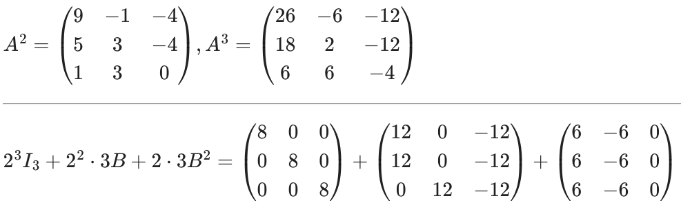
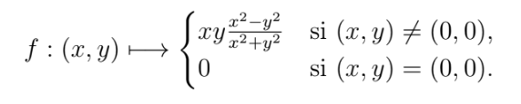
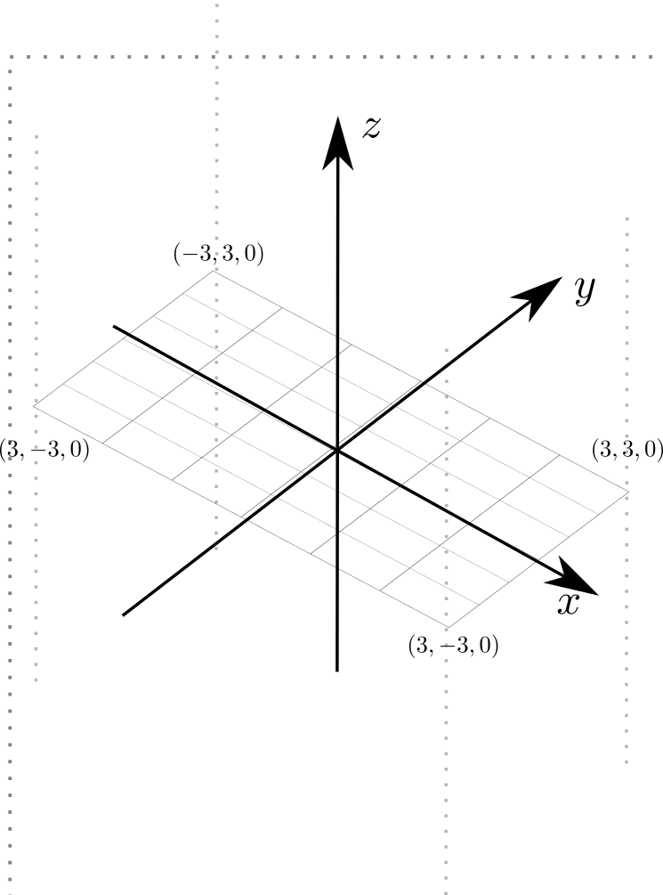
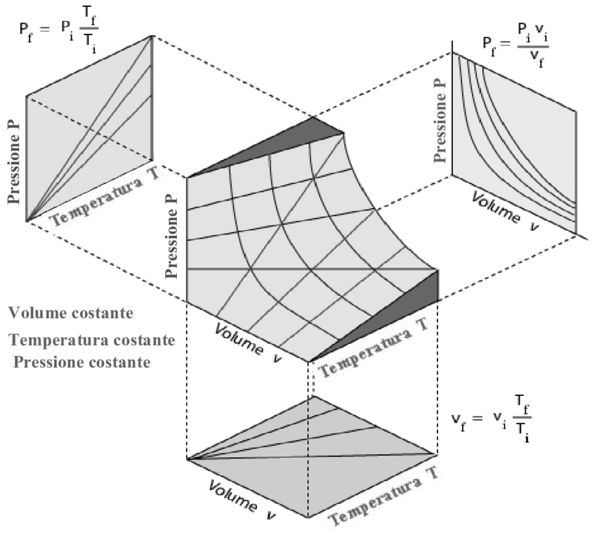

# Mat 305

- Tuesdays 8:00 E204
- Wednesdays 9:45 E202
- First class: 10/9

**Important :** CC2 4/12
<!-- **Important :** CC1 9/10 -->

---

## Programme

1.  Fonctions de plusieurs variables
1.  Algèbre linéaire

A titre d'info   : 

- [CC1 2024](./CC1_mat305_2024.pdf)
- [CC2 2023](CC2_2023.pdf)
- [CC1 2023](./CC1_mat305.pdf)
- [correction CC1](./CC1_mat305_2023.pdf)
- [CC2 du  9/12/22 sujet + bareme + correction](./CC2_MAT305.pdf)
- [CC1 2022](./CC1_MAT305_2022.pdf)
- [correction](./CC1_corr.pdf)

- [ET  2021](https://www-fourier.ujf-grenoble.fr/~eherscov/MAT305/ET-01.2022.pdf) 

<!-- - [CC1 du 8/10](./CC1_MAT305.pdf) -->
<!-- - [web page avec tous les documents](https://www-fourier.ujf-grenoble.fr/~eherscov/index-mat305-2022.php) -->
<!-- - [2021 TD archived page](./MAT305_index.md) -->
<!-- - [mes calculs](./uniqueness.pdf) -->

<!-- <!-1- - [Feuille diagonalisation](./diag.pdf) -1-> -->
<!-- <!-1- - [solutions](./sols.md) -1-> -->

<!-- - [Feuille inverses](./inverse.pdf) -->

---

<!-- **solutions noyau/image** -->

<!-- ker = {t[ 5 -2  1]} im = 1x + -1y + 2z = 0 --> 

<!-- ker = {t[  6 -15  28]} im = 1x + -1y + 2z = 0 --> 

<!-- ker = {t[ -6  13 -23]} im = -1x + 1y + 2z = 0 --> 

<!-- ker = {t[-3  3 -2]} im = -1x + 5y + -3z = 0 --> 

<!-- ker = {t[-12   7  -9]} im = 1x + -3y + -1z = 0 --> 

<!-- ker = {t[ -3  -1 -12]} im = -1x + -1y + -1z = 0 --> 

<!-- ker = {t[-5 -4 -4]} im = 5x + -1y + -1z = 0 --> 

<!-- ker = {t[  7  -3 -10]} im = -1x + -1y + 3z = 0 --> 

<!-- ker = {t[-6 -1  2]} im = -2x + 1y + -1z = 0 --> 

<!-- ker = {t[ 20 -13   3]} im = -1x + -1y + -1z = 0 -->

<!-- - [Multiplication etc.](./mult.pdf) -->

---

- [F3 calcul matriciel](./exos_matrices.pdf)
    - [Algebre lineaire cours mat 102](./polyMAT102-espace_vect.pdf)
    - [exemple correction](./f3_corr_2.pdf)

- **Exo 1.10**

- **Exos a preparer pour 12/11**
    - 1.5.2
    - 1.7.2

<!-- - [revision](./extra.pdf) -->
<!-- <!-1- - [CC2 du  9/11/22 sujet + bareme + correction](./CC2_MAT305.pdf) -1-> -->

<!-- 	- [la courbe](https://www.wolframalpha.com/input?i=plot+%281+-+t%5E2%2C++t%5E3%2F4+-+3t%29) -->
<!-- 	- [vecteur velocite](https://www.wolframalpha.com/input?i=derivative+t+of++%281+-+t%5E2%2C++t%5E3%2F4+-+3t%29) -->
<!-- 	- [exo 2](https://www.wolframalpha.com/input?i=xy%5E2+%E2%88%92+y%5E3+%2B+log%281+%E2%88%92+x%5E2+%E2%88%92+y%5E2+%29) -->
<!-- 	- [f_yx](https://www.wolframalpha.com/input?i=derivate+y+of+y%5E2+-+%282+x%29%2F%281+-+x%5E2+-+y%5E2%29) -->
<!-- 	- [f_xy](https://www.wolframalpha.com/input?i=derivative+x+of+y+%282+x+-+3+y+-+2%2F%281+-+x%5E2+-+y%5E2%29%29) -->

<!-- --- -->

<!-- ## Exos a preparer -->

<!-- <!-1- - **Pour 20/9 preparer F1 exos 5 et 6.** -1-> -->
<!-- <!-1- - **Pour 21/9 preparer F1 exos 7 et 8** -1-> -->
<!-- <!-1- - **Pour 27/9 preparer F2 exo 2:** -1-> -->
<!-- <!-1- - **Pour 4/10 preparer F2 exo 6:** -1-> -->
<!-- <!-1- - **Pour 5/10 preparer F2 exo 7:** -1-> -->
<!-- <!-1- 	- calculer les derivees partielles pour chaque fonction -1-> -->
<!-- <!-1- 	- Verifier avec Wolfram ex [exo 2.1](https://www.wolframalpha.com/input?i=x+ln%28+y%5E2+%2B+1%29) -1-> -->
<!-- <!-1- <!-2- $\partial f/\partial x, \partial f/\partial y$ pour -2-> -1-> --> 

<!-- --- -->

<!-- ## Feuilles avec commentaires -->

<!-- - exo 1 --> 
<!-- 	1. OK -->
<!-- 	1. OK -->
<!-- 	1. OK -->
<!-- 	1. OK -->
<!-- 	1. OK --> 
<!-- 	1. non -->
<!-- 	1. OK -->
<!-- 	1. non -->
<!-- 	1. OK -->

<!-- - exo 4 a/ -->
<!-- 	1. OK -->
<!-- 	1. NON  $F_2(2,0), 2F_2(1,0)$ -->
<!-- 	1. OK -->
<!-- 	1. OK -->

<!-- - exo 5 [correction de 2021](./correction_f2exo6.pdf) -->

<!-- - exo 7-8 et 9-12 [correction](./correction_rest.pdf) -->
<!-- 	- [notes](http://mathix.org/linux/wp-content/uploads/2013/02/Expose-43.pdf) -->
<!-- 	- [les reflexions en chimie](https://fr.wikipedia.org/wiki/%C3%89nantiom%C3%A9rie#:~:text=L'%C3%A9nantiom%C3%A9rie%20est%20une%20propri%C3%A9t%C3%A9,deux%20%C3%A9nantiom%C3%A8res%20est%20dite%20chirale.) -->

<!-- --- -->

---

[F2](./F2_2024exos.pdf)

**RAPPEL** 
-  [derivatives : poly mat102 pages 49-50](./mat102_functions.pdf)
- [Feuille de mat102 pour révisier](../MAT102/Fiche4-fonctions.pdf)

**Exos à Preparer**

**15/10** : 1.04, Problème 1.2

- [coordonnées
sphériques](https://fr.wikipedia.org/wiki/Coordonn%C3%A9es_polaires#Trois_dimensions)
- [loi de kepler](https://fr.wikipedia.org/wiki/Lois_de_Kepler)

**8/10 PREPARER** [exos supplementaires](./mexican_hat.pdf)

- [1er exo](https://www.wolframalpha.com/input?i=plot+%281%E2%88%92x+%5E2++%E2%88%92y+%5E2++%29exp%28+%E2%88%92%28x%5E2++%2By%5E2++%29)
- [2eme
exo](https://www.wolframalpha.com/input?i=plot+%28x-y%29%5E2+%2B+1)
- [3eme
exo](https://www.wolframalpha.com/input?i=plot+%28x%2By%29%5E2+%2B+4%28x-y%29%5E2)

---

**Problème 1**

- [demo interactif](https://demonstrations.wolfram.com/LaSuperpositionDeDeuxOndesFrench/)
- [ANC headphones](https://en.wikipedia.org/wiki/Noise-cancelling_headphones)
- [cos( x + y - 1) for x from -4*pi to 4*pi](https://www.wolframalpha.com/input?i=plot+cos%28+x+%2B+y+-1%29+for+x+from+-4*pi+to+4*pi+)
- [cos( -x + y -1) for x from -4*pi to 4*pi](https://www.wolframalpha.com/input?i=plot+cos%28-+x+%2B+y+-1%29+for+x+from+-4*pi+to+4*pi+)
- [superposition](https://www.wolframalpha.com/input?i=plot+cos%28+x+%2B+y+-1%29+%2B+cos%28+-x+%2B+y+-1%29+for+x+from+-2*pi+to+2*pi+)

La fonction qui ne verifie pas la relation de Schwarz en (0,0) 

[solution](https://www.wolframalpha.com/input?i=calcul+the+gradient+of+the+function+x*y*%28x%5E2+-y%5E2%29%2F%28x%5E2+%2B+y%5E2%29)

<!--  -->

- [voici le graphe](https://www.wolframalpha.com/input/?i=derivative+of+xy%28x%5E2-y%5E2%29%2F%28x%5E2%2By%5E2%29)
- [3D interactive](./monkey.html)

---

### Solutions

[solution 1.3](./sol_2_1_3.html)

[solution 2.4](./sol_2_2_4.html)

<!-- Pour 26/9 : 1.2. Dérivées partielles, gradient --> 

<!-- Pour 27/9 : 1.3. Problème 1.1 (Équation des ondes). -->

---

<!-- [Exo supplementaire](./supp_exo.pdf) -->

<!-- - [calculs](./f6_corr_bis.pdf) -->

<!-- Exo 1.2 -->

- [x ln(y^2 + 1)](https://www.wolframalpha.com/input?i=derivative+of+x+ln%28y%5E2+%2B+1%29)
- [(x − y) ln(x^2 − y^2 )](https://www.wolframalpha.com/input?i=derivative+of+%28x+%E2%88%92+y%29+ln%28x%5E2+%E2%88%92+y%5E2+%29%3B)
- [exp(x^2+y^3 ) − cos(xy)](https://www.wolframalpha.com/input?i=derivative+of+exp%28x%5E2%2By%5E3+%29+%E2%88%92+cos%28xy%29)
- [x^2/(x+2y)](https://www.wolframalpha.com/input?i=gradient+of+x%5E2%2F%28x%2B2y%29)
    - [f_yx](https://www.wolframalpha.com/input?i=derivate+by+y+of++%284xy+%2B+x%5E2%29%2F%28x%2B2y%29%5E2)
    - [f_xy](https://www.wolframalpha.com/input?i=derivative+by+x+of+-2x%5E2%2F%28x%2B2y%29%5E2)

---

[F1](./F1_2024exos.pdf)

**Rappel** [poly mat102 pages 37-41](./mat102_functions.pdf)

**Exos à Preparer** 

Pour 17/9 : 1.4.6, 1.6.1, 1.6.2, 1.6.3, 1.6.4

<!--   -->

<!-- - [gradient of sqrt(x^2+y^2)](https://www.wolframalpha.com/input?i=gradient+of+sqrt%28x%5E2%2By%5E2%29) -->
<!-- - [plot x + 2y + 3](https://www.wolframalpha.com/input?i=plot+x+%2B+2y+%2B+3) -->
<!-- - [plot x^2 − 9y^2](https://www.wolframalpha.com/input?i=plot+x%5E2+%E2%88%92+9y%5E2) -->

<!-- - pour 19/9 Exercice 1.5 (Équation d’état des gaz parfaits)- [sur wikipedia](https://fr.wikipedia.org/wiki/Loi_des_gaz_parfaits) -->

---

**Exos**

- [1.1.2 graph](https://www.wolframalpha.com/input?i=plot+-2x+%2B+3)
- [1.1.3 graph](https://www.wolframalpha.com/input?i=plot++1+%2B+1%2F%28x+%2B+2%29)
- [1.1.4 graph](https://www.wolframalpha.com/input?i=plot++%7C2x+-3%7C)

---

[Pat Brans journaliste](https://www.cio.com/profile/pat-brans/)

- 1.2.1 [graphe](https://www.wolframalpha.com/input?i=plot+x%5E2+-2x+%2B1)
    - [correction](./sol_model.pdf)
- 1.2.2 [derivative](https://www.wolframalpha.com/input?i=derivative+sqrt%283+-+2x%29)
- 2.3 [derivative](https://www.wolframalpha.com/input?i=derivative+1%2F%28x%5E2%2B1%29)
- 2.4 [graph](https://www.wolframalpha.com/input?i=plot+%28x-1%29%2F%28x%2B1%29)
    - [correction](./sol_2_4.html)
- 2.6 [graph](https://www.wolframalpha.com/input?i=plot+exp%28-x%5E2%29)
    - [correction](./sol_2_6.html)
- 2.7 [graph](https://www.wolframalpha.com/input?i=plot+cos%281%2Fx%29+for+x+from+0+to+pi)
    - [commentaire](./sol_2_7.html)

---

- 3.2 [solution](./sol_3_2.html)
    - [solve y <= x^2](https://www.wolframalpha.com/input?i=solve++y+%3C%3D+x%5E2)
- 3.3 [solve  x + ln(y)>0](https://www.wolframalpha.com/input?i=solve++x+%2B+ln%28y%29%3E0)
- [3.5 solution](./sol_3_5.html) 
    - 3.5 [y sin(x) graph and contour plot](https://www.wolframalpha.com/input?i=plot+y+sin%28x%29++for+x+from+-2pi+to+2pi+and++y+from+-1+to+1)

---

- [1.4.1 3D interactive](./cone.html)
- [1.4.2 3D interactive](./half_pipe.html)
- [1.4.6 3D interactive](./plane_x.html)

---

- [1.6 Loi de
Loi_des_gaz_parfaits](https://fr.wikipedia.org/wiki/Loi_des_gaz_parfaits)

- [1:d + e](https://www.wolframalpha.com/input?i=plot+xy+for+x+from+0+to+10+and+y+from+0+to+10)
- [2.c](https://www.wolframalpha.com/input?i=plot+y%2Fx+for+x+from+0+to+2+and+y+from+0+to+2)

---

- [1.6 3D interactive](./cos_cone.html)

