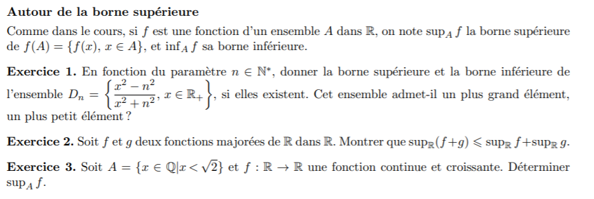
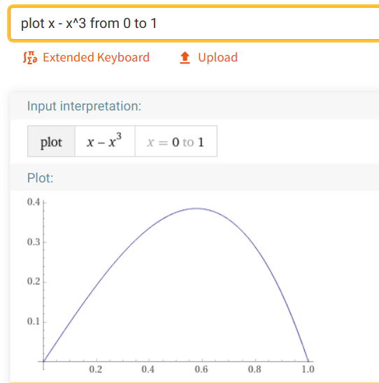
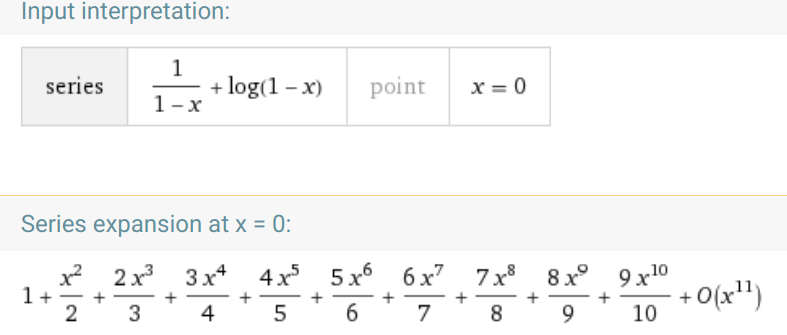

# Mat 402

- This page is a repo for exchanges in the TD group  MAT2 (lun 15h15-16h45, mar 13h30-15h).  
-  We will be meeting in **Discord** et on va parler (un peu) en
    [TeX](https://macbuse.github.io/LATEX/).
- After each seance I'll post exos avec indications on this page.
Normally there will be corrections for all the execises like [last
year](../2019_MAT402).

**27/1** Attention suite a vos mails j'ai change le lien vers Discord sur Moodle.C'est tjrs le meme serveur que pour les seances de 25/1 et 26/1.

Cherchez l'icone :

 Voici [la page de responsable](https://www-fourier.ujf-grenoble.fr/~courtes)

---

### Documents 

J'ai telecharge depuis le Moodle

- [poly](https://www-fourier.ujf-grenoble.fr/~courtes/cours-mat402.pdf)
- [feuille 1](./MAT402_EXOS-1_2021.pdf)
- [feuille 2](./MAT402_EXOS-2_2021.pdf)
- [feuille 3](./MAT402_EXOS-3_2019.pdf)

---

- [devoir
    maison](https://www-fourier.ujf-grenoble.fr/~courtes/MAT402_rappels-series_2020.pdf)
- materials and some corrections  from 2018 are
[here](https://www-fourier.ujf-grenoble.fr/~eynardbh/enseignement.html)
- [Last years page](../2019_MAT402)

---

## Seances

- lundi 25/1 F1 exos 1 - 3 
- [elts de correction](./f1_1-4.pdf)
- [exo 6](./corr_mat402_1_6.pdf)

---

- lundi 1/2 Finir exo 7, preparer F1 exo 10 
- [correction exo 7&8](./corr_1_8-10.pdf)
- [correction exo 10](./corr_1_10.pdf)
- [correction exo 11](./corr_1_11.pdf)

---

- lundi 8/2 (regarder la feuille 2 sur les suites de fonctions)
- [corrections](./corr_f2_1-4.pdf)

---

- lundi 22/2 (feuille 2 exo 5 et 6 )
- [correction 6 et 8](./corr_f2_6-8.pdf)
- mardi 23/2 (finir feuille 2)
- [correction toute la feulle 2](./corr_f2.pdf)

---

- lundi 1/3 (feuille 3 exo 1 et 2 )
- [correction](./corr_f3_1_2.pdf)
- [correction](./corr_f3_1.pdf)

---

- lundi 15/3 (exo 3)
- [correction](./corr_f3_3.pdf)
- mardi 16/3 (exo 4, exo 7)
-

---

- lundi 22/3 (feuille 3 exo 10 et 9)
- [correction exo 10](./corr_f3_10.pdf)

To draw graphs and check DL (Maclaurin Series) I use online calculators

- [graphe](https://www.wolframalpha.com/input/?i=plot+x+-+x%5E3+from+0+to+1+)
- [DL](https://www.wolframalpha.com/input/?i=taylor+series+%28x%5E2+%2B+2x+-1%29+exp%28x%29+at+x+%3D+0)
- [somme d'une
    serie](https://www.wolframalpha.com/input/?i=sum+1%2F%28n%2B2%29*2%5En%2F3%5E%28n%2B1%29%2C+n%3D1+to+infinity)

