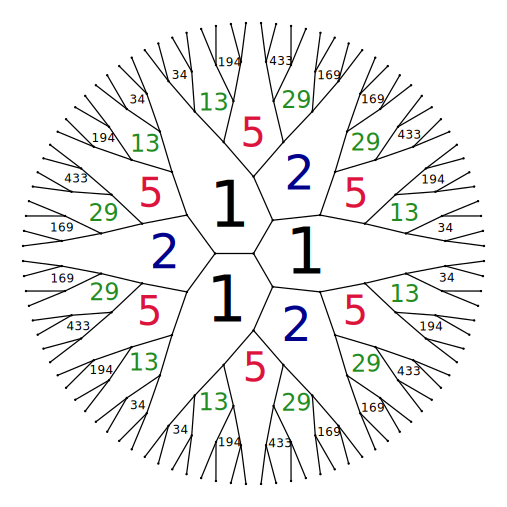

%Markoff numbers 
%greg mc
%mars 2021

#

- [Proofs from THE BOOK](https://en.wikipedia.org/wiki/Proofs_from_THE_BOOK#:~:text=Proofs%20from%20THE%20BOOK%20is,proof%20of%20each%20mathematical%20theorem){target="_blank"}
- [Convexity and Aigner's Conjectures](https://arxiv.org/abs/2101.03316){target="_blank"}
- Can I prove these with one figure ?

#

Markov numbers are integers that appear in triples which are solutions of
a Diophantine equation the so-called Markov cubic

$x^2 + y^2 + z^2 - 3x y z = 0.$

$(1,1,1),(1,1,2),(1,2,5),(1,5,13)$

# 
## infinity of Markoff numbers

$\begin{pmatrix} 3 & -1 \\ 1 & 0 \end{pmatrix}$
is an automorph of $x^2 + y^2  - 3x y.$

 so $( v_n,v_{n+1},1)$ is a solution where

$\begin{pmatrix}v_{n+1} \\ v_n \end{pmatrix} = \begin{pmatrix} 3 & -1 \\ 1 & 0 \end{pmatrix}^n \begin{pmatrix}1 \\ 1 \end{pmatrix}$

#
### Odd index Fibonacci numbers are Markoff numbers

$1, 1, 2, 3, 5, 8, 13, 21, 34, 55, 89, 144, 233, 377, 610, 987, 1597, 2584, 4181, 6765, 10946, 17711, 28657, 46368, 75025, 121393, 196418, 317811, ...$

$(1,1,1),(1,1,2),(1,2,5),(1,5,13)$

#
### Frobenius uniqueness conjecture

The largest integer in a triple determines the two other numbers.

#
### Aigner's monotonicity conjectures

- Markov’s theorem and 100 years of the uniqueness conjecture. A mathematical journey from irrational numbers to perfect matchings.  2013.  
- M. Rabideaua, R. Schiffler,
Continued fractions and orderings on the Markov numbers,
Advances in Mathematics Vol 370,  2020.
- C Lagisquet and E. Pelantová and S. Tavenas and L. Vuillon, On the Markov numbers: fixed numerator, denominator, and sum conjectures.

#

there is a natural map

$\mathbb{Q}\cup \infty \rightarrow$ Markoff numbers

$p/q \mapsto m_{p,q}$

#
### Geometric structure

- group action 
- $\mathbb{Z}/2 * \mathbb{Z}/2 * \mathbb{Z}/2$ action
- [Vieta
    flipping](https://en.wikipedia.org/wiki/Vieta_jumping){target="_blank"}

#
### Vieta flips/involutions
$x^2 + y^2 + z^2 - 3x y z = 0.$

- quadratic in $x$,  two roots $x^\pm$
- $x^+ + x^- = 3yz$
- involution $(x,y,z) \mapsto (3yz -x, y,z)$

#

Peter Sarnak (Princeton and IAS)

Title: Strong approximation for Markoff surfaces

We discuss the transitivity properties of the group of morphisms generated by Vieta involutions on the solutions in congruences to the Markoff equation as well as to other Markoff type affine cubic surfaces. These are dictated in part by the finite orbits of these actions on the algebraic points

Joint work with J.Bourgain and A.Gamburd.

# Automorphisms

- Vieta flips
- (cyclic) permutations of $x,y,z$
- get $\mathbb{Z}/2 * \mathbb{Z}/3$ action
- = $PSL(2,\mathbb{Z})$ action

#
Natural  = $PSL(2,\mathbb{Z})$-equivariant map

$\mathbb{Q}\cup \infty \rightarrow$ Markoff numbers $p/q \mapsto m_{p/q}$

- $(1:1) \mapsto  1/1 \mapsto 2$ 
- $(0:1) \mapsto  0/1 \mapsto 1$ 
- $(1:0) \mapsto  \infty \mapsto 1$ 
- actions = projective on left and by autos on right

# 
### Tree structure

comes from Cayley graph of
 $PSL(2,\mathbb{Z})$ 

#
## Modern theory 

H. Cohn, Approach to Markov’s Minimal Forms Through Modular Functions (1955)

- modular torus = quotient of upper half plane $\mathbb{H}$ by  $\Gamma$ = commutator subgroup of $\text{PSL}(2, \mathbb{Z})$, acting by Mobius transformations
-  relates Markoff numbers to lengths of simple closed geodesics

#

- modular torus = quotient of upper half plane $\mathbb{H}$ by  $\Gamma$ = commutator subgroup of $\text{PSL}(2, \mathbb{Z})$, acting by Mobius transformations
- hyperbolic torus = quotient of upper half plane $\mathbb{H}$
by  $\Gamma = \rho(\mathbb{Z}*\mathbb{Z})$, 
- $\rho:\mathbb{Z}*\mathbb{Z}\rightarrow\text{PSL}(2, \mathbb{R})$ discrete
    faithful

# 

$\rho:\mathbb{Z}*\mathbb{Z}\rightarrow\text{PSL}(2, \mathbb{R})$ 

- lifts to 
 $\hat{\rho}:\mathbb{Z}*\mathbb{Z}\rightarrow\text{SL}(2, \mathbb{R})$ 
- character map $\chi : \rho \mapsto ( tr \hat{\rho}(a),  tr \hat{\rho}(b),  tr \hat{\rho}(ab) )$
- $a,b$ generators of the free group = fundamental group of the torus.

#

## puncture condition 

$tr \hat{\rho} (aba^{-1}b^{-1}) = -2$

- $(x,y,z) =  ( tr \hat{\rho}(a),  tr \hat{\rho}(b),  tr \hat{\rho}(ab) )$
- $x^2 + y^2 + z^2 - x y z = 0.$
- = Markoff cubic up to a change of variable

#

Cohn shows that 
the permutations and the Vieta flips
used to construct Markov's binary tree
are induced by automorphisms of the
fundamental group of the torus.

#### Exo

- Nielsen moves
- $tr ab  + tr ab^{-1} = (tr a) (tr b)$

#
## Counting problem

$N(t) =$ number of Markoff numbers $\leq t$

$N(t) = C (\log(3t))^2 + O(\log t)$

- Zagier (1982) [On the Number of Markov Numbers Below a Given Bound.](https://www.ams.org/journals/mcom/1982-39-160/S0025-5718-1982-0669663-7/S0025-5718-1982-0669663-7.pdf) 
- Greg McShane, Igor Rivin [A norm on homology of surfaces and counting simple geodesics](https://arxiv.org/abs/math/0005222){target="_blank"} 

#
### Counting closed simple geodesics

- character map $\chi : \rho \mapsto ( tr \hat{\rho}(a),  tr \hat{\rho}(b),  tr \hat{\rho}(ab) )$
- $a,b$ generators  fundamental group of the torus.
- $a$ generator iff $\exists$ essential simple  closed curves representing its conjugacy class

#
### Simple representatives

#
### Simple representatives in homology

$\phi :  \mathbb{Z}*\mathbb{Z} \rightarrow \mathbb{Z}^2 \simeq
H^1(T,\mathbb{Z})$.
abelianizing homomorphism.

- takes generators of  $\mathbb{Z}*\mathbb{Z}$ to generators of $\mathbb{Z}^2$.
- $(m,n) \in \mathbb{Z}^2$  generator $\Leftrightarrow m,n$ coprime.

#
### La norme

Let $c$ be an essential closed curve $\ell_c$ its length.

$\gamma \in H^1(T,\mathbb{Z}), \, \| \gamma \| := \inf_{ c \in \gamma} \ell_c/2$

- convexity/triangle inequality
- any pair of curves in linearly independent homology classes intersect
- a curve with self intersections is never a minimizer

#

#

#
## Unit ball

#
### Unit ball and counting

- $\sharp \{ \gamma,\, \| \gamma \| \leq t \} \sim \text{area unit ball}\times t^2$ 
- $\sharp \{ \gamma \text{ primitive},\, \| \gamma \| \leq t \} \sim \frac{6}{\pi^2}\text{area unit ball}\times t^2$ 
- the area of the unit ball depends on the hyperbolic structure
- with Rivin we studied it, but now it's called the Mirzakhani function :(

#
## Why log ?
$N(t) = C (\log(3t)^2 + O(\log t)$

- $m_{p/q} = \frac13 tr \hat{\rho}( \gamma_{p/q})$
- $= \frac23 \cosh\left(\frac{\ell_{\gamma_p}}{2} \right)$
- $= \frac23 \cosh(\| (q,p) \|_s)$

#
## Aigner's conjectures 

#

[On the ordering of the Markov numbers](https://arxiv.org/abs/2010.13010){target="_blank"}
Kyungyong Lee, Li Li, Michelle Rabideau, Ralf Schiffler

The proof uses a connection to cluster algebras. It was observed
in [P, BBH] that the Markov numbers can be obtained from the cluster variables in the cluster
algebra of the once-punctured torus by specializing the initial cluster variables to 1. Moreover, the clusters in the cluster algebra then specialize to the Markov triples. On the other hand, the cluster variables can be computed by a combinatorial formula given as a summation over the perfect matchings of a so-called snake graph.

#
## Aigner's conjectures 

Let $p, q$ be real non negative numbers and $i > 0$ then

- $\|(q,p) \|_s < \|(q + i,p) \|_s$
- $\|(q,p) \|_s < \|(q ,p +i ) \|_s$
- If in addition $p < q$ then
$\|(q ,p  ) \|_s < \|(q + i ,p -i ) \|_s$

#
## Aigner's conjectures proof

#
##

[source](https://arxiv.org/pdf/2010.13010.pdf){target="_blank"}
