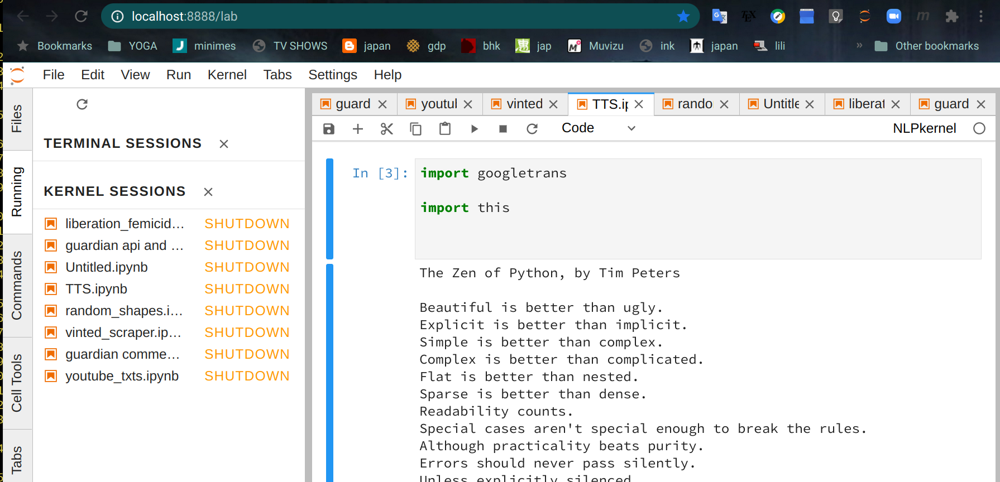
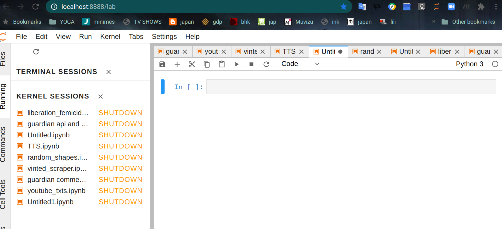
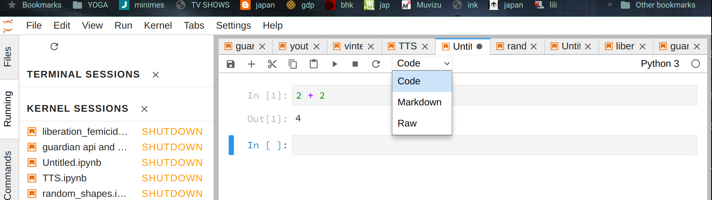

# Introduction


The first class was just preparation for what we will do in the rest of the
semester.  I won't be using the Moodle page so much as it is not easy to update
unlike GitHub.  You will be learning how to use GitHub later - it's quite easy.

Please watch the videos. You can learn a lot from them. There will not be so
much reading but there will be a lot of watching. To begin with the videos will
be mostly in French but some subjects are only really explained well in
English. 

---
### Friday 23/9

Here is the [second notebook](./numpy_intro.ipynb).

-- There are some difficult things in it mainly about matrices.
-- There are some exercises at the end of the worksheet.

Watch these videos before starting:

<iframe width="560" height="315" src="https://www.youtube.com/embed/NzDQTrqsxas" frameborder="0" allow="accelerometer; autoplay; clipboard-write; encrypted-media; gyroscope; picture-in-picture" allowfullscreen></iframe>

<iframe width="560" height="315" src="https://www.youtube.com/embed/vw4u9uBFFqU" frameborder="0" allow="accelerometer; autoplay; clipboard-write; encrypted-media; gyroscope; picture-in-picture" allowfullscreen></iframe>

## Why do this?

Numpy was developed by physicists for doing large numerical calculations.
It is efficient because the loops that we would usually write are
hidden by the API and done in **C**.

It was adapted for doing Data Science and there is a special module for this 
[Pandas](https://pandas.pydata.org/).

A few years ago Google published an API to their neural net framework 
called TensorFlow. The data is fed to the algorithms in [numpy arrays](https://www.tensorflow.org/guide/tf_numpy).

Finally, as you will see in the notebook, images are stored as matrices
and elementary image processing can be done using linear algebra and slicing.

### Friday 16/9

Here is the [first notebook](./lists.ipynb) I've prepared - you should go
through it once you have **installed JuPyTer** (see below it comes with Anaconda).

If you are **not** familiar with Python then try [this notebook](./basic_python.ipynb) first.


At the end of the **first notebook** there is some code to analyse letter
frequency in Hamlet. You should go through it then do the exercise:


## Exo

Find another text and analyse it

--- 

## Why do this?

Machine translation has made **big** progress in recent years [read this](https://www.sciencedirect.com/science/article/pii/S2095809921002745#bb0090)
because of [statistical language models](https://en.wikipedia.org/wiki/Language_model).

- [word2vec](https://jalammar.github.io/illustrated-word2vec/) was the first big advance.
- [BERT](https://towardsml.com/2019/09/17/bert-explained-a-complete-guide-with-theory-and-tutorial/) is the latest from Google
- [GPT3](https://en.wikipedia.org/wiki/GPT-3) is a competitor from OpenAI

For BERT: you can try and install it but you will need a pretty good computer.

We are only going to do very basic statistics on words but the Python code is
close to what really happens.

- Texts get split up into words
- frequencies of pairs of words are calculated. 

This is done for text scraped from:

- wikipedia
- novels and newspaper articles
- forums 

---

## Installing Anaconda

We will be using [Anaconda](https://www.anaconda.com/)
because it is convenient and it is really **industry standard** for doing
DataScience. It comes with JuPyTer, Numpy, Matplotlib, Pandas.

You can follow the instructions on [this
page](https://docs.anaconda.com/anaconda/install/)
to install Anaconda on your machine.

<iframe width="560" height="315" src="https://www.youtube.com/embed/pVME6JvdD5g" frameborder="0" allow="accelerometer; autoplay; clipboard-write; encrypted-media; gyroscope; picture-in-picture" allowfullscreen></iframe>

## Google Colab

If Anaconda installation doesn't work then sign up for an account to [Google
Colab](https://colab.research.google.com/). To use this service you will have to
be connected to the internet all the time. 

It is a **good idea** to sign up for this now because Colab is configured for
using GPUs and works well with Deep Learning packages ie Keras/Tensorflow.

<iframe width="560" height="315"
src="https://www.youtube.com/embed/rlSnUXnd5xE" frameborder="0"
allow="accelerometer; autoplay; clipboard-write; encrypted-media; gyroscope;
picture-in-picture" allowfullscreen></iframe>

## Kaggle

I have a [Kaggle](https://www.kaggle.com/) account too but I rarely use it. In theory you can follow the
course using a Kaggle account if you have one.

## Getting started

[JupyterLab](https://jupyterlab.readthedocs.io/en/stable/) 
- is a web-based interactive development environment for Jupyter notebooks, code, and data. 
- is flexible: configure and arrange the user interface to support a wide range of workflows in data science, scientific computing, and machine learning. 
- is a javascript **front end** running in my browser that interfaces with different **kernels**.


Lab is a version of JuPyteR scheduled to replace ```jupyter notebooks```
but there are still some bugs (in particular when using interactive widgets).

When I run ```jupyter lab ``` this appears in the navigator:



The **kernel sessions** list on the left are recent projects that are
automatically opened. On the right there is a window with an open project
TTS.ipynb. The file format [ipynb](https://fileinfo.com/extension/ipynb) stands
for [Iron Python](https://ironpython.net/) Notebook. If you know about these
things then it is really a [json](https://www.json.org/json-en.html) file.

You can open a new notebook from the  **File menu**.



The blank rectangle is
a [code cell](https://jupyter-notebook.readthedocs.io/en/stable/notebook.html)
- you can write python code here and execute it with ```shift-enter```.

There are 2 other kinds of cell
- Markdown for formatted text and math formulas.
- Raw

You can change the cell type from the menu:




## Notebooks 

You should read this 
 [tutorial for biomaths](https://python.sdv.univ-paris-diderot.fr/18_jupyter/)
 to get an idea of how notebooks work.

Lots of people use notebooks for swapping and explaining results : 
- [calculating R0](https://github.com/k-sys/covid-19/blob/master/Realtime%20R0.ipynb)
- [data
science](https://www.ionos.fr/digitalguide/sites-internet/developpement-web/jupyter-notebook/)
- [gravitational
waves](https://blog.jupyter.org/congratulations-to-the-ligo-and-virgo-collaborations-from-project-jupyter-5923247be019)
- [LHC particle
physics](https://cds.cern.ch/record/2687389/files/CERN_SUM_PJ_report_Yixin.pdf)


---
## Further reading

### Why use Python?

Because even the authors of the [C language manual](https://en.wikipedia.org/wiki/The_C_Programming_Language) say so:
<iframe width="560" height="315" src="https://www.youtube.com/embed/GNyQxXw_oMQ" title="YouTube video player" frameborder="0" allow="accelerometer; autoplay; clipboard-write; encrypted-media; gyroscope; picture-in-picture" allowfullscreen></iframe>


### Python Idioms

Watch the first part about collections and functions.

Here are the 
[slides](https://files.speakerdeck.com/presentations/c56b00e084950130ac8e22000a1c4bc5/BeautifulCode.pdf) in english. The code is Python 2 - so if you want it to work remember that in Python 3 ```print``` is a function!


<iframe width="560" height="315" src="https://www.youtube.com/embed/anrOzOapJ2E" frameborder="0" allow="accelerometer; autoplay; clipboard-write; encrypted-media; gyroscope; picture-in-picture" allowfullscreen></iframe>


### Markdown

Read about Markdown [in english](https://daringfireball.net/projects/markdown/syntax) and
[in french](https://blog.wax-o.com/2014/04/tutoriel-un-guide-pour-bien-commencer-avec-markdown/).

<iframe width="560" height="315" src="https://www.youtube.com/embed/6hikjzymd0c" frameborder="0" allow="accelerometer; autoplay; clipboard-write; encrypted-media; gyroscope; picture-in-picture" allowfullscreen></iframe>


