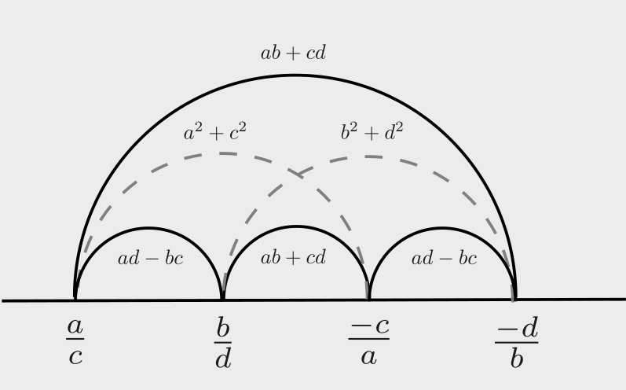

## Brahmagupta–Fibonacci identity

The Brahmagupta identity states that the product of two sums of two
squares is again a sum of two squares. It can be expressed as:
$$ (a^2+b^2)(c^2+d^2) = (ac+ bd)^2 + (ad-bc)^2$$
The "square root" of this identity can be expressed   in terms of moduli of complex numbers as: 
$$(ai+b)(-ci+d) = (ac+bd) + (ad-bc)i.$$
It is amusing to note that the 2 dimensional Cauchy-Schwarz inequality is a corollary:

$$\begin{array}{lll}
 \|(a,b)\|^2\|(c,d)\|^2 
&=& (a^2+b^2)(c^2+d^2) \\
&\geq& (ac+ bd)^2  \\
&=& |(a,b)\cdot(c,d)|^2
\end{array}
$$

There is also the amusing identity:
$$\frac{ai+b}{ci+d} = \frac{(ac+bd) + (ad-bc)i}{c^2+d^2}.$$

### Gauss  composition of binary quadratic forms

The identity
$$ (a^2+b^2)(c^2+d^2) = (ac+ bd)^2 + (ad-bc)^2$$
is a special case of the composition law discovered by Gauss for binary quadratic forms: it says that the square of the form $x^2+y^2$ is the form itself. 
In fact Brahmagupta discovered the more general identity:
$$ (a^2+nb^2)(c^2+nd^2) = (ac+ nbd)^2 + n(ad-bc)^2$$

### Ptolemy's identity

The Brahmagupta identity is a special case of  Ptolemy's identity

Let $(a,b), (c,d)$ be a pair of non-collinear points in the plane.

$$ \begin{pmatrix} a & -b \\ b & a  \end{pmatrix}
\begin{pmatrix}c & d\\ -d & c\end{pmatrix}
=\begin{pmatrix} ac+bd & ad-bc \\ -ad+bc & ac + bd
\end{pmatrix}$$

<!-- $$\begin{vmatrix} a & -b \\ b & a  \end{vmatrix} -->
<!-- \begin{vmatrix}c & d\\ -d & c\end{vmatrix} -->
<!-- =\begin{vmatrix} ac+bd & ad-bc \\ -ad+bc & ac + bd -->
<!-- \end{vmatrix}$$ -->

And we compute determinants to obtain the identity.
In fact the quantities $ac+bd$ and $ad-bc$ are also determinants of
2x2 matrices:
$$ ad-bc = \begin{vmatrix} a & b \\ c & d \end{vmatrix}, \quad ac+bd
= \begin{vmatrix} a & -b \\ d & c \end{vmatrix}.$$

So that in terms of determinants, we have the identity:
$$\begin{vmatrix} a & -b \\ b & a  \end{vmatrix}
\begin{vmatrix}c & d\\ -d & c\end{vmatrix}
=
\begin{vmatrix} a & b \\ c & d \end{vmatrix}^2
+ 
 \begin{vmatrix} a & -b \\ d & c \end{vmatrix}^2.$$

## Spinnors

Following Matthews we define a \textit{spinnor} 
$(a,b)\in \mathbb{C}^2$
and we regard the latter as a symplectic vector space with the symplectic form
$$\{(a,b), (c,d)\} = (a,b)\wedge (c,d)= ad - bc.$$

We will only be interested in the subspace of real non null spinnors which we denote by $\mathbb{R}^2_*$.

Given 3 spinnors $u,v,w\in \mathbb{R}^2_*$, one has
a **Jacobi identity** for the symplectic form:
$$\{v,w\}u + \{w,u\}v + \{u,v\}w = 0,$$
and it follows that
$$ \{v^+,w\}\{u,v^-\} + \{w,u\}\{v^+,v^-\} + \{u,v^+\}\{w,v^-\} = 0 $$
for any quadruple of spinnor $v^\pm, w^\pm\in \mathbb{R}^2_*$.
This latter identity is a version of  the \textit{Ptolemy
identity}.

$$ \{v^+,w^+\}\{w^-,v^-\}+ \{w^-,v^+\}\{w^+,v^-\} 
= \{w^+,w^-\}\{v^+,v^-\}$$ 

To any such quadruple of spinnors we can associate an ideal
quadrilateral in the Poincaré disk: this is just the convex hull of
the four points on the projective line $\mathbb{RP}^1$ corresponding
to the obtained from the spinnors by the map
$$\mathbb{R}^2_* \to \mathbb{RP}^1, \quad (a,b) \mapsto [a:b].$$
We may suppose that after possibly changing labels
$v^+,w^+,v^-,w^-$ are in the correct cyclic order (see figure).

We say that an ideal quadrilateral is an ideal parallologram if
opposite sides have the same lambda length, that is, if the
spinnors $v^+, v^-$ and $w^+, w^-$ satisfy
$$|\{v^\pm,w^\pm\}| = |\{v^\mp,w^\mp\}|.$$

For any ideal parallogram, we have the following identity:
$$X^2 + Y^2 = Z_+ Z_-$$
This is
one of the two Vieta identities for the quadratic polynomial:
$$Z^2 - (kXY)Z + X^2 + Y^2 = 0$$
where $Z_+$ and $Z_-$ are the two roots of the polynomial
and $k$ is a constant.
The other Vieta identity is:
$$Z_+ + Z_- = kXY.$$

---

## Quadratic forms

The quadratic forms over $\mathbb{Z}$
of a given discriminant $D$ form a group under the
composition law discovered by Gauss. The identity element
is 

- if $D\equiv 0 \mod 4$ the class of the form 
$$x^2 + \frac{D}{4}y^2$$

- if $D\equiv 1 \mod 4$  the class of the form 
$$x^2 + xy + \frac{1-D}{4}y^2$$ 

The inverse of the class of the form $ax^2 + bxy + cy^2$ is the
class of the form $ax^2 - bxy + cy^2$.

The composition law can be described in terms of
the bilinear matrix:
$$B = \begin{pmatrix} 2a & b \\ b & 2c \end{pmatrix}.$$
The composition of the forms $F(x,y) = (x,y)B(x,y)^T$ and
$F'(x,y) = (x,y)B'(x,y)^T$ is the form
$F''(x,y) = (x,y)B''(x,y)^T$ where
$$B'' = \frac{1}{g} \begin{pmatrix} 2aa' & ab' + ba' \\ ab' + ba' &
2cc' \end{pmatrix}$$

---

## Euler's four-square identity

There is a corresponding identity for sums of four squares, known as
Euler's four-square identity:

$$
\begin{array}{lll}
&& (a^2+b^2+c^2+d^2)(p^2+q^2+r^2+s^2)\\
&=& (ap+bq+cr+ds)^2
+(aq-bp-ecs+edr)^2 \\
&+&(ar+ebs-cp-edq)^2
+(as-ebr+ecq-dp)^2
\end{array}
$$
where e=1 or e=-1 .

This identity can also be expressed in terms of moduli of
quaternions:
$$|(a+bi+cj+dk)(p+qi+rj+sk)|^2 = |(ap+bq+cr+ds) + (aq-bp-ecs+edr)i +
(ar+ebs-cp-edq)j + (as-ebr+ecq-dp)k|^2.$$

[four square identity](https://en.wikipedia.org/wiki/Euler%27s_four-square_identity)
[cut the
knot](https://www.cut-the-knot.org/m/Algebra/BrahmaguptaFibonacci.shtml)

https://arxiv.org/pdf/1905.10704

Continued Fractions and Factoring
Michele Elia
Legendre found that the continued fraction expansion of \sqrt N having odd period leads directly to an explicit representation of N as the sum of two squares. Similarly, it is shown here that the continued fraction expansion of \sqrt N having even period directly produces a factor of a composite N. Shanks' infrastructural method is then revisited, and some consequences of its application to factorization by means of the continued fraction expansion of \sqrt N are derived.
https://arxiv.org/abs/1706.05919

Rational Right Triangles of a Given Area
Stephanie Chan
Starting from any given rational-sided, right triangle, for example the -triangle with area , we use Euclidean geometry to show that there are infinitely many other rational-sided, right triangles of the same area. We show further that the set of all such triangles of a given area is finitely generated under our geometric construction. Such areas are known as "congruent numbers" and have a rich history in which all the results in this article have been proved and far more. Yet, as far as we can tell, this seems to be the first exploration using this kind of geometric technique.

---

[The development of the principal genus theorem](https://arxiv.org/pdf/math/0207306)
This is a survey of the principal genus theorem in number theory, which has been a major driving force for many important developments in algebraic number theory. 

It's a curious text and I found it quite hard to read, but it
contains a lot of historical information.

The principal genus contains forms that represent squares
modulo the discriminant.

$$x^2 + 2y^2$$

The set of squares modulo $p$ is a subgroup of index 2 of the
multiplicative group $(\mathbb{Z}/p\mathbb{Z})^*$ and the latter group consists of exactly two cosets of the subgroup of squares.

- $x^2 + 5y^2$ represents squares mod 20.
- $2x^2 + 2xy + 3y^2$ does not.

A very naive calculation shows that it represents the other coset of squares mod $5$:

$$ 2x^2 + 2xy + 3y^2 = 2(x+y/2)^2 + 10(y/2)^2 = 2(u^2 + 5v^2)$$

So modulo any odd prime $p$ the form is a multiple of the "principal form" $x^2 + 5y^2$ and one sees that, as claimed, it represents the other coset of squares mod $5$.

## Lifting argument

So if $p$ is an odd prime when will it be represented by the
principal form $x^2 + 5y^2$?

- If $p=1,9 \mod 20$ then $p$ is represented by $x^2 + 5y^2$.
- If $p=3,7 \mod 20$ then $p$ is represented by $2x^2 + 2xy + 3y^2$.

So $11 = 1 + 2\cdot 5$ is not represented by $x^2 + 5y^2$ 
but it should be shouldn't it? Well it is represented by exactly
those forms equivalent
$$11x^2 + bxy + cy^2$$
where $b,c$ are integers.
The discriminant is 
$$b^2 - 4\cdot 11 \cdot c$$
and so the discriminant is a square mod $11$. Unfortunately 
the squares modulo $11$ are just
$$1,3, 4, 5, 9$$
so $-20$ or $2$ is not a square mod $11$.
Evidently it's inconvenient to check that $-20$ is a square modulo for all the odd primes $p$ and that's where quadratic reciprocity comes in.

On the other hand for $41$
this time $12^2 = 144 = -20 \mod 41$ so $-20$ is a square mod $41$ and 
$$41 x^2 + 12 xy + y^2$$
is a form of discriminant $-20$ that represents $41$.

Finally, reduction of forms tells us that
this form is equivalent to one of the two reduced forms
above. It's easy to decide which one it is:
$$41 x^2 + 12 xy + y^2 = x^2 + 2xy + y^2 \mod 5$$
so this form only represents squares mod $5$ and so it must be
equivalent to the principal form $x^2 + 5y^2$.

---

[ideal class groups](https://math.stanford.edu/~conrad/676Page/handouts/picgroup.pdf)

- $x^2 + 82y^2$
- $2x^2 + 41y^2$

 are in the same genus but are not equivalent.

---

see also
- [Quadratic reciprocity](https://stacky.net/files/115/RousseauQR.pdf)
- [Genus theory and convenient numbers](https://math.uchicago.edu/~may/REU2018/REUPapers/Dilmohamed.pdf)

Euler's idoneal numbers (also called suitable numbers or convenient numbers) are the positive integers D such that any integer expressible in only one way as $x^2 \pm Dy^2$ (where $x^2$ is relatively prime to $Dy^2$) is a prime power or twice a prime power. In particular, a number that has two distinct representations as a sum of two squares is composite. Every idoneal number generates a set containing infinitely many primes and missing infinitely many other primes.
[Idoneal number - Wikipedia](https://en.wikipedia.org/wiki/Idoneal_number)

The latter is a very nice introduction to genus theory, composition of forms, and the principal genus theorem.

**Theorem 2.8.** Let D ≡ 0, 1 mod 4 be a nonzero integer. There exists a unique
homomorphism χ : $\mathbb{(Z}/D\mathbb{Z})^* \to \{\pm 1\}$
such that 
$\chi([p]) = (D/p)$ for odd primes p not dividing D.

**Definition 4.1.** Two quadratic forms with discriminant D are in the same genus if they represent the same values in $(\mathbb{Z}/D\mathbb{Z})^*$
. Similarly, the genus with respect to discriminant D of a set of numbers A consists of all quadratic forms with discriminant D that represent the values of A mod D.

**Lemma 4.4.** Let D ≡ 0, 1 mod 4 be an integer and m be an odd integer coprime to D. 
Then m is properly represented by a primitive form of discriminant D if and only if D is a quadratic residue mod m.

**Lemma 4.6.** Given D ≡ 0, 1 mod 4 is a negative integer, 
let χ : $\mathbb{(Z}/D\mathbb{Z})^*$
be the homomorphism defined in Theorem 2.8, and let f(x, y) be a quadratic form of
discriminant D. Then the following statements are true:

- The values in $\mathbb{(Z}/D\mathbb{Z})^*$
represented by the principal form of discriminant D form
a subgroup $G\subset \ker(\chi)$.
- The values in $\mathbb{(Z}/D\mathbb{Z})^*$
represented by f(x, y) form a coset of G in $\ker(\chi)$.

**Theorem 4.7.** Let D ≡ 0, 1 mod 4 be negative, and let 
χ : $\mathbb{(Z}/D\mathbb{Z})^*$
be the homomorphism defined in Theorem 2.8. Then for an odd prime p not dividing D,
$[p] \in \ker \chi$ if and only if p is represented by a reduced form of discriminant D.

---

FRANZ LEMMERMEYER

Introduction

Genus theory belongs to algebraic number theory and, in very broad terms, deals
with the part of the ideal class group of a number field that is ‘easy to compute’.
Historically, the importance of genus theory stems from the fact that it was the
essential algebraic ingredient in the derivation of the classical reciprocity laws –
from Gauß’s second proof over Kummer’s contributions up to Takagi’s ‘general’
reciprocity law for p-th power residues.

## Principal Genus Theorem and the Inverse

**Problem.** Given a binary form F = (A, B, C) of determinant D belonging to a principal genus: to find a binary form f from whose duplication
we get the form F.

$$x^2 + 5y^2 = (x + 2y)^2 - 3(x + 2y)(y) + 2(y)^2$$

There are two forms of determinant -20:
- $x^2 + 5y^2$ 
- $2x^2 + 2xy + 3y^2$.

---

- $p =  1,9 \mod 20$
- $p = 3,7 \mod 20$

$x^2 + 30y^2$

Four reduced forms of discriminant -120:
- $x^2 + 30y^2$
- $3x^2 + 10y^2$
- $2x^2 + 15y^2$
- $5x^2 + 6y^2$

---

1. If D is negative, F is reduced if 
- $|b| \leq a \leq c$, 
- and if 
    - either $|b| < a < c$ 
    - or $a < |b| = c$.
1. If D is positive, F is reduced if 
- $0 < b < \sqrt{D}$ 
- and $\sqrt{D} - b < 2|a| < \sqrt{D} + b$.

## Dirichlet

If (A, B, C) is a form in the principal genus of determinant D, then the
equation
$$Az^2 + 2Bzy + Cy^2 = x^2$$
has solutions in integers z, y, x such that x is coprime to 2D

In §158 Dedekind gives a proof of the principal genus theorem based on Legendre’s theorem.

# Epilogue

To solve 
$$ f(x,y) = ax^2 + bxy + cy^2= z$$
Let $D= b^2 - 4ac>0$ be the discriminant of the form $f(x,y)$.

There are two steps:
- (reciprocity) solve the congruence $f(x,y) \equiv z \mod D$
- (reduction) lift to an integer solution and reduce

