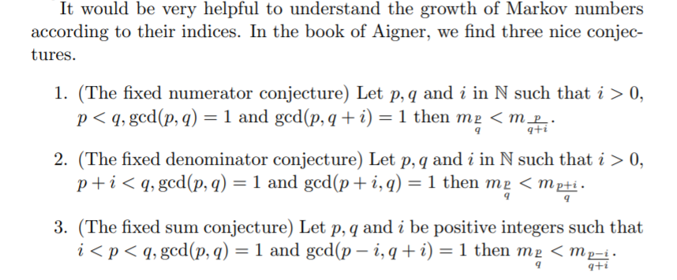
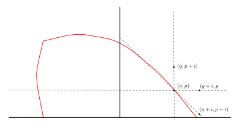
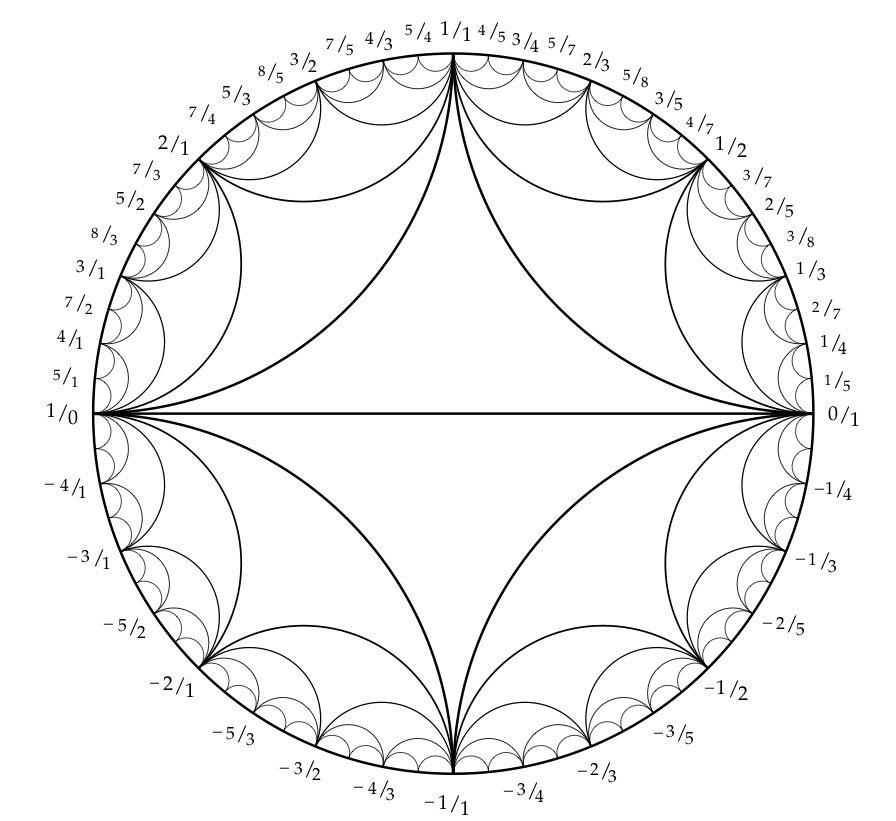
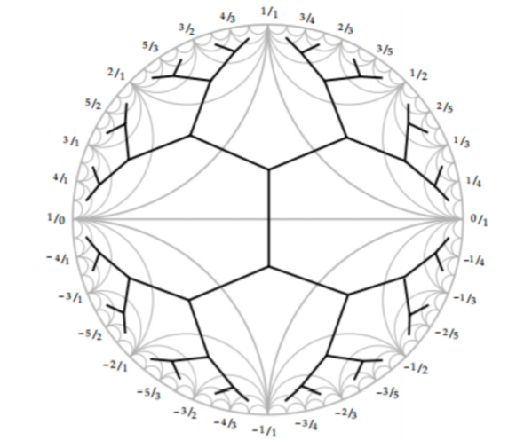
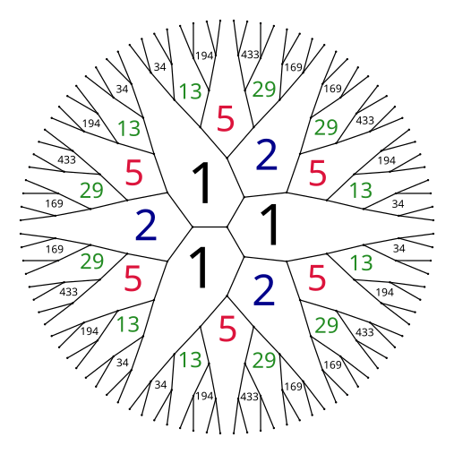
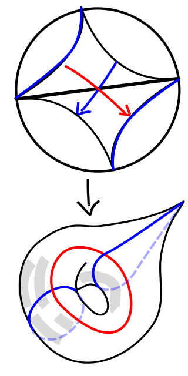
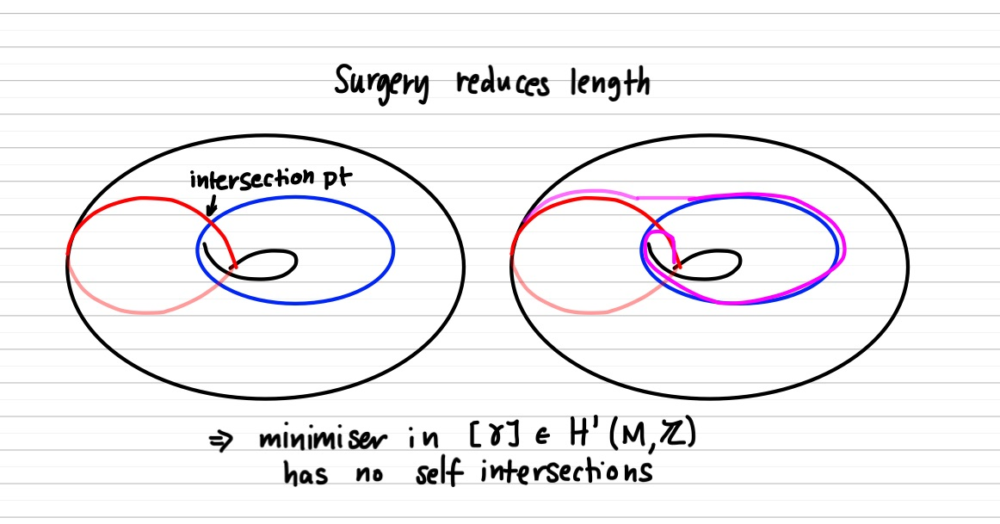
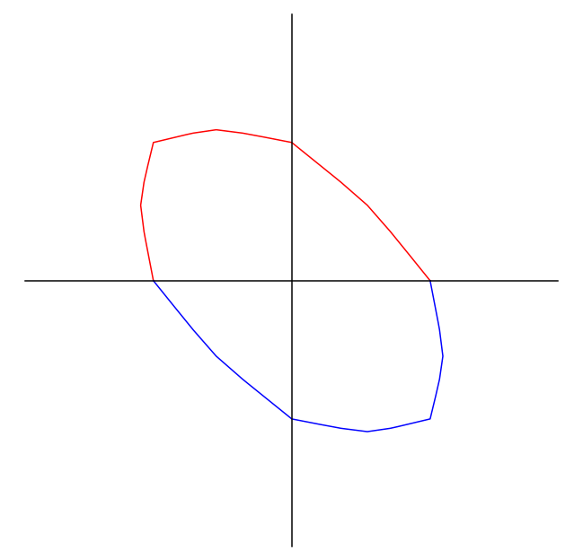
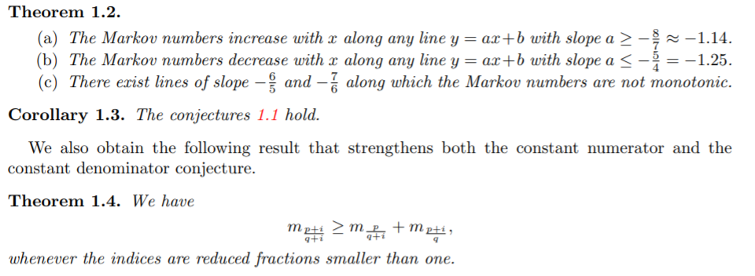

<!--
theme: gaia
class: gaia lead
headingDivider: 1
paginate: true
header: Sanya 2026
footer: 
backgroundImage: linear-gradient(-20deg, rgba(0, 0, 0, 0.6), transparent)
_paginate: false
_header: ''
_footer: ''

style: |
  @keyframes marp-outgoing-transition-vertical-scroll {
    from { transform: translateY(0%); }
    to { transform: translateY(-100%); }
  }
  @keyframes marp-incoming-transition-vertical-scroll {
    from { transform: translateY(100%); }
    to { transform: translateY(0%); }
  }

  @keyframes marp-outgoing-transition-vflip {
    0% { animation-timing-function: ease-in; }
    50% {
      transform: perspective(100vw) translateZ(-100vw) rotateX(-90deg);
      opacity: 0.5;
      animation-timing-function: step-end;
    }
    100% { opacity: 0; }
  }
  @keyframes marp-incoming-transition-vflip {
    0% {
      animation-timing-function: step-start;
      opacity: 0;
    }
    50% {
      transform: perspective(100vw) translateZ(-100vw) rotateX(90deg);
      opacity: 0.5;
      animation-timing-function: ease-out;
    }
  }

  header, footer { text-align: center; color: currentcolor; }
  section.small-code pre { font-size: 68%; }

-->

# Stable norm (old&new)
<!-- _transition: glow -->
Greg Mc Shane
 Institut Fourier
 **USTC, Hefei**

#

<!-- _transition: cube -->
- slides : google **greg mcshane github**
- click on **sanya**

#
<!-- _transition: slide -->
**Markoff numbers** are integers that appear a **Markoff triple** 
$$(1,1,1),(1,2,1),(2,5,1),(5,13,1)$$
which are solutions of a Diophantine equation 
the so-called **Markoff cubic**

* $$x^2 + y^2 + z^2 - 3x y z = 0.$$

<!-- # --> 
<!-- _transition: wipe -->
<!-- ## infinity of Markoff triples: $z=1$ -->

<!-- $\begin{pmatrix} 3 & -1 \\ 1 & 0 \end{pmatrix}$ -->
<!-- is an automorph of --> 
<!-- $$x^2 + y^2  - 3x y.$$ -->

<!-- So $( v_n,v_{n+1},1)$ is a Markoff triple where -->

<!-- $\begin{pmatrix} x \\ y \end{pmatrix}=  \begin{pmatrix}v_{n+1} \\ v_n \end{pmatrix} = \begin{pmatrix} 3 & -1 \\ 1 & 0 \end{pmatrix}^n \begin{pmatrix}1 \\ 1 \end{pmatrix}$ -->

#
### Odd index Fibonacci numbers are Markoff numbers
<!-- _transition: slide -->
$1, 1, 2, 3, 5, 8, 13, 21, 34, 55, 89, 144, 233, 377, 610, 987, 1597, 2584, 4181 \ldots$

$(1,1,1),(1,2,1),(2,5,1),(5,13,1),(13,34,1),(34,89,1)$

#
### Odd index Pell numbers are Markoff numbers
<!-- _transition: cube -->
$0, 1, 2, 5, 12, 29, 70, 169, 408, 985, 2378, 5741, 13860,\ldots$

$(1,5,2), (5,29,2),(29,169,2)\ldots$
#
<!-- _transition: slide -->
### Frobenius uniqueness conjecture

The largest integer in a triple determines the two other numbers.

#
<!-- _transition: cube -->
### Partial results

m = Markoff number

* Jack Button for [m prime](https://londmathsoc.onlinelibrary.wiley.com/doi/abs/10.1112/S0024610798006292)
* Baragar [m, 3m - 2, 3m + 2 prime](https://www.cambridge.org/core/services/aop-cambridge-core/content/view/88B0E426FFCBEA8B3A345C1074B8CC59/S0008439500018828a.pdf/on-the-unicity-conjecture-for-markoff-numbers.pdf)
* Zhang [An elementary proof...](https://arxiv.org/abs/math/0606283)
* Lang, Tan [A simple proof....](https://arxiv.org/abs/math/0508443)
* [ Bugeaud, Reutenauer, Siksek](https://core.ac.uk/download/pdf/82088222.pdf)
* Conclusion too hard!!!

# Martin Aigner
<!-- _transition: wipe -->

-  [Proofs from THE BOOK](https://en.wikipedia.org/wiki/Proofs_from_THE_BOOK#:~:text=Proofs%20from%20THE%20BOOK%20is,proof%20of%20each%20mathematical%20theorem)
* [Convexity and Aigner's Conjectures](https://arxiv.org/abs/2101.03316)
* Prove his conjectures with one figure?

#
<!-- _transition: cube -->
### Aigner's monotonicity conjectures

- Markoff’s theorem and 100 years of the uniqueness conjecture. A mathematical journey from irrational numbers to perfect matchings.  2013.  
* M. Rabideau, R. Schiffler,
Continued fractions and orderings on the Markoff numbers,
Advances in Mathematics Vol 370,  2020. [published](https://www.sciencedirect.com/science/article/abs/pii/S0001870820302577)
* C Lagisquet and E. Pelantová and S. Tavenas and L. Vuillon, On the Markoff numbers: fixed numerator, denominator, and sum conjectures. [published](https://www.sciencedirect.com/science/article/abs/pii/S0196885821000658)

#
<!-- _transition: slide -->
There is a natural map (we'll see why shortly)

$\mathbb{Q}\cup \infty \rightarrow \text{Markoff numbers},\,\, p/q \mapsto m_{p,q}$

#
<!-- _transition: wipe -->
## Aigner's conjectures proof

# Labeling Markoff numbers
<!-- _transition: cube -->
## A tale of three trees

* Markoff number = $m_{p/q}$
* Farey "tree" of coprime integers $p,q$
* Markoff tree of solutions to the cubic
* Bass-Serre of a free product 

$PSL(2,\mathbb{Z}) \simeq \mathbb{Z}/2 * \mathbb{Z}/3$

# 
<!-- _transition: slide -->
## coprime integers $p,q$
* $\gamma$ closed geodesic 
* $\gamma^*$  arc on a punctured torus (disjoint from the geodesic)
<!-- * snake graph and its perfect matchings -->
<!-- * "lengths" that verify a Ptolemy inequality -->

<!-- # -->
<!-- ## Group actions -->

<!-- <!-1- _transition: glow -1-> -->
<!-- $\mathbb{Q}\cup \infty \subset$ circle/projective line -->

<!-- * $(a,c)\text{ primitive } \mapsto a/c \in \mathbb{Q}\cup \infty$ -->
<!-- * $\begin{pmatrix} a & d \\ c & d \end{pmatrix} \mapsto$  arc joining $(a/c, b/d)$ --> 
<!-- * $(a/b, c/d)$ are Farey neighbors iff $|ad - bc | =  1$ -->
<!-- * obvious transitive $SL(2,\mathbb{Z})$  action on Farey neighbors -->

#
<!-- _transition: fade -->

[source](https://www.math.mcgill.ca/sdouba/seminar/sami)

<!-- # -->
<!--  -->
<!-- [source](https://www.mathi.uni-heidelberg.de/~pozzetti/trees/4.pdf) -->

#
<!-- _transition: cube -->

[source](https://www3.nd.edu/~math/rtg/GTS/www3.nd.edu/_jquigle2/GSTS%20FA18/Week1P.pdf)

#

### natural map ?
<!-- _transition: slide -->
$\mathbb{Q}\cup \infty \rightarrow$ Markoff numbers

$p/q \mapsto m_{p,q}$

- $SL(2, \mathbb{Z})$ action on $\mathbb{Q}\cup \infty$ 
- $SL(2, \mathbb{Z})$ action on Markoff numbers/triples ?
- [Vieta jumping](https://en.wikipedia.org/wiki/Vieta_jumping)

$$x^2 - (3yz)x  + (y^2 + z^2) = 0.$$

* quadratic in $x$,  two roots $x^\pm$
* Vieta formula $x^+ + x^- = 3yz$ 
<!-- * involution $(x^-,y,z) \mapsto (x^+, y,z) = (3yz - x^-, z,y)$ -->

#
<!-- _transition: fade -->
## Automorphisms
$$x^2 + y^2 + z^2 - 3x y z = 0.$$

- Vieta flips
- (cyclic) permutations of $x,y,z$
- action of $\mathbb{Z}/2 * \mathbb{Z}/3 \simeq PSL(2,\mathbb{Z})$ 

#
<!-- _transition: glow -->
Natural  = $PSL(2,\mathbb{Z})$-equivariant map

$\mathbb{Q}\cup \infty \rightarrow p/q \mapsto \text{Markoff
number}\,\,m_{p/q}$

- $(0:1) \mapsto  0/1 \mapsto  m_{0/1} = 1 = x$
- $(1:0) \mapsto  \infty \mapsto m_{1/0} = 1 = y$
- $(1:1) \mapsto  1/1 \mapsto m_{1/1} = 2 = z$ 
- actions = projective on left and by autos on right

# 
### Tree structure

comes from Bass-Serre tree of
 $PSL(2,\mathbb{Z})$ 

<!--  -->

#
<!-- _transition: cube -->
## Uniqueness conjecture

* The largest integer in a triple determines the two other numbers.
* The multiplicity of any number in the complementary regions to the tree is at most **6**

#
<!-- _transition: slide -->
## Modern theory: H. Cohn 

Approach to Markoff’s Minimal Forms Through Modular Functions (1955)

- modular torus = quotient of upper half plane $\mathbb{H}$ by  commutator subgroup of $\Gamma'< \text{PSL}(2, \mathbb{Z})$, acting by Mobius transformations
*  relates Markoff numbers to lengths of simple closed geodesics

#
<!-- _transition: cube -->

* modular torus = quotient of upper half plane $\mathbb{H}$ by  commutator subgroup of $\Gamma'< \text{PSL}(2, \mathbb{Z})$
* obtained from a pair of ideal triangles by identification
<!-- * elliptic involution swaps triangles fixes midpoint of diagonal -->

#
<!-- _transition: fade -->
## Character variety

 modular torus = $\mathbb{H}/\Gamma'$ 

- $\Gamma'\simeq \mathbb{Z}*\mathbb{Z} \simeq$ fundamental group of the torus.
* any hyperbolic torus = $\mathbb{H}/ \rho(\mathbb{Z}*\mathbb{Z})$, 
* $\rho:\mathbb{Z}*\mathbb{Z}\rightarrow\text{PSL}(2, \mathbb{R})$ discrete faithful representation
* lifts to $\hat{\rho}:\mathbb{Z}*\mathbb{Z}\rightarrow\text{SL}(2, \mathbb{R})$ 
* $a,b$ generators of $\mathbb{Z}*\mathbb{Z}$
* **Definition** *character map* $\chi : \rho \mapsto ( tr \hat{\rho}(a),  tr \hat{\rho}(b),  tr \hat{\rho}(ab) )$

<!-- #### Exo -->

<!-- - Nielsen move $\rightarrow$ Vieta flip -->
<!-- - $tr\,ab  + tr\,ab^{-1} = (tr\,a) (tr\,b)$ -->

#

<!-- _transition: cube -->

### Theorem: Fricke, Cohn (and others) 

The semi-algebraic set:

$(x,y,z) \in \mathbb{R}_+,\,x^2 + y^2 + z^2 - x y z = 0.$

can be identified with the Teichmueller space of the punctured torus.

- permutations 
- the Vieta flips 

 used to construct Markoff's binary tree are induced by
 automorphisms of the fundamental group of the torus.

#
<!-- _transition: fade -->
## Counting problem

$N(t) := \text{number of Markoff numbers} \leq t$

**Theorem** $N(t) = C (\log(3t))^2 + O(\log t)$

- Zagier (1982) [On the Number of Markoff Numbers Below a Given Bound.](https://www.ams.org/journals/mcom/1982-39-160/S0025-5718-1982-0669663-7/S0025-5718-1982-0669663-7.pdf) 
- Greg McShane, Igor Rivin (1995) [A norm on homology of surfaces and counting simple geodesics](https://arxiv.org/abs/math/0005222)

#
<!-- _transition: fade -->
### Counting closed simple geodesics

- character map $\chi : \rho \mapsto ( tr \hat{\rho}(a),  tr \hat{\rho}(b),  tr \hat{\rho}(ab) )$
* $a$ is generator iff $\exists$ essential simple  closed curve representing its conjugacy/free homotopy class

# 
<!-- _transition: cube -->
### Simple representatives

* blue curve is simple representative of its homotopy class
* not every homotopy class contains a simple curve 
* every (non trivial) homology class has a representative that is a (multiple) of a simple curve

<!-- # -->
<!-- ### Simple representatives in homology -->
<!-- $\phi :  \mathbb{Z}*\mathbb{Z} \rightarrow \mathbb{Z}^2 \simeq -->
<!-- H^1(T,\mathbb{Z})$. -->
<!-- abelianizing homomorphism. -->

<!-- - $\phi$ takes generators of  $\mathbb{Z}*\mathbb{Z}$ to generators of $\mathbb{Z}^2$. -->
<!-- - $(p,q) \in \mathbb{Z}^2$  generator $\Leftrightarrow p,q$ coprime. -->

#
<!-- _transition: fade -->
### Norms and minimizers

Let $c$ be an essential closed curve $\ell_c$ its length.

$\gamma \in H^1(T,\mathbb{Z}), \, \| \gamma \| := \inf_{ c \in \gamma} \ell_c/2$

- convexity/triangle inequality
* any pair of curves in linearly independent homology classes intersect
* a curve with self intersections is never a minimizer

#

<!-- _transition: fade -->

* Cluster algebra folks call this a **smoothing**

<!-- # -->

<!--  -->

#

<!-- _transition: cube -->
**Corollary:** Let T be a punctured torus  with a hyperbolic structure. 

- Then, the shortest multicurve representing a non-trivial homology class $h$ is a simple closed geodesic if $h$ is a primitive homology class, and a multiply covered geodesic otherwise. 
- In addition, the shortest multicurve representing $h$ is unique.

#

<!-- _transition: cube -->
## Unit ball

#
<!-- _transition: fade -->
### Unit ball and counting

 $\sharp \{ \gamma \in \mathbb{Z}^2,\, \| \gamma \| \leq t \} \sim \text{area unit ball}\times t^2$ 
* $\sharp \{ \gamma \text{ primitive},\, \| \gamma \| \leq t \} \sim \frac{6}{\pi^2}\text{area unit ball}\times t^2$ 
* the area of the unit ball depends on the hyperbolic structure
* with Rivin we studied it, but now it's called the Mirzakhani function :(

#
<!-- _transition: cube -->
## Why log ?
$N(t) = C (\log(3t)^2 + O(\log t)$

- $m_{p/q} = \frac13 tr \hat{\rho}( \gamma_{p/q})$
- $= \frac23 \cosh\left(\frac{\ell_{\gamma_p}}{2} \right)$
- $= \frac23 \cosh(\| (q,p) \|_s)$
- **important** $t ↦ \frac23 \cosh(t)$ monotone increasing on $[0,\infty[$

#
<!-- _transition: fade -->
## Aigner's conjectures 

#
<!-- _transition: fade -->
## Reformulate Aigner's conjectures 

 Markoff number $m_{p/q} = \frac23 \cosh(\| (q,p) \|_s)$
 $t ↦ \frac23 \cosh(t)$ monotone increasing on $[0,\infty[$

- Let $p, q$ be real non negative numbers and $i > 0$ then

- $\|(q,p) \|_s < \|(q + i,p) \|_s$
- $\|(q,p) \|_s < \|(q ,p +i ) \|_s$
- If in addition $p < q$ then
$\|(q ,p  ) \|_s < \|(q + i ,p -i ) \|_s$

#
<!-- _transition: fade -->
### Aigner's conjectures proof

#
<!-- _transition: cube -->
##

* [Gaster](https://arxiv.org/abs/2107.13499)

[source](https://arxiv.org/pdf/2010.13010.pdf)

#
<!-- _transition: fade -->
[On the ordering of the Markoff numbers](https://arxiv.org/abs/2010.13010)
Kyungyong Lee, Li Li, Michelle Rabideau, Ralf Schiffler

The proof uses a connection to cluster algebras. It was observed
in [P, BBH] that the Markoff numbers can be obtained from the cluster variables in the cluster
algebra of the once-punctured torus by specializing the initial cluster variables to 1. Moreover, the clusters in the cluster algebra then specialize to the Markoff triples. On the other hand, the cluster variables can be computed by a combinatorial formula given as a summation over the perfect matchings of a so-called snake graph.

# 

### How do you draw the norm ball?

- Plot 
$$(q,p) \in \mathbb{Z}^2,\, \frac{(q,p)}{ \| (q,p) \|_s}  = \frac{(q,p)}{  \ell(\gamma(q,p))}$$
* corners at rational directions
* smoothness at irrational directions

# Robert Hines' perimeter formula

- [An infinite product](https://arxiv.org/pdf/2001.05557v3) on the Teichmüller space of the once-punctured torus
$$\prod_{\gamma\, scg}\left(\frac{e^{l(\gamma)}+1}{e^{l(\gamma)}-1}\right)^{2h}=\exp\left(\frac{l_1+l_2+l_3}{2}\right),$$
- $l(\gamma)$ is the length of the geodesic, 
- $l_1,l_2,l_3$ are the lengths of any triple of simple geodesics $\{\gamma_i\}$ **intersecting at a single point.** 
- The exponent $h=h(\gamma;\{\gamma_i\})$ is a positive integer "height" 

# 

## Analysis of (the derivative of) F

- $F$ is a continuous extension of

$$(q,p) \in \mathbb{Z}^2,\,  \frac{\ell(\gamma(q,p))}{p} = \frac{\|(q,p)\|_s}{p}$$

- "projection of the graph of the "inverse" of the norm ball
coordinates
- 
