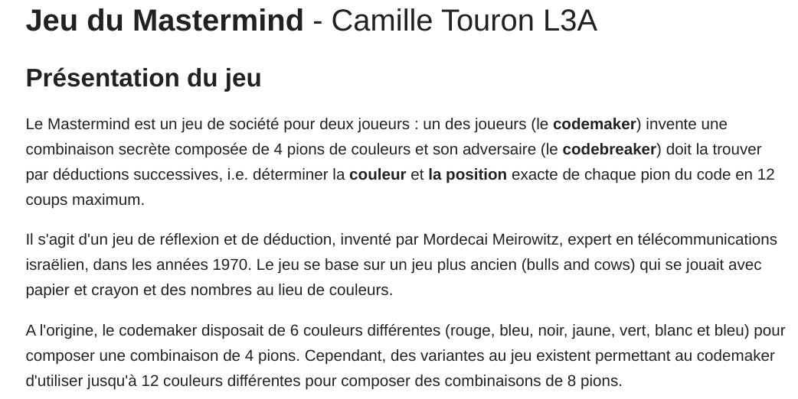

%Stage 
%greg mc
%June 2022


# 3D


- [topology: Alexander sphere](https://www-fourier.ujf-grenoble.fr/~mcshane/3D/alexanderSphere.html){target="_blank"}
- [geometry: Heisenberg group](https://www-fourier.ujf-grenoble.fr/~mcshane/3D/heisenberg_moon_radial_hires.html){target="_blank"}


# Arithmetic

- Pythagoras
- Fibonacci
- Fermat

# Games

- [Mastermind](https://fr.wikipedia.org/wiki/Mastermind){target="_blank"}
- Wordle
	- [english](https://www.nytimes.com/games/wordle/index.html){target="_blank"}
	- [french](https://www.solitaire-play.com/lemot){target="_blank"}
- [Conway](https://fr.wikipedia.org/wiki/Jeu_de_la_vie){target="_blank"}

# algorithms

- [Parcours sup](https://framagit.org/parcoursup/algorithmes-de-parcoursup){target="_blank"}
- [maintainer](https://www.labri.fr/perso/gimbert/){target="_blank"}
- [Google Pagerank](https://fr.wikipedia.org/wiki/PageRank){target="_blank"}
- [Word2vec](https://fr.wikipedia.org/wiki/Word2vec){target="_blank"}
- [GPT3/LaMDA](https://www.npr.org/2022/06/16/1105552435/google-ai-sentient){target="_blank"}


#



#


#  Enumeration

- 6 colours
- $6^4 = 1296$
- 6 colours $\leftrightarrow$ digits $0,1,2\ldots 6$
- possibilities $\leftrightarrow$ digits $0,1,2\ldots 1296$

```
def number_base(n, base):
    if n == 0:
        return 0
    else:
        return n % base + 10 * number_base(n // base, base)

```

# Wordle

 [english wordle](https://www.nytimes.com/games/wordle/index.html){target="_blank"}

# Fibonacci


- $F_0 = 0, F_1 = 1$
- $F_{n+1} = F_n + F_{n-1}$

# Python


```
def Fibonacci(n):
    if n == 0:
        return 0
    elif n == 1:
        return 1
    else:
        return Fibonacci(n-1) + Fibonacci(n-2)
```

# DNN/AI

- [Deepl](https://www.deepl.com/translator#en/fr/this%20is%20a%20lot%20of%20shit){target="_blank"}
- [Github copilot](https://copilot.github.com/){target="_blank"}

# Python 

```
fib = [1,1]
for _ in range(20):
    fib.append(fib[-1] + fib[-2])
               
print(fib)

[1, 1, 2, 3, 5, 8, 13, 21, 34, 55, 
89, 144, 233, 377, 610, 987, 1597, 
2584, 4181, 6765, 10946, 17711]
```


#
### Odd index Fibonacci numbers

```
fib[1::2] 

[1, 2, 5, 13, 34, 89, 233, 610, 1597, 4181, 10946]$
```

- $2 = 1^2 + 1^2$
- $5 = 1^2 + 2^2$
- $13 = 2^2 + 3^2$
- $34 = 3^2 + 5^2$

#

```
[x**2 + y**2 for  x,y in zip(fib[0:11], fib[1:]) ]


[1, 2, 5, 13, 34, 89, 233, 610, 1597, 4181, 10946]
```

#
### Odd index Fibonacci numbers

$$F_{2n+1} = F_{n+1}^2 + F_n^2$$
