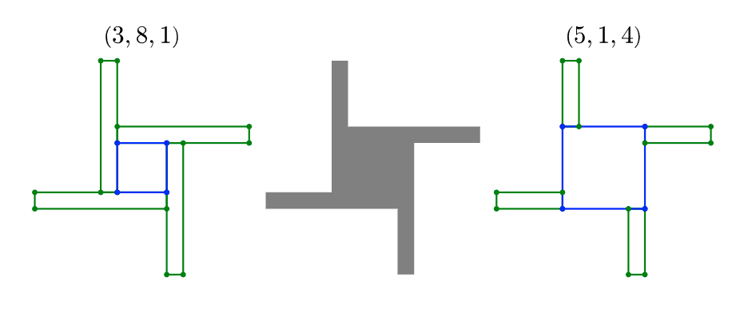

## UGA : TER 2020-21 : Majeur Mathématiques

## Titre : Théorème des deux carrés de Fermat

Résumé : 

**Théorème fondamental**

Un nombre premier $p>2$ est somme de dex carres si et seulement si
$p$ est congrue a 1 modulo 4

On compte des dixaines de démonstrations et parmi elles la preuve de  D. Zagier est remarquable car elle  ne tient qu’une ligne.

On va étudier trois preuves de ce résultat :

- à la base de la division euclidienne dans les entiers de Gauss.
- en étudiant des modules libre de rang 2 suivant Lucas.
- avec l’involution de Zagier et son interpretation en termes de la combinatoire des moulins à vents decouverte par A. Spivak.

En particulier, on mettra en avant la géométrie sous adjacente dans les preuves.

[source](https://mathoverflow.net/questions/31113/zagiers-one-sentence-proof-of-a-theorem-of-fermat)

## Prérequis : 

Algèbre II

## Références

1. Christian Elsholtz, A combinatorial approach to sums of two squares and related problems
[télécharger](https://www.math.tugraz.at/~elsholtz/WWW/papers/papers30nathanson-new-address3.pdf)

2.  Wagon, S.: The Euclidean algorithm strikes again. Amer. Math. Monthly 97 (1990), 125–129.

3. Zagier, D.: A one-sentence proof that every prime p = 1 (mod 4) is a sum of two squares, Amer. Math. Monthly 97(2) (1990), 144.
p
