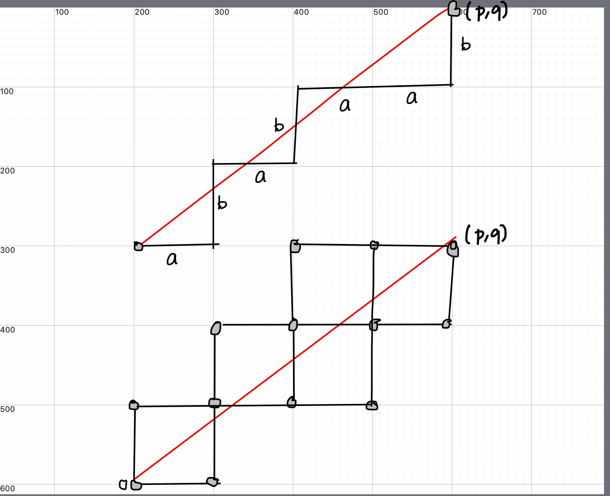

%Markoff numbers 
%greg mc
%July 2023

#
##Geometry of discrete groups and hyperbolic spaces

#

- Markoff numbers and Frobenius conjecture
- Aigners monotonicity conjectures
- Group actions and labelling numbers
- Visualizing Markoff numbers

#

- [Proofs from THE BOOK](https://en.wikipedia.org/wiki/Proofs_from_THE_BOOK#:~:text=Proofs%20from%20THE%20BOOK%20is,proof%20of%20each%20mathematical%20theorem){target="_blank"}
- [Convexity and Aigner's Conjectures](https://arxiv.org/abs/2101.03316){target="_blank"}
- Can I prove these with one figure ?

#

Markov numbers are integers that appear in triples which are solutions of
a Diophantine equation the so-called Markov cubic

$x^2 + y^2 + z^2 - 3x y z = 0.$

$(1,1,1),(1,1,2),(1,2,5),(1,5,13)$

# 
## infinity of Markoff numbers

$\begin{pmatrix} 3 & -1 \\ 1 & 0 \end{pmatrix}$
is an automorph of 150$x^2 + y^2  - 3x y.$

 so 150$( v_n,v_{n+1},1)$ is a solution where

150$\begin{pmatrix}v_{n+1} \\ v_n \end{pmatrix} = \begin{pmatrix} 3 & -1 \\ 1 & 0 \end{pmatrix}^n \begin{pmatrix}1 \\ 1 \end{pmatrix}$

#
### Odd index Fibonacci numbers are Markoff numbers

$1, 1, 2, 3, 5, 8, 13, 21, 34, 55, 89, 144, 233, 377, 610, 987, 1597, 2584, 4181, 6765, 10946, 17711, 28657, 46368, 75025, 121393, 196418, 317811, ...$

$(1,1,1),(1,1,2),(1,2,5),(1,5,13)$

#
### Frobenius uniqueness conjecture

The largest integer in a triple determines the two other numbers.

#
### Partial results

m = Markoff number

- Jack Button for [m prime](https://londmathsoc.onlinelibrary.wiley.com/doi/abs/10.1112/S0024610798006292){target="_blank"}
- Zhang [An elementary proof...](https://arxiv.org/abs/math/0606283){target="_blank}
- Baragar [m, 3m - 2, 3m + 2 prime](https://www.cambridge.org/core/services/aop-cambridge-core/content/view/88B0E426FFCBEA8B3A345C1074B8CC59/S0008439500018828a.pdf/on-the-unicity-conjecture-for-markoff-numbers.pdf){target="_blank}
- [ Bugeaud, Reutenauer, Siksek](https://core.ac.uk/download/pdf/82088222.pdf){target="_blank}
- [Multiplicities of simple closed geodesics](https://projecteuclid.org/journals/geometry-and-topology/volume-12/issue-4/Multiplicities-of-simple-closed-geodesics-and-hypersurfaces-in-Teichm%C3%BCller-space/10.2140/gt.2008.12.1883.full){target="_blank}
- Conclusion too hard!!!

#
### Aigner's monotonicity conjectures

- Markov’s theorem and 100 years of the uniqueness conjecture. A mathematical journey from irrational numbers to perfect matchings.  2013.  
- M. Rabideaua, R. Schiffler,
Continued fractions and orderings on the Markov numbers,
Advances in Mathematics Vol 370,  2020.
- C Lagisquet and E. Pelantová and S. Tavenas and L. Vuillon, On the Markov numbers: fixed numerator, denominator, and sum conjectures.

#

There is a natural map (we'll see why shortly)

$\mathbb{Q}\cup \infty \rightarrow$ Markoff numbers

$p/q \mapsto m_{p,q}$

# 
## A tale of three trees

Labeling Markoff numbers

- Markoff number = 250$m_{p/q}$
- Farey tree of coprime integers 250$p,q$
- Markoff tree of solutions to cubic
- Bass-Serre of a free product (250$PSL(2,\mathbb{Z})$)

# 
## Story of correspondences 

- $GL(2,\mathbb{Z})$ and its actions
- coprime integers 250$p,q$
- simple closed geodesics on a torus
- snake graphs
- "lengths"

# 
## Grids

 coprime integers 250$p,q$ live in a grid with a line

#
## Matchings

#
## Groups

- 250$\mathbb{Z}$ fundamental group of circle
- 250$\mathbb{Z}^2$ fundamental group of torus
- 250$\mathbb{Z}^2$ acting by translation on 250$\mathbb{R}^2$.

#
## Group actions

- 250$\mathbb{Z}^2$ acting by translation on 250$\mathbb{R}^2$.
- infinitely many primitive elements 
- 250$(a,b)$ primitive iff 250$a,b \in \mathbb{Z}$ coprime

#
## Two choices (red/blue pill)

Next most interesting groups ?

- free product $\mathbb{Z}*\mathbb{Z}$
- automorphism group  $GL(2,\mathbb{Z})$
- both lead to hyperbolic geometry

#
## Group actions

- $GL(2,\mathbb{Z})$ acting by "base change" on $\mathbb{Z}^2$
- Bezout's identity $\Rightarrow$ transitive on primitives
- Visualize  $GL(2,\mathbb{Z})$ action 

#

$\mathbb{Q}\cup \infty \subset$ circle/projective line

- $(a,b)\text{ primitive } \mapsto a/b \in \mathbb{Q}\cup \infty$
- $\begin{pmatrix} a & c \\ b & d \end{pmatrix} \mapsto$  arc joining $(a/b, c/d)$ 
- $(a/b, c/d)$ are Farey neighbors

#

[source](https://www.math.mcgill.ca/sdouba/seminar/sami)

#

[source](https://www3.nd.edu/~math/rtg/GTS/www3.nd.edu/_jquigle2/GSTS%20FA18/Week1P.pdf)

#
### natural map ?

$\mathbb{Q}\cup \infty \rightarrow$ Markoff numbers

$p/q \mapsto m_{p,q}$

- projective $GL(2, \mathbb{Z})$ action on $\mathbb{Q}\cup \infty$ 
- action on Markoff numbers ?
- [Vieta flipping](https://en.wikipedia.org/wiki/Vieta_jumping){target="_blank"}

#
### Vieta flips/involutions
250$x^2 + y^2 + z^2 - 3x y z = 0.$

- quadratic in $x$,  two roots $x^\pm$
- $x^+ + x^- = 3yz$
- involution $(x,y,z) \mapsto (3yz -x, y,z)$

#

Peter Sarnak (Princeton and IAS)

Title: Strong approximation for Markoff surfaces

We discuss the transitivity properties of the group of morphisms generated by Vieta involutions on the solutions in congruences to the Markoff equation as well as to other Markoff type affine cubic surfaces. These are dictated in part by the finite orbits of these actions on the algebraic points

Joint work with J.Bourgain and A.Gamburd.

#
## Automorphisms

- Vieta flips
- (cyclic) permutations of $x,y,z$
- get $\mathbb{Z}/2 * \mathbb{Z}/3$ action
- = [$PSL(2,\mathbb{Z})$ action](https://en.wikipedia.org/wiki/Modular_group){target="_blank}

#
Natural  = $PSL(2,\mathbb{Z})$-equivariant map

150$\mathbb{Q}\cup \infty \rightarrow$ Markoff numbers 150$p/q \mapsto m_{p/q}$

- 150$(1:1) \mapsto  1/1 \mapsto 2$ 
- 150$(0:1) \mapsto  0/1 \mapsto 1$ 
- 150$(1:0) \mapsto  \infty \mapsto 1$ 
- actions = projective on left and by autos on right

# 
### Tree structure

comes from Bass-Serre tree of
 $PSL(2,\mathbb{Z})$ 

#
## Vizualization

- so we have seen the structure of the Markoff numbers
- is there a bette way?
- is there hidden information?

#
## Motivation

$x^2 + y^2 + z^2 - x y z = 0.$

- positive characteristic Sarnak et al.
- over $\mathbb{C}$ ? 
- Bowditch
- Sakuma et al.
- SP Tan et al.

#
## Fibonacci growth

[Bowditch](http://homepages.warwick.ac.uk/~masgak/papers/bhb-markoff.pdf){target="_blank"}

#
## Fibonacci growth

- $a,b$ generate $\mathbb{Z}*\mathbb{Z}$
- coprime $(p,q) \mapsto w \in \langle a, b \rangle$
- $1/c (|p| + |q|) \leq \ell_w \leq  c(|p| + |q|)$

#
## Continuity of length

$\rho, \gamma \mapsto \ell_\gamma(\rho)$
is a continuous map  
$\mathcal{T}(\Sigma) \times \mathcal{ML} \rightarrow \mathbb{R}$

- [Generalisation Brock](http://citeseerx.ist.psu.edu/viewdoc/download;jsessionid=B57D2A49F7D875E1D8673D71711C7134?doi=10.1.1.493.2878&rep=rep1&type=pdf)
- Question how regular is it?

#
### Is there a norm hidden here?

