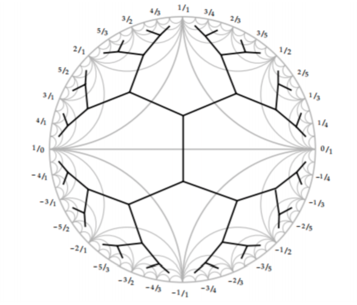
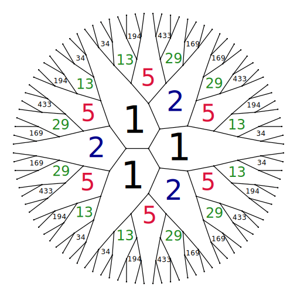

<!--
theme: gaia
class: gaia lead
headingDivider: 1
paginate: true
header: Tokyo slides
footer: Transition showcase
backgroundImage: linear-gradient(-20deg, rgba(0, 0, 0, 0.3), transparent)
_paginate: false
_header: ''
_footer: ''

style: |
  @keyframes marp-outgoing-transition-vertical-scroll {
    from { transform: translateY(0%); }
    to { transform: translateY(-100%); }
  }
  @keyframes marp-incoming-transition-vertical-scroll {
    from { transform: translateY(100%); }
    to { transform: translateY(0%); }
  }

  @keyframes marp-outgoing-transition-vflip {
    0% { animation-timing-function: ease-in; }
    50% {
      transform: perspective(100vw) translateZ(-100vw) rotateX(-90deg);
      opacity: 0.5;
      animation-timing-function: step-end;
    }
    100% { opacity: 0; }
  }
  @keyframes marp-incoming-transition-vflip {
    0% {
      animation-timing-function: step-start;
      opacity: 0;
    }
    50% {
      transform: perspective(100vw) translateZ(-100vw) rotateX(90deg);
      opacity: 0.5;
      animation-timing-function: ease-out;
    }
  }

  header, footer { text-align: center; color: currentcolor; }
  section.small-code pre { font-size: 68%; }
-->

# Markoff numbers 
<!-- _class: lead -->
<!-- _transition: glow -->
greg mc shane

# Martin Aigner
<!-- _transition: wipe -->


* [Proofs from THE BOOK](https://en.wikipedia.org/wiki/Proofs_from_THE_BOOK#:~:text=Proofs%20from%20THE%20BOOK%20is,proof%20of%20each%20mathematical%20theorem)
* [Convexity and Aigner's Conjectures](https://arxiv.org/abs/2101.03316)
* Can I prove these with one figure ?


#
<!-- _transition: cube -->
**Markov numbers** are integers that appear a **Markov triple** 
$$(1,1,1),(1,2,1),(2,5,1),(5,13,1)$$
which are solutions of a Diophantine equation 
the so-called **Markov cubic**

* $$x^2 + y^2 + z^2 - 3x y z = 0.$$


# 
<!-- _transition: wipe -->
## infinity of Markoff triples: $z=1$

$\begin{pmatrix} 3 & -1 \\ 1 & 0 \end{pmatrix}$
is an automorph of 
$$x^2 + y^2  - 3x y.$$

So $( v_n,v_{n+1},1)$ is a Markov triple where

$\begin{pmatrix} x \\ y \end{pmatrix}=  \begin{pmatrix}v_{n+1} \\ v_n \end{pmatrix} = \begin{pmatrix} 3 & -1 \\ 1 & 0 \end{pmatrix}^n \begin{pmatrix}1 \\ 1 \end{pmatrix}$

#
### Odd index Fibonacci numbers are Markoff numbers
<!-- _transition: cube -->
$1, 1, 2, 3, 5, 8, 13, 21, 34, 55, 89, 144, 233, 377, 610, 987, 1597, 2584, 4181 \ldots$

$(1,1,1),(1,2,1),(2,5,1),(5,13,1),(13,34,1),(34,89,1)$

#
<!-- _transition: cube -->
### Frobenius uniqueness conjecture


The largest integer in a triple determines the two other numbers.

#
<!-- _transition: cube -->
### Partial results

m = Markoff number

* Jack Button for [m prime](https://londmathsoc.onlinelibrary.wiley.com/doi/abs/10.1112/S0024610798006292)
* Zhang [An elementary proof...](https://arxiv.org/abs/math/0606283)
* Baragar [m, 3m - 2, 3m + 2 prime](https://www.cambridge.org/core/services/aop-cambridge-core/content/view/88B0E426FFCBEA8B3A345C1074B8CC59/S0008439500018828a.pdf/on-the-unicity-conjecture-for-markoff-numbers.pdf)
* [ Bugeaud, Reutenauer, Siksek](https://core.ac.uk/download/pdf/82088222.pdf)
* Conclusion too hard!!!

#
<!-- _transition: cube -->
### Aigner's monotonicity conjectures

* Markov’s theorem and 100 years of the uniqueness conjecture. A mathematical journey from irrational numbers to perfect matchings.  2013.  
* M. Rabideau, R. Schiffler,
Continued fractions and orderings on the Markov numbers,
Advances in Mathematics Vol 370,  2020.
* C Lagisquet and E. Pelantová and S. Tavenas and L. Vuillon, On the Markov numbers: fixed numerator, denominator, and sum conjectures.


#
<!-- _transition: slide -->
There is a natural map (we'll see why shortly)

$\mathbb{Q}\cup \infty \rightarrow$ Markoff numbers

$p/q \mapsto m_{p,q}$


# 
<!-- _transition: slide -->
## A tale of three trees

Labeling Markoff numbers

* Markoff number = $m_{p/q}$
* Farey tree of coprime integers $p,q$
* Markoff tree of solutions to cubic
* Bass-Serre of a free product ($PSL(2,\mathbb{Z})$)

# 
## Story of pairs

* coprime integers $p,q$
* 2x2 matrices
* closed geodesics
* snake graphs
* "lengths"

# 
## Story of involutions

- Vieta jumping
- diagonal exchanges
- mutations


#
## Group actions

* $\mathbb{Z}$ acting by translation on $\mathbb{R}$.
* two possible generators more correctly primitive elements
* **primitive** iff $a = b^m \Rightarrow m = \pm 1$ 

#
## Group actions

* $\mathbb{Z}^2$ acting by translation on $\mathbb{R}^2$.
* infinitely many primitive elements 
* $(a,b)$ primitive iff $a,b \in \mathbb{Z}$ coprime

#
## Two choices (red/blue pill)

- free product $\mathbb{Z}*\mathbb{Z}$
- automorphism group  $GL(2,\mathbb{Z})$
- both lead to hyperbolic geometry

#
## Group actions
* $GL(2,\mathbb{Z})$ acting by "base change" on $\mathbb{Z}^2$
* Bezout's identity $\Rightarrow$ transitive on primitives
* Visualize  $GL(2,\mathbb{Z})$ action 

#

<!-- _transition: glow -->
$\mathbb{Q}\cup \infty \subset$ circle/projective line

* $(a,b)\text{ primitive } \mapsto a/b \in \mathbb{Q}\cup \infty$
* $\begin{pmatrix} a & c \\ b & d \end{pmatrix} \mapsto$  arc joining $(a/b, c/d)$ 
* $(a/b, c/d)$ are Farey neighbors

#
<!-- _transition: fade -->

[source](https://www.math.mcgill.ca/sdouba/seminar/sami)

<!-- # -->
<!--  -->
<!-- [source](https://www.mathi.uni-heidelberg.de/~pozzetti/trees/4.pdf) -->

#
<!-- _transition: cube -->


[source](https://www3.nd.edu/~math/rtg/GTS/www3.nd.edu/_jquigle2/GSTS%20FA18/Week1P.pdf)

#

### natural map ?
<!-- _transition: cube -->
$\mathbb{Q}\cup \infty \rightarrow$ Markoff numbers

$p/q \mapsto m_{p,q}$

* $GL(2, \mathbb{Z})$ action on $\mathbb{Q}\cup \infty$ 
* $GL(2, \mathbb{Z})$ action on Markoff numbers ?
* [Vieta jumping](https://en.wikipedia.org/wiki/Vieta_jumping)

#
<!-- _transition: cube -->
### Vieta jumps/flips/involutions
$x^2 + y^2 + z^2 - 3x y z = 0.$

* quadratic in $x$,  two roots $x^\pm$
* Vieta formula $x^+ + x^- = 3yz$ 
* involution $(x^-,y,z) \mapsto (x⁺, y,z) = (3yz - x^-, y,z)$

#

Peter Sarnak (Princeton and IAS)

Title: Strong approximation for Markoff surfaces

We discuss the transitivity properties of the group of morphisms generated by Vieta involutions on the solutions in congruences to the Markoff equation as well as to other Markoff type affine cubic surfaces. These are dictated in part by the finite orbits of these actions on the algebraic points

Joint work with J.Bourgain and A.Gamburd.

#
<!-- _transition: fade -->
## Automorphisms
$$x^2 + y^2 + z^2 - 3x y z = 0.$$

- Vieta flips
- (cyclic) permutations of $x,y,z$
- get action $\mathbb{Z}/2 * \mathbb{Z}/3$ 
-  $\simeq PSL(2,\mathbb{Z})$ action

#
<!-- _transition: glow -->
Natural  = $PSL(2,\mathbb{Z})$-equivariant map

$\mathbb{Q}\cup \infty \rightarrow$ Markoff numbers $p/q \mapsto m_{p/q}$

- $(1:1) \mapsto  1/1 \mapsto m_{1/1} = 2$ 
- $(0:1) \mapsto  0/1 \mapsto m_{0/1} = 1$
- $(1:0) \mapsto  \infty \mapsto m_{1/0} = 1$
- actions = projective on left and by autos on right

# 
### Tree structure

comes from Bass-Serre tree of
 $PSL(2,\mathbb{Z})$ 

<!--  -->


# drop

<!-- _backgroundColor: #4996C8 -->
<!-- _transition: drop -->

```markdown
<!-- transition: drop -->
```

# explode

<!-- _backgroundColor: #6EB35E -->
<!-- _transition: explode -->

```markdown
<!-- transition: explode -->
```

# fade

<!-- _backgroundColor: #ECD03F -->
<!-- _transition: fade -->

```markdown
<!-- transition: fade -->
```

# fade-out

<!-- _backgroundColor: #F39C3C -->
<!-- _transition: fade-out -->

```markdown
<!-- transition: fade-out -->
```


# flip

<!-- _backgroundColor: #774ED8 -->
<!-- _transition: flip -->

```markdown
<!-- transition: flip -->
```

# glow

<!-- _backgroundColor: #4996C8 -->
<!-- _transition: glow -->

```markdown
<!-- transition: glow -->
```

# implode

<!-- _backgroundColor: #6EB35E -->
<!-- _transition: implode -->

```markdown
<!-- transition: implode -->
```

# in-out

<!-- _backgroundColor: #ECD03F -->
<!-- _transition: in-out -->

```markdown
<!-- transition: in-out -->
```


# iris-out

<!-- _backgroundColor: #EA5555 -->
<!-- _transition: iris-out -->

```markdown
<!-- transition: iris-out -->
```

# overlap

<!-- _backgroundColor: #4996C8 -->
<!-- _transition: overlap -->

```markdown
<!-- transition: overlap -->
```


# pull

<!-- _backgroundColor: #ECD03F -->
<!-- _transition: pull -->

```markdown
<!-- transition: pull -->
```

# push

<!-- _backgroundColor: #F39C3C -->
<!-- _transition: push -->

```markdown
<!-- transition: push -->
```

# reveal

<!-- _backgroundColor: #EA5555 -->
<!-- _transition: reveal -->

```markdown
<!-- transition: reveal -->
```

# rotate

<!-- _backgroundColor: #774ED8 -->
<!-- _transition: rotate -->

```markdown
<!-- transition: rotate -->
```

# slide

<!-- _backgroundColor: #4996C8 -->
<!-- _transition: slide -->

```markdown
<!-- transition: slide -->
```


# swipe

<!-- _backgroundColor: #F39C3C -->
<!-- _transition: swipe -->

```markdown
<!-- transition: swipe -->
```

# swoosh

<!-- _backgroundColor: #EA5555 -->
<!-- _transition: swoosh -->

```markdown
<!-- transition: swoosh -->
```

# wipe

<!-- _backgroundColor: #774ED8 -->
<!-- _transition: wipe -->

```markdown
<!-- transition: wipe -->
```

# wiper

<!-- _backgroundColor: #4996C8 -->
<!-- _transition: wiper -->

```markdown
<!-- transition: wiper -->
```

# zoom

<!-- _backgroundColor: #6EB35E -->
<!-- _transition: zoom -->

```markdown
<!-- transition: zoom -->
```

