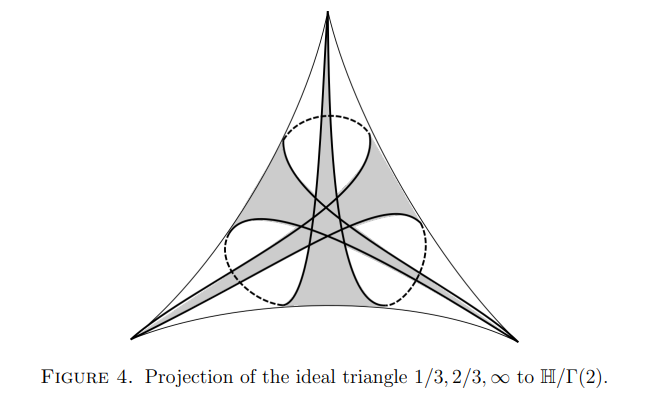
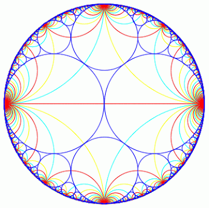
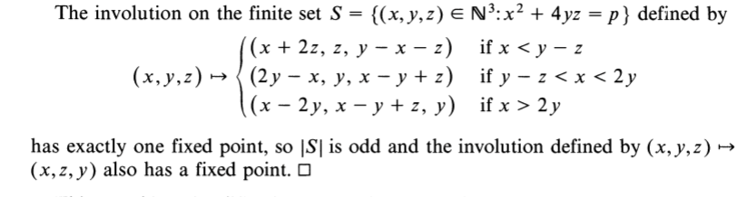
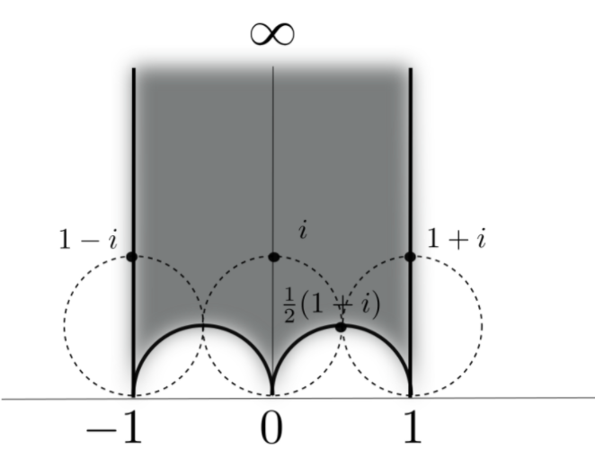
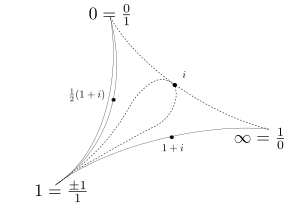

<!--
theme: gaia
class: gaia lead
headingDivider: 1
paginate: true
header: TITECH 2023
footer: 
backgroundImage: linear-gradient(-20deg, rgba(0, 0, 0, 0.6), transparent)
_paginate: false
_header: ''
_footer: ''

style: |
  @keyframes marp-outgoing-transition-vertical-scroll {
    from { transform: translateY(0%); }
    to { transform: translateY(-100%); }
  }
  @keyframes marp-incoming-transition-vertical-scroll {
    from { transform: translateY(100%); }
    to { transform: translateY(0%); }
  }

  @keyframes marp-outgoing-transition-vflip {
    0% { animation-timing-function: ease-in; }
    50% {
      transform: perspective(100vw) translateZ(-100vw) rotateX(-90deg);
      opacity: 0.5;
      animation-timing-function: step-end;
    }
    100% { opacity: 0; }
  }
  @keyframes marp-incoming-transition-vflip {
    0% {
      animation-timing-function: step-start;
      opacity: 0;
    }
    50% {
      transform: perspective(100vw) translateZ(-100vw) rotateX(90deg);
      opacity: 0.5;
      animation-timing-function: ease-out;
    }
  }

  header, footer { text-align: center; color: currentcolor; }
  section.small-code pre { font-size: 68%; }

-->

#
## Button's Theorem

If $z$ is a Markoff number which is prime 
then there is a unique triple $z > y > x$

* $x^2 + y^2 + z^2 - 3x y z = 0.$
* $\bar{x}^2 + \bar{y}^2 = 0.$ in $\mathbb{F}_z$
* $(\bar{x}/\bar{y})^2 = -1$ in $\mathbb{F}_z$
*  $\Rightarrow p = 2$ or $p − 1$ is a multiple of 4.

#

<!--  -->

### Theorem F1 (Fermat)

Let $p$ be a prime then
$$x^2 + y^2= p$$
has a solution over $\mathbb{Z}$

- iff $p = 2$ or $p − 1$ is a multiple of 4.
- Button's theorem follows from unicity of $x,y$

#

### Theorem F2 (Fermat)

Let $p$ be a prime then
$$x^2  + xy + y^2= p$$
has a solution over $\mathbb{Z}$ 

- iff $p = 3$ or $p − 1$ is a multiple of 6.

#

-  [Eisenstein integers and equilateral ideal triangles](./eisenstein.pdf)

#
## two groups of order 4

Acting on $\mathbb{F}_p^*$

$\begin{array}{lll}
x &\mapsto& -x \\
x &\mapsto& 1/x
\end{array}$

Acting on $\mathbb{H}$

$\begin{array}{lll}
z &\mapsto& -\bar{z} \\
z &\mapsto& 1/\bar{z}
\end{array}$

#

**Farey tessalation**

#

**Ford circles**
<!-- # -->
<!-- <iframe width="560" height="315" src="https://www.youtube.com/embed/0hlvhQZIOQw" title="YouTube video player" frameborder="0" allow="accelerometer; autoplay; clipboard-write; encrypted-media; gyroscope; picture-in-picture" allowfullscreen></iframe> -->

#
## References etc

- Heath-Brown, Fermat’s two squares theorem. Invariant (1984) 
- Zagier, A one-sentence proof that every prime p = 1 (mod 4) is a sum of two squares, 1990
- Elsholtz, Combinatorial Approach to Sums of Two Squares and Related Problems.  (2010) 
- Penner, The decorated Teichmueller space of punctured surfaces, Comm  Math Phys  (1987)
- [Zagier text](https://people.mpim-bonn.mpg.de/zagier/files/doi/10.2307/2323918/fulltext.pdf)

#
## Zagier

 

#
## Let's begin then...

#
### Burnside Lemma 

- $G$ acting on $X$ then 

    $|G| |X/G| = \sum_{g} |X^g|$

- $X^g$ =  fixed points of the element $g$ 
- $X/G$  the orbit space.

#

### Theorem 

Let $p$ be a prime then 

$x^2 = -1$

has a solution over $\mathbb{F}_p$

- iff $p = 2$ or $p − 1$ is a multiple of 4.

#
### Proof

Group acting on $X = \mathbb{F}_p^*$:

$\begin{array}{lll}
x &\mapsto& x \\
x &\mapsto& -x \\
x &\mapsto& 1/x \\
x &\mapsto& -1/x
\end{array}$

#

### Counting fixed points

* identity $|X^g| = p-1$ 
* $x \mapsto -x, |X^g| = 0$  
* $x \mapsto 1/x, |X^g| = 2$  
* $x \mapsto -1/x, |X^g| = \ldots$ ?  

#
### Apply Burnside

- $|G| |X/G| = \sum_{g} |X^g|$
- $4 |X/G| = (p-1) + 2 + |X^{(x\mapsto -1/x)}|$
- $\Rightarrow  |X^{(x\mapsto -1/x)}| = 2,\, \text{if }4 \not \mid (p+1)$
- $\Rightarrow  \exists x,\, x^2 = -1,\, \text{if }4 \not \mid (p+1)$

#
## QED

#
### Theorem F2: sum of 2 squares

Acting on $\mathbb{H}$

$\begin{array}{lll}
z &\mapsto& -\bar{z} \\
z &\mapsto& 1/\bar{z}
\end{array}$

#
## Primitives in the boundary  of $\mathbb{H}$

- $(a,b)$ primitive iff $a,b \in \mathbb{Z}$ coprime
* infinitely many primitive elements 
* $SL(2,\mathbb{Z})$ transitive on primitives

[source](https://www.math.mcgill.ca/sdouba/seminar/sami)

# Recall
## Definitions
- **arc** = Poincaré geodesic joining $a/b, c/d \in \mathbb{Q}\cup \infty$
- **$\lambda$- length of  arc** $= |ad - bc|$ 

#
### Groups and quotients

- $\Gamma = \mathrm{SL}(2,\mathbb{Z})$ has torsion so $\mathbb{H}/\Gamma$ orbifold
- $\Gamma(2) = \ker (\mathrm{SL}(2,\mathbb{Z})\rightarrow  \mathrm{SL}(2,\mathbb{F}_2))$
- $\mathbb{H}/\Gamma(2)$  three punctured sphere 
<!-- - $\Gamma' = [\Gamma,\Gamma]$ -->
<!-- - $\mathbb{H}/\Gamma'$ once punctured torus --> 

- For Aigner's conjectures the geometry of the 
simple geodesics on
$\mathbb{H}/\Gamma'$ once punctured torus was important. 
* For Fermat's theorem it's the automorphisms of 
$\mathbb{H}/\Gamma(2)$ =  three punctured sphere 

#

A three punctured sphere can be cut up into 2 ideal triangles
:= top and bottom triangles

 Fundamental domain for $\Gamma(2)$

#

 $i, 1+i, \frac12 ( 1 + i)$ are midpoints of 3 arcs 
 of $\lambda$-length 1

* $i$  fixed point of 3 different involutions
* one dotted arc has $\lambda$-length $1 = 1^2 + 0^2$
* other dotted arc has $\lambda$-length $2 = 1^2 + 1^2$

#
## Lemma A

- Let $n$ be a positive integer.
- The number of  ways of writing $n$  as a  sum of squares $n = c^2 + d^2$ with $c,d$ coprime integers
- is equal to the number of  integers $0 \leq k < n-1$ coprime to $n$ such that the line $\{  k/n + i t,\, t>0  \}$ contains  a point in the $\Gamma$  orbit of $i$.

#
What is the subgroup of automorphisms 
fixing the cusp labeled $\infty$?

 $\simeq \mathbb{Z}/2\mathbb{Z} \oplus \mathbb{Z}/2\mathbb{Z}$

* one reflection $V$ that 
swaps $0,\infty$ 
fixes the arc of $\lambda$-length = 2
* other reflection $U$ that 
fixes $0,\infty$ 
fixes the arc of $\lambda$-length = 1
* both fix the midpoint $i$

#
### group lifts to 

- $U': z \mapsto -\bar{z}$
- $V' : z \mapsto 1/\bar{z}$
* $U'\circ V' : z \mapsto z \mapsto -1/z$
* $U' \circ V'$ fixes $i$

#
### the set $X$

- arcs joining cusps $0, \infty$ with $\lambda$-length $p$
- these "lift to vertical lines" with endpoints $k/p$ with $k$ odd
- $|X| = p - 1$ as before

<!-- - whose fixed point is $i+1$. -->

#
## automorphisms 

<!-- * one reflection $V$ that --> 
<!-- swaps $0,1$ --> 
<!-- fixes the arc of $\lambda$-length = 2 -->
First the automorphism $U$ 
* fixes $0,\infty$ 
* fixes the arc of $\lambda$-length = 1
* swaps the upper and lower ideal triangles
* $\Rightarrow$ has no fixed points in $X$

<!-- - $U' : z \mapsto 2-\bar{z}$ induces an automorphism no fixed points in $X,\, p \geq 3$ -->
<!-- - $U'$ induces an automorphism no fixed points in $X,\, \text{if } p \geq 3$ -->
<!-- - $V'$ is an inversion in a half circle with endpoints 0 and 1 -->
<!-- - this arc's projection to surface is simple arc of $\lambda$-length $=2$ -->

#
## Lemma B

The automorphism $V$ induced by $V'$ 
fixes two and exactly two arcs in $X$.

* suppose that there is an invariant arc that starts at $a/b$
* then it must end at $V'(a/b) = b/a$ 
* its $\lambda$- length is $a^2 - b^2 = p$
* $p$ prime $\Rightarrow$ two solution $a-b= \pm 1, a+b= \pm p$

- apply Burnside Lemma to prove Theorem F2
- $4 |X/G| = (p-1) + 2 + |X^{U\circ V}|$

# Question

Can other elementary results for quadratic forms be interpreted in a similar way?

- Fermat $x^2 + 2y^2 = p$ for $p = 1, 3 \mod 8$

using arcs $\mathbb{H}/\Gamma_0(2)$ where $\Gamma_0(n) := \left\{\begin{pmatrix} 1 & * \\ 0 & 1 \end{pmatrix} \mod n \right\}$

