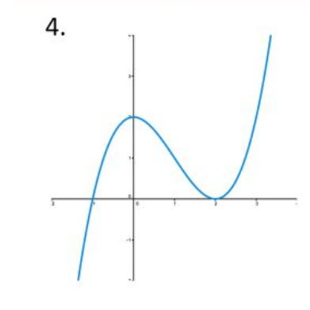

# Differentiable functions. 

This is a slideshow with audio.

CLICK to continue

#

## Idea: differentiable is nearly affine. 

$f(x) : x \mapsto f(x)$
<audio  data-autoplay >
<source src="today_in_class.mp3" >
</audio>

#

##  Graph of the function

<audio  data-autoplay >
<source src="lets_draw_a.mp3" >
</audio>

#

##  Graph of the function

<audio  data-autoplay >
<source src="so_this_is.mp3" >
</audio>

#

##  Graph of the function

<audio  data-autoplay >
<source src="lets_choose_a.mp3" >
</audio>
