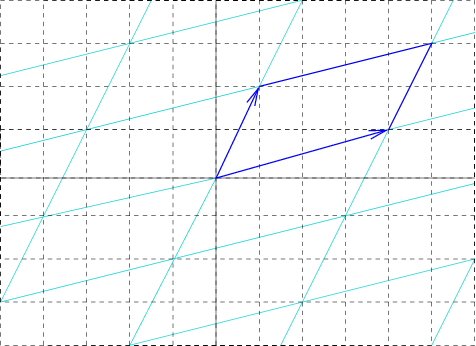
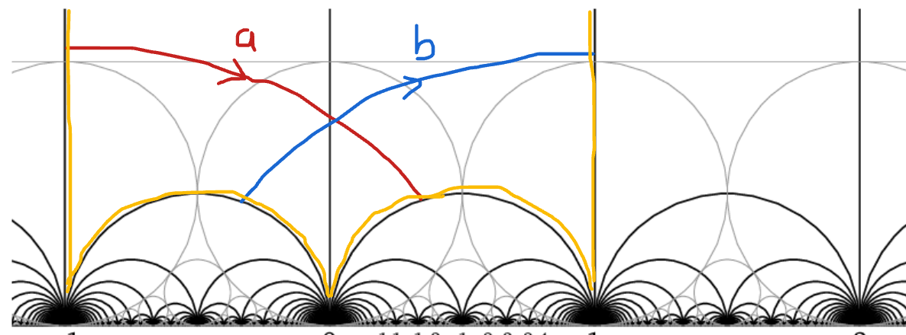

%Part 2
%greg mc
%May 2021

#
### Contents

- Character variety
- Norms and counting
- Proof of Aigner
- Proof by snakes
- More lengths

#
## Character variety

H. Cohn, Approach to Markov’s Minimal Forms Through Modular Functions (1955)

- modular torus = quotient of upper half plane $\mathbb{H}$ by  $\Gamma$ = commutator subgroup of $PSL(2,\mathbb{Z})$, acting by Mobius transformations
-  relates Markoff numbers to lengths of simple closed geodesics

#
## Back to the Torus

- $\mathbb{Z}^2$ acting on $\mathbb{R}^2$ by translation
- quotient space (orbit space) is a euclidean torus
- primitive elements $(p,q)\in \mathbb{Z}^2$ 
- $\rightarrow$ closed curve on torus = $(p,q)$ curve
- (usual) length $=\|(p,q)\| = \sqrt{p^2 + q^2}$

#

## Usual Torus

#

## Torus

- $\mathbb{Z}^2$ acts by translation in lots of different ways
- translation lengths of $(1,0),(0,1),(1,-1)$ determine (up to conjugation)
- the representation $\mathbb{Z}^2 \rightarrow \text{isom}(\mathbb{R}^2)$
- length of $(p,q)$ curve given by quadratic form 

#

representation $\mathbb{Z}^2 \rightarrow \text{isom}(\mathbb{R}^2)$

#

representation $\mathbb{Z}^2 \rightarrow \text{isom}(\mathbb{R}^2)$

#
### Threes, triangles, tori

- 3 side lengths determine a triangle
- need 3 numbers to build a euclidean torus
- what about the 3 Markoff numbers ?
- can build a hyperbolic punctured torus
- no simple formula for length of $(p,q)$ curve

#

- modular torus = quotient of upper half plane $\mathbb{H}$ by  $\Gamma$ = commutator subgroup of $\text{PSL}(2, \mathbb{Z})$, acting by Mobius transformations
- hyperbolic torus = quotient of upper half plane $\mathbb{H}$
by  $\Gamma = \rho(\mathbb{Z}*\mathbb{Z})$, 
- $\rho:\mathbb{Z}*\mathbb{Z}\rightarrow\text{PSL}(2, \mathbb{R})$ discrete
    faithful

#
## Flat torus

#
## Punctured torus

# 

[Geometry of the Markoff
numbers](https://www.researchgate.net/publication/226685228_The_geometry_of_markoff_numbers){target="_blank"}

#

$\rho:\mathbb{Z}*\mathbb{Z}\rightarrow\text{PSL}(2, \mathbb{R})$ 

- lifts to 
 $\hat{\rho}:\mathbb{Z}*\mathbb{Z}\rightarrow\text{SL}(2, \mathbb{R})$ 
- character map $\chi : \rho \mapsto ( tr \hat{\rho}(a),  tr \hat{\rho}(b),  tr \hat{\rho}(ab) )$
- $a,b$ generators of the free group = fundamental group of the torus.

#
Traces behave "like squares of translation lengths"

- [parallogram
    law](https://en.wikipedia.org/wiki/Parallelogram_law){target="_blank}
- $b\in SL(2,\mathbb{C}),\,b^2 - (tr b)b + I_2 = 0$ 
- (Cayley-Hamilton) $\Rightarrow$
- $tr ab  + tr ab^{-1} = (tr a) (tr b)$

#

## Markoff cubic from the puncture 

Loop round the puncture $aba^{-1}b^{-1}$

- isn't trivial but it's special (parabolic)
- corresponding matrix something like 
- $\begin{pmatrix} \pm 1 & 6 \\ 0 & \pm 1 \end{pmatrix}$ 

#

## puncture condition 

$tr \hat{\rho} (aba^{-1}b^{-1}) = -2$

- $(x,y,z) =  ( tr \hat{\rho}(a),  tr \hat{\rho}(b),  tr \hat{\rho}(ab) )$
- $x^2 + y^2 + z^2 - x y z = 2 + tr \hat{\rho} (aba^{-1}b^{-1})=0.$
- = Markoff cubic up to a change of variable

#
## "inverse" character map 

Section: character variety to representation variety

 $\begin{pmatrix}  x & -1 \\ 1 & 0 \end{pmatrix}$ 
 $\begin{pmatrix}  0 &  \eta \\ -\eta^{-1} & y \end{pmatrix}$ 

$z = \text{trace of  product} = \eta + \eta^{-1}$

#

Cohn shows that 
the permutations and the Vieta flips
used to construct Markov's binary tree
are induced by automorphisms of the
fundamental group of the torus.

#### Exo

- Nielsen move $(a,b,ab) \mapsto (a, b^{-1}, ab^{-1})$
- $tr ab  + tr ab^{-1} = (tr a) (tr b)$

#
## Counting problem

$N(t) =$ number of Markoff numbers $\leq t$

- $N(t) = C (\log(3t))^2 + O(\log t)$
- Zagier (1982) [On the Number of Markov Numbers Below a Given Bound.](https://www.ams.org/journals/mcom/1982-39-160/S0025-5718-1982-0669663-7/S0025-5718-1982-0669663-7.pdf) 
- Greg McShane, Igor Rivin [A norm on homology of surfaces and counting simple geodesics](https://arxiv.org/abs/math/0005222){target="_blank"} 

#
### Counting closed simple geodesics

- character map $\chi : \rho \mapsto ( tr \hat{\rho}(a),  tr \hat{\rho}(b),  tr \hat{\rho}(ab) )$
- $a,b$ generators  fundamental group of the torus.
- $a$ generator iff $\exists$ essential simple  closed curves representing its conjugacy class

#
### Simple representatives

#
### Simple representatives in homology

$\phi :  \mathbb{Z}*\mathbb{Z} \rightarrow \mathbb{Z}^2 \simeq
H^1(T,\mathbb{Z})$
abelianizing homomorphism.

- generators $\in \mathbb{Z}*\mathbb{Z}$  $\mapsto$ primitive  $\in \mathbb{Z}^2$.
- $(p,q) \in \mathbb{Z}^2$  primitive $\Leftrightarrow p,q$ coprime.

#
### La norme

Let $c$ be an essential closed curve $\ell_c$ its length.

$\gamma \in H^1(T,\mathbb{Z}), \, \| \gamma \| := \inf_{ c \in \gamma} \ell_c/2$

- convexity/triangle inequality
- any pair of curves in linearly independent homology classes intersect
- a curve with self intersections is never a minimizer

#

#

more formally from our paper

#
## Unit ball

#
## Corollary

The length function does not coincide with any reasonable function

- not differentiable at rational slopes
- is well approximated by piecewise linear

#
### Unit ball and counting

- $\sharp \{ \gamma,\, \| \gamma \| \leq t \} \sim \text{area unit ball}\times t^2$ 
- $\sharp \{ \gamma \text{ primitive},\, \| \gamma \| \leq t \} \sim \frac{6}{\pi^2}\text{area unit ball}\times t^2$ 
- the area of the unit ball depends on the hyperbolic structure
- with Rivin we studied it, but now it's called the Mirzakhani function :(
- $\frac{6}{\pi^2}$ = [proba 2 random integers
    coprime](https://hal.archives-ouvertes.fr/hal-01413829/document){target="_blank"}

#
## Why log ?
$N(t) = C (\log 3 ))^2 + O(\log t)$

- $m_{p/q} = \frac13 tr \hat{\rho}( \gamma_{p/q})$
- $= \frac23 \cosh\left(\frac{\ell_{\gamma_p}}{2} \right)$
- $= \frac23 \cosh(\| (q,p) \|_s)$

#
## Aigner's conjectures 

#
## Aigner's conjectures 

Let $p, q$ be real non negative numbers and $i > 0$ then

- $\|(q,p) \|_s < \|(q + i,p) \|_s$
- $\|(q,p) \|_s < \|(q ,p +i ) \|_s$
- If in addition $p < q$ then
$\|(q ,p  ) \|_s < \|(q + i ,p -i ) \|_s$

#
## Aigners conjectures proof

#
##

[source](https://arxiv.org/pdf/2010.13010.pdf){target="_blank"}

#
## Pair of pants

- coprime $(p,q) \mapsto w_{p,q} \in \langle a,b \rangle$
- extend length from $\mathbb{Z}^2$ to $\mathbb{R}^2$ 
- technically, can be done in general using immersed train tracks

#
## Goldman integer pts, orbifolds

$x^2 + y^2 + z^2 - x y z = 20.$

- different $GL(2,\mathbb{Z})$ orbts
- (2,2,-2) three punctured sphere
- (0,3,1) orbifold, disc with 2 cone points
- (0, 4,2) orbifold, punctured disc one cone point

#
## Three punctured sphere

#
## Pair of pants

$x^2 + y^2 + z^2 - x y z \geq  20.$

#
## (0,4,2) orbifold

#
## (0,3,1) orbifold

#
## 

# Thanks

