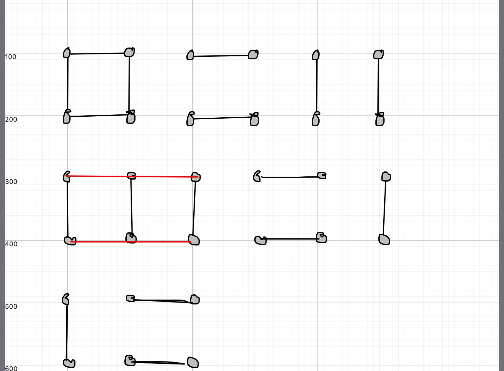
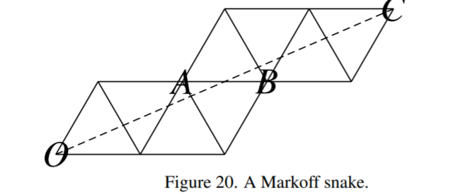
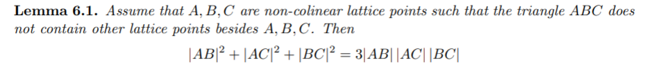
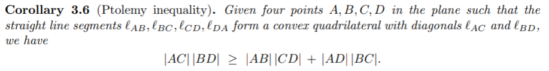

#

# Matchings and snakes

- [Jim Propp](http://faculty.uml.edu/jpropp/){target="_blank"}
- [Ralph Schiffler](https://schiffler.math.uconn.edu/){target="_blank"}
- plus many coauthors of both
- a new notion of length ?

#
## length

$(p,q)$ curve

- $\sqrt p^2 + q^2$
- $|p| + |q|$
- $\ell_w$
- complexity of another object ?

# 

A matching of a graph G is a set of pairwise non-adjacent edges, none of which are loops.

A perfect matching matches all vertices of the graph.

#

#
## Matching polynomial

5 perfect matchings

- $x^4 + y^4 + x^2z^2 + 2x^2y^2$
- match $\rightarrow$ monomial=product of labels 

#

13 perfect matchings

[src](https://arxiv.org/pdf/math/0511633.pdf){target="_blank"}

#
## Snake graph from primitive 

$A=(1,1)$,
$B=(2,1)$,
$C=(3,2)$

#
## Positivity conjecture

- [cluster algebras](https://en.wikipedia.org/wiki/Cluster_algebra){target="_blank"}
- seed is like a Markoff triple $(x,y,z)$
- mutation is like a Vieta flip
- Markoff number $\rightarrow$ Laurent polynomial 
- proof (idea) : coeffs are coeffs of the snake polynomial

#
## Positivity conjecture

- [cluster alg. from surfaces](https://www.sciencedirect.com/science/article/pii/S0001870811001423){target="_blank"}
- [general case](https://annals.math.princeton.edu/wp-content/uploads/Lee_Schiffler.pdf){target="_blank"}

#
## Markoff numbers

$A,B \in \mathbb{Z}^2$ 
$|AB|=$ number perfect matchings for associated snake graph

[src](https://arxiv.org/pdf/2010.13010.pdf)

#
## Ptolemy inequality

#

