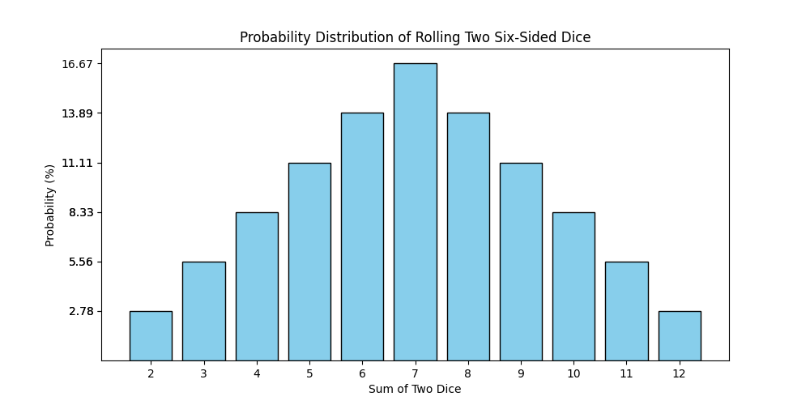

# Rolling dice

Here’s a table showing the possible outcomes when rolling two six-sided dice. The rows represent the result of the first die, and the columns represent the result of the second die. Each cell contains the sum of the two dice.

| 🎲1\🎲2 | 1  | 2  | 3  | 4  | 5  | 6  |
|--------|----|----|----|----|----|----|
| **1**  | 2  | 3  | 4  | 5  | 6  | 7  |
| **2**  | 3  | 4  | 5  | 6  | 7  | 8  |
| **3**  | 4  | 5  | 6  | 7  | 8  | 9  |
| **4**  | 5  | 6  | 7  | 8  | 9  | 10 |
| **5**  | 6  | 7  | 8  | 9  | 10 | 11 |
| **6**  | 7  | 8  | 9  | 10 | 11 | 12 |

Each sum appears with different probabilities, with 7 being the most common outcome. Let me know if you need additional details! 🎲

Sure! Here's a more detailed breakdown of the possible outcomes when rolling two six-sided dice.

### **Understanding the Table**
- The **rows** represent the result of rolling the first die (1–6).
- The **columns** represent the result of rolling the second die (1–6).
- Each cell in the table contains the **sum** of the two dice.

### **Expanded Table of Outcomes**
| 🎲1\🎲2 | **1** | **2** | **3** | **4** | **5** | **6** |
|--------|------|------|------|------|------|------|
| **1**  | **2**  | 3  | 4  | 5  | 6  | 7  |
| **2**  | 3  | **4**  | 5  | 6  | 7  | 8  |
| **3**  | 4  | 5  | **6**  | 7  | 8  | 9  |
| **4**  | 5  | 6  | 7  | **8**  | 9  | 10 |
| **5**  | 6  | 7  | 8  | 9  | **10** | 11 |
| **6**  | 7  | 8  | 9  | 10 | 11 | **12** |

### **Probability of Each Sum**
Since each die has 6 sides, there are **6 × 6 = 36 total possible outcomes**. Some sums occur more frequently than others:

| **Sum** | **Ways to Get It** | **Probability** |
|---------|------------------|--------------|
| **2**  | (1,1)  | **1/36** ≈ 2.78% |
| **3**  | (1,2), (2,1)  | **2/36** ≈ 5.56% |
| **4**  | (1,3), (2,2), (3,1)  | **3/36** ≈ 8.33% |
| **5**  | (1,4), (2,3), (3,2), (4,1)  | **4/36** ≈ 11.11% |
| **6**  | (1,5), (2,4), (3,3), (4,2), (5,1)  | **5/36** ≈ 13.89% |
| **7**  | (1,6), (2,5), (3,4), (4,3), (5,2), (6,1)  | **6/36** ≈ 16.67% |
| **8**  | (2,6), (3,5), (4,4), (5,3), (6,2)  | **5/36** ≈ 13.89% |
| **9**  | (3,6), (4,5), (5,4), (6,3)  | **4/36** ≈ 11.11% |
| **10** | (4,6), (5,5), (6,4)  | **3/36** ≈ 8.33% |
| **11** | (5,6), (6,5)  | **2/36** ≈ 5.56% |
| **12** | (6,6)  | **1/36** ≈ 2.78% |

### **Key Takeaways**
- The most common sum is **7**, occurring **16.67%** of the time.
- The least common sums are **2 and 12**, each occurring **2.78%** of the time.
- The probabilities are **symmetrical**, meaning sums on opposite ends (e.g., 3 & 11, 4 & 10) have the same likelihood.

Would you like a visual representation, such as a probability chart? 😊

