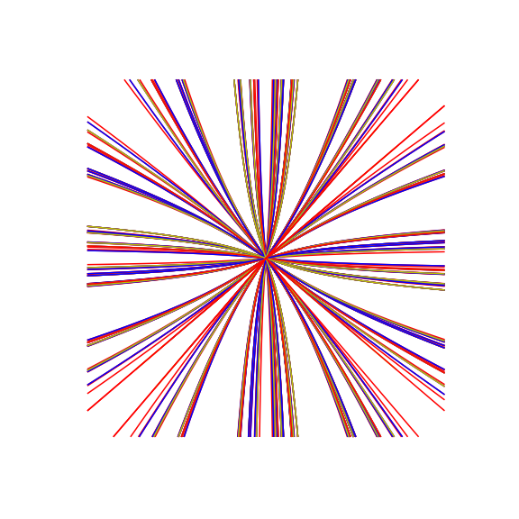

# Greg McShane

### Bureau 328, Institut Fourier.
### mcshane@univ-grenoble-alpes.fr


- this page wasn't getting updated over Xmas due to a problem with a copy of the [reveal.js repo](https://revealjs.com/) that I had (stupidly) uploaded.
- I am currently back from sick leave with a broken shoulder.
- I am very busy with refereeing

---


---

# Teaching 2021-22

<!-- [More details](teaching.md) -->


## Second semester

### MNUM 

Fridays 13h45 salle CARISM RdC.

1. I **prefer** if you bring your own computer as
it's not hygienic to use the computers in the room.
1. there will be a break at 15h30 for 15 minutes to ventilate the room.

- [F1](./METH_NUM/1_feuille_flottant.pdf)
	- 21/1 exos 1, 3 et 5  [correction](./METH_NUM/TP_1_corr.pdf) and [my brouillon](./METH_NUM/TP1.ipynb)
	- 28/1 exos 6,7 et 8

#### notes

Two examples where binary (base 2) arithmetic is best:
- [modexp](https://github.com/secworks/modexp/blob/master/src/model/python/modexp.py)
- [Q_rsqrt](https://en.wikipedia.org/wiki/Fast_inverse_square_root)

Horner should look like this in Python:
```
def horner(x, P):
    val = 0
    for coeff in reversed(P):
        val *= x
        val += coeff
    return val
```

---

## First semester

### introduction à la programmation 

This course has finished we did some interesting things.

<!-- #### Mastermind -->

#### Conway's life on a torus

This is an amusing demonstration of how using a convolution to do something is
just the right thing to do. There is  a **pytorch** implementation somewhere.

<center>

</center>

simulation of an epidemic the particles follow a random walk....

<center>

</center>

---

### MAT305 

Math for second year chemists [archived](./MAT305_index.md)

---

<!-- ## Stages/TER -->

<!-- but if you are looking fora stage M2R they are here: -->

<!-- - [non orientable surfaces](./stage_m2r_2020.md) -->
<!-- - [statistics closed geodesics](./stage_m2r_2020_bis.md) -->

<!-- or a TER -->

<!-- - [quadratic reciprocity](./TER.md) -->
<!-- - [Riemann mapping](./TER2.md) -->

<!-- --- -->

# What (else) do I do?

- Ex directeur de [GDR TRESSES](http://tresses.math.cnrs.fr)
- Editor [Annales de l'Institut Fourier](http://aif.cedram.org/?lang=fr)
- Principal investigator l'equipe action ```ToFu```
- Local coordinator [federation RAA](http://frmraa.math.cnrs.fr/)
- Member of the Conseil de l'UFR IMAG2
- [CV](https://www-fourier.ujf-grenoble.fr/~mcshane/TEXTS/cv2016.pdf)
- [research statement](https://www-fourier.ujf-grenoble.fr/~mcshane/TEXTS/research%20statement.pdf)
- [my github account](https://github.com/macbuse)

### seminars I go to

Basically if you are looking for me on a Thursday well....forget it

- Thursdays 10h30 [Seminaire francophone](https://www-fourier.univ-grenoble-alpes.fr/seminaire-gg/?q=seances)
- Thursdays 14h TSG Grenoble
- Thursdays 15h CMSA Interdisciplinary Science Seminar
- Thursdays 16h [Geometry and Topology Online](http://homepages.warwick.ac.uk/~masgar/Seminar/current_seminar.html)

## and a little more...

I am a (low dimensional) topologist a subject which has it's origins in the
<a href="http://analysis-situs.math.cnrs.fr/"> work of the French mathematician Henri Poincaré</a>.
Recently I have been doing a lot of

- [topology and WebGL](https://www-fourier.ujf-grenoble.fr/~mcshane/3D/alexanderSphere.html)
- [3D printing of fractals](https://github.com/macbuse/Mandelbrottle)

I was a member of ICERM at Brown University in 2019 participating in
<a href="https://icerm.brown.edu/programs/sp-f19/">Illustrating Math</a>
and visits to
-    Boston College
-    CUNY Graduate Center

Here is the [book](https://bookstore.ams.org/mbk-135)
that we wrote during the semester.

And where I got time to do write stuff forInkscape like this
<a href="https://inkscape.org/~macbuse/%E2%98%85apollonian-master">Apollonian Packings</a>

---

<center>
<p> This is what I look like <br>


<br>
IHP 2012 : La Maison des Maths
</p>
</center>


<p><a href="https://www-fourier.ujf-grenoble.fr/~mcshane/bestblackboards2015.html">More real math on blackboards</a></p>

---

<h1 id="research">Research</h1>

### Networks

- I am principal investigator [ToFu](https://persyval-lab.org/en/ToFu)
- I am an associate member of <a href="http://gear.math.illinois.edu">GEAR</a>
- I was <strong>director</strong> of the <a href="http://tresses.math.cnrs.fr">GDR des Tresses</a>

 <!-- <a href="https://github.com/macbuse/MATH/blob/master/conferences.md">Meetings in low dimensional topology and dynamics</a> -->

## Rencontres du GDR in 2020:

- <a href="http://winterbraids.math.cnrs.fr/">WINTERBRAIDS</a>
- Artin Groups, CAT(0) Geometry and Related Topics
- Teichmüller Theory: Classical, Higher, Super and Quantum 
- Complex Hyperbolic Geometry and Related Topic
- [ Conférence internationale à la mémoire de Patrick Dehornoy]( https://c.lmno.cnrs.fr/Braids2020)
   
<!-- ### Previous conferences -->

<!--  - <a href="http://winterbraids.math.cnrs.fr/archives/winterbraids8/"> WinterBraids VIII</a> -->
<!--  - <a href="https://tqft.sciencesconf.org/"> TQFT et Catégorification</a> -->
<!--  - <a href="https://conf.lmno.cnrs.fr/CRG/CRG_programme.html"> Complex Reflection Groups and their Braid Groups</a> -->
<!--   - <a href="https://if-summer2018.sciencesconf.org/"> Summer school Teichmüller dynamics, mapping class groups </a> -->
  
<!-- <ul> -->
<!--  <li>Journées Géométrie et Topologie ENS Lyon -->
<!--  <ul> -->
<!--   <li><a href="https://www-fourier.ujf-grenoble.fr/~mcshane/TEXTS/jdf2017.pdf"> Novembre 2017</a> </li> -->
<!--  <li> <a href="https://www-fourier.ujf-grenoble.fr/~mcshane/TEXTS/annonce-journee-20170614.pdf"> Juin 2017</a> -->
<!--  </li> -->
<!--  <li> <a href="http://math.univ-bpclermont.fr/~heusener/Lyon-dec2016/index.html"> Decembre 2016</a> </li> -->
<!--   </ul> -->
<!--  </li> -->
<!--  <li>Journees de doctorants du GdR TRESSES, 16-17/11/17</li> -->
<!--  <li> <a href="http://winterbraids.math.cnrs.fr/archives/winterbraids7/">WinterBraids VII</a></li> -->
<!--  <li> <a href = "http://scientific-events.weebly.com/1713.html">Teichmüller Space, Polygonal Billiard, Interval Exchanges CIRM</a></li> -->
<!--  <li> <a href = "https://minkowski-2017.sciencesconf.org/">Minkowski ? function, Grenoble</a> </li> -->
<!--  <li><a href="https://old.i2m.univ-amu.fr/~audoux/ToCQ.htm">Interactions Topologie/Codes quantiques, Marseille</a></li> -->
<!-- </ul> -->
<!-- --- -->

## Themes

- Teichmueller space
- Modular group actions
- Applications to low dimensional topology

This is a quasi-Fuchsian manifold:
 it's a basic kind of 3 manifold homeomorphic to the product of a surface and an interval together with a (non unique) choice of hyperbolic metric.
Togther with Prof. S. Kojima of TITEC we are working on applying
converegence results for quasi-Fuchsian manifolds and Teichmueller theory
to get information about closed hyperbolic manifolds.

<center>

</center>

With Bill Goldman and a couple of his ex students we have been working on a book that just got published <a href="https://www.amazon.com/Automorphisms-Two-generator-Isometric-Hyp:we/dp/1470436140">by the AMS</a>. Much of it is dedicated to explaining this picture of an invariant fractal in the character variety.


<center>
 
</center>


<h2 id="recentpreprints">Recent preprints</h2>

-  [On systoles and ortho spectrum rigidity](https://arxiv.org/abs/1909.09829)
-  [NORMALIZED ENTROPY VERSUS VOLUME FOR PSEUDO-ANOSOVS](https://www-fourier.ujf-grenoble.fr/~mcshane/TEXTS/entropy.pdf)
-  [EQUIDECOMPOSABILITY, VOLUME FORMULAE AND ORTHOSPECTRA](https://www-fourier.ujf-grenoble.fr/~mcshane/TEXTS/CalegariBridgeman7.pdf)
-  [GEOMETRIC IDENTITIES](https://www-fourier.ujf-grenoble.fr/~mcshane/TEXTS/Kokyuroku_mcshane.pdf)

---
---

## Talks

Talks are [Reveal.js](https://revealjs.com/) slides 
- blue arrows = next/previous
- esc-key foroverview
- blue text is a link to a resource on the web

---

- [Tokyo 7/12]( ./GRENOBLE/short.html)
- [Toulouse 9/11]( ./GRENOBLE/web.html)
- [Grenoble 8/10](./GRENOBLE/web.html)


- **Glasgow 7/6**
  - [part 1](./GLASGOW/intro.html)
  - [part 2](./GLASGOW/hyperbolic.html)
  - [annex: snakes etc](./GLASGOW/perf.html)
  - [annex: non convexity](./GLASGOW/non_convex.html)


- **Tokyo 3/6** (Geometry of discrete groups and hyperbolic spaces)
  - [talk 1](./TOKYO/intro.html)
  - [talk 2](./TOKYO/hyperbolic.html)
  - [annex: snakes etc](./TOKYO/perf.html)

- **Warwick 28/5** (Colloquium)
- [Nantes 18/3](./NANTES/slides.html)
- [HARVARD 18/12/20](./HARVARD/slides.html)

---

# FabLab

[stages](https://www-fourier.ujf-grenoble.fr/~mcshane/stagiaresdetroisime.html)

From March 2014 I've also been working with the [fablab MSTIC](http://fabmstic.liglab.fr/) 
making mathematical curiosities from wood.
I'm mainly interested in constructing geometric objects in wood using kerf
bending patterns. Wood prepared using a laser cutting machine can be bent and
joined to like a 3 dimensional jigsaw puzzle.

<center>
 
 
</center>

In November 2014 I was invited to take part in
a workshop forarchitectural students
 [ Architect 2.0 Grenoble](http://lcv.hypotheses.org/9187)
to explain the techniques and possibilities.

<center>


</center>

## Finally (you can skip)

After being abused by [ed](https://www.gnu.org/software/ed/) as a teenager I've recently converted to  the church of [neovim](https://neovim.io/)

- [the pope](https://github.com/tpope)
- [the primate/bishop](https://github.com/ThePrimeagen)
- [heretics/future](https://github.com/nvim-treesitter/nvim-treesitter)

[why ?](church)
