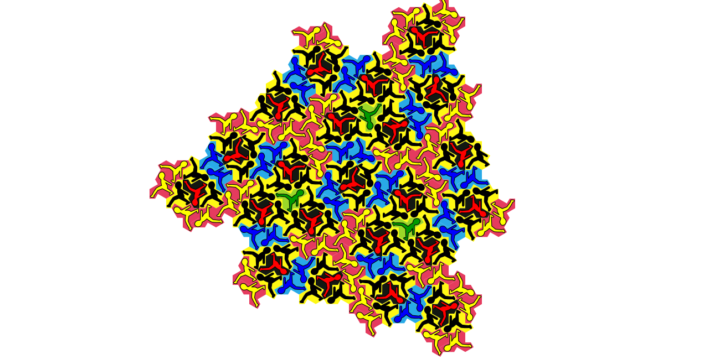
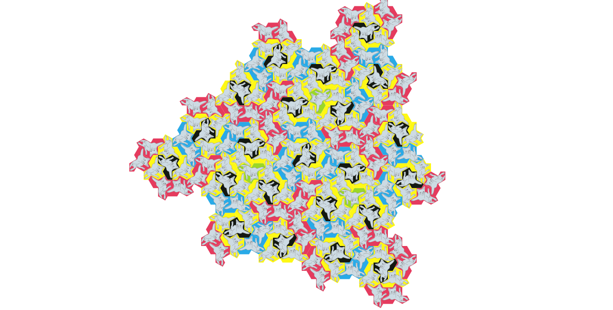
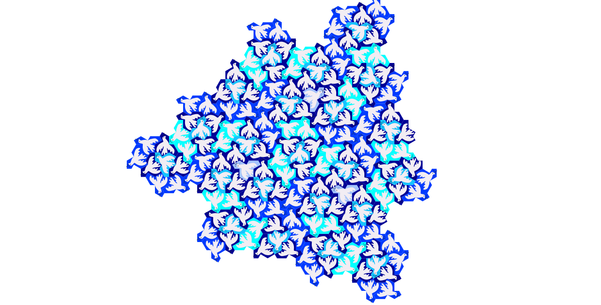
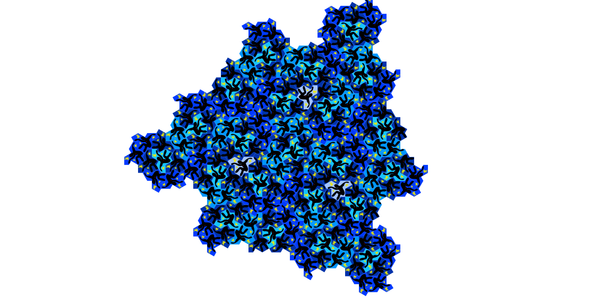

# Greg McShane

### Bureau 328, Institut Fourier.
### mcshane@univ-grenoble-alpes.fr

- [CV french](./CV2024.pdf)


You [should](./bourses.md) be able to find out about my research and teaching here. But if you need a CV for some reason (grant applications, invitations etc) then here is a [CV](./CV.pdf). Just in case you are wondering why this page is on GitHub [read this](https://www.netlify.com/blog/2021/08/31/how-git-can-power-an-exciting-future-for-content-management/) and here are  [my github repos](https://github.com/macbuse) I've just added a [new repo](https://github.com/macbuse/FAREY_DIAGRAM/tree/main) for a project I'm working on with a student.

Went to  Singapore for the [meeting on thin groups](https://ims.nus.edu.sg/events/computational-aspects-of-thin-groups/) 3/6/2024-14/6/2024. On Friday 14/6 I'll be giving a talk 

- [Slides: Automorphisms and elementary number theory](./TIT2023/singapore.html).

---


 I went to Oxford in January to give a talk in the topology seminar and I was supposed to go to San Francisco in January to give a talk in a special session on Markoff numbers at the AMS meeting but this got cancelled because of **Notilus**.

- [Oxford talk slides ](./TIT2023/oxford.html)
- then I organised  Zhang Yibo's [thesis defence](https://www-fourier.ujf-grenoble.fr/?q=fr/content/4-manifolds-admitting-fibrations) 5/4/2024.
- I was president of Andrea Seppi's [HDR jury](https://www-fourier.univ-grenoble-alpes.fr/?q=fr/content/probl%C3%A8mes-de-plateau-asymptotiques-leurs-g%C3%A9n%C3%A9ralisations-et-applications-aux-structures) 25/4/2024.
- working on a [draft of work in progress](./QUADS/x2.pdf)
- working on a [thinking about Diophantine triples](./triples.pdf)

<!-- - I am currently in confinement with COVID -->
<!-- - This week I'm sad :( because Copilot is out of beta preview. -->
<!-- - I am very busy with refereeing -->
<!-- - I did a [stage ](./STAGE/web.html) high school students. -->
<!-- - this page wasn't getting updated over Xmas due to a problem with a copy of the [reveal.js repo](https://revealjs.com/) that I had (stupidly) uploaded. -->

---

<h1 id="teaching">Teaching 2024-25</h1>

### First semester

<!-- [More details](teaching.md) -->

#### MAT 102

- [web page for class](./MAT102/index.md)
- First class: 11/9
    - Wednesdays 11h30
    - Friday 13h30

#### MAT305

- [web page for class](./MAT305/index.md)
- First class: 10/9
    - Tuesdays 8:00 
    - Wednesdays 9:45


### Second semester

- Magistère Algebraic Topology 
- L3 Differential Geometry


---


<h1 id="research">Research</h1>

- I am principal investigator [ToFu](https://persyval-lab.org/en/ToFu)
- I am also co director of the thesis of [Zhang Yibo](https://sites.google.com/view/yibozhang) financed by ToFu/[Persyval Lab](https://persyval-lab.org/)
- I organised a [special session](./schedule_amssmf.md) **AMS-EMS-SMF** Joint International Meeting in July also funded by ToFu/[Persyval Lab](https://persyval-lab.org/)
	<!-- - [event programme](https://ams-ems-smf2022.inviteo.fr/index.php?langue=en&onglet=11&acces=&idUser=&emailUser=&messageConfirmation=) -->
	<!-- - [special session schedule](./schedule_amssmf.md) -->

<!-- - I am an associate member of <a href="http://gear.math.illinois.edu">GEAR</a> -->
<!-- - I was <strong>director</strong> of the <a href="http://tresses.math.cnrs.fr">GDR des Tresses</a> -->
<!-- - I will probably attend [this conference](https://ms-math-computer.science/projects/dmv_math_art_22.html) on zoom. -->


#### What have I  been doing lately?


- Speaker [Oxford topology seminar](https://www.maths.ox.ac.uk/node/66487) 22 January 2024.

- Invited speaker special session on [Markoff
Numbers](https://meetings.ams.org/math/jmm2024/meetingapp.cgi/Session/7957) at the AMS
meeting San Francisco January 2024.


Last summer I was travelling in Japan visiting TiTech and Rims

* [Serfest talk RIMS](./KYOTO/kyoto.html)
* [TITECH talk 28 July](./TIT2023/tokyo.html)


I am always working on the geometry of surfaces and its relations with number theory here are some preprints.

<!-- -  [Markov uniqueness, pants and the Bunyakovsky conjecture](./uniqueness.pdf) -->
- [Isospectral configurations in Euclidean and Hyperbolic Geometry](./MC0726.pdf)
-  [Eisenstein integers and equilateral ideal triangles](./eisenstein.pdf)
-  [Geometry of Fermat’s sum of squares](./squares.pdf)
-  [Convexity and Aigner's Conjectures](https://arxiv.org/pdf/2101.03316.pdf)
-  [On systoles and ortho spectrum rigidity](https://arxiv.org/abs/1909.09829)
# What (else) do I do?

- Editor [Annales de l'Institut Fourier](http://aif.cedram.org/?lang=fr)
- Principal investigator l'equipe action ```ToFu``` [persyval-lab](https://persyval-lab.org/)
- member of the [IRGA](https://www.univ-grenoble-alpes.fr/universite/ambition-et-strategie/l-initiative-d-excellence-idex/les-appels-a-projets/appel-a-projets-initiatives-de-recherche-a-grenoble-alpes-irga-2024-1298254.kjsp) committee pole MSTIC

- Member of the Conseil de l'UFR IMAG2
    - member of the commission de la recherche de l'UFR IMAG2

- Local coordinator [federation RAA](http://frmraa.math.cnrs.fr/)
**Paperwork**

- Ex directeur de [GDR TRESSES](http://tresses.math.cnrs.fr)
- [CV](./CV.pdf)
- [research statement](https://www-fourier.ujf-grenoble.fr/~mcshane/TEXTS/research%20statement.pdf)

### seminars I go to

Basically if you are looking for me on a Thursday well....forget it!

- Thursdays 10h30 [Seminaire francophone](https://www-fourier.univ-grenoble-alpes.fr/seminaire-gg/?q=seances)
- Thursdays 14h TSG Grenoble
- Thursdays 15h CMSA Interdisciplinary Science Seminar
- Thursdays 16h [Geometry and Topology Online](http://homepages.warwick.ac.uk/~masgar/Seminar/current_seminar.html)

## and a little more...

I am a (low dimensional) topologist a subject which has it's origins in the
<a href="http://analysis-situs.math.cnrs.fr/"> work of the French mathematician Henri Poincaré</a>.
I am interested in visualisation and computation in mathematics 

- [topology and WebGL](https://www-fourier.ujf-grenoble.fr/~mcshane/3D/alexanderSphere.html)
- [3D printing of fractals](https://github.com/macbuse/Mandelbrottle)
- [mathematical art](https://www-fourier.ujf-grenoble.fr/~mcshane/IMAGES/)

I was a member of ICERM at Brown University in 2019 participating in
<a href="https://icerm.brown.edu/programs/sp-f19/">Illustrating Math</a>
and visits to
-    Boston College
-    CUNY Graduate Center

Here is the [book](https://bookstore.ams.org/mbk-135) that we wrote during the
semester.

And where I got time to do write stuff forInkscape like this
<a href="https://inkscape.org/~macbuse/%E2%98%85apollonian-master">Apollonian Packings</a>

--- 

I am also am/was a beta tester for :
- [GitHub Copilot](https://github.com/features/copilot)
- [Neovim](https://neovim.io/)
- [Marp](https://marp.app/)
- [Inkscape](https://inkscape.org/)
- [Blender](https://www.blender.org/)

(actually Copilot is out of beta now and completed most of the above
list)


---

#### This is what I look like 

<center>


</center>

**IHP 2012 : La Maison des Maths**

<p><a href="https://www-fourier.ujf-grenoble.fr/~mcshane/bestblackboards2015.html">More real math on blackboards</a></p>

---


### Research Networks

- principal investigator [ToFu](https://persyval-lab.org/en/ToFu)
- am an associate member of <a href="http://gear.math.illinois.edu">GEAR</a>
-  **ex director** of the <a href="http://tresses.math.cnrs.fr">GDR des Tresses</a>

 <!-- <a href="https://github.com/macbuse/MATH/blob/master/conferences.md">Meetings in low dimensional topology and dynamics</a> -->

### Rencontres du GDR in 2020:

When I was director of the GDR Tresses we organised a number of meetings even during the pandemic.

- <a href="http://winterbraids.math.cnrs.fr/">WINTERBRAIDS</a>
- Artin Groups, CAT(0) Geometry and Related Topics
- Teichmüller Theory: Classical, Higher, Super and Quantum 
- Complex Hyperbolic Geometry and Related Topic
- [ Conférence internationale à la mémoire de Patrick Dehornoy]( https://c.lmno.cnrs.fr/Braids2020)
   
<!-- ### Previous conferences -->

<!--  - <a href="http://winterbraids.math.cnrs.fr/archives/winterbraids8/"> WinterBraids VIII</a> -->
<!--  - <a href="https://tqft.sciencesconf.org/"> TQFT et Catégorification</a> -->
<!--  - <a href="https://conf.lmno.cnrs.fr/CRG/CRG_programme.html"> Complex Reflection Groups and their Braid Groups</a> -->
<!--   - <a href="https://if-summer2018.sciencesconf.org/"> Summer school Teichmüller dynamics, mapping class groups </a> -->
  
<!-- <ul> -->
<!--  <li>Journées Géométrie et Topologie ENS Lyon -->
<!--  <ul> -->
<!--   <li><a href="https://www-fourier.ujf-grenoble.fr/~mcshane/TEXTS/jdf2017.pdf"> Novembre 2017</a> </li> -->
<!--  <li> <a href="https://www-fourier.ujf-grenoble.fr/~mcshane/TEXTS/annonce-journee-20170614.pdf"> Juin 2017</a> -->
<!--  </li> -->
<!--  <li> <a href="http://math.univ-bpclermont.fr/~heusener/Lyon-dec2016/index.html"> Decembre 2016</a> </li> -->
<!--   </ul> -->
<!--  </li> -->
<!--  <li>Journees de doctorants du GdR TRESSES, 16-17/11/17</li> -->
<!--  <li> <a href="http://winterbraids.math.cnrs.fr/archives/winterbraids7/">WinterBraids VII</a></li> -->
<!--  <li> <a href = "http://scientific-events.weebly.com/1713.html">Teichmüller Space, Polygonal Billiard, Interval Exchanges CIRM</a></li> -->
<!--  <li> <a href = "https://minkowski-2017.sciencesconf.org/">Minkowski ? function, Grenoble</a> </li> -->
<!--  <li><a href="https://old.i2m.univ-amu.fr/~audoux/ToCQ.htm">Interactions Topologie/Codes quantiques, Marseille</a></li> -->
<!-- </ul> -->
<!-- --- -->

## Themes

- Teichmueller space
- Modular group actions
- Applications to low dimensional topology

This is a quasi-Fuchsian manifold:
 it's a basic kind of 3 manifold homeomorphic to the product of a surface and an interval together with a (non unique) choice of hyperbolic metric.
Togther with Prof. S. Kojima of TITEC we are working on applying
converegence results for quasi-Fuchsian manifolds and Teichmueller theory
to get information about closed hyperbolic manifolds.

<center>

</center>

With Bill Goldman and a couple of his ex students we have been working on a
book that just got published 
<a href="https://www.amazon.com/Automorphisms-Two-generator-Isometric-Hyp:we/dp/1470436140">by the AMS</a>. 
Much of it is dedicated to explaining this picture of an invariant
fractal in the character variety.


<center>
 
</center>


<h2 id="recentpreprints"> Recent preprints</h2>

Mostly geometry of surfaces and (elementary) number theory.

- [Isospectral configurations in Euclidean and Hyperbolic
Geometry](./MC0726.pdf)
- [Convexity and Aigner's Conjectures](https://arxiv.org/pdf/2101.03316.pdf)
-  [EISENSTEIN INTEGERS AND EQUILATERAL IDEAL TRIANGLES](./eisenstein.pdf)
-  [GEOMETRY OF FERMAT’S SUM OF SQUARES](./squares.pdf)
-  [On systoles and ortho spectrum rigidity](https://arxiv.org/abs/1909.09829)

---

## Talks

Talks were [Reveal.js](https://revealjs.com/) slides till 2023
but I've switched to [Marp](https://github.com/marp-team/marp) but
it's  basically the same

- blue arrows = next/previous
<!-- - esc-key foroverview -->
- blue text is a link to a resource on the web


---

### 2024

* [Oxford topology seminar 22/1](./TIT2023/oxford.html)
* AMS special session 3/1

### 2023

* [Serfest talk RIMS](./KYOTO/kyoto.html)
* [TITECH talk 28/7](./TIT2023/tokyo.html)

### 2022


- [Beijing/Nankai 21/11]( ./GRENOBLE/web.html)

### 2021

- [Tokyo 7/12]( ./GRENOBLE/short.html)
- [Toulouse 9/11]( ./GRENOBLE/web.html)
- [Grenoble 8/10](./GRENOBLE/web.html)


- **Glasgow 7/6**
  - [part 1](./GLASGOW/intro.html)
  - [part 2](./GLASGOW/hyperbolic.html)
  - [annex: snakes etc](./GLASGOW/perf.html)
  - [annex: non convexity](./GLASGOW/non_convex.html)


- **Tokyo 3/6** (Geometry of discrete groups and hyperbolic spaces)
  - [talk 1](./TOKYO/intro.html)
  - [talk 2](./TOKYO/hyperbolic.html)
  - [annex: snakes etc](./TOKYO/perf.html)

- **Warwick 28/5** (Colloquium)
- [Nantes 18/3](./NANTES/slides.html)

### 2020

- [HARVARD 18/12/20](./HARVARD/slides.html)

---

# FabLab

[stages](https://www-fourier.ujf-grenoble.fr/~mcshane/stagiaresdetroisime.html)

From March 2014 I've also been working with the [fablab MSTIC](http://fabmstic.liglab.fr/) 
making mathematical curiosities from wood.
I'm mainly interested in constructing geometric objects in wood using kerf
bending patterns. Wood prepared using a laser cutting machine can be bent and
joined to like a 3 dimensional jigsaw puzzle. [collection of pieces](https://www-fourier.ujf-grenoble.fr/~mcshane/SVGS/)

<center>
 
 
</center>

In November 2014 I was invited to take part in
a workshop forarchitectural students
 [ Architect 2.0 Grenoble](http://lcv.hypotheses.org/9187)
to explain the techniques and possibilities.

<center>


</center>

#### What I'm doing this week

<!-- - [frieze patterns](./frieze.pdf) -->
<!-- - [tea pots](./PROG/thurston_bonsai.html) -->
<!--  -->
- [newton fractals](./PROG/newton_frac.html)
<!-- - back on [Copilot](https://github.com/features/copilot) -->
<!-- - thinking about projects like [magic squares](https://en.wikipedia.org/wiki/Magic_square#Method_of_superposition) -->

- thinking about  einsteins



more [here](./mono.md)

<!--  -->

<!--  -->
<!--  -->

<!-- ``` -->
<!-- # compare with -->
<!-- # https://scipython.com/book/chapter-6-numpy/examples/creating-a-magic-square/ -->
<!-- # which is (nearly) twice as long :( -->

<!-- def mk_magic_square(N=5, -->
<!--                     RANDOM=False): -->
    
<!--     seed_row = (N+1) * np.arange(0, N) + 1 -->
<!--     seed_row = np.roll(seed_row, N // 2) -->

<!--     ms =  np.zeros((N,N), dtype=int) -->
<!--     for k in range(0,N): -->
<!--         ms[k] = np.roll(seed_row, -k) + k * N -->  
    
<!--     ms = ms % N**2 -->
<!--     ms[ms == 0] = N**2 -->

<!--     if RANDOM : -->
<!--         V = np.identity(N, dtype=int) -->
<!--         np.random.shuffle(V) -->
<!--         ms = V @ ms -->
<!--     return  ms -->
<!-- ``` -->

---


<!-- ### MNUM --> 

<!-- - **Salle F217 batiment F** -->
<!-- - [page pour la classe](./mnum_index.md) -->
<!-- - First class: mercredi 18/1 ou  vendredi 20/1 -->

<!-- - mercredi 13h45 -->
<!-- - vendredi 13h45 -->


<!-- [Correction examen 19/5/2022]( ./METH_NUM/cf_2022.pdf) -->

<!-- ### Introduction à la programmation --> 

<!-- <!-1- - First class: 16/09 -1-> -->
<!-- - Fridays 13:45 -->
<!-- - [page for the class](./PROG/index.md) -->
<!-- <!-1- - If you are coming to this class then please install [Anaconda](https://www.anaconda.com/products/distribution). -1-> -->

<!-- Evaluation is by project. Here are some of the finished projects from 2020 and 2021: -->

<!-- 1. [sudoko with digit recognition](./STAGE/Sudoku_-_Sarah_Depernet.html) -->
<!-- 1. [labrinths on surfaces](./STAGE/projet-info_Abel-Douzal_Charles-Schwing-2021-2022.html) -->
<!-- 1. [labrinths classic](./STAGE/HARENG_L3A1.html) -->
<!-- 1. [Mastermind d'apres Knuth](./STAGE/Mastermind_projet_Touron_Camille_L3A-checkpoint.html) -->


<!-- Video of a 120-cell by Muaad Tamtam et Damis El Alami. -->

<!--  <video  id="my-player" class="video-js vjs-default-skin vjs-big-play-centered" controls="controls"  width="600"> -->
<!-- <source src="./PROG/120-cell.mp4" type="video/mp4"> -->
<!--  </video> -->


<!-- And this is something I learned to do by talking to the students (and going on forums). -->


### Simulation of an epidemic 

<!-- solving mazes with random walks -->
<!-- <iframe width="560" height="315" -->
<!-- src="https://www.youtube.com/embed/BvwgdrC8vlE" title="YouTube video player" -->
<!-- frameborder="0" allow="accelerometer; autoplay; clipboard-write; -->
<!-- encrypted-media; gyroscope; picture-in-picture" allowfullscreen></iframe> -->

- the particles follow a random walk.
- the yellow particles are infected
- contact between yellow and blue results in transmission

<center>

</center>

I embedded this in a [script with pygame too](./PROG/epidemic_sim.py)
- more complicated about 150 LOC.


---

<!-- ## Stages/TER -->

<!-- but if you are looking fora stage M2R they are here: -->

<!-- - [non orientable surfaces](./stage_m2r_2020.md) -->
<!-- - [statistics closed geodesics](./stage_m2r_2020_bis.md) -->

<!-- or a TER -->

<!-- - [quadratic reciprocity](./TER.md) -->
<!-- - [Riemann mapping](./TER2.md) -->

<!-- --- -->


## Finally (you can skip)

After being abused by [ed](https://www.gnu.org/software/ed/) as a teenager I've recently converted to  the church of [neovim](https://neovim.io/)

- [the pope](https://github.com/tpope)
- [the primate/bishop](https://github.com/ThePrimeagen)
- [heretics/future](https://github.com/nvim-treesitter/nvim-treesitter)

[this](./Artin-Cerf-Nielsen-apres_Athanase.pdf)
