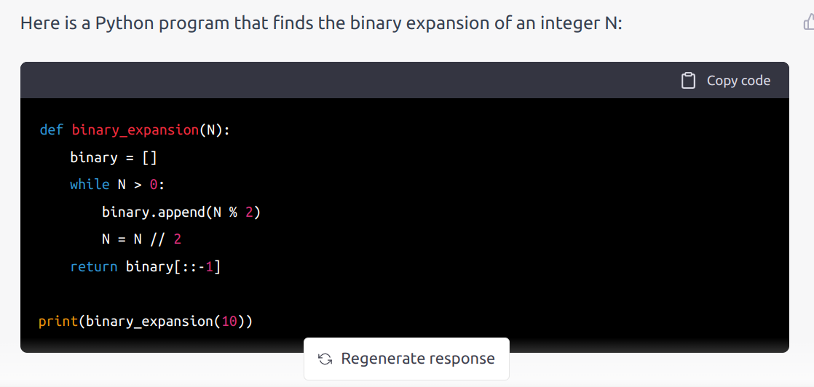

# MNUM

Salle F217 batiment F 

- mercredi 13h45
- vendredi 13h45

---

- Les feuilles sont en ligne  : cliquez sur F1 pour telecharger.
- C'est  plus facile: 
	- Si vous regardez les exos avant la classe.
	- Si vous venez avec votre propre ordinnateur et  Python 3.8

---

- [F1](./METH_NUM/1_feuille_flottant.pdf) Nombres flottants
   
    - [correction](./METH_NUM/1_feuille_flottant_corrigé.pdf) and [my brouillon](./METH_NUM/f1exo8.html)
	- **semaine 16/1** exos 1,3 et 5  
	- programmer l'algo  dans exo 1.1
	- programmer le calcul du [constant d'euler](https://fr.wikipedia.org/wiki/Constante_d%27Euler-Mascheroni) exo  3
	- programmer l'algo dans 5.1, Horner 5.2 et l'evaluation naive.
	- [correction](./METH_NUM/TP_1_corr.pdf) and [my solutions and comments](./METH_NUM/mnum_week1.html)
    
	- **semaine 23/1** exos 6,7 et 8 
    -  use  [scipy.integrate.quad](https://docs.scipy.org/doc/scipy/tutorial/integrate.html) to  calculate the value  of the integrals
    - [mon brouillon]( ./METH_NUM/mnum_week2.html)


	- **semaine 31/1** F1 exo  8, 

---

 - [F2](./METH_NUM/2_feuille_condition.pdf) Systèmes, conditionnement 
    - [correction](./METH_NUM/2_feuille_condition_corrige.pdf)

<br>

- **semaine 6/2** F2 exo  8, 9
    - mini CC de TP 30 minutes [sujet](./METH_NUM/sujet2_feb.html)
    - DS Exo 3 [sujet](./METH_NUM/cc1_2021_print.pdf)
	- **semaine 20/2** F2 exo  6, 7, 8, eventuellement 9
	- programmer cholesky
    - [mon brouillon](./METH_NUM/QR_etc.html)
    


- **semaine 27/2** 
    - programmer la decomposition QR 
        - avec [Gramm Schmidt](https://bdesgraupes.pagesperso-orange.fr/UPX/Master1/MNM1_seance_07_doc.pdf)
        - avec les matrices de Householder
    - Householder : utiliser l'exo 2 dans [ce sujet](./METH_NUM/cc1_2021_print.pdf)
    - [Calculer les valeurs propres](http://jaramillo.perso.math.cnrs.fr/Courses/MaSC4A/TD3.pdf) avec QR

        - [correction exo 2](./METH_NUM/cc1_2021.pdf)
        - [mon brouillon](./METH_NUM/QR_corr.html)

---

[F3](./METH_NUM/SRC/my_iter.pdf) Itération

- **semaine 6/3** 

   - Programmer Householder
   - F3 exos 1, 2, 3
   - [méthode de la puissance](https://www.bibmath.net/dico/index.php?action=affiche&quoi=./m/methodepuissance.html)
   - [mon brouillon](./METH_NUM/powers.html)

<br>

- **semaine 13/3** 

    - F3 exos 4, 5, 6, 7, 8
    - [methode de la puissance
      inverse](https://www.bibmath.net/dico/index.php?action=affiche&quoi=./m/methpuisinverse.html)

---

- [F4](./METH_NUM/3_feuille_interp.pdf)

```
##ATTENTION!!!
import numpy as np
import matplotlib.pyplot as plt

# polynomial class in one variable x
P = np.poly1d([1,1])
print(P)
```

-  **semaine 20/3**

	- programmation et plot du polynôme d'interpolation de Lagrange
	- 1) Par évaluation naïve des polynômes l_i de Lagrange
	- 2) En utilisant les différences divisées

    - [mon brouillon](./METH_NUM/Lagrange.html)


-  **semaine 27/3**
    - Exo 3
	- Exercice 5 : visualiser le [phénomène de Runge](https://en.wikipedia.org/wiki/Runge%27s_phenomenon)
    - Exos 6,7,8

<!-- 	- 25/3 [mon brouillon](./METH_NUM/Lagrange.html) -->
<!-- 	* utilisation des [abscisses de Tchebychev](https://en.wikipedia.org/wiki/Chebyshev_nodes) pour obtenir une convergence uniforme -->
<!-- 	* début de l'approximation : droite des moindres carrés -->
<!-- 	- 1/4 exos 3,7,9, 10 **controle de TP note** -->
<!-- 	- 8/4 exos 7,9, 10 et finir la feuille 3 -->
<!-- [correction F3](./METH_NUM/3_feuille_interp_corrige.pdf) -->



<!-- 	- 4/2 finir exo 8 ([convergence](https://www.maa.org/press/periodicals/loci/joma/iterative-methods-for-solving-iaxi-ibi-analysis-of-jacobi-and-gauss-seidel-methods) dans Jacobi) puis passer a F2 -->


---

## Controles  (2022)

Something  similar this  year but dates will change

	- 11/2 **controle de 20 minutes en classe**
	- 18/2 **DM en classe** [voici le sujet](./METH_NUM/cc1_2021_print.pdf) c'est le CC du mars 2021. Vous pouvez le faire en groupes.
	- [correction](./METH_NUM/cc1_2021_corr.pdf)


<!-- 		- Indication [you can find code here](https://www.quantstart.com/articles/QR-Decomposition-with-Python-and-NumPy/) there are some mistakes in the code fix them! -->
<!-- 	- 18/3 F1 Exo 8 --> 
<!-- 	* étudié numériquement le conditionnement A / h^2 + C --> 
<!-- 	* implémenté la résolution du système linéaire toukours de A / h^2 + C --> 
<!-- 	* méthodes itératives de Jacobi et Gauss Siedel (cf cours). -->


<!-- - [F5](./METH_NUM/5_feuille_int.pdf) -->
<!-- - [29/4] [mon brouillon]( ./METH_NUM/integration.html) -->

<!-- 1) Approximation d'une intégrale 1D par -->

<!-- * rectangle -->
<!-- * trapèze -->
<!-- * Simpson -->

<!-- 2) Étude d'ordres de convergence (1, 2 et 4)  <br> -->
<!-- 3) Méthode de Monte Carlo pour l'approximation d'une aire (disque dans un carré) -->


<!-- <!-1- [correction]( ./METH_NUM/ -1-> -->

<!-- --- -->

<!-- [F4](./METH_NUM/4_feuille_ode.pdf) -->

<!-- - 4/5 exos 2 et 4 [brouillon]( ./METH_NUM/euler_ode.html) -->

<!-- --- -->

<!-- ### Notes from previous week -->

<!-- ``` -->
<!-- def cholesky(A): -->
<!--     '''Performs a Cholesky decomposition --> 
<!--     A, which must be a symmetric and positive definite matrix. --> 
<!--     returns L = lower variant triangular matrix -->
<!--     such that A = L L^*''' -->
<!--     n = len(A) -->

<!--     # Initialise L as the zero matrix -->
<!--     L = np.zeros((n,n)) -->

<!--     for i in range(n): -->
<!--         # under the diagonal -->
<!--         for k in range(i): -->
<!--              # LaTeX: l_{ik} = \frac{1}{l_{kk}} \left( a_{ik} - \sum^{k-1}_{j=1} l_{ij} l_{kj} \right) -->
<!--             L[i,k] = (1.0 / L[k,k] * (A[i,k] -  L[i,:] @  L[k,:])) -->
        
<!--         # on the diagonal -->
<!--         # LaTeX: l_{kk} = \sqrt{ a_{kk} - \sum^{k-1}_{j=1} l^2_{kj}} -->
<!--         L[i,i] = sqrt(A[i,i] -  L[i,:] @  L[i,:]) -->

<!--     return --> 
<!-- ``` -->

<!-- 2) programmer la méthode QR  <br> -->
<!--    2.1 Utiliser la méthode QR pour [le calcul de valeurs propres](https://www.andreinc.net/2021/01/25/computing-eigenvalues-and-eigenvectors-using-qr-decomposition#:~:text=Even%20if%20it's%20not%20very,Q%20is%20an%20orthonormal%20matrix.) <br> -->
<!--    2.2 applications avec la matrice compagnon pour [la recherche de racines de polynomes](https://www.math.utah.edu/~gustafso/s2016/2270/labs/lab7-polyroot-qrmethod.pdf) <br> -->

<!-- ``` -->
<!-- def QR_householder(A): -->
<!--     '''Performs a Householder Reflections based QR decomposition --> 
<!--     of  A an np.array -->
<!--     Returns --> 
<!--     - Q, an orthogonal matrix -->
<!--     - R upper triangular matrix --> 
<!--     such that A = QR. -->
<!--     ''' -->
<!--     n = A.shape[0] -->
    
<!--     # base case 1x1 matrix do nothing -->
<!--     if  n == 1 : return [1], A -->
    
<!--     R = A.copy() -->
  
<!--     # get the vectors x, e and the scalar alpha -->
<!--     x = R[:,0] -->
<!--     e_0 = np.identity(n)[0] -->
<!--     alpha = -np.sign(x[0]) * np.linalg.norm(x) -->

<!--     u = x + alpha*e_0 -->
<!--     v = u/np.linalg.norm(u) -->

<!--     # matrix of the reflection x -> x - 2<v,x>v -->
<!--     Q = np.identity(n) -  2*np.array([ v[i]*v for i  in range(n)]) --> 
    
<!--     R = Q @ R -->
    
<!--     # do the recursion -->
<!--     Q1, R1 = QR(R[1:,1:]) -->
    
<!--     # copy the results into Q, R -->
<!--     Q[1:,1:] = Q[1:,1:] @ Q1 -->
<!--     Q[0,1:] =  Q[0,1:] @ Q1 -->
<!--     R[1:,1:] = R1 -->   

<!--     return Q, R -->    
<!-- ``` -->

<!-- #### notes TP1 -->

<!-- Two examples where binary (base 2) arithmetic is best: -->
<!-- - [modexp](https://github.com/secworks/modexp/blob/master/src/model/python/modexp.py) -->
<!-- - [Q_rsqrt](https://en.wikipedia.org/wiki/Fast_inverse_square_root) -->

<!-- Naive evaluation should look like this -->

<!-- ``` -->
<!-- def naif_eval(x,P): -->
<!--     val = 0 -->
<!--     for i, coeff in enumerate(P): -->
<!--         val += coeff*x**i -->
<!--     return val --> 
<!-- ``` -->

<!-- Horner should look like this in Python: -->
<!-- ``` -->
<!-- def horner(x, P): -->
<!--     val = 0 -->
<!--     for coeff in reversed(P): -->
<!--         val *= x -->
<!--         val += coeff -->
<!--     return val -->
<!-- ``` -->
<!-- --- -->

---

## numpy

I will assume you know how to use **numpy**.

[introduction  here](./PROG/numpy_intro.html)

You should learn how to use **numpy** notation for matrices
[quickstart](https://numpy.org/doc/stable/user/quickstart.html)

- ```np.array```
- ```shape``` + ```reshape```
- ```np.identity```
- ```np.zeros``` ```np.ones```
- ```@``` matrix multiplication


---

## Example from F1

Etude de convergence dans la methode de Jacobi.
- C = matrice 2x2 
- V = valeur initiale (1,1)
- solution exacte = (0,1)

```
C = np.array([2,1,1,1]).reshape(2,2)
D = np.array([C[i,i] for i in range(C.shape[0])])
V = np.ones(2)
b = np.ones(2)

E = []
for k in range(40):
    #V = (-LU @ V) + b)/D
    V = V + (-C @ V) + b)/D
    E.append(np.linalg.norm(V - [0,1]))
plt.plot(np.log(E));
```


---

   - [mon brouillon](./METH_NUM/mnum_week3_matrices.html)

