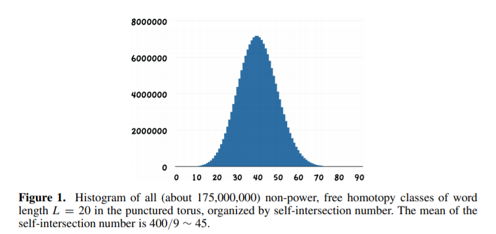

# Stage M2R

Greg McShane 2020

[my webpage](https://macbuse.github.io/)

# Bounds and statistics for closed geodesics

## Context

Consider an orientable surface $\Sigma$ with negative Euler characteristic, a minimal set of generators of the fundamental group, and a constant curvature −1 metric on $\Sigma$. Each free homotopy class C of closed oriented curves on S determines three numbers: 
1. the word length (that is, the minimal number of letters needed
to express $\gamma$ as a cyclic word in the generators and their inverses), 
1. the minimal geometric self-intersection number
1. the geometric length $\ell(\gamma)$ ie the length of the unique closed geodesic in the class $\gamma$.

These three numbers can be explicitly computed (or approximated) using a computer so we can do experiments and check results algorithmically.

From a theoretical point of view :

- The relation between word length and geometric length was studied by Milnor in the 60s then Policott and Sharp from a statistical point of view in the 90s. 
- The relation between intersection number and geometric length was studied by Basmajian about 10 years ago  then by Chas and her coathors from a statistical point of view.

---

The principal (non statistical) results are easy to state precisely. 
Let $\gamma$ be a cyclically reduced word in the fundamental group  and $\ell(\gamma)$ the length of the unique closed geodesic representing this
conjucacy class then :

Milnor proved that there is a constant $K$ which depends on the metric  such that 
$$(1/K) |\gamma| < \ell(\gamma) < K|\gamma|. $$
where  $|\gamma|$ is the word length and $\ell(\gamma)$ 
the length of the curve for the *choice* of metric.

Likewise Basmajian  proved that there is a constant $K$ which depends on the metric  such that 
$$(1/K) i(\gamma,\gamma) < \ell(\gamma) < K i(\gamma,\gamma). $$
where  $i(\gamma,\gamma)$ is the geometric intersection number.

The way that the factor $K$ varies carries important geometric information.

---

### Details of the stage

We will review the basic geometric constructions 
and in particular the work of Milnor which 
relates combinatorial group theory to Riemannian geometry.
Then we will study Basmajian'method for obtaining 
inequalities relating intersection number to length.
We will look at the applications of this to giving effective bounds
in Scott's Theorem on simple lifts.
Finally we will study the methods required by Lalley and Chas to obtain the
statistical relation between length and intersection number.

---

### References

1. Relations between Word Length, Hyperbolic Length and
Self-Intersection Number of Curves on Surfaces, Moira Chas
[manuscript](http://www.math.stonybrook.edu/~moira/papers/2015ChasRelations_between_Word_Length_Hyperbolic_Length_and_Self-Intersection_Number_of_Curves_on_Surfaces.pdf)
1. M. Pollicott and R. Sharp, Comparison theorems and orbit counting in hyperbolic geometry. Trans. Amer. Math. Soc. 350, 473499, 1998.
1. Universal length bounds for non-simple closed geodesics on hyperbolic surfaces Ara Basmajian Journal of Topology, Volume 6, Issue 2, June 2013, Pages 513–524, https://doi.org/10.1112/jtopol/jtt005 
1. Self-intersections in combinatorial topology: statistical structure
Moira Chas, Steven P. Lalley [arxiv](https://arxiv.org/abs/1012.0580)
1. Short closed geodesics with self-intersections
Viveka Erlandsson and Hugo Parlier
[arxiv](https://arxiv.org/pdf/1609.00217.pdf)
1. Building hyperbolic metrics suited to closed curves and applications to lifting simply, 
Tarik Aougab, Jonah Gaster, Priyam Patel, Jenya Sapir
[arxiv](https://arxiv.org/abs/1603.06303)
1. Peter Scott. Subgroups of surface groups are almost geometric. J. London Math.  Soc. (2) 17(1978)

[web page](https://github.com/macbuse/MATH/edit/master/stage%20m2r%202020_bis.md)
