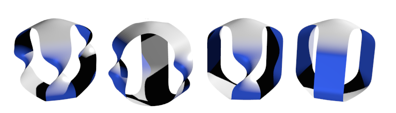

# Stage M2R

Greg McShane 2019-2020

[my webpage](https://macbuse.github.io/)

## Context

The moduli space of Riemann surfaces is a very old and rich subject.
The connexion with hyperbolic geometry was recognised by Klein as
being of great importance and through the work of Thurston, Penner
and many others at the end of the last century has improved our 
understanding of the geometry of Teichmueller space, the mapping class group
and the moduli space itself. One important development has been the discovery of
Mirzakhani's volume polynomials, the recursion they satisfy and the 
resulting formulation of so-called [geometric recursion](https://arxiv.org/abs/1711.04729).

The Figure show the one holed torus, one holed Klein bottle, two holed projective plane and the three holed sphere.

A [Klein surface](https://en.wikipedia.org/wiki/Klein_surface) is a non orientable topological surface 
together with a hyperbolic structure. The moduli space 
of Klein surfaces is much less well understood than that of Riemann surfaces.
In particular there seems to be no notion of Mirzakhani's polynomials for Klein 
surfaces nor asymptotic formula for the number of closed simple geodesics.

In a [recent manuscript](https://arxiv.org/abs/1706.08798) Gendulphe 
hakes some calculations and proposes an explanation as to why there can be no 
such polynomials they should not exist. In another [work](https://arxiv.org/abs/1705.09377)
Magee proves a counting formula for counting one sided simple closed geodesics
on Fuchsian thrice punctured projective planes showing surprisingly that the 
growth rate is not polynomial.

## Details of the stage

We will review the basic geometric constructions used in the oriented case
and see how they have to be modified in the article of PAPADOPOULOS and PENNER.
Next we will study the character variety for small surfaces as in Goldman, et al.
Finally we will go through Gendulphe and compare hs results with that of Magee
to see why there are no polynomials.

## References

1. Universal length bounds for non-simple closed geodesics on hyperbolic surfaces Ara Basmajian Journal of Topology, Volume 6, Issue 2, June 2013, Pages 513–524, https://doi.org/10.1112/jtopol/jtt005 
1. Self-intersections in combinatorial topology: statistical structure
Moira Chas, Steven P. Lalley [arxiv](https://arxiv.org/abs/1012.0580)
1. Short closed geodesics with self-intersections
Viveka Erlandsson and Hugo Parlier
[arxiv](https://arxiv.org/pdf/1609.00217.pdf)

[web page](https://github.com/macbuse/MATH/edit/master/stage%20m2r%202019.md)
