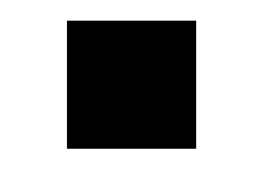

First semester

### introduction à la programmation 

This course has finished we did some interesting things.

Here are some of the finished projects:

- [sudoko with digit recognition](./STAGE/Sudoku_-_Sarah_Depernet.html)
- [labrinths on surfaces](./STAGE/projet-info_Abel-Douzal_Charles-Schwing-2021-2022.html)
- [labrinths classic](./STAGE/HARENG_L3A1.html)
- [Mastermind d'apres Knuth](./STAGE/Mastermind_projet_Touron_Camille_L3A-checkpoint.html)

<!-- #### Mastermind -->

#### Conway's life on a torus

This is an amusing demonstration of how using a convolution to do something is
just the right thing to do. There is  a **pytorch** implementation somewhere.

I embedded this in a [script with pygame](./PROG/my_conway.py)
it's like 50 LOC.

Simulation of an epidemic the particles follow a random walk....

I embedded this in a [script with pygame too](./PROG/epidemic_sim.py)
- more complicated about 150 LOC.

---

### MAT305 

Math for second year chemists [archived](./MAT305_index.md)

